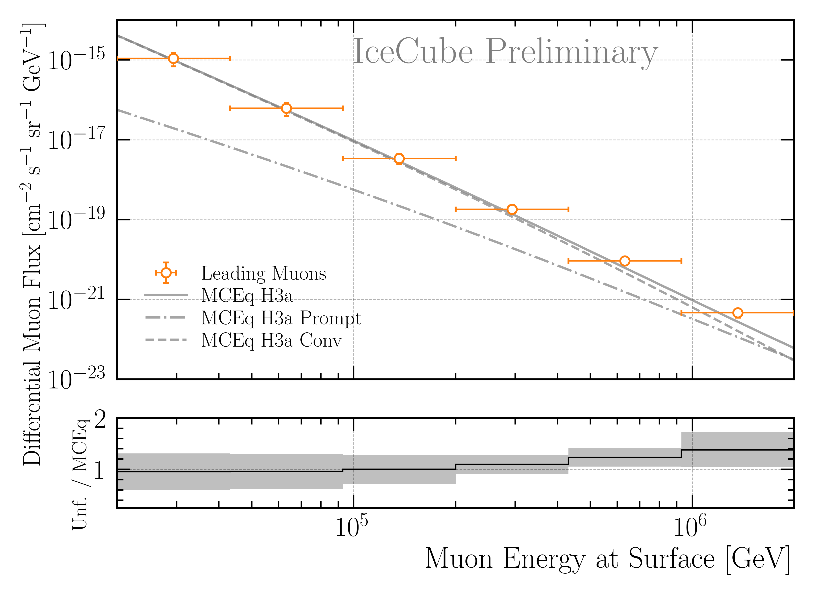

.. _burnsample_unfolding_paragraph:
Burnsample Unfolding
####################

The burnsample unfolding has been presented at the ICRC and the proceedings is available 
here: `Unfolding the Atmospheric Muon Flux with IceCube: Investigating Stopping Muons and High-Energy Prompt Contributions <https://pos.sissa.it/501/281/>`_.

In the following, the determination of the regularization strength and two robustness tests are presented on MC. Afterwards, the burnsample unfolding on experimental data is shown. The effective area and the corresponding systematic uncertainties are described in :ref:`Unfolding/Effective Area <effective_area_paragraph>`.

MC
---

Regularization 
==============

At first, the regularization parameter tau is determined by finding the minimum of the global correlation

.. math::
    \rho = \sum_{i>j} V_{ij}\,,

where V is the covariance matrix of the unfolded distribution, with i and j being the indices of the 
unfolding bins. This does not include the under- and overflow bin, nor the systematic bins. For the burnsample MC, the global correlation is presented in :numref:`burnsample_global_correlation_mc`. 
Here, 280 tau values from 1e-6 to 1 are tested. It is checked whether the minimization of the unfolding using minuit is successful, otherwise the point is discarded. Due to some jumps in the distribution, instead of the exact minimum, a rolling average with a window size of 5 is used to determine the optimal tau value. This results in a value of tau=0.038 for the burnsample unfolding on MC. However, this needs to be determined for all changes in the unfolding, thus whenever the binning changes, the spectral index of the cosmic-ray flux changes, or the unfolding is applied to experimental data.

.. _burnsample_global_correlation_mc:

    : Global correlation as a function of the regularization parameter tau for the burnsample unfolding on MC. 

Robustness Tests
================

Afterwards, two robustness tests are performed. At first, the impact of a shift in the spectral index of the cosmic-ray flux on the unfolded muon flux is investigated. The unfolding algorithm is trained on the nominal spectrum with H3a, and then the spectrum is varied by ±0.1. This re-weighting is achieved by multiplying the weight :math:`w` of each event by the primary energy :math:`E_{\text{P}}` to the power of the shift in the spectral index :math:`gamma_{\text{s}}`, via

.. math::
    w_{\text{s}} = w \times E_{\text{P}}^{\gamma_{\text{s}}}\,,

resulting to the shifted weights :math:`w_{\text{s}}`. The results are shown in :numref:`burnsample_delta_gamma_shift`. Within the uncertainties, the results are compatible. Thus, the burnsample unfolding is robust against small changes in the spectral index of the cosmic-ray flux.

.. _burnsample_delta_gamma_shift:

    : The impact of a shift in the spectral index of the cosmic-ray flux on the unfolded muon flux using the burnsample MC is investigated. The unfolding algorithm is trained on the nominal spectrum with H3a, and then the spectrum is varied by ±0.1. This re-weighting is achieved by multiplying the weight of each event by the the primary energy to the power of the shift in the spectral index. The ratio to the true H3a MC distribution is shown. Within the uncertainties, the results are compatible. Thus, the burnsample unfolding is robust against changes in the spectral index of the cosmic-ray flux.

Secondly, the impact of the primary cosmic-ray model on the unfolded flux is studied. The unfolding algorithm is trained on the four different primary models, and then the same pseudo test dataset sampled from an H3a distribution is unfolded. The results are shown in :numref:`burnsample_primary_model_shift`. Within the uncertainties, the results are compatible. Thus, the burnsample unfolding is robust against changes in the primary cosmic-ray model.

.. _burnsample_primary_model_shift:

    : Study of the impact of the primary cosmic-ray model on the unfolded flux using the burnsample MC. The unfolding algorithm is trained on the four different primary models, and then the same pseudo test dataset sampled from an H3a distribution is unfolded. The ratio to the true H3a MC distribution is shown. Within the uncertainties, the results are compatible. Thus, the burnsample unfolding is robust against changes in the primary cosmic-ray model.

Data
----

Similar to the MC studies above, the regularization strength needs to be determined for the experimental data. This is presented in :numref:`burnsample_global_correlation_exp`. Here, the minimum of the global correlation is found at tau=0.0029.

.. _burnsample_global_correlation_exp:

    : Global correlation as a function of the regularization parameter tau for the burnsample unfolding on experimental data.

The final burnsample unfolding with :math:`2487\,\mathrm{h}` of IceCube data is then performed with tau=0.0029, and the result is shown in :numref:`burnsample_final_unfolding`. The unfolded data are compared to 
predictions by MCEq assuming the cosmic-ray primary model H3a, and the hadronic interaction model SIBYLL2.3c. The total uncertainties :math:`\sigma_{\text{tot}}` are derived from the inverse of the Hessian matrix obtained in the Minuit fit (:math:`\sigma_{\text{minuit}}`) and are further expanded to include the systematic variations of the effective area (:math:`\sigma_{\text{Aeff,sys}}`). This is done via 

.. math::
    \sigma_{\text{tot}} = \sqrt{\sigma_{\text{minuit}}^2 + \sigma_{\text{Aeff,sys}}^2}\,.

The effective area uncertainties are determined here :ref:`Unfolding/Effective Area <effective_area_paragraph>`. The unfolded result is in agreement with the predictions from MCEq, indicating a small excess towards 
higher energies. 

.. _burnsample_final_unfolding:

    : Unfolded muon flux at surface using the burnsample data with :math:`2487\,\mathrm{h}` of IceCube data. The unfolding is performed with tau=0.0029. The uncertainties are derived from the inverse of the Hessian matrix obtained in the Minuit fit and are further expanded to include the systematic variations of the effective area. The unfolded result is compared to predictions from MCEq using H3a, and SIBYLL 2.3c.