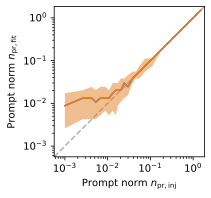

Analysis - Forward Fit
######################

.. warning::
    This page is outdated. In the past, the focus was on the unfolding. Currently, a new Master's student is 
    working on the forward fit. Updates on the forward fit will be provided soon.

This forward fit aims to measure the normalization of the prompt component. At first, some MC studies are shown. Afterwards, a pseudo analysis 
is performed to set up a baseline for the real data analysis. Finally, we plan to use the tool NNMFit to perform the forward fit, since it is 
already established in IceCube and a duplication of the code is not necessary. Looking to the future, this tool already includes the possibility
to perform a combined fit of the prompt muon and neutrino flux.

Dataset exploration 
-------------------

At first, the energy spectrum of prompt and conventional muons is investigated. The focus is on the leadingness and the energy of the leading muon and the muon bundle.
Also different primary models are compared. The starting point is level 2.

Leadingness 
+++++++++++
Leadingness :math:`L_{\mathrm{E}}` describes the ratio of the highest energy muon :math:`E_{\mathrm{max}}` in a bundle to the total energy :math:`E_{\mathrm{tot}}` 
of the bundle:

.. math:: 

    L_{\mathrm{E}} = \frac{E_{\mathrm{max}}}{E_{\mathrm{tot}}}

The leadingness is shown for the prompt and conventional component for two different energy cuts in 
:numref:`leading_bundle_energy_fraction`.

.. _leading_bundle_energy_fraction:

  
    : The leadingness is shown for the prompt and conventional component for two different energy cuts. The prompt component is shown as dashed lines 
    and the conventional component as solid lines.

A minimum energy is required to have an excess of prompt particles in relation to conventional ones. In addition, there is a sweet spot between 
a leadingness of :math:`L_{\mathrm{E}} \in [0.1, 0.9]` in which the prompt component dominates the conventional component. Hence, a high leadingness does not 
lead to more sensitivity to detect prompt muons. This means, we are not searching for leading muons.

Leading vs. bundle energy 
+++++++++++++++++++++++++
The production of prompt an conventional particles is shown in relation to the GaisserH3a prediction. The GST and GSF model predict the 
most prompt muons.

The energy spectra for the leading muon (most energetic muon inside a muon bundle) and muon bundle are presented for different primary models.

The GSF model is state-of-the-art and thus used in any plot, if only one primary weighting is shown. The leading muon energy is more sensitive to the prompt 
component in comparison to the muon bundle energy. 

Pseudo analysis 
---------------

Pseudo analysis means an analysis performed on our simulated data. The goal is to find the best analysis strategy for the real data analysis. As an initial guess, an energy cut on the reconstructed muon 
bundle energy at entry is applied which requires a minimum energy of :math:`100\,\mathrm{TeV}`.
At first, a re-sampling method is created to generate pseudo data from the simulated data. The sampled data are shown for an expected livetime of 10 years using the GSF weighting. 

The actual fitting is performed by a maximum likelihood fit assuming a Poisson distribution in each energy bin. 

.. math::

The true and fitted norm are presented below to estimate the bias of the fit. 

The application of Wilks' theorem requires a :math:`\chi^2` test statistic, which is tested for the background statistic assuming no prompt component (:math:`n_{\mathrm{pr}} = 0`).

Since the background statistic seems to be :math:`\chi^2` distributed, we can calculate the sensitivity and discovery potential using Wilks' theorem.
The sensitivity :math:`s_{\mathrm{pr}}` is defined as the prompt normalization which results in a distribution test statistics, where :math:`90\,\%` of all trials result in a test statistic larger than the median of the distribution of 
the test statistic under the null hypothesis (background statistic). For 10 years of data using GSF weighting, the sensitivity is :math:`s_{\mathrm{pr}} = 0.007 \pm 0.000`.

The :math:`5\,\sigma` discovery potential :math:`n_{\mathrm{pr}}^{5\sigma}` is defined as the prompt normalization at which :math:`50\,\%` of all trials result in a test statistic with a significance of :math:`5\,\sigma` or 
larger. For 10 years of data using GSF weighting, the discovery potential is :math:`n_{\mathrm{pr}}^{5\sigma} = 0.032 \pm 0.001`.

These results use a limited statistic of the simulated MC events. In the pseudo data set, the events are oversampled to match the number of expected events for 10 years of data. 

In the figure below, the test statistics are presented for several prompt normalizations. 

NNMFit
------

The tool is available in the IceCube github at `NNMFit <https://github.com/icecube/NNMFit/tree/dev-data-binning>`_.
