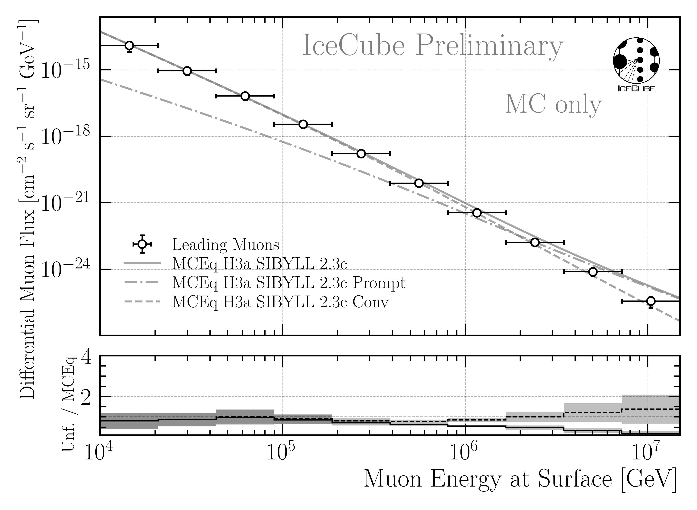

.. _full_sample_unfolding_paragraph:
Full Sample Unfolding 
#####################

The burnsample unfolding has been presented at the ICRC and the proceedings is available 
here: `Unfolding the Atmospheric Muon Flux with IceCube: Investigating Stopping Muons and High-Energy Prompt Contributions <https://pos.sissa.it/501/281/>`_.

In the following, the determination of the regularization strength and two robustness tests are presented on MC. The effective area and the corresponding systematic uncertainties are described in :ref:`Unfolding/Effective Area <effective_area_paragraph>`.

MC
---

Regularization 
==============

At first, the regularization parameter tau is determined by finding the minimum of the global correlation

.. math::
    \rho = \sum_{i>j} V_{ij}\,,

where V is the covariance matrix of the unfolded distribution, with i and j being the indices of the 
unfolding bins. This does not include the under- and overflow bin, nor the systematic bins. For the burnsample MC, the global correlation is presented in :numref:`full_sample_global_correlation_mc`. 
Here, 280 tau values from 1e-6 to 1 are tested. It is checked whether the minimization of the unfolding using minuit is successful, otherwise the point is discarded. Due to some jumps in the distribution, instead of the exact minimum, a rolling average with a window size of 8 is used to determine the optimal tau value. This results in a value of tau=0.0022 on MC. However, this needs to be determined for all changes in the unfolding, thus whenever the binning changes, the cosmic-ray models changes, the spectral index of the cosmic-ray flux changes, or the unfolding is applied to experimental data.

.. _full_sample_global_correlation_mc:
.. figure:: images/plots/unfolding/new/full_sample/global_correlations_single_tau_mc.png
    :width: 600px 

    : Global correlation as a function of the regularization parameter tau on MC. 

Robustness Tests 
================

Afterwards, two robustness tests are performed. At first, the impact of a shift in the spectral index of the cosmic-ray flux on the unfolded muon flux is investigated. The unfolding algorithm is trained on the nominal spectrum with H3a, and then the spectrum is varied by ±0.1. This re-weighting is achieved by multiplying the weight :math:`w` of each event by the primary energy :math:`E_{\text{P}}` to the power of the shift in the spectral index :math:`gamma_{\text{s}}`, via

.. math::
    w_{\text{s}} = w \times E_{\text{P}}^{\gamma_{\text{s}}}\,,

resulting to the shifted weights :math:`w_{\text{s}}`. The results are shown in :numref:`full_sample_delta_gamma_shift`. Within the uncertainties, the results are compatible. Thus, the burnsample unfolding is robust against small changes in the spectral index of the cosmic-ray flux.

.. _full_sample_delta_gamma_shift:

    : The impact of a shift in the spectral index of the cosmic-ray flux on the unfolded muon flux on MC is investigated. The unfolding algorithm is trained on the nominal spectrum with H3a, and then the spectrum is varied by ±0.1. This re-weighting is achieved by multiplying the weight of each event by the the primary energy to the power of the shift in the spectral index. The ratio to the true H3a MC distribution is shown. The uncertainties come from the inverse of the Hesse matrix (not systematic scaling of the effective area is included here). Within the uncertainties, the results are compatible. Thus, the unfolding is robust against changes in the spectral index of the cosmic-ray flux.

Secondly, the impact of the primary cosmic-ray model on the unfolded flux is studied. The unfolding algorithm is trained on the four different primary models, and then the same pseudo test dataset sampled from an H3a distribution is unfolded. The results are shown in :numref:`full_sample_primary_model_shift`. Within the uncertainties, the results are compatible. Thus, the unfolding is robust against changes in the primary cosmic-ray model.

.. _full_sample_primary_model_shift:
.. figure:: images/plots/unfolding/new/full_sample/test_primary_model/unfolding_flux_systematics_weight_col_shift_primary_models_comparison_zoom.png
    :width: 600px 

    : Study of the impact of the primary cosmic-ray model on the unfolded flux on MC. The unfolding algorithm is trained on the four different primary models, and then the same pseudo test dataset sampled from an H3a distribution is unfolded. The ratio to the true H3a MC distribution is shown. The uncertainties come from the inverse of the Hesse matrix (not systematic scaling of the effective area is included here). Within the uncertainties, the results are compatible. Thus, the unfolding is robust against changes in the primary cosmic-ray model.

Bias tests
==========

For the full sample, 12 years of data IC86 will be used. The unfolding is performed analogue to the burnsample unfolding. 
However, the uncertainties are treated slightly different. 

The total uncertainty on the unfolded flux is given by

.. math::
    \sigma_{\text{tot}} = \sqrt{\sigma_{\text{minuit}}^2 + \sigma_{\text{Aeff,stat}}^2 + \sigma_{\text{unf-bias}}^2}\,.

Here, :math:`\sigma_{\text{minuit}}` is derived from the inverse of the Hessian matrix obtained in the Minuit fit. This fit also 
includes the 5 in-ice systematics. :math:`\sigma_{\text{Aeff,stat}}` is the statistical uncertainty on the effective area, and :math:`\sigma_{\text{unf-bias}}` is the uncertainty due to a possible unfolding bias. This bias is presented in 
:numref:`unfolding_bias_all_weightings_2`.

.. _unfolding_bias_all_weightings_2:
.. figure:: images/plots/one_page_summary/unfolding_flux_systematics_weight_col_shift_primary_models_comparison_zoom_ratio_to_mc_tauscan_tau_0.001916_matrix_all_models_full_MC.png
    :width: 600px 

    : Study of the unfolding bias for the full sample unfolding. The unfolding algorithm is trained on the four different primary models, and then the MC dataset weighted to a livetime of 12 years is unfolded. The ratio to the true MC distribution is shown. 
    This is done for all 4 weightings, which then results in 16 unfoldings in total. Ideally, all lines would align with 1. However, some deviations are visible, which are considered as unfolding bias. The maximum deviation in each bin is taken as systematic uncertainty due to the unfolding bias.

After including these additional uncertainties, the final unfolding result on MC is shown in :numref:`full_sample_final_unfolding_mc_with_bias`.

.. _full_sample_final_unfolding_mc_with_bias:

    : Final unfolding result on MC including the uncertainty due to a possible unfolding bias. The unfolded data are compared to 
    the true MC distribution assuming the cosmic-ray primary model H3a The total uncertainties :math:`\sigma_{\text{tot}}` are derived from the inverse of the Hesse matrix obtained in the Minuit fit (:math:`\sigma_{\text{minuit}}`), the statistical uncertainty on the effective area (:math:`\sigma_{\text{Aeff,stat}}`) and the uncertainty due to a possible unfolding bias (:math:`\sigma_{\text{unf-bias}}`). For all four unfoldings trained on the different primary models, the results are compatible with the true MC distribution within the uncertainties.

For the final unfolding on data, four unfoldings trained on all 4 primary models will be performed. The results will then be averaged to obtain the best fit result. For the MC test using the H3a weighting, this is presented in :numref:`full_sample_final_unfolding_mc_4_models_average`. The total uncertainties are calculated as 

.. math::

    \begin{align}
    \sigma_\mathrm{tot} &= \sqrt{\sigma_\mathrm{unf}^2 + \sigma_\mathrm{spread}^2} \\
    \text{with} \quad
    \sigma_\mathrm{unf} &= \frac{\sqrt{\sum \sigma_\mathrm{i}^2}}{N} \\
    \sigma_\mathrm{spread} &= \mathrm{std}(f_i)
    \end{align}

with :math:`N = 4`, and :math:`\sigma_\mathrm{i}` being the total uncertainty of each unfolding, and being :math:`f_i` the unfolded flux of each unfolding. Here, :math:`\sigma_\mathrm{unf}` represents the average uncertainty due to the unfolding procedure, while :math:`\sigma_\mathrm{spread}` represents the spread of the different unfoldings trained on different primary models.

.. _full_sample_final_unfolding_mc_4_models_average:

    : The four unfoldings presented above are averaged to obtain the best fit result. The unfolded data are compared to 
    the true MC distribution assuming the cosmic-ray primary model H3a. 

.. _sensitivity_paragraph:
Sensitivity Tests
=================

Here, a test is performed to make sure the unfolding is sensitive to the prompt component. For this, two pseudo test datasets are created. One set is sampled from the total H3a distribution including the prompt and conventional component, and one set is sampled from a distribution that only 
includes the conventional component. This is done via the extended history option in CORSIKA. Hence, for the set without prompt muons, all muons that 
do not have a pion or kaon as a parent particle are removed. When we then unfold both sets with the same response matrix that includes the prompt component as in our nominal analysis, we expect that the unfolded set without the prompt component follows the conventional distribution, while the unfolded set with the prompt component should be above that, following the total distribution including prompt and conventional. For the comparisons MCEq with H3a and SIBYLL 2.3c is utilized. 

In :numref:`full_sample_sensitivity_no_prompt`, the result for the set without prompt muons is shown. The unfolded distribution follows the conventional distribution, and no significant prompt contribution is observed, as expected. 

.. _full_sample_sensitivity_no_prompt:

    : Unfolded muon flux for a pseudo test dataset sampled from a distribution that **only includes the conventional component**. The unfolding is performed with the same response matrix that includes the prompt component as in our nominal analysis. The unfolded distribution follows the conventional distribution, and no significant prompt contribution is observed, as expected. Uncertainties are included from minuit and the effective area.

In :numref:`full_sample_sensitivity_with_prompt`, the result for the set with prompt muons is shown. The unfolded distribution is significantly above the conventional distribution, following the total distribution including prompt and conventional, as expected.

.. _full_sample_sensitivity_with_prompt:
.. figure:: images/plots/unfolding/new/full_sample/prompt_sensitivity/unfolding_flux_mceq_02-1_H3a_SIBYLL23c_A_eff_unc.png
    :width: 600px

    : Unfolded muon flux for a pseudo test dataset sampled from the total H3a distribution **including the prompt and conventional component**. The unfolding is performed with the same response matrix that includes the prompt component as in our nominal analysis. The unfolded distribution is significantly above the conventional distribution, following the total distribution including prompt and conventional, as expected. Uncertainties are included from minuit and the effective area.

Data
----

Unblinded results will be presented here.