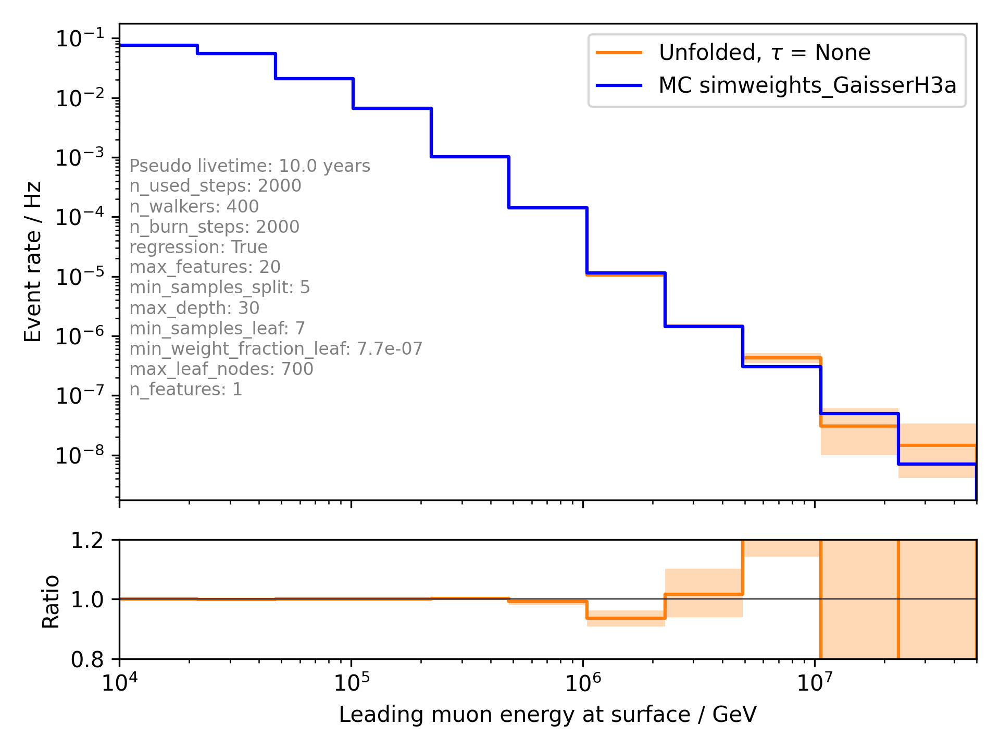

.. _unfolding paragraph:

Analysis - Unfolding 
####################

The Concept of Unfolding
------------------------
The quantity of interest, the propagation
length of the particles, is smeared out in the detection process
due to the limited accuracy and sensitivity of the detector.
Hence, it is impossible to determine the physical
truth from the measurement directly. In fact, the measurement yields proxy variables, which stem
from the detector response to the underlying physics. The inverse process,
namely the determination of the most probable physical truth on the basis of the
measurements, is referred to as unfolding.

The distribution of a measured quantity :math:`g(y)` is connected to the true
physical distribution :math:`f(x)` via the detector response :math:`A(x,y)` according
to the convolution integral

.. math::
  \begin{equation}
    g(y) = \int A(x,y) f(x) \,\mathrm{d}x + b(y) + \epsilon(y) \; .
  \end{equation}

This is referred to as the *Fredholm integral equation of the first kind*.
The additional term :math:`b(y)` represents some bias, which originates form
contributions to the measurement that are considered as background. Since the
selected sample is assumed to have a sufficiently high purity, the bias will
be neglected in the following. The quantity :math:`\epsilon(y)` denotes systematic uncertainties,
which are not yet taken into account. The detector response function :math:`A(x,y)` describes
the whole detection procedure. It depends on the physical truth and has to be determined
from Monte Carlo simulations.

In practice, it is necessary to discretize the phase space of the variables :math:`x` and :math:`y`.
The integral has to be transformed into a sum

.. math::
  \begin{equation}
    g_{i} = \sum_{j} A_{ij} f_{j} \qquad \Rightarrow \qquad \textbf{g} = \textbf{A} \cdot \textbf{f} \; ,
  \end{equation}

where the equation on the right represents a matrix multiplication with the
detector response matrix :math:`\textbf{A}` and the vectors :math:`\textbf{g}` and :math:`\textbf{f}`.
Each vector component denotes a bin entry in the distribution of the corresponding
quantity.

.. _unfolding:
.. figure:: images/plots/unfolding/unfolding_sketch.jpg

  : Schematic representation of unfolding. The underlying physical
  truth is smeared in the detection process. This is described by the
  detector response :math:`A`. The inverse process, which determines the most probable
  physical truth on the basis of the measurements, is called unfolding.

The main task is the reconstruction of the true distribution :math:`\textbf{f}`
from the measured distribution :math:`\textbf{g}`.
In principle, this could be done by simply inverting the discrete Fredholm equation.
However, the response matrix is not necessarily a square matrix and even if the
inverse :math:`\textbf{A}^{-1}` exists, the solution often shows an oscillating
behavior. This would be an unphysical result and can be traced back to the
properties of the matrix itself. The approach is an ill-posed problem,
where small eigenvalues of the matrix heavily amplify statistical noise in the
measurement. Consequently, more sophisticated methods are needed to unfold the
true spectrum.

Maximum Likelihood Estimation
-----------------------------
One such approach is a maximum likelihood estimation.
A likelihood function is constructed by assuming a Poisson distribution for each
bin of the proxy variable

.. math::
  \begin{equation}
    \mathcal{L}(\textbf{g}|\textbf{f}\,) = \prod_{i}
    \frac{\lambda_{i}(\textbf{f}\,)^{g_{i}}}{g_{i}!}
    \exp{\left(-\lambda_{i}(\textbf{f}\,)\right)} \; ,
  \end{equation}

where the used model :math:`\lambda_{i}(\textbf{f}\,)` corresponds to the
discrete Fredholm equation

.. math::
  \begin{equation}
    \mathcal{L}(\textbf{g}|\textbf{f}\,)= \prod_{i}
    \frac{(\textbf{A} \cdot \textbf{f}\,)_{i}^{g_{i}}}{g_{i}!}
    \exp{\left(-(\textbf{A} \cdot \textbf{f}\,)_{i}\right)} \; .
  \end{equation}

The most probable distribution :math:`\textbf{f}` on the basis of the measurements
:math:`\textbf{g}` maximizes the likelihood. For practical
reasons, it is often useful to minimize the negative logarithm of this function instead.
The result remains unchanged, but the likelihood reads

.. math::
  \begin{equation}
    l(\textbf{g}|\textbf{f}\,) = \sum_{i} \Big((\textbf{A} \cdot \textbf{f}\,)_{i}
    - g_{i} \ln{\left((\textbf{A} \cdot \textbf{f}\,)_{i}\right)}\Big) \; ,
  \end{equation}

The complication of oscillating solutions
still remains. To overcome this problem, it is necessary to introduce additional
assumptions about the smoothness of the distribution. This method is referred to
as *regularization*. A commonly used form of regularization is the
*Tikhonov regularization*. It introduces a penalty term which suppresses high second
derivatives of the solution

.. math::
  \begin{equation}
    \mathcal{R}(\textbf{f}\,) = \frac{1}{2} \tau^{-1} \, \textbf{f}^{T} \, \textbf{C}^{T} \, \textbf{C} \, \textbf{f} \; ,
  \end{equation}

with the regularization matrix

.. math::
  \begin{align}
    C = \begin{bmatrix}
        -1 & 1 & 0 & & \dots & & 0 \\
        1 & -2 & 1 & & & & \\
        0 & 1 & -2 & & & & \vdots \\
         & & & \ddots & & & \\
        \vdots & & & & -2 & 1 & 0 \\
         & & & & 1 & -2 & 1 \\
        0 & & \dots & & 0 & 1 & -1 \\
        \end{bmatrix} \; .
  \end{align}

It is chosen such that :math:`\textbf{C} \textbf{f}` is the second derivative
according to the *finite difference method*.
The parameter :math:`\tau` controls the strength of the regularization. Introducing
a regularization serves as a form of bias. It is important to optimize
its strength in such a way that the oscillations are suppressed, but the spectrum
is not flattened to an extent that makes the result physically unreliable.
The total likelihood then reads 

.. math::
  \begin{equation}
    l(\textbf{g}|\textbf{f}\,) = \sum_{i} \Big((\textbf{A} \cdot \textbf{f}\,)_{i}
    - g_{i} \ln{\left((\textbf{A} \cdot \textbf{f}\,)_{i}\right)}\Big) 
    + \frac{1}{2} \tau^{-1} \, \left(\textbf{C} \, \textbf{f}\right)^{T} \, \textbf{C} \, \textbf{f}\; .
  \end{equation}

Since bins of the target distribution :math:`\textbf{f}` can be empty and the logarithm of zero is not 
definded, a small offset :math:`d` is added. The target distribution is further subject to the detector response, 
which is why not :math:`\textbf{f}` itself, but the logarithm of the acceptance corrected spectrum is expected to be flat. 
Hence, the regularization term is modified:

.. math::
  \begin{align}
    l(\textbf{g}|\textbf{f}\,) = &\sum_{i} \Big((\textbf{A} \cdot \textbf{f}\,)_{i}
    - g_{i} \ln{\left((\textbf{A} \cdot \textbf{f}\,)_{i}\right)}\Big) \\
    &+ \frac{1}{2} \tau^{-1} \, \log_{10}{\left(A_{\mathrm{eff}}^{-1} \left(\textbf{f}+d \cdot \textbf{1} \right) \right)}^{T}
    \, \textbf{C}^2 \,
    \log_{10}{\left(A_{\mathrm{eff}}^{-1} \left(\textbf{f}+d \cdot \textbf{1} \right) \right)} \; .
  \end{align}

funfolding
----------
The concepts of ML unfolding have already been implemented in a python package by Mathis Börner, a former member of the 
TU Dortmund group. The package is available via ``pip install funfolding``. In addition to the above mentioned unfolding 
approach, the package features tools such as an MCMC sampling or the possibility of fitting nuisance parameters to 
the distributions, which improves the estimation of systematic uncertainties in the analysis. Funfolding has also been 
used in an earlier IceCube analysis (`3yr NuMu analysis <https://user-web.icecube.wisc.edu/~lkardum/Nu_Mu_unfolding/>`_) where 
additional informaiton can be found.

.. _mcmc:

MCMC Sampling
=============
Funfolding evaluates the likelihood in a bayesian approach. A Markov Chain Monte Carlo (MCMC) sampling is 
used to contruct an a-posteriori distribution of the form 

.. math::
  \begin{equation}
    p(\textbf{f}|\textbf{g}\,) = \frac{\mathcal{L}(\textbf{g}|\textbf{f}\,) \cdot p(\textbf{f})}{p(\textbf{g})} \; ,
  \end{equation}

where the a-priori distribution of :math:`\textbf{f}` is set to be uniform

.. math::
  \begin{align}
    p(f_{i}) = 
    \begin{cases}
      \frac{1}{N} \quad \mathrm{for} \quad 0 \leq f_{i} \leq N \; , \\
      0 \quad \mathrm{else} \; .
    \end{cases}
  \end{align}

The drawn samples depend only on the one sampled before them, and they are independent of all others.
Starting from a random guess, the chain moves to another point
by adding a noise from a predetermined distribution. 
The jump is accepted with a certain probability, following the concepts of a modified Metropolis-Hastings 
algorithm as implemented in the :math:`\texttt{EnsembleSampler}` of the :math:`\texttt{emcee}`
python package. The new point is included in the sample.

Parameter Optimization
======================
The regularization strength :math:`\tau` and the log-offset :math:`d` have to be optimized. This is done 
by means of a simple grid search which aims to minimize the chi-squared distance between the unfolded result
(on MC data) and the MC truth. The following metric is calculated for the individual unfoldings:

.. math:: 
  \begin{equation}
    \chi^2 = \sum_\limits{i} \frac{(f_{\mathrm{true},i} - f_{\mathrm{unf},i})^2}{\sigma_{\mathrm{unf},i}^2}
  \end{equation}

Systematic Uncertainties
========================
Certain parameters in the simulation chain have uncertainties, which is why it is 
necessary to estimate their impact on the analysis as so-called systematic uncertainties. 
In terms of unfolding, the systematics are described by systematic parameters, which are 
fitted to the data as additional nuisance parameters. The detector repsonse matrix 
then depends on these additional parameters:

.. math::
  \begin{equation}
    \textbf{A} \rightarrow \textbf{A}(\vec{\xi}\,)
  \end{equation}

For each systematic, new simulation sets are used. These simulation sets are 
created with the systematic parameters variing within their defined range.
This enables to construct weighting functions :math:`\omega_{i}(\xi_{j})`
(:math:`i`: Bin, :math:`j`: Systematic) that present the relative change of 
the bin content compared to the baseline simulation. To consider all 
parameters in a single bin, the functions are multiplied

.. math::
  \begin{equation}
    \omega_{i}(\vec{\xi}\,) = \prod_{j} \omega_{i}(\xi_{j}) \; .
  \end{equation}

The response matrix is then calculated as 

.. math::
  \begin{equation}
    \textbf{A}(\vec{\xi}\,) = \mathrm{Diag}(\vec{\omega}(\vec{\xi}\,)) \, \textbf{A} \, .
  \end{equation}

The likelihood :math:`\mathcal{L}` now also depends on the nuisance parameters :math:`\vec{\xi}`, 
which makes it possible to fit these parameters in the unfolding.

Unfolding
---------

In this analysis, we would like to unfold the energy of the leading muon at the surface. This is variable is called our 
target variable. For the unfolding, we need proxies, that correlate with our target. 

Proxy Variable
==============

At first, we need a proxy that correlates with the true physical quantity. In Figure :numref:`proxy_variable`, the muon energy of the 
leading muon at entry is used as a proxy variable. The target is the energy of the leading muon at the surface. 

.. _proxy_variable:
.. figure:: images/plots/unfolding/source/docs/images/plots/unfolding/DeepLearningReco_leading_bundle_surface_leading_bundle_energy_OC_inputs9_large_log_02_entry_energy_vs_muon_energy_first_mctree.png 

  : Proxy variable for unfolding. Here, the muon energy of the leading muon at entry is used. The target is the leading muon energy 
  at surface.

Unfold Event Rate - one proxy
=============================

In Figure :numref:`unfolding_muon_energy_first_mctree_1.0e+04_5.0e+07_12bins_tauNone_GaisserH3a_few_steps`, the unfolded event rate of the muon energy of the leading muon at the surface is shown. 
In Figure :numref:`unfolding_muon_energy_first_mctree_1.0e+04_5.0e+07_12bins_tauNone_GaisserH3a_more_steps`, the same unfolding is performed with more steps and walkers. 

.. _unfolding_muon_energy_first_mctree_1.0e+04_5.0e+07_12bins_tauNone_GaisserH3a_few_steps:
.. figure:: images/plots/unfolding/source/docs/images/plots/unfolding/unfolding_muon_energy_first_mctree_1.0e+04_5.0e+07_12bins_tauNone_GaisserH3a_few_steps.png 

  : Unfolded event rate of the muon energy of the leading muon at the surface. The true distribution is shown in blue, the unfolded 
  distribution in red. 

.. _unfolding_muon_energy_first_mctree_1.0e+04_5.0e+07_12bins_tauNone_GaisserH3a_more_steps:
.. figure:: images/plots/unfolding/source/docs/images/plots/unfolding/unfolding_muon_energy_first_mctree_1.0e+04_5.0e+07_12bins_tauNone_GaisserH3a_more_steps.png 

  : Unfolded event rate of the muon energy of the leading muon at the surface. The true distribution is shown in blue, the unfolded 
  distribution in red. 

Unfold Event Rate - multiple proxies / tree binning 
===================================================

Instead of using just one proxy, multiple proxies can be used. Due to the high dimensionality, a decision tree is used to bin the data. 
This is done in a way, that the tree is used to solve our problem: estimating the energy of the leading muon at the surface. But then, 
we don't use the estimation of the energy, but just the leafs for the binning. This way, we can use the tree to bin the data. Of course, 
this approach can also be used with only one proxy. This is presented first, to compare the results with the classical binning by hand.

In Figures :numref:`decision_tree_regression_1D_only_leading_energy` and :numref:`decision_tree_regression_2D_only_leading_energy`, 
the decision tree regression for the leading muon energy at the surface is shown. The tree is able to reconstruct the target variable.

.. _decision_tree_regression_1D_only_leading_energy:
.. figure:: images/plots/unfolding/source/docs/images/plots/unfolding/decision_tree_regression_1D_only_leading_energy.png 

  : Decision tree regression for the leading muon energy at the surface. The tree is used to bin the data.

.. _decision_tree_regression_2D_only_leading_energy:
.. figure:: images/plots/unfolding/source/docs/images/plots/unfolding/decision_tree_regression_2D_only_leading_energy.png 

  : Decision tree regression for the leading muon energy at the surface in 2D. The tree is used to bin the data.

Using this binning and the same number of steps and walkers a in Figure :numref:`_unfolding_muon_energy_first_mctree_1.0e+04_5.0e+07_12bins_tauNone_GaisserH3a_few_steps`, 
the unfolding of the event rate results as in Figure :numref:`tree_binning_unfolding_rate_only_leading_energy`. The tree binning improves 
the unfolding result.

.. _tree_binning_unfolding_rate_only_leading_energy:

  : Unfolded event rate of the muon energy of the leading muon at the surface. The true distribution is shown in blue, the unfolded in red. 
  Tree binning is used. As a proxy, only the leading muon energy at entry is used.