.. _unfolding paragraph:

Analysis - Unfolding 
####################

The Concept of Unfolding
------------------------
The quantity of interest, the propagation
length of the particles, is smeared out in the detection process
due to the limited accuracy and sensitivity of the detector.
Hence, it is impossible to determine the physical
truth from the measurement directly. In fact, the measurement yields proxy variables, which stem
from the detector response to the underlying physics. The inverse process,
namely the determination of the most probable physical truth on the basis of the
measurements, is referred to as unfolding.

The distribution of a measured quantity :math:`g(y)` is connected to the true
physical distribution :math:`f(x)` via the detector response :math:`A(x,y)` according
to the convolution integral

.. math::
  \begin{equation}
    g(y) = \int A(x,y) f(x) \,\mathrm{d}x + b(y) + \epsilon(y) \; .
  \end{equation}

This is referred to as the *Fredholm integral equation of the first kind*.
The additional term :math:`b(y)` represents some bias, which originates form
contributions to the measurement that are considered as background. Since the
selected sample is assumed to have a sufficiently high purity, the bias will
be neglected in the following. The quantity :math:`\epsilon(y)` denotes systematic uncertainties,
which are not yet taken into account. The detector response function :math:`A(x,y)` describes
the whole detection procedure. It depends on the physical truth and has to be determined
from Monte Carlo simulations.

In practice, it is necessary to discretize the phase space of the variables :math:`x` and :math:`y`.
The integral has to be transformed into a sum

.. math::
  \begin{equation}
    g_{i} = \sum_{j} A_{ij} f_{j} \qquad \Rightarrow \qquad \textbf{g} = \textbf{A} \cdot \textbf{f} \; ,
  \end{equation}

where the equation on the right represents a matrix multiplication with the
detector response matrix :math:`\textbf{A}` and the vectors :math:`\textbf{g}` and :math:`\textbf{f}`.
Each vector component denotes a bin entry in the distribution of the corresponding
quantity.

.. _unfolding:

  : Schematic representation of unfolding. The underlying physical
  truth is smeared in the detection process. This is described by the
  detector response :math:`A`. The inverse process, which determines the most probable
  physical truth on the basis of the measurements, is called unfolding.

The main task is the reconstruction of the true distribution :math:`\textbf{f}`
from the measured distribution :math:`\textbf{g}`.
In principle, this could be done by simply inverting the discrete Fredholm equation.
However, the response matrix is not necessarily a square matrix and even if the
inverse :math:`\textbf{A}^{-1}` exists, the solution often shows an oscillating
behavior. This would be an unphysical result and can be traced back to the
properties of the matrix itself. The approach is an ill-posed problem,
where small eigenvalues of the matrix heavily amplify statistical noise in the
measurement. Consequently, more sophisticated methods are needed to unfold the
true spectrum.

Maximum Likelihood Estimation
-----------------------------
One such approach is a maximum likelihood estimation.
A likelihood function is constructed by assuming a Poisson distribution for each
bin of the proxy variable

.. math::
  \begin{equation}
    \mathcal{L}(\textbf{g}|\textbf{f}\,) = \prod_{i}
    \frac{\lambda_{i}(\textbf{f}\,)^{g_{i}}}{g_{i}!}
    \exp{\left(-\lambda_{i}(\textbf{f}\,)\right)} \; ,
  \end{equation}

where the used model :math:`\lambda_{i}(\textbf{f}\,)` corresponds to the
discrete Fredholm equation

.. math::
  \begin{equation}
    \mathcal{L}(\textbf{g}|\textbf{f}\,)= \prod_{i}
    \frac{(\textbf{A} \cdot \textbf{f}\,)_{i}^{g_{i}}}{g_{i}!}
    \exp{\left(-(\textbf{A} \cdot \textbf{f}\,)_{i}\right)} \; .
  \end{equation}

The most probable distribution :math:`\textbf{f}` on the basis of the measurements
:math:`\textbf{g}` maximizes the likelihood. For practical
reasons, it is often useful to minimize the negative logarithm of this function instead.
The result remains unchanged, but the likelihood reads

.. math::
  \begin{equation}
    l(\textbf{g}|\textbf{f}\,) = \sum_{i} \Big((\textbf{A} \cdot \textbf{f}\,)_{i}
    - g_{i} \ln{\left((\textbf{A} \cdot \textbf{f}\,)_{i}\right)}\Big) \; ,
  \end{equation}

The complication of oscillating solutions
still remains. To overcome this problem, it is necessary to introduce additional
assumptions about the smoothness of the distribution. This method is referred to
as *regularization*. A commonly used form of regularization is the
*Tikhonov regularization*. It introduces a penalty term which suppresses high second
derivatives of the solution

.. math::
  \begin{equation}
    \mathcal{R}(\textbf{f}\,) = \frac{1}{2} \tau^{-1} \, \textbf{f}^{T} \, \textbf{C}^{T} \, \textbf{C} \, \textbf{f} \; ,
  \end{equation}

with the regularization matrix

.. math::
  \begin{align}
    C = \begin{bmatrix}
        -1 & 1 & 0 & & \dots & & 0 \\
        1 & -2 & 1 & & & & \\
        0 & 1 & -2 & & & & \vdots \\
         & & & \ddots & & & \\
        \vdots & & & & -2 & 1 & 0 \\
         & & & & 1 & -2 & 1 \\
        0 & & \dots & & 0 & 1 & -1 \\
        \end{bmatrix} \; .
  \end{align}

It is chosen such that :math:`\textbf{C} \textbf{f}` is the second derivative
according to the *finite difference method*.
The parameter :math:`\tau` controls the strength of the regularization. Introducing
a regularization serves as a form of bias. It is important to optimize
its strength in such a way that the oscillations are suppressed, but the spectrum
is not flattened to an extent that makes the result physically unreliable.
The total likelihood then reads 

.. math::
  \begin{equation}
    l(\textbf{g}|\textbf{f}\,) = \sum_{i} \Big((\textbf{A} \cdot \textbf{f}\,)_{i}
    - g_{i} \ln{\left((\textbf{A} \cdot \textbf{f}\,)_{i}\right)}\Big) 
    + \frac{1}{2} \tau^{-1} \, \left(\textbf{C} \, \textbf{f}\right)^{T} \, \textbf{C} \, \textbf{f}\; .
  \end{equation}

Since bins of the target distribution :math:`\textbf{f}` can be empty and the logarithm of zero is not 
definded, a small offset :math:`d` is added. The target distribution is further subject to the detector response, 
which is why not :math:`\textbf{f}` itself, but the logarithm of the acceptance corrected spectrum is expected to be flat. 
Hence, the regularization term is modified:

.. math::
  \begin{align}
    l(\textbf{g}|\textbf{f}\,) = &\sum_{i} \Big((\textbf{A} \cdot \textbf{f}\,)_{i}
    - g_{i} \ln{\left((\textbf{A} \cdot \textbf{f}\,)_{i}\right)}\Big) \\
    &+ \frac{1}{2} \tau^{-1} \, \log_{10}{\left(A_{\mathrm{eff}}^{-1} \left(\textbf{f}+d \cdot \textbf{1} \right) \right)}^{T}
    \, \textbf{C}^2 \,
    \log_{10}{\left(A_{\mathrm{eff}}^{-1} \left(\textbf{f}+d \cdot \textbf{1} \right) \right)} \; .
  \end{align}

funfolding
----------
The concepts of ML unfolding have already been implemented in a python package by Mathis Börner, a former member of the 
TU Dortmund group. The package is available via ``pip install funfolding``. In addition to the above mentioned unfolding 
approach, the package features tools such as an MCMC sampling or the possibility of fitting nuisance parameters to 
the distributions, which improves the estimation of systematic uncertainties in the analysis. Funfolding has also been 
used in an earlier IceCube analysis (`3yr NuMu analysis <https://user-web.icecube.wisc.edu/~lkardum/Nu_Mu_unfolding/>`_) where 
additional informaiton can be found.

.. _mcmc:

MCMC Sampling
=============
Funfolding evaluates the likelihood in a bayesian approach. A Markov Chain Monte Carlo (MCMC) sampling is 
used to contruct an a-posteriori distribution of the form 

.. math::
  \begin{equation}
    p(\textbf{f}|\textbf{g}\,) = \frac{\mathcal{L}(\textbf{g}|\textbf{f}\,) \cdot p(\textbf{f})}{p(\textbf{g})} \; ,
  \end{equation}

where the a-priori distribution of :math:`\textbf{f}` is set to be uniform

.. math::
  \begin{align}
    p(f_{i}) = 
    \begin{cases}
      \frac{1}{N} \quad \mathrm{for} \quad 0 \leq f_{i} \leq N \; , \\
      0 \quad \mathrm{else} \; .
    \end{cases}
  \end{align}

The drawn samples depend only on the one sampled before them, and they are independent of all others.
Starting from a random guess, the chain moves to another point
by adding a noise from a predetermined distribution. 
The jump is accepted with a certain probability, following the concepts of a modified Metropolis-Hastings 
algorithm as implemented in the :math:`\texttt{EnsembleSampler}` of the :math:`\texttt{emcee}`
python package. The new point is included in the sample.

Parameter Optimization
======================
The regularization strength :math:`\tau` and the log-offset :math:`d` have to be optimized. This is done 
by means of a simple grid search which aims to minimize the chi-squared distance between the unfolded result
(on MC data) and the MC truth. The following metric is calculated for the individual unfoldings:

.. math:: 
  \begin{equation}
    \chi^2 = \sum_\limits{i} \frac{(f_{\mathrm{true},i} - f_{\mathrm{unf},i})^2}{\sigma_{\mathrm{unf},i}^2}
  \end{equation}

Systematic Uncertainties
========================
Certain parameters in the simulation chain have uncertainties, which is why it is 
necessary to estimate their impact on the analysis as so-called systematic uncertainties. 
In terms of unfolding, the systematics are described by systematic parameters, which are 
fitted to the data as additional nuisance parameters. The detector repsonse matrix 
then depends on these additional parameters:

.. math::
  \begin{equation}
    \textbf{A} \rightarrow \textbf{A}(\vec{\xi}\,)
  \end{equation}

For each systematic, new simulation sets are used. These simulation sets are 
created with the systematic parameters variing within their defined range.
This enables to construct weighting functions :math:`\omega_{i}(\xi_{j})`
(:math:`i`: Bin, :math:`j`: Systematic) that present the relative change of 
the bin content compared to the baseline simulation. To consider all 
parameters in a single bin, the functions are multiplied

.. math::
  \begin{equation}
    \omega_{i}(\vec{\xi}\,) = \prod_{j} \omega_{i}(\xi_{j}) \; .
  \end{equation}

The response matrix is then calculated as 

.. math::
  \begin{equation}
    \textbf{A}(\vec{\xi}\,) = \mathrm{Diag}(\vec{\omega}(\vec{\xi}\,)) \, \textbf{A} \, .
  \end{equation}

The likelihood :math:`\mathcal{L}` now also depends on the nuisance parameters :math:`\vec{\xi}`, 
which makes it possible to fit these parameters in the unfolding.

Unfolding
---------

In this analysis, we would like to unfold the energy of the leading muon at the surface. This variable is called our 
target variable. For the unfolding, we need proxies, that correlate with our target. 

Proxy Variable
==============

At first, we need a proxy that correlates with the true physical quantity. In Figure :numref:`proxy_variable`, the muon energy of the 
leading muon at entry is used as a proxy variable. The target is the energy of the leading muon at the surface. 

.. _proxy_variable:
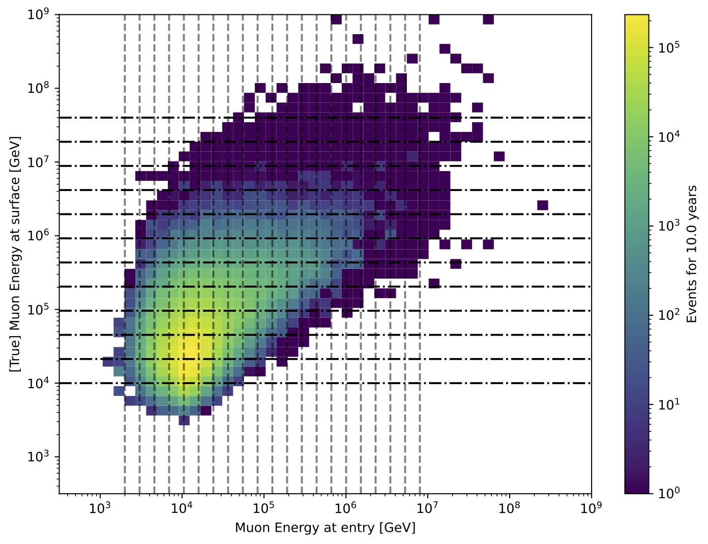

  : Proxy variable for unfolding. Here, the muon energy of the leading muon at entry is used. The target is the leading muon energy 
  at surface. The grey, dashed lines represent the binning for the proxy and target variable. This binning serves as an example. The final binning can change slightly. 

Unfold Event Rate
=================

In Figure :numref:`unfolding_event_rate`, the unfolded event rate of the muon energy of the leading muon at the surface is shown for a 
statistic of 10 years. The legend shows the used minimizer, here minuit, and the regularization strength, here :math:`\tau = None`.

.. _unfolding_event_rate:
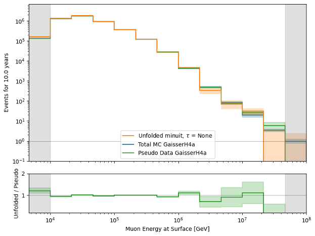

  : Unfolded event rate of the muon energy of the leading muon at the surface. The true distribution using the entire dataset is shown 
  in blue, a bootstrapped sample is shown in green (used for the unfolding), and the unfolded distribution is shown in orange.

Unfold Muon Flux
================

For the unfolding of the muon flux at surface, an effective area is needed. This area is basically the information, 
how many muons correspond to a certain event measured by the detector. The calculation of the effective area is 
done similar to the analysis of stopping muons (`Stopping muons wiki <https://user-web.icecube.wisc.edu/~lwitthaus/StoppingMuonAnalysis/docs/Effective_Area/effective_area.html>`_). We build a ratio of all muons at surface generated in step 0 to the muons that are detected on our final level.

In Figure :numref:`unfolding_muon_flux` the muon flux at surface is unfolded using the leading muon energy at entry as a proxy with classical binning. 

.. _unfolding_muon_flux:
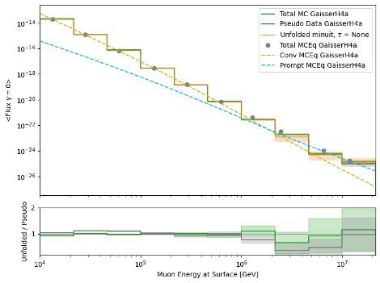

  : Unfolded differential muon flux at surface. The true distribution using the entire dataset is shown 
  in blue, a bootstrapped sample is shown in green (used for the unfolding), and the unfolded distribution is shown in orange.
  Additionally, predictions from MCEq are included. These are divided into 3 parts. The grey dots represent the total muon flux contribution at surface. The ratio between MCEq and the unfolding is done at the energy expectation per bin. For this, the energy expectation per bin is calculated on MC using alle muons in step 0. The conventional component is shown in dashed, light-green, the prompt component in dashed, light-blue.

.. _unfolding_muon_flux_gamma_37:
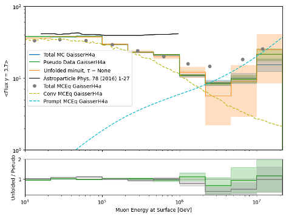

  : Unfolded differential muon flux at surface with an energy rescaling of :math:`\gamma = 3.7` to get more insights into the spectrum. The true distribution using the entire dataset is shown 
  in blue, a bootstrapped sample is shown in green (used for the unfolding), and the unfolded distribution is shown in orange. For reference, a former flux measured by IceCube is shown black. Additionally, predictions from MCEq are included. These are divided into 3 parts. The grey dots represent the total muon flux contribution at surface. The ratio between MCEq and the unfolding is done at the energy expectation per bin. For this, the energy expectation per bin is calculated on MC using alle muons in step 0. The conventional component is shown in dashed, light-green, the prompt component in dashed, light-blue.

Systematics 
-----------

The systematic uncertainties are estimated by varying the systematic parameters in the simulation chain. The systematic parameters are fitted to the data as additional nuisance parameters. The detector response matrix then depends on these additional parameters. For each systematic, new simulation sets are used. These simulation sets are created with the systematic parameters varying within their defined range. This enables to construct weighting functions that present the relative change of the bin content compared to the baseline simulation. To consider all parameters in a single bin, the functions are multiplied. The response matrix is then calculated as the product of the weighting functions and the baseline response matrix. The likelihood now also depends on the nuisance parameters, which makes it possible to fit these parameters in the unfolding.

For the simulation, the snowstorm parameters for the ice model "spice_ftp-v3m" are used as defined in :numref:`systematics_table` taken from `here <https://wiki.icecube.wisc.edu/index.php/SnowStorm_MC>`_ (from April 2024).

.. _systematics_table:
.. list-table:: Systematics Table
   :header-rows: 1
   :widths: 20 30 30

   * - Systematic
     - Sampling Distribution
     - Sampling Range
   * - Scattering
     - uniform
     - [0.913, 1.087]
   * - Absorption
     - uniform
     - [0.913, 1.087]
   * - DOM Efficiency
     - uniform
     - [0.9, 1.1]
   * - HoleIce Forward p0
     - uniform
     - [-0.1, 0.5]
   * - HoleIce Forward p1
     - uniform
     - [-0.1, 0.0]

Visualize impact of systematics on muon energy at entry (proxy)
===========================================================

Absorption and DOMEfficiency have the largest impact on the leading muon energy at entry as shown below.

.. _Absorption_proxy_impact:

  : Impact of the Absorption systematic on the muon energy at entry. The dataset is divided into 5 systematic bins used to visualize the impact of the systematic on the proxy variable.

.. _DOMEfficency_proxy_impact:
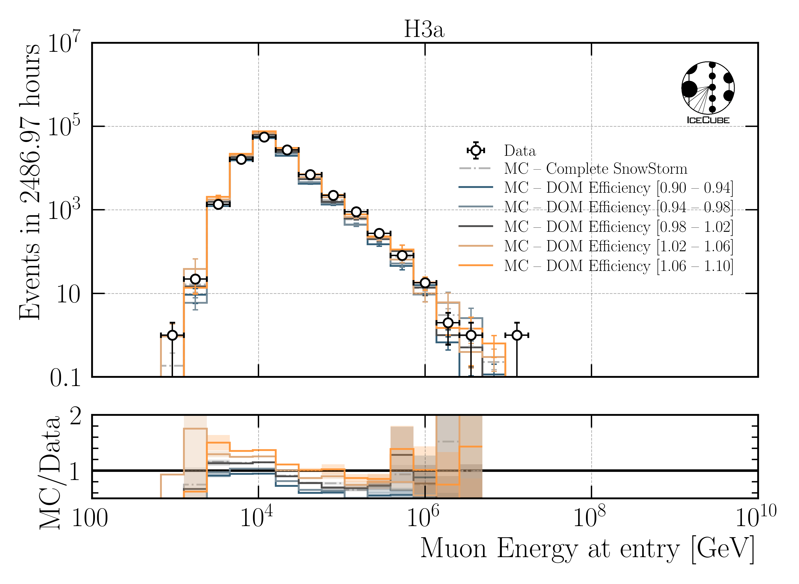

  : Impact of the DOMEfficiency systematic on the muon energy at entry. The dataset is divided into 5 systematic bins used to visualize the impact of the systematic on the proxy variable.

.. _HoleIceForward_p0_proxy_impact:

  : Impact of the HoleIceForward_p0 systematic on the muon energy at entry. The dataset is divided into 5 systematic bins used to visualize the impact of the systematic on the proxy variable.

.. _HoleIceForward_p1_proxy_impact:
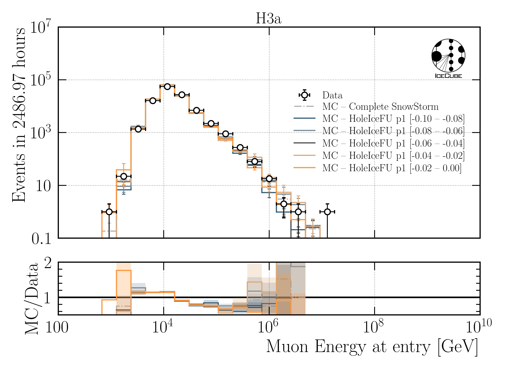

  : Impact of the HoleIceForward_p1 systematic on the muon energy at entry. The dataset is divided into 5 systematic bins used to visualize the impact of the systematic on the proxy variable.

.. _Scattering_proxy_impact:
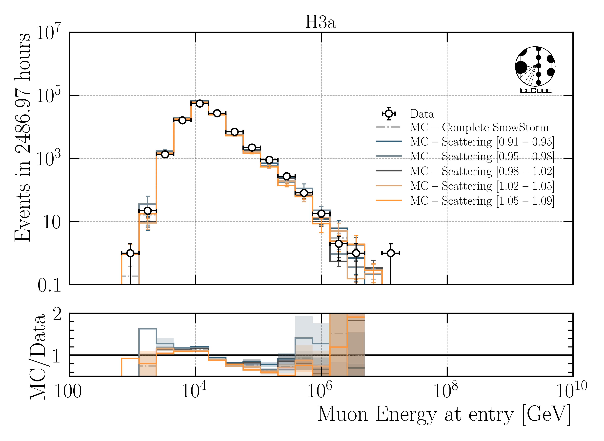

  : Impact of the Scattering systematic on the muon energy at entry. The dataset is divided into 5 systematic bins used to visualize the impact of the systematic on the proxy variable.

Chi2 test impact of systematics on muon energy at entry (proxy)
===========================================================

Perform a chi2 test to estimate the impact of the systematics on the proxy variable. For this, the highest and the lowest systematic bin are used. There is no significant impact of the HoleIce Forward p1 systematic on the proxy variable and a small impact of the HoleIce Forward p0 systematic. 

.. _Absorption_proxy_chi2:

  : Chi2 test for the Absorption systematic on the muon energy at entry. The dataset is divided into 5 systematic bins and the lowest and highest bin are used for the chi2 test.

.. _DOMEfficency_proxy_chi2:
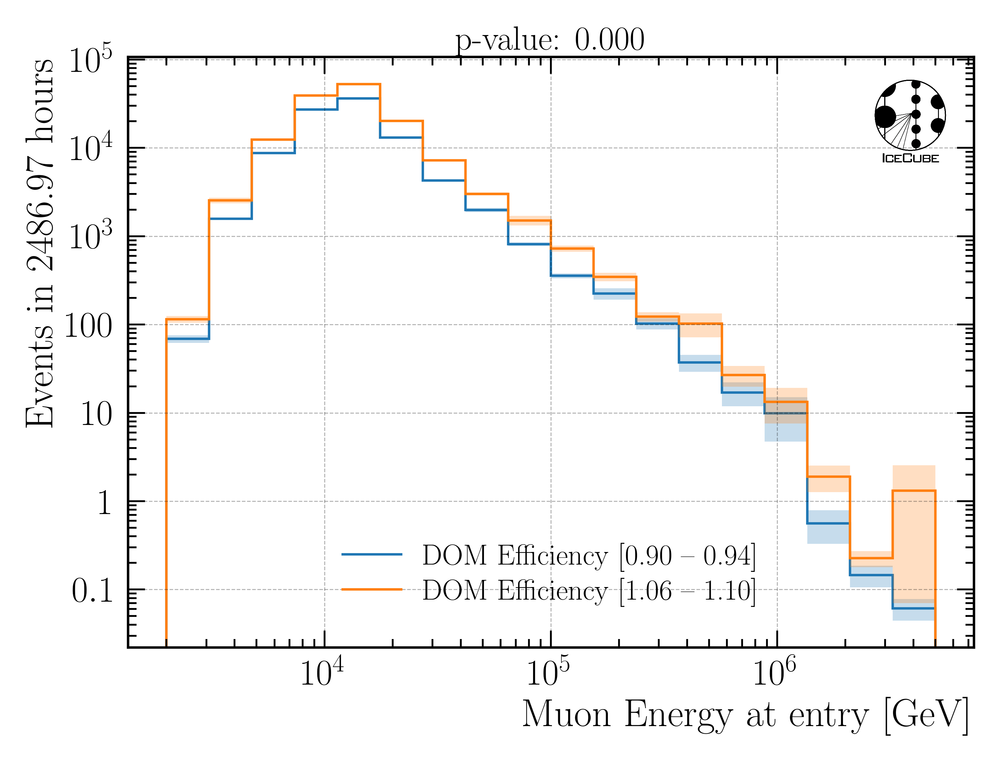

  : Chi2 test for the DOMEfficiency systematic on the muon energy at entry. The dataset is divided into 5 systematic bins and the lowest and highest bin are used for the chi2 test.

.. _HoleIceForward_p0_proxy_chi2:

  : Chi2 test for the HoleIceForward_p0 systematic on the muon energy at entry. The dataset is divided into 5 systematic bins and the lowest and highest bin are used for the chi2 test.

.. _HoleIceForward_p1_proxy_chi2:

  : Chi2 test for the HoleIceForward_p1 systematic on the muon energy at entry. The dataset is divided into 5 systematic bins and the lowest and highest bin are used for the chi2 test.

.. _Scattering_proxy_chi2:
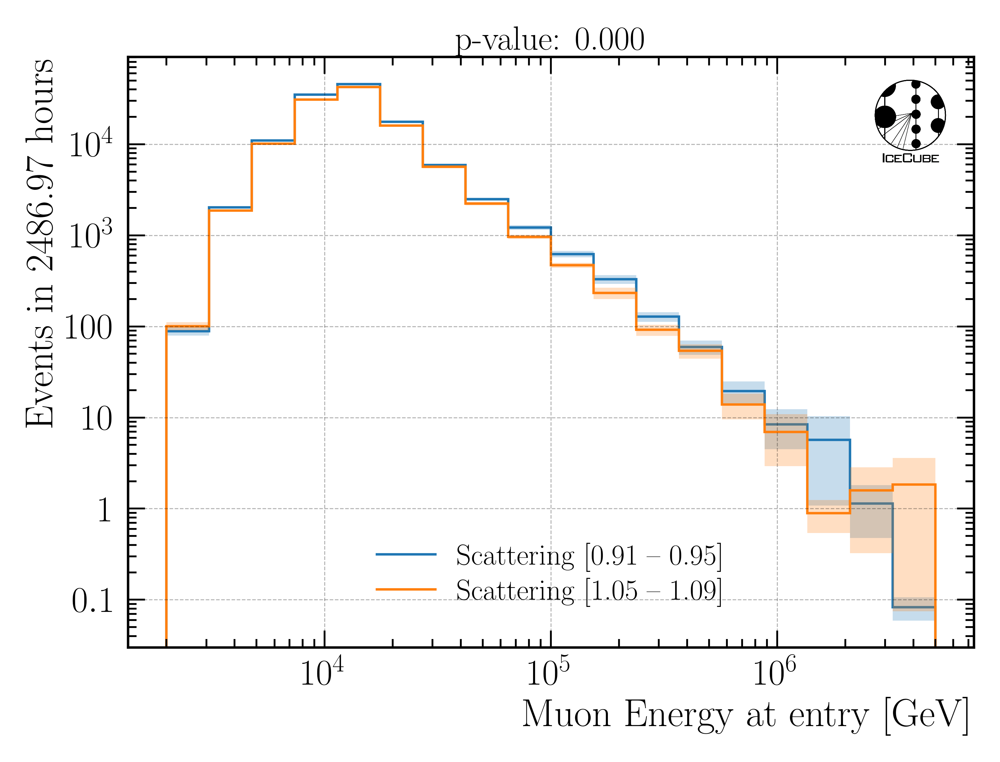

  : Chi2 test for the Scattering systematic on the muon energy at entry. The dataset is divided into 5 systematic bins and the lowest and highest bin are used for the chi2 test.

Fit systematic impact on muon energy at entry (proxy)
=====================================================

Each proxy bin is divided into three different datasets corresponding to the equidistant cuts on the 
systematic parameter. Then, the ratio of the sub-datasets to the baseline dataset is calculated.
These three ratios are fitted with a linear function. Therefore, at first a chi2 test is performed 
if a constant :math:`y = 1` is compatible with the data with a p-value of 0.05. If this is not the case, a linear fit with the lowest slope that is compatible with the data under a p-value of 0.2 is performed. A requirement that the fit is going through the baseline point is added. This procedure is done instead of fitting all three ratios because the uncertainties on the ratios are large in some of the bins. In addition, some bins have very small uncertainties, which would lead to a large impact on the fit. This is caused by insufficient statistics in the sub-datasets. Hence, when fitting the ratios, some unphysical parametrization with either an extreme slope, or an offset is obtained.

As an example, 3 bins (bin 0, 5 and 10 of 18 total bins) for each of the 5 systematics are shown below. A complete set of systematic fits can be found in the Google docs `here <https://drive.google.com/drive/folders/17r4pLPrKjZmZW83lhMTzp-gXytVQDk83?ths=true>`_. As expected from the distributions above, for Scattering, HoleIce p0 and HoleIce p1, most of the fits are compatible with a constant, thus they don't have an impact on my proxy variable. For Absorption and DOMEfficiency, in some bins there is an impact on the proxy variable, in some bins not.

.. _Absorption_proxy_fit_bin0:

  : Fit of the Absorption systematic on the muon energy at entry for bin 0. The dataset is divided into 3 systematic bins used to visualize the impact of the systematic on the proxy variable.

.. _Absorption_proxy_fit_bin5:

  : Fit of the Absorption systematic on the muon energy at entry for bin 5. The dataset is divided into 3 systematic bins used to visualize the impact of the systematic on the proxy variable.

.. _Absorption_proxy_fit_bin10:

  : Fit of the Absorption systematic on the muon energy at entry for bin 10. The dataset is divided into 3 systematic bins used to visualize the impact of the systematic on the proxy variable.

.. _DOMEfficency_proxy_fit_bin0:

  : Fit of the DOMEfficiency systematic on the muon energy at entry for bin 0. The dataset is divided into 3 systematic bins used to visualize the impact of the systematic on the proxy variable.

.. _DOMEfficency_proxy_fit_bin5:

  : Fit of the DOMEfficiency systematic on the muon energy at entry for bin 5. The dataset is divided into 3 systematic bins used to visualize the impact of the systematic on the proxy variable.

.. _DOMEfficency_proxy_fit_bin10:

  : Fit of the DOMEfficiency systematic on the muon energy at entry for bin 10. The dataset is divided into 3 systematic bins used to visualize the impact of the systematic on the proxy variable.

.. _HoleIceForward_p0_proxy_fit_bin0:
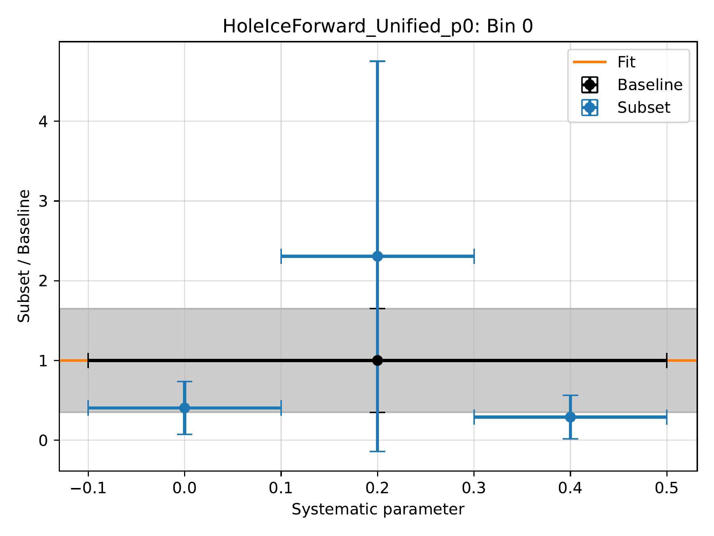

  : Fit of the HoleIceForward_p0 systematic on the muon energy at entry for bin 0. The dataset is divided into 3 systematic bins used to visualize the impact of the systematic on the proxy variable.

.. _HoleIceForward_p0_proxy_fit_bin5:
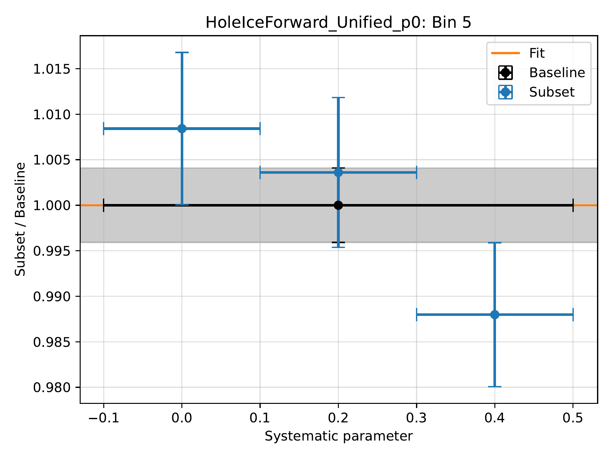

  : Fit of the HoleIceForward_p0 systematic on the muon energy at entry for bin 5. The dataset is divided into 3 systematic bins used to visualize the impact of the systematic on the proxy variable.

.. _HoleIceForward_p0_proxy_fit_bin10:

  : Fit of the HoleIceForward_p0 systematic on the muon energy at entry for bin 10. The dataset is divided into 3 systematic bins used to visualize the impact of the systematic on the proxy variable.

.. _HoleIceForward_p1_proxy_fit_bin0:

  : Fit of the HoleIceForward_p1 systematic on the muon energy at entry for bin 0. The dataset is divided into 3 systematic bins used to visualize the impact of the systematic on the proxy variable.

.. _HoleIceForward_p1_proxy_fit_bin5:

  : Fit of the HoleIceForward_p1 systematic on the muon energy at entry for bin 5. The dataset is divided into 3 systematic bins used to visualize the impact of the systematic on the proxy variable.

.. _HoleIceForward_p1_proxy_fit_bin10:

  : Fit of the HoleIceForward_p1 systematic on the muon energy at entry for bin 10. The dataset is divided into 3 systematic bins used to visualize the impact of the systematic on the proxy variable.

.. _Scattering_proxy_fit_bin0:

  : Fit of the Scattering systematic on the muon energy at entry for bin 0. The dataset is divided into 3 systematic bins used to visualize the impact of the systematic on the proxy variable.

.. _Scattering_proxy_fit_bin5:

  : Fit of the Scattering systematic on the muon energy at entry for bin 5. The dataset is divided into 3 systematic bins used to visualize the impact of the systematic on the proxy variable.  

.. _Scattering_proxy_fit_bin10:

  : Fit of the Scattering systematic on the muon energy at entry for bin 10. The dataset is divided into 3 systematic bins used to visualize the impact of the systematic on the proxy variable.

Results: Unfolding with systematics
-----------------------------------
