.. _appendix paragraph:

Appendix
########

This appendix includes further information about studies, detailed investigations and tests.  

.. _stochasticity paragraph:

Stochasticity 
+++++++++++++

``This section is based on datasets 30010-30013``

A muon loses its energy in stochastic processes. Thus, a single muon deposits stochastic energy losses along a track. In a bundle of many muons, 
every muon has its own stochastic energy losses, which 
appear as a more continuous energy loss in the detector. Hence, if there are very stochastic energy losses detected inside the detector, there are 
probably only a few muons or a single muon (at low energies). 
If we extend this to high energies, the largest energy losses are caused by the most energetic muon in the bundle. In a bundle in which the muon 
energies are distributed more equally, also the losses 
appear more continuously. The idea is to search for events that deposit their energy more stochastically to select and/or to improve the energy 
reconstruction of muons with a high leadingness. 

For the stochasticity calculation of the leading muon, the energy depositions and corresponding distances are needed. These can be determined by the function
`get_track_energy_depositions <https://github.com/icecube/ic3-labels/blob/5b68fa208607c5cba9cfd6ec317985017cc6c113/ic3_labels/labels/modules/event_generator/utils.py#L10>`_.
The stochasticity is then calculated by the function `compute_stochasticity <https://github.com/icecube/ic3-labels/blob/5b68fa208607c5cba9cfd6ec317985017cc6c113/ic3_labels/labels/modules/event_generator/utils.py#L796>`_.
This function calculates the stochasticity of energy losses along a track by measuring the area between the cumulative distribution function (CDF) of the energy losses 
and the relative distances. 
It returns three values: the stochasticity (a float between 0 and 1, normalized by 0.5), the total area above the diagonal (a float), and the total area below the diagonal (a float).
An extreme case of 1 means, the muon loses all it's energy in one interaction, the extreme case of 0 means, the muon loses all it's energy continuously.

As mentioned above, usually there is not only one muon, but several muons entering the detector. The energy losses of individual muons overlap. For this calculation, 
all energy losses of all muons with respect to their propagated distance are determined by the function 
`get_bundle_energy_depositions <https://github.com/icecube/ic3-labels/blob/5b68fa208607c5cba9cfd6ec317985017cc6c113/ic3_labels/labels/modules/event_generator/utils.py#L602>`_.
Here, it is assumed that all tracks travel on the same trajectory. The stochasticity is then calculated with the same function stated above. In this analysis, it is referred to 
as the bundle stochasticity.

Monte Carlo studies
-------------------

In :numref:`stochasticity_vs_leadingness`, the leadingness is shown as a function of the bundle stochasticity. If the muon event has a large stochasticity, 
this is caused by a high leadingness, but this is the case only for a small amount of events. Hence, a high leadingness does not necessary results to a 
large stochasticity.

.. _stochasticity_vs_leadingness:
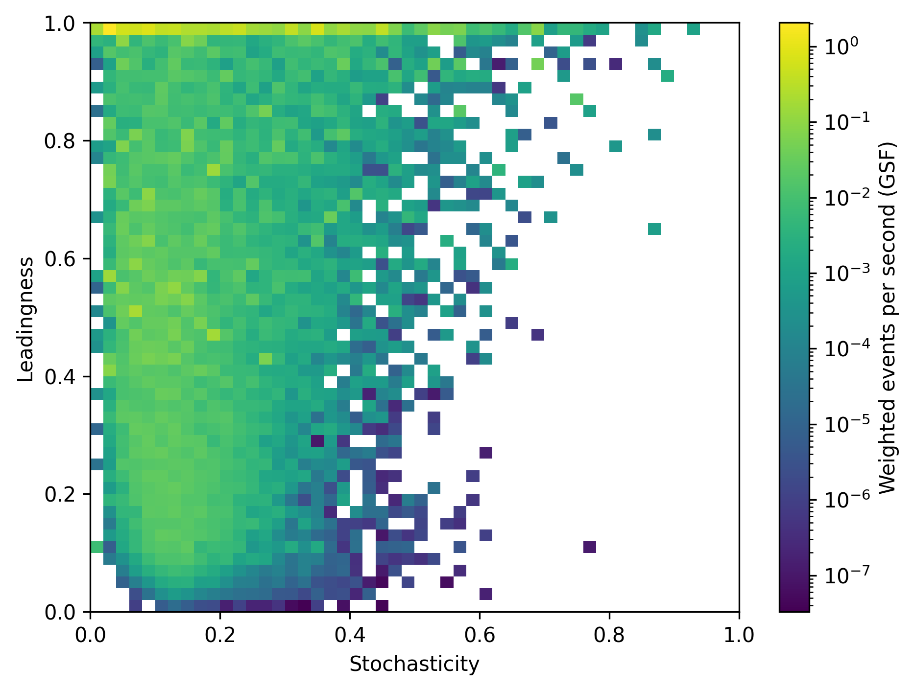

    : The leadingness is shown as a function of the bundle stochasticity as a weighted distribution.

To get an idea of the correlation between the leading muon energy and the bundle stochasticity, 
in :numref:`MCLabelsLeadingMuons_bundle_stochasticity_vs_MCLabelsLeadingMuons_entry_energy`, the energy of the leading muon is shown as a function of the bundle stochasticity.

.. _MCLabelsLeadingMuons_bundle_stochasticity_vs_MCLabelsLeadingMuons_entry_energy:
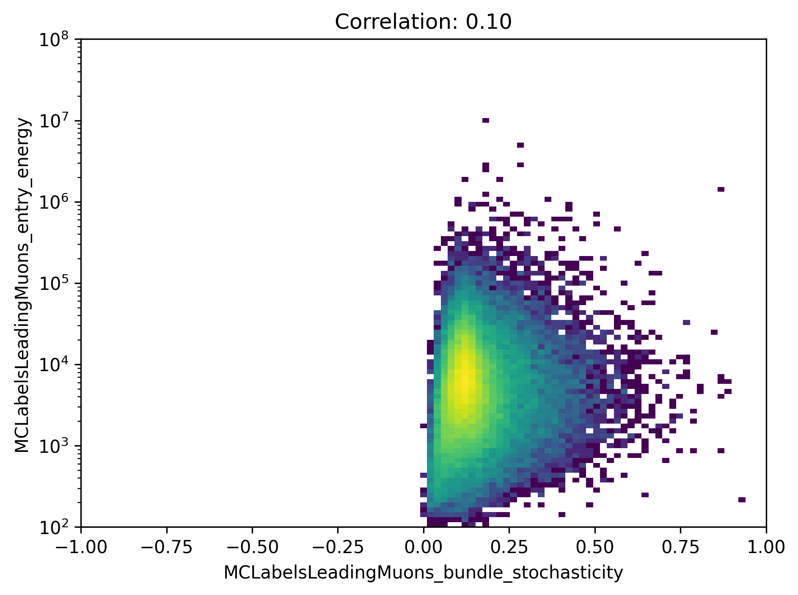

    : The energy of the leading muon is shown as a function of the bundle stochasticity.

In the following, the title of the plots shows a cut applied on the bundle energy in GeV. Hence, from left to right only high energy muons are selected.

In :numref:`MCLabelsLeadingMuons_bundle_stochasticity_vs_MCLabelsLeadingMuons_leading_energy_rel_entry_bundle_energy_cuts_larger_bins_no_logscale`, 
the leadingness is shown as a function of the bundle stochasticity. High stochasticities lead to a large leadingness, but it removes the entire statistics.

.. _MCLabelsLeadingMuons_bundle_stochasticity_vs_MCLabelsLeadingMuons_leading_energy_rel_entry_bundle_energy_cuts_larger_bins_no_logscale:
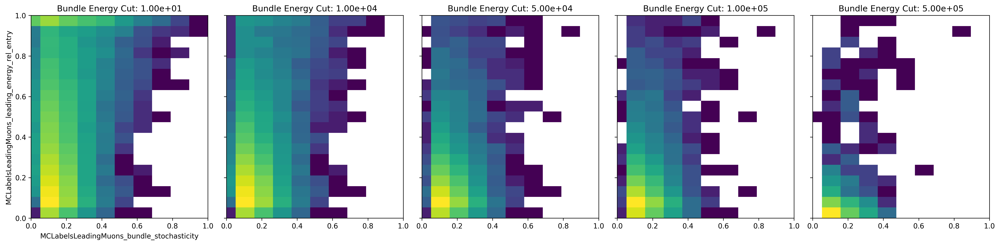

    : The leadingness is shown as a function of the bundle stochasticity.

In :numref:`MCLabelsLeadingMuons_bundle_stochasticity_energy_00_vs_MCLabelsLeadingMuons_leading_energy_rel_entry_bundle_energy_cuts_larger_bins_no_logscale`, 
the leadingness is shown as a function of the largest energy loss. It results that considering only the largest energy loss does not 
indicate the leadingness.

.. _MCLabelsLeadingMuons_bundle_stochasticity_energy_00_vs_MCLabelsLeadingMuons_leading_energy_rel_entry_bundle_energy_cuts_larger_bins_no_logscale:
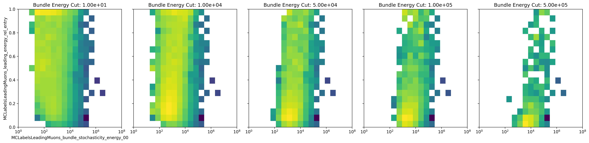

    : The leadingness is shown as a function of the largest energy loss.

In :numref:`MCLabelsLeadingMuons_bundle_stochasticity_energy_00_vs_MCLabelsLeadingMuons_entry_energy`, the energy of the leading muon is shown as a function of the largest energy loss. 
The largest energy loss is correlated with the energy of the leading muon. The larger the energy loss, the higher the energy of the leading muon.

.. _MCLabelsLeadingMuons_bundle_stochasticity_energy_00_vs_MCLabelsLeadingMuons_entry_energy:
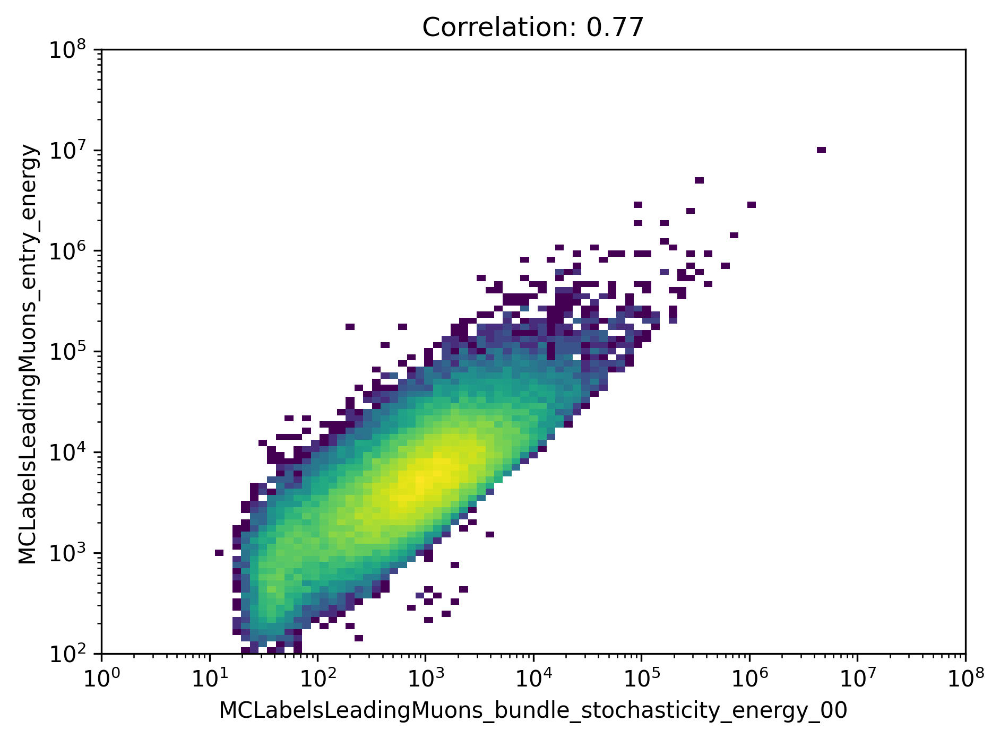

    : The energy of the leading muon is shown as a function of the largest energy loss.

In :numref:`bundle_muon_energy_spectrum_stochasticity_cuts`, the energy spectrum of the leading muon is shown for different cuts on the stochasticity. The plot is divided into 
a prompt and conventional component. 
A cut on the stochasticity removes high energy muons. Due to the low statistics expected at high energies for 10 years, 
we do not apply any cuts on the stochasticity in this analysis.

.. _bundle_muon_energy_spectrum_stochasticity_cuts:
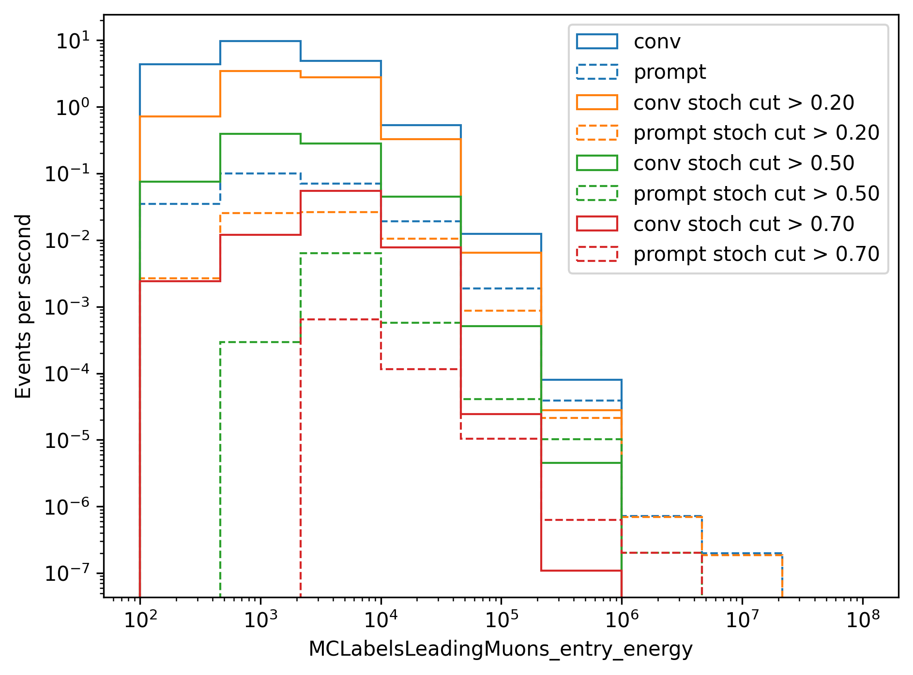

    : The energy spectrum of the leading muon is shown for different cuts on the stochasticity.

.. _impact stochasticity paragraph:

Impact on the energy reconstruction
-----------------------------------

The impact of the stochasticity on the energy reconstruction is shown in the following plots. 

The bundle energy reconstruction for different cuts on the stochasticity is shown in :numref:`bundleE_DeepLearningReco_exported_model_PromptMu_L2_energy_stoch_cut_lower` and
:numref:`bundleE_DeepLearningReco_exported_model_PromptMu_L2_energy_stoch_cut_higher`. A cut on the stochasticity does not improve the bundle energy reconstruction.

.. _bundleE_DeepLearningReco_exported_model_PromptMu_L2_energy_stoch_cut_lower:
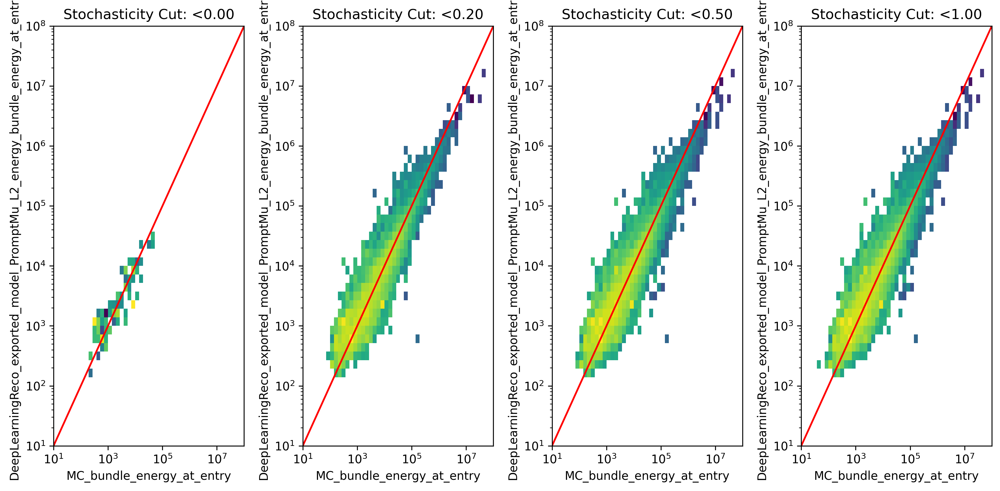

    : The bundle energy reconstruction for stochasticities below a certain cut is shown.

.. _bundleE_DeepLearningReco_exported_model_PromptMu_L2_energy_stoch_cut_higher:
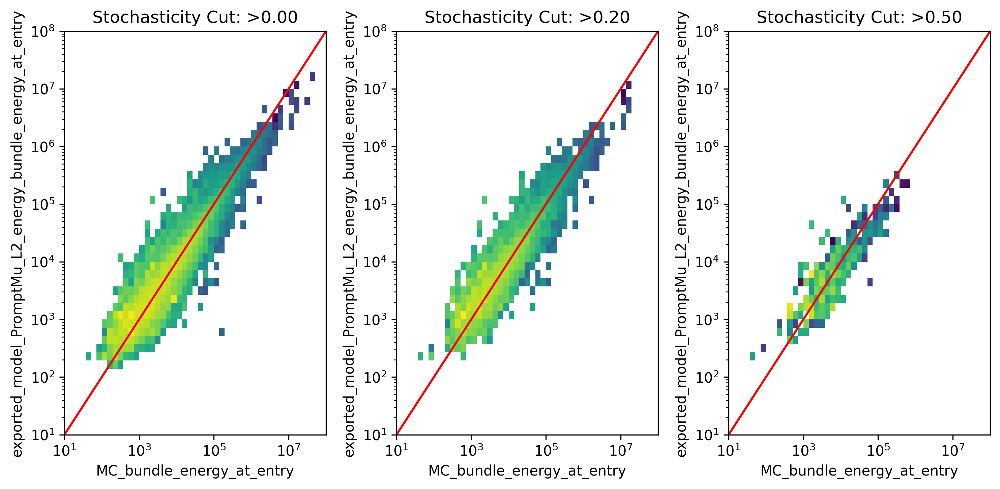
    
    : The bundle energy reconstruction for stochasticities above a certain cut is shown.

The leading muon energy reconstruction for different cuts on the stochasticity is shown in :numref:`leadingE_DeepLearningReco_exported_model_PromptMu_L2_energy_stoch_cut_lower` and
:numref:`leadingE_DeepLearningReco_exported_model_PromptMu_L2_energy_stoch_cut_higher`. A cut on the stochasticity does not improve the leading muon energy reconstruction.

.. _leadingE_DeepLearningReco_exported_model_PromptMu_L2_energy_stoch_cut_lower:
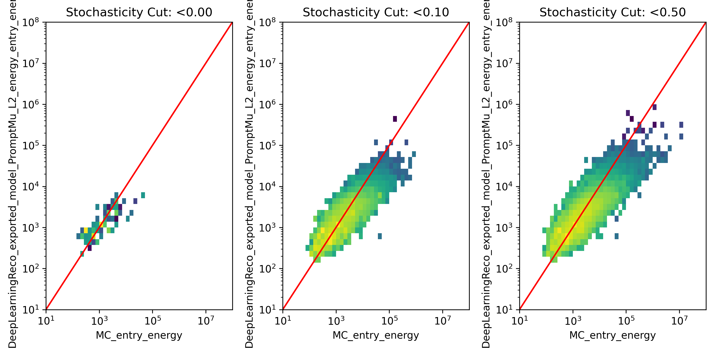

    : The leading muon energy reconstruction for stochasticities below a certain cut is shown.

.. _leadingE_DeepLearningReco_exported_model_PromptMu_L2_energy_stoch_cut_higher:
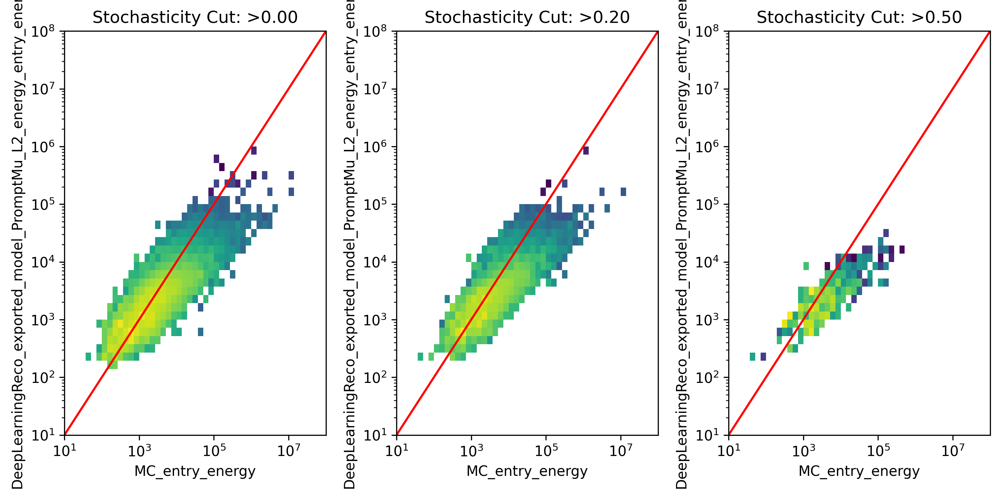

    : The leading muon energy reconstruction for stochasticities above a certain cut is shown.

In summary, a cut on the stochasticity does not improve the bundle or leading muon energy reconstruction. 

.. _bundle radius paragraph:

Bundle radius 
+++++++++++++

``This section is based on datasets 30010-30013``

Another idea to investigate muons with a high leadingness is to analyze the bundle radius. Depending on the fraction of the energy the most energetic muons carries, 
the projected radius of the 
entire bundle should differ. Here, different radii for the fractional amount of energy inside the projected area are studied. 
To quantify this, the perpendicular distance between the leading muon and the closest approach position to the center of the detector is 
calculated. Then, the closest approach point to the center is calculated for all muons in the bundle. With these positions, the distances between 
the leading muon and the other muons are calculated. Finally, the distances are weighted by the energy. For example, 100% means that the largest distance between 
a muon and the leading muon is considered. 90% means that the distance between the leading muon and the muon that accumulates 90 % of the bundle energy is considered.
In the following, this distance is referred to as the bundle radius. The calculation can be performed with the function 
`get_bundle_radius <https://github.com/icecube/ic3-labels/blob/5b68fa208607c5cba9cfd6ec317985017cc6c113/ic3_labels/labels/utils/muon.py#L1802>`_.

Monte Carlo studies
-------------------

In :numref:`bundle_radius_scale_2`, the bundle radius is shown for different bundle radius quantiles. These range from the energy inside the projected area 
from 50% to 100%. The same plot is shown for different scalings on the axes. The distributions peak between 5m and 20m, but also radii above 100m are observed.

.. _bundle_radius_scale_2:
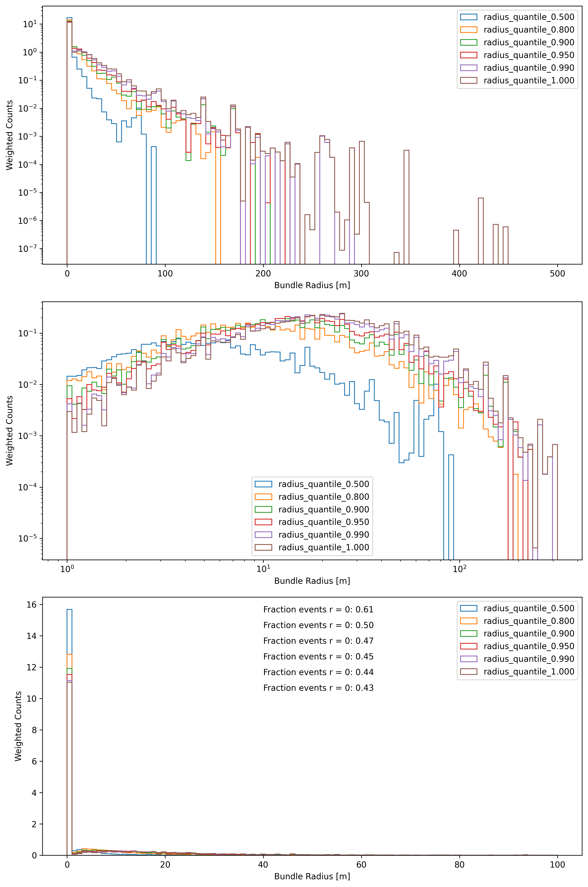

    : The bundle radius is shown for different bundle radius quantiles.

In :numref:`bundle_radius_vs_leadingness`, the leadingness is shown as a function of the bundle radius for a bundle radius quantile of 100%. If the bundle radius is 
very small, the leadingness is high.

.. _bundle_radius_vs_leadingness:
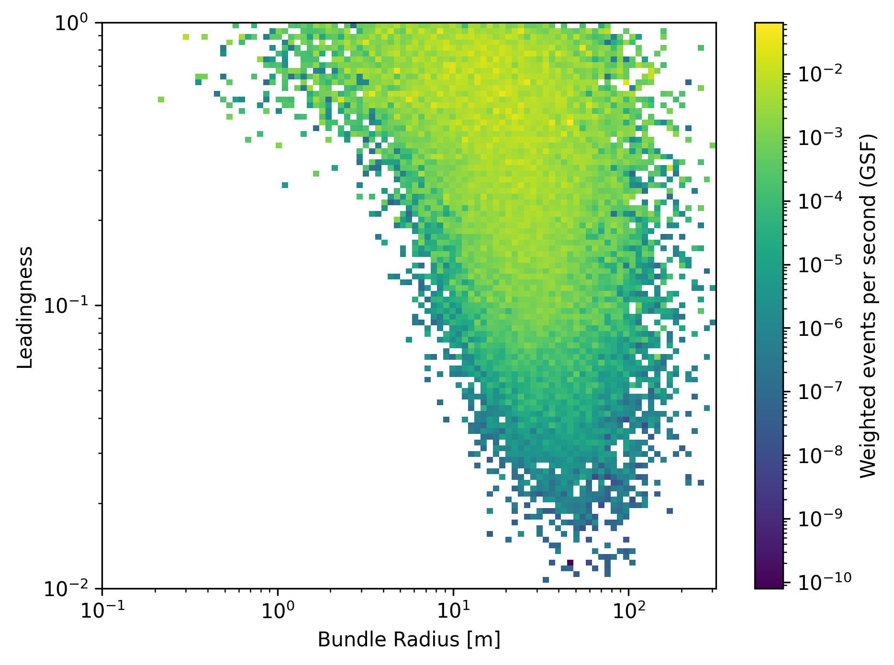

    : The leadingness is shown as a function of the bundle radius for a bundle radius quantile of 100% as a weighted distribution.

In the following :numref:`bundle_radius_radius_quantile_1.000_leadingness_bundle_energy_cut_no_logscale`, 
the leadingness is shown as a function of the bundle radius for different bundle energy cuts. If the bundle radius is high, the leadingness is low.

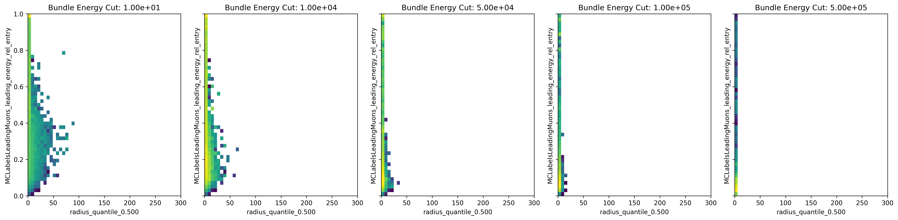

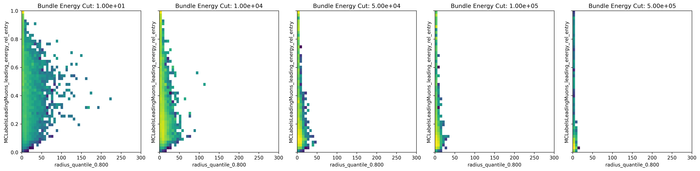

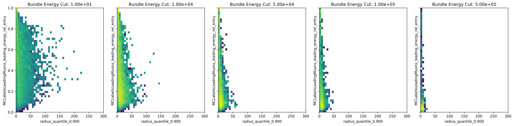

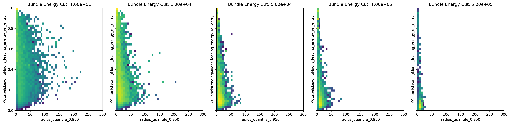

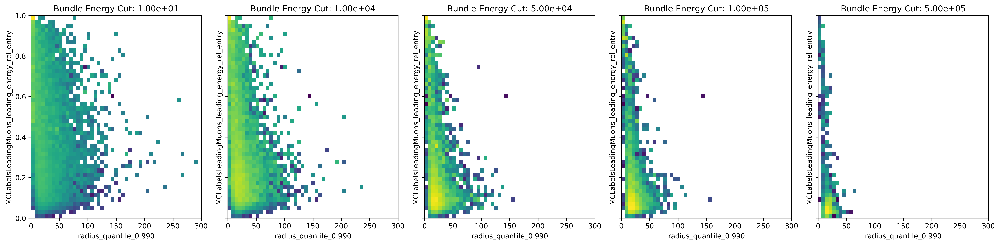

.. _bundle_radius_radius_quantile_1.000_leadingness_bundle_energy_cut_no_logscale:
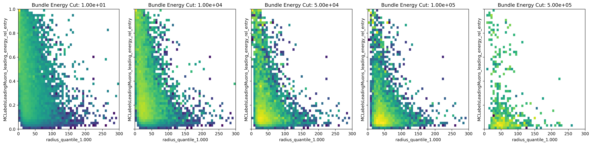

    : The leadingness is shown as a function of the bundle radius for different bundle energy cuts.

In :numref:`bundle_radius_radius_quantile_1.000_bundleE_bundle_energy_cut`, the muon bundle energy is shown as a function of the bundle radius for different bundle energy cuts.
For a small amount of events, a large bundle radius indicates a low bundle energy.

.. _bundle_radius_radius_quantile_1.000_bundleE_bundle_energy_cut:
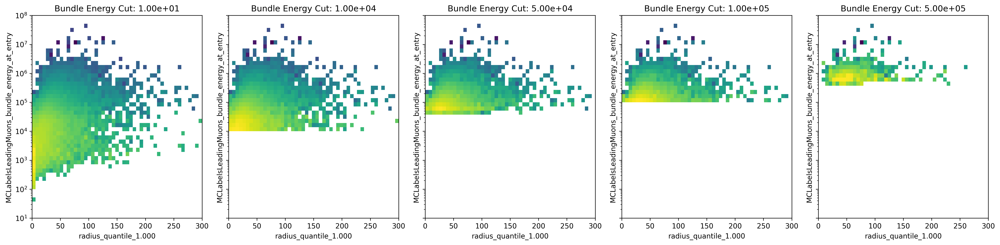

    : The muon bundle energy is shown as a function of the bundle radius for different bundle energy cuts.

In :numref:`bundle_radius_radius_quantile_1.000_leadingE_bundle_energy_cut`, the leading muon energy is shown as a function of the bundle radius for different bundle energy cuts.
For a small amount of events, a large bundle radius indicates a low leading muon energy.

.. _bundle_radius_radius_quantile_1.000_leadingE_bundle_energy_cut:
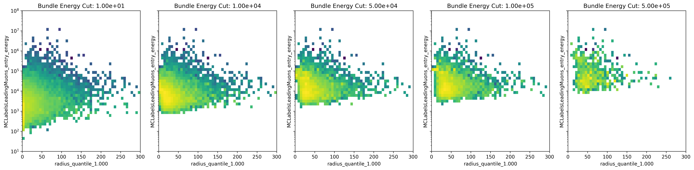

    : The leading muon energy is shown as a function of the bundle radius for different bundle energy cuts.

In :numref:`leadingE_radius_0.990_cut_prompt`, the leading muon energy spectrum is shown for different cuts on the bundle radius. 
A bundle radius quantile of 99% is chosen as a cut parameter. 

.. _leadingE_radius_0.990_cut_prompt:
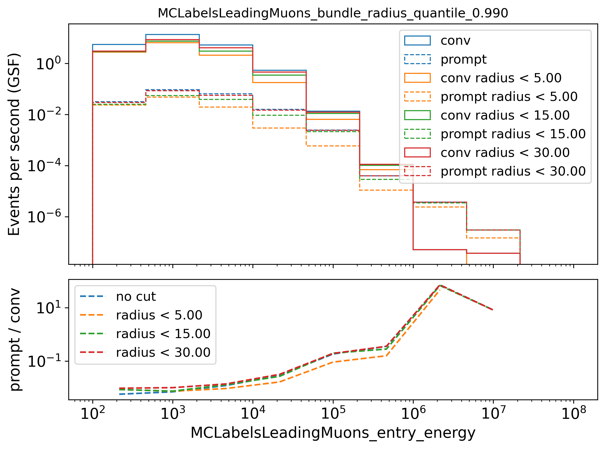

    : The leading muon energy spectrum is shown for different cuts on the bundle radius of the 99% quantile.

In :numref:`leadingE_radius_1.000_cut_prompt`, the leading muon energy spectrum is shown for different cuts on the bundle radius.
A bundle radius quantile of 100% is chosen as a cut parameter.

.. _leadingE_radius_1.000_cut_prompt:
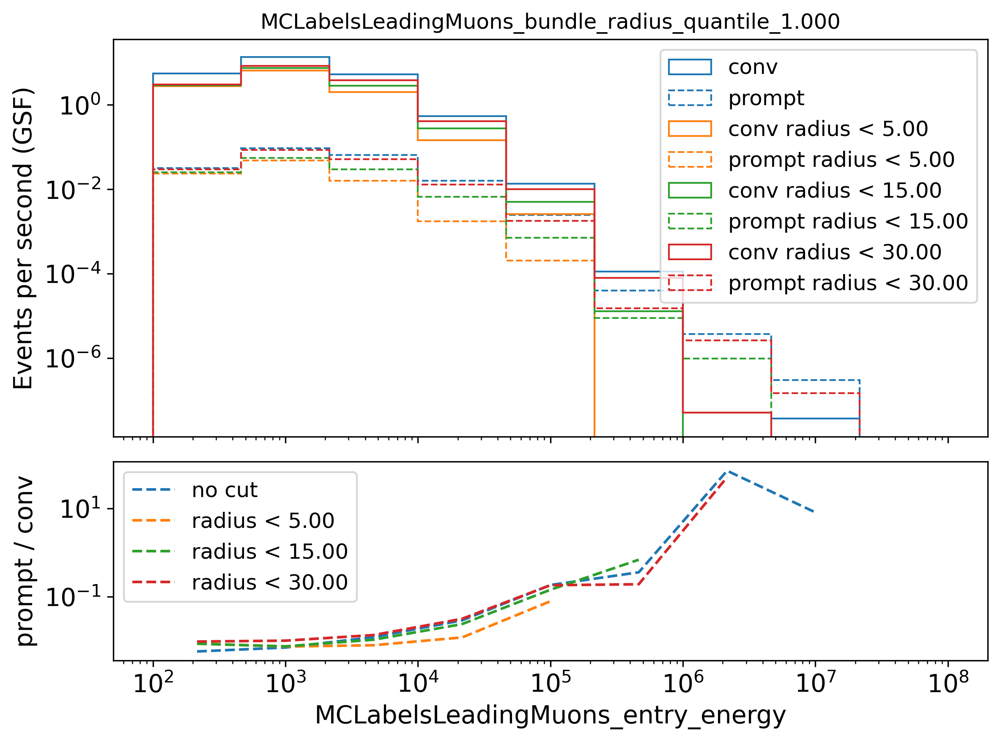

    : The leading muon energy spectrum is shown for different cuts on the bundle radius of the 100% quantile.

Selecting events below a certain bundle radius does not increase the sensitivity to distinguish between prompt and conventional, but it removes 
statistics. Thus, there is no selection performed using the bundle radius.

.. _impact bundle radius paragraph:

Impact on the energy reconstruction
-----------------------------------

In :numref:`bundle_radius_radius_quantile_1.000_leadingE_DeepLearningReco_exported_model_PromptMu_L2_energy_radius_cut`, the impact of the bundle radius on the 
reconstruction of the leading muon energy is shown. A bundle radius quantile of 100% is chosen as a cut parameter.

.. _bundle_radius_radius_quantile_1.000_leadingE_DeepLearningReco_exported_model_PromptMu_L2_energy_radius_cut: 
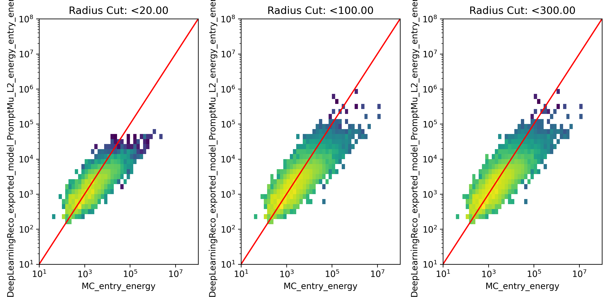

    : The impact of the bundle radius of the 10% quantile on the reconstruction of the leading muon energy is shown.

There is no significant reconstruction improvement due to the application of a bundle radius cut. Instead, high energy 
events are rejected. Hence, no cut on the bundle radius is performed.

.. _network evaluation paragraph:

Network evaluation 
++++++++++++++++++

``This section is based on datasets 30010-30013``

In the following, the evaluation of the networks is shown. Each figure contains two plots. The left plots show the evaluation of all events, 
the right plot shows an uncertainty cut applied on the estimated uncertainty by the network. The evaluation is performed on our own extended 
history simulation dataset (datasets 30010 - 30013). Each plot has the network prediction on the y-axis and the true value on the x-axis. 
In general, networks are trained with 
3 or 9 inputs and a time window of 6ms or the internal DNN time window cleaning is applied to the *SplitInIceDSTPulses*. 
Furthermore, the CNN layers and nodes are varied. The runtime prediction 
is presented for the usage of a GPU. The preprocessing runtime represents the time needed to create the input features for the network based on the 
input pulses. 

Bundle energy at surface 
------------------------

precut networks:

.. _DeepLearningReco_precut_bundle_energy_3inputs_6ms_at_surface_01_vs_MCLabelsLeadingMuons_bundle_energy_in_mctree:
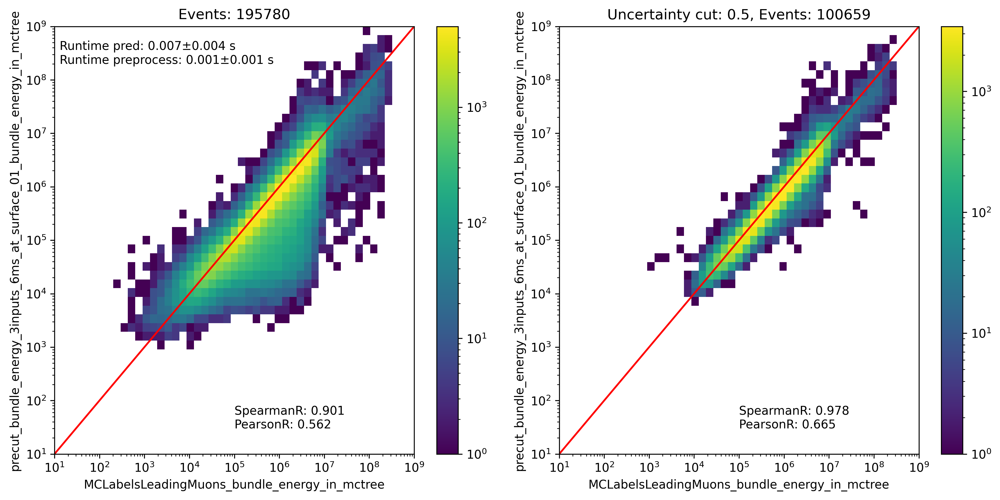

    : The bundle energy at the surface is shown for the network ``DeepLearningReco_precut_bundle_energy_3inputs_6ms_at_surface_01``. It uses 3 inputs 
    and a 6ms time window.

.. _DeepLearningReco_precut_bundle_energy_3inputs_6ms_01_vs_MCLabelsLeadingMuons_bundle_energy_in_mctree:
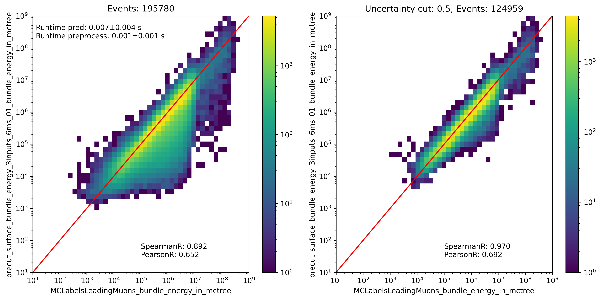

    : The bundle energy at the surface is shown for the network ``DeepLearningReco_precut_surface_bundle_energy_3inputs_6ms_01``. It uses 3 inputs
    and a 6ms time window.

----

.. _DeepLearningReco_leading_bundle_surface_leading_bundle_energy_OC_inputs9_6ms_large_log_02__bundle_energy_in_mctree:
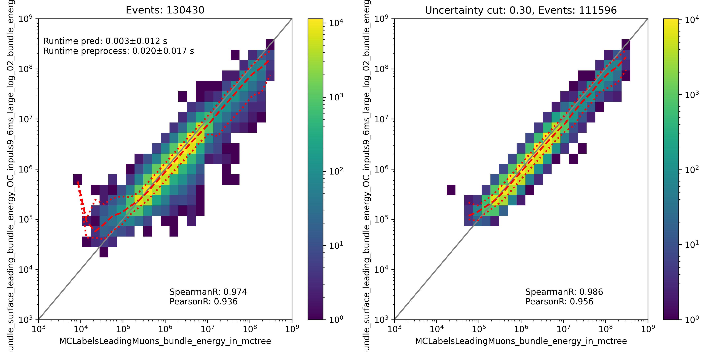

    : The bundle energy at the surface is shown for the network ``DeepLearningReco_leading_bundle_surface_leading_bundle_energy_OC_inputs9_6ms_large_log_02``. It uses 9 inputs and a 6ms time window.

.. _DeepLearningReco_leading_bundle_surface_leading_bundle_energy_OC_inputs9_large_log_02__bundle_energy_in_mctree:
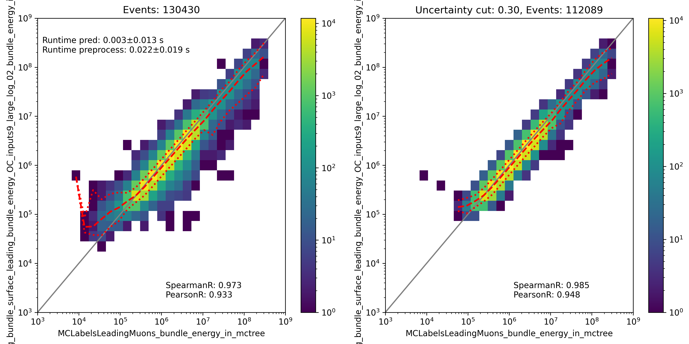

    : The bundle energy at the surface is shown for the network ``DeepLearningReco_leading_bundle_surface_leading_bundle_energy_OC_inputs9_large_log_02``. It uses 9 inputs and the internal DNN time window cleaning.

Bundle energy at entry 
----------------------

.. _DeepLearningReco_leading_bundle_energy_OC_inputs9_6ms_large_log_02__bundle_energy_at_entry:
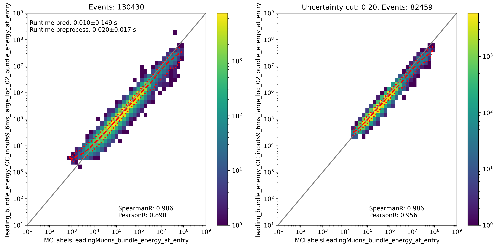

    : The bundle energy at the entry is shown for the network ``DeepLearningReco_leading_bundle_energy_OC_inputs9_6ms_large_log_02``. It uses 9 inputs and a 6ms time window.

.. _DeepLearningReco_leading_bundle_OC_inputs9_large_log_02__bundle_energy_at_entry:

    : The bundle energy at the entry is shown for the network ``DeepLearningReco_leading_bundle_OC_inputs9_large_log_02``. It uses 9 inputs and the internal DNN time window cleaning.

.. _DeepLearningReco_leading_bundle_surface_leading_bundle_energy_OC_inputs9_6ms_large_log_02__bundle_energy_at_entry:

    : The bundle energy at the entry is shown for the network ``DeepLearningReco_leading_bundle_surface_leading_bundle_energy_OC_inputs9_6ms_large_log_02``. It uses 9 inputs and a 6ms time window.

.. _DeepLearningReco_leading_bundle_surface_leading_bundle_energy_OC_inputs9_large_log_02__bundle_energy_at_entry:
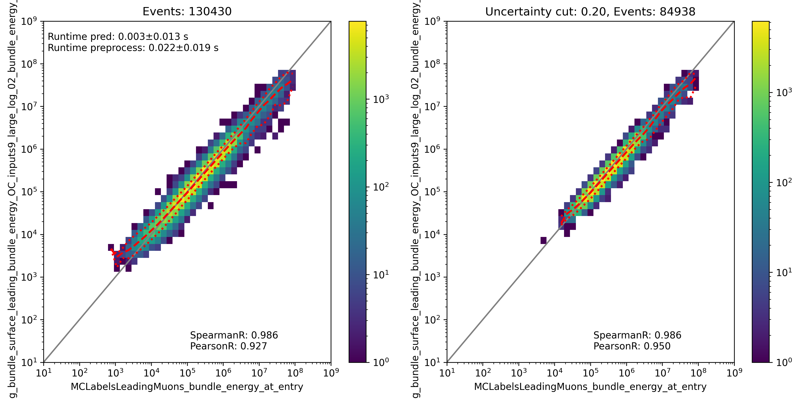

    : The bundle energy at the entry is shown for the network ``DeepLearningReco_leading_bundle_surface_leading_bundle_energy_OC_inputs9_large_log_02``. It uses 9 inputs and the internal DNN time window cleaning.

Leading muon energy at surface
------------------------------

.. _DeepLearningReco_leading_bundle_surface_leading_bundle_energy_OC_inputs9_6ms_large_log_02__muon_energy_first_mctree:
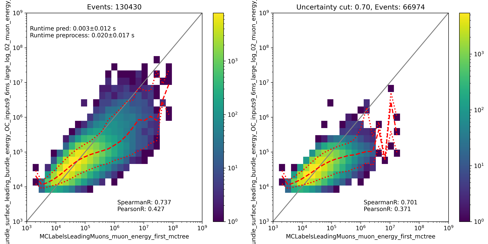

    : The leading muon energy at the surface is shown for the network ``DeepLearningReco_leading_bundle_surface_leading_bundle_energy_OC_inputs9_6ms_large_log_02``. It uses 9 inputs and a 6ms time window.

.. _DeepLearningReco_leading_bundle_surface_leading_bundle_energy_OC_inputs9_large_log_02__muon_energy_first_mctree:
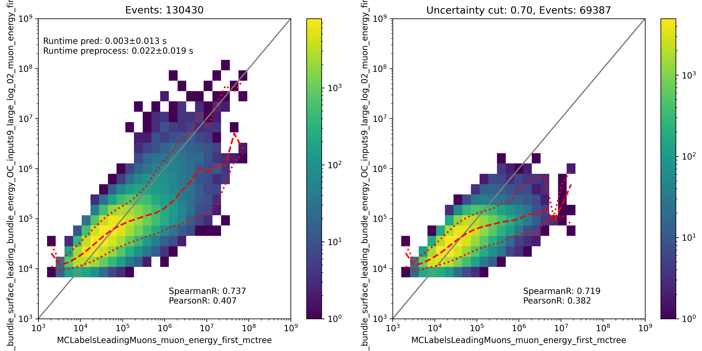

    : The leading muon energy at the surface is shown for the network ``DeepLearningReco_leading_bundle_surface_leading_bundle_energy_OC_inputs9_large_log_02``. It uses 9 inputs and the internal DNN time window cleaning.

Leading muon energy at entry
----------------------------

.. _DeepLearningReco_leading_bundle_energy_OC_inputs9_6ms_large_log_02__entry_energy:
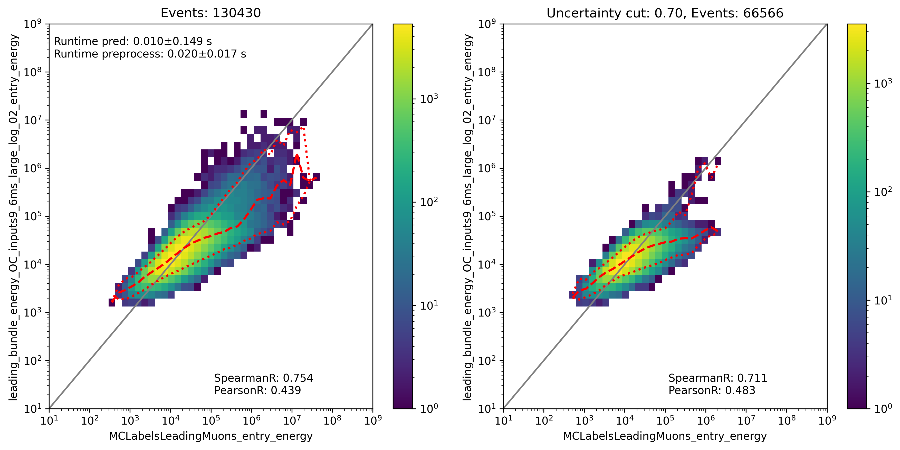

    : The leading muon energy at the entry is shown for the network ``DeepLearningReco_leading_bundle_energy_OC_inputs9_6ms_large_log_02``. It uses 9 inputs and a 6ms time window.

.. _DeepLearningReco_leading_bundle_OC_inputs9_large_log_02__entry_energy:
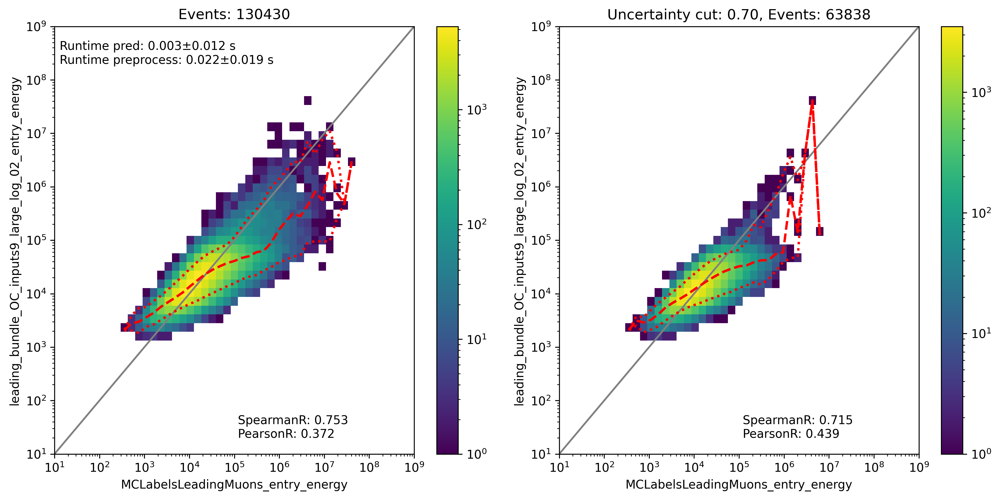

    : The leading muon energy at the entry is shown for the network ``DeepLearningReco_leading_bundle_OC_inputs9_large_log_02``. It uses 9 inputs and the internal DNN time window cleaning.

.. _DeepLearningReco_leading_bundle_surface_leading_bundle_energy_OC_inputs9_6ms_large_log_02__entry_energy:

    : The leading muon energy at the entry is shown for the network ``DeepLearningReco_leading_bundle_surface_leading_bundle_energy_OC_inputs9_6ms_large_log_02``. It uses 9 inputs and a 6ms time window.

.. _DeepLearningReco_leading_bundle_surface_leading_bundle_energy_OC_inputs9_large_log_02__entry_energy:
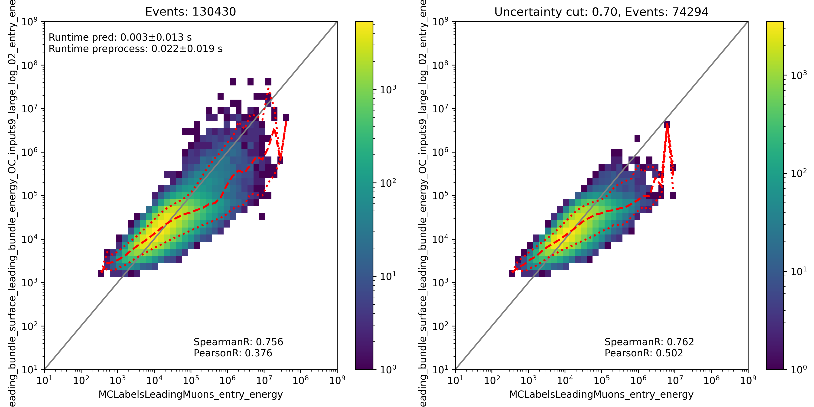

    : The leading muon energy at the entry is shown for the network ``DeepLearningReco_leading_bundle_surface_leading_bundle_energy_OC_inputs9_large_log_02``. It uses 9 inputs and the internal DNN time window cleaning.

---- 

The reconstruction of the leading muon is a difficult task, since the leading muon is accompanied by a bundle of muons. Thus, the emitted cherenkov light of the 
leading muon is superimposed by the light of the other muons. In :numref:`true_muon_energy_fraction`, the true muon energy fraction is shown as a function of the true 
bundle energy, at entry. There is a clear correlation between the true muon energy fraction and the true bundle energy. The distribution is smeared. 
In :numref:`recos_muon_energy_fraction`, the reconstructed muon energy fraction is shown as a function of the reconstructed bundle energy, at entry. This distribution is less smeared. 
Hence, the network seems to reconstruct the bundle energy and tries to refer to the leading muon energy. 

.. _true_muon_energy_fraction:
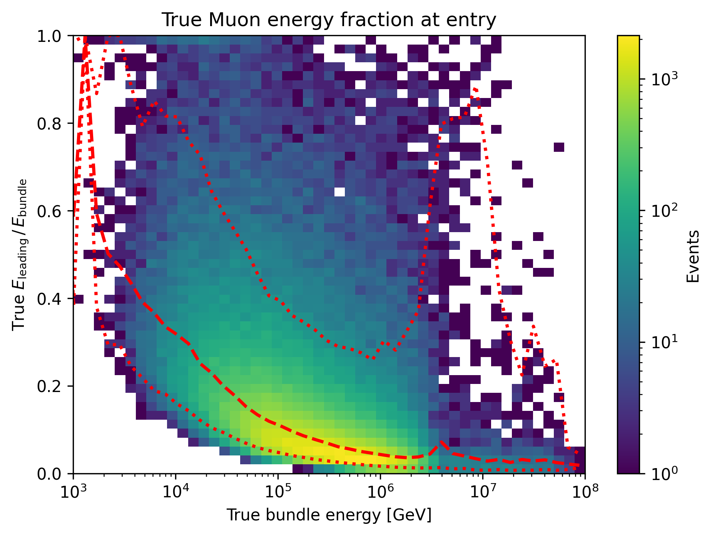

    : The true muon energy fraction is shown as a function of the true bundle energy, at entry.

.. _recos_muon_energy_fraction:
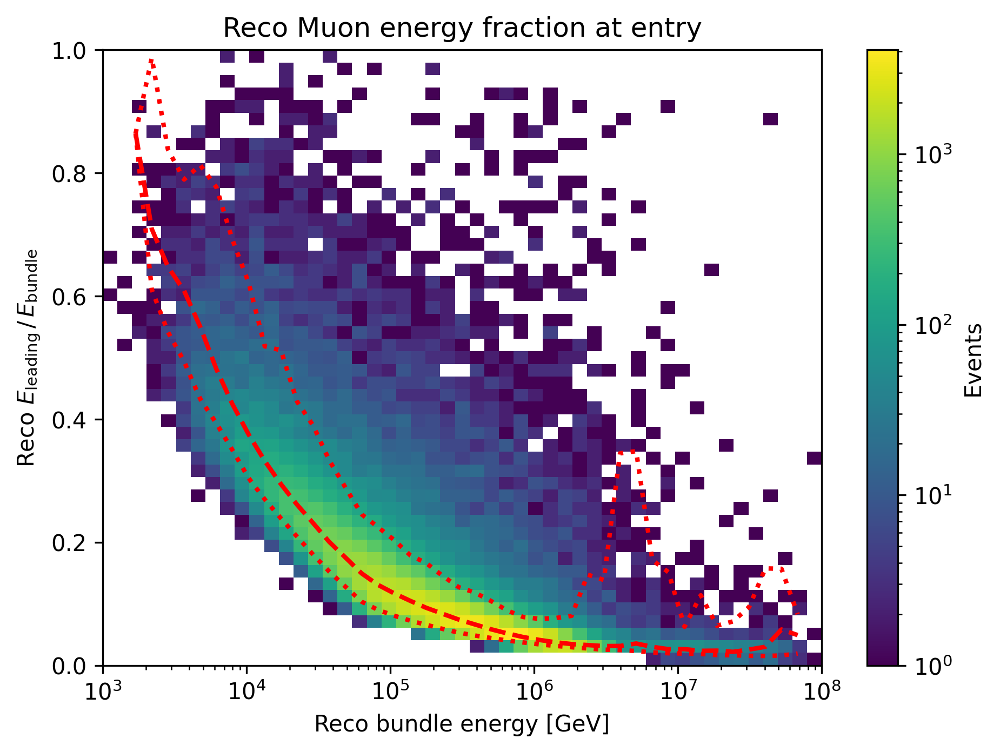

    : The reconstructed muon energy fraction is shown as a function of the true bundle energy, at entry.

Track geometry
--------------

Center time:

.. _track_geometry_9inputs_6ms_medium_01__center_pos_t:
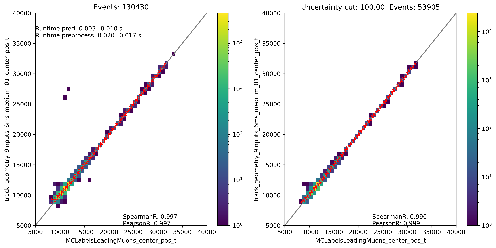

    : The center time is shown for the network ``DeepLearningREco_track_geometry_9inputs_6ms_medium_01``. It uses 9 inputs and a 6ms time window.

.. _track_geometry_9inputs_uncleaned_01__center_pos_t:
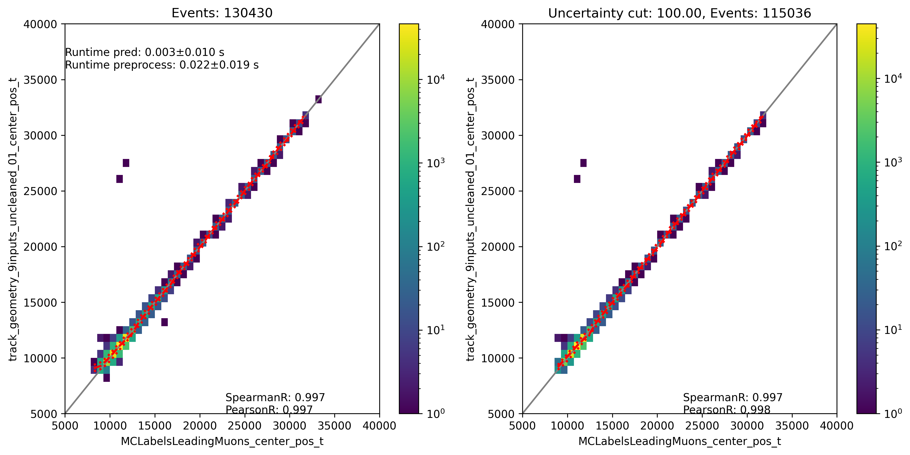

    : The center time is shown for the network ``DeepLearningREco_track_geometry_9inputs_uncleaned_01``. It uses 9 inputs and the internal DNN time window cleaning.

Entry time: 

.. _track_geometry_9inputs_6ms_medium_01__entry_pos_t:
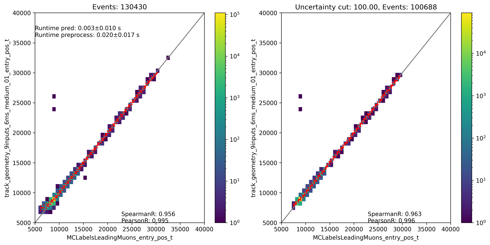

    : The entry time is shown for the network ``DeepLearningREco_track_geometry_9inputs_6ms_medium_01``. It uses 9 inputs and a 6ms time window.

.. _track_geometry_9inputs_uncleaned_01__entry_pos_t:
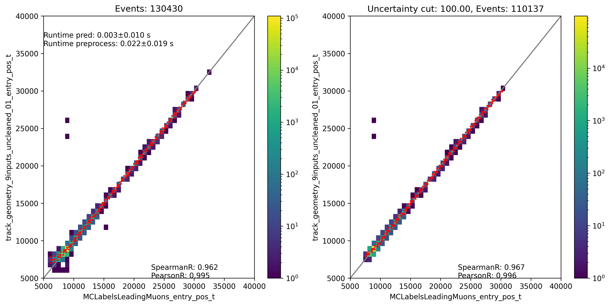

    : The entry time is shown for the network ``DeepLearningREco_track_geometry_9inputs_uncleaned_01``. It uses 9 inputs and the internal DNN time window cleaning.

Center position x:

.. _track_geometry_9inputs_6ms_medium_01__center_pos_x:
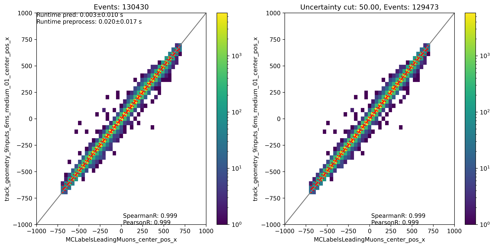

    : The center position x is shown for the network ``DeepLearningREco_track_geometry_9inputs_6ms_medium_01``. It uses 9 inputs and a 6ms time window.

.. _track_geometry_9inputs_uncleaned_01__center_pos_x:
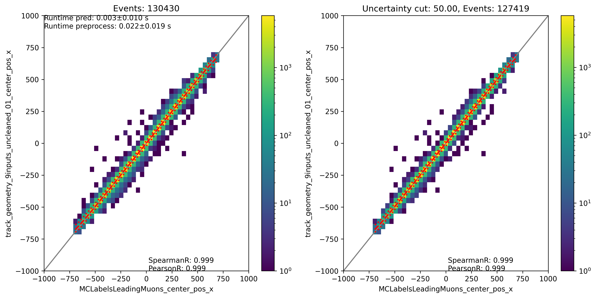

    : The center position x is shown for the network ``DeepLearningREco_track_geometry_9inputs_uncleaned_01``. It uses 9 inputs and the internal DNN time window cleaning.

Center position y:

.. _track_geometry_9inputs_6ms_medium_01__center_pos_y:
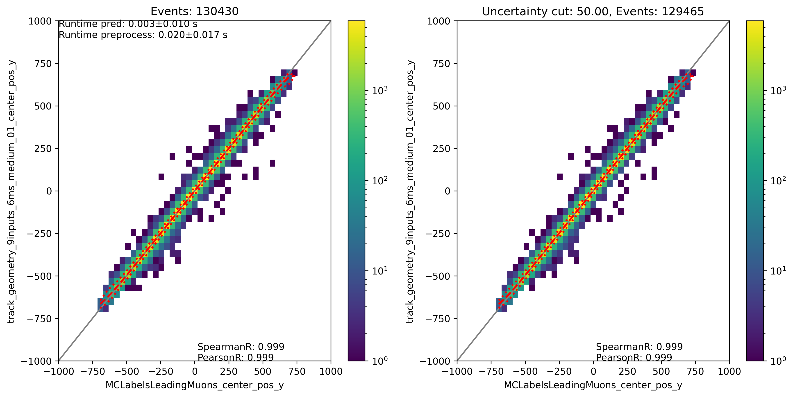

    : The center position y is shown for the network ``DeepLearningREco_track_geometry_9inputs_6ms_medium_01``. It uses 9 inputs and a 6ms time window.

.. _track_geometry_9inputs_uncleaned_01__center_pos_y:

    : The center position y is shown for the network ``DeepLearningREco_track_geometry_9inputs_uncleaned_01``. It uses 9 inputs and the internal DNN time window cleaning.

Center position z:

.. _track_geometry_9inputs_6ms_medium_01__center_pos_z:
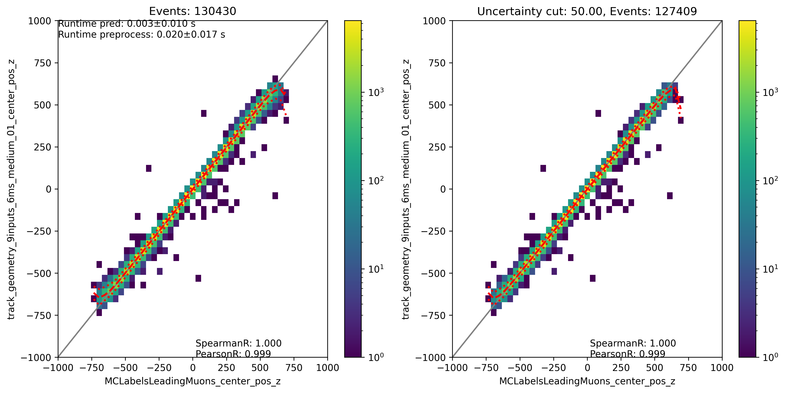

    : The center position z is shown for the network ``DeepLearningREco_track_geometry_9inputs_6ms_medium_01``. It uses 9 inputs and a 6ms time window.

.. _track_geometry_9inputs_uncleaned_01__center_pos_z:
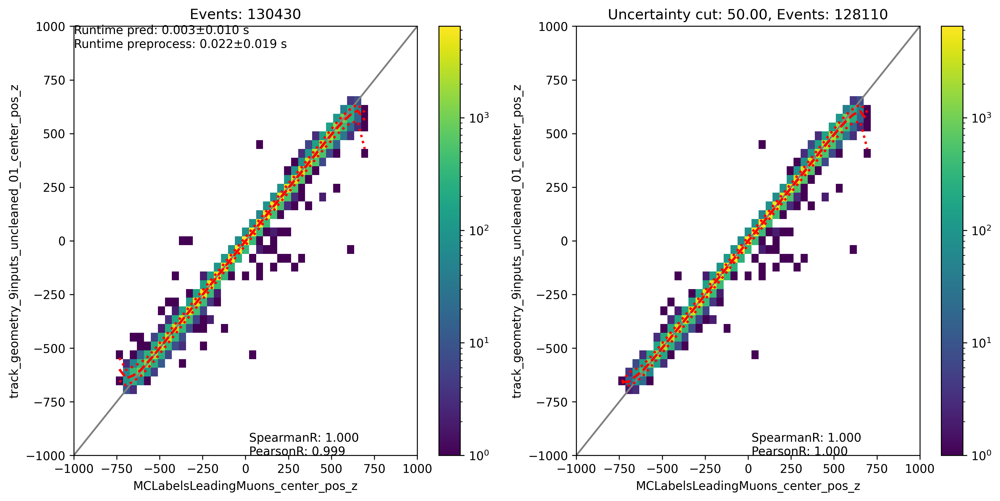

    : The center position z is shown for the network ``DeepLearningREco_track_geometry_9inputs_uncleaned_01``. It uses 9 inputs and the internal DNN time window cleaning.

Entry position x:

.. _track_geometry_9inputs_6ms_medium_01__entry_pos_x:
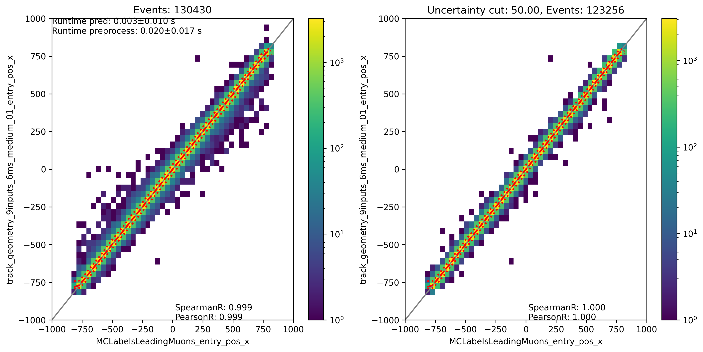

    : The entry position x is shown for the network ``DeepLearningREco_track_geometry_9inputs_6ms_medium_01``. It uses 9 inputs and a 6ms time window.

.. _track_geometry_9inputs_uncleaned_01__entry_pos_x:
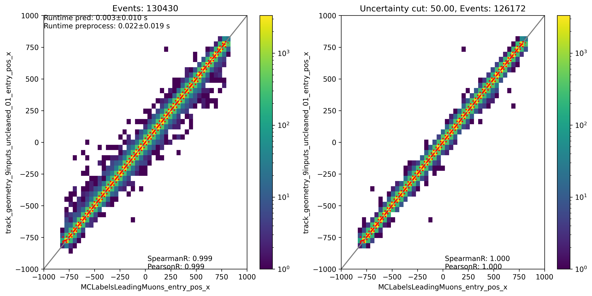

    : The entry position x is shown for the network ``DeepLearningREco_track_geometry_9inputs_uncleaned_01``. It uses 9 inputs and the internal DNN time window cleaning.

Entry position y:

.. _track_geometry_9inputs_6ms_medium_01__entry_pos_y:
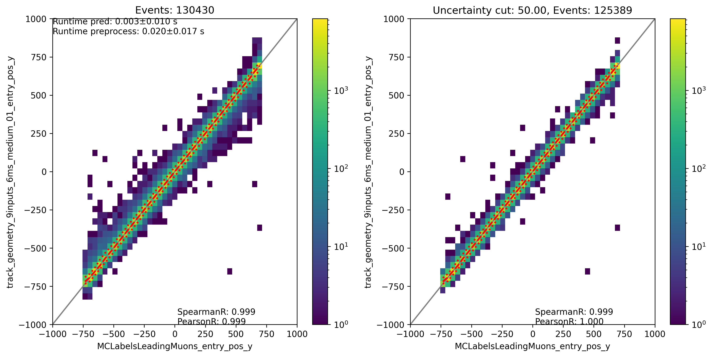

    : The entry position y is shown for the network ``DeepLearningREco_track_geometry_9inputs_6ms_medium_01``. It uses 9 inputs and a 6ms time window.

.. _track_geometry_9inputs_uncleaned_01__entry_pos_y:
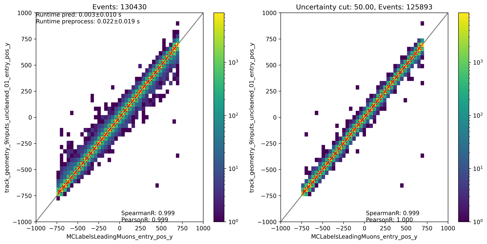

    : The entry position y is shown for the network ``DeepLearningREco_track_geometry_9inputs_uncleaned_01``. It uses 9 inputs and the internal DNN time window cleaning.

Entry position z:

.. _track_geometry_9inputs_6ms_medium_01__entry_pos_z:
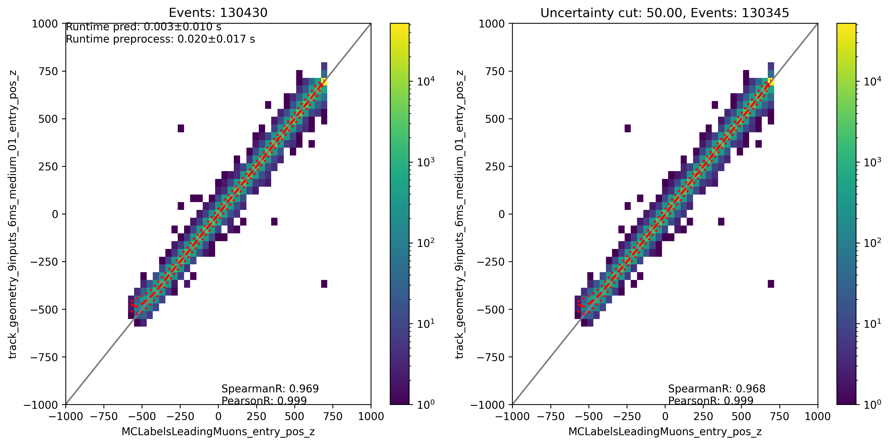

    : The entry position z is shown for the network ``DeepLearningREco_track_geometry_9inputs_6ms_medium_01``. It uses 9 inputs and a 6ms time window.

.. _track_geometry_9inputs_uncleaned_01__entry_pos_z:
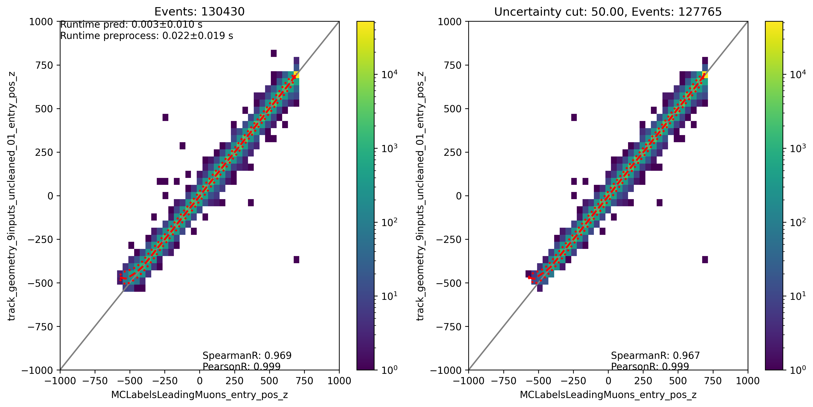

    : The entry position z is shown for the network ``DeepLearningREco_track_geometry_9inputs_uncleaned_01``. It uses 9 inputs and the internal DNN time window cleaning.

Total track length:

.. _track_geometry_9inputs_6ms_medium_01__Length:
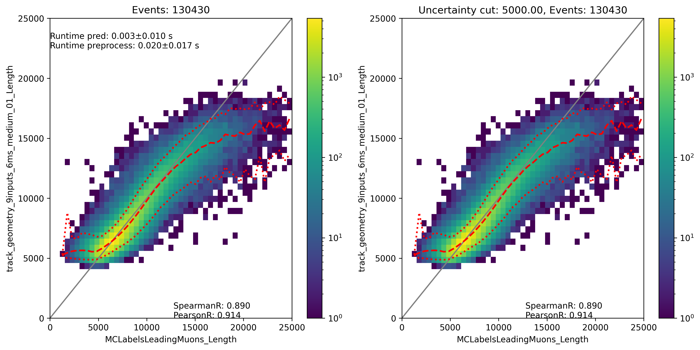

    : The track length is shown for the network ``DeepLearningREco_track_geometry_9inputs_6ms_medium_01``. It uses 9 inputs and a 6ms time window.

.. _track_geometry_9inputs_uncleaned_01__Length:
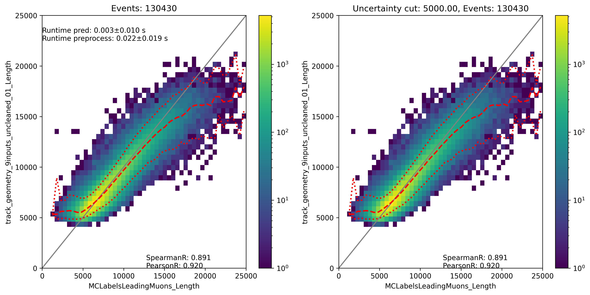

    : The track length is shown for the network ``DeepLearningREco_track_geometry_9inputs_uncleaned_01``. It uses 9 inputs and the internal DNN time window cleaning.

Track length in detector:

.. _track_geometry_9inputs_6ms_medium_01__LengthInDetector:
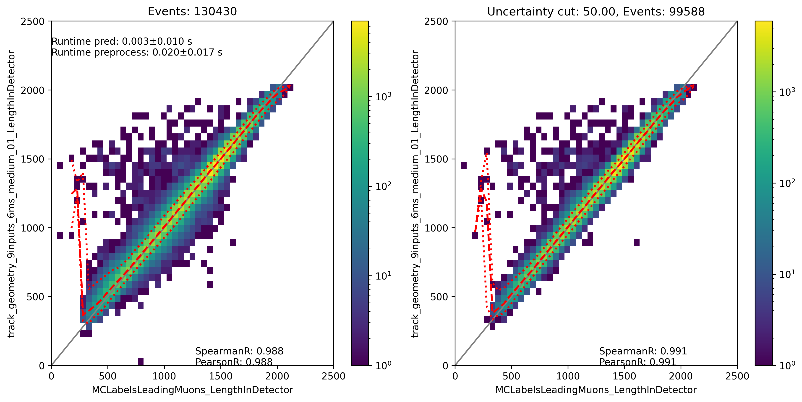

    : The track length in the detector is shown for the network ``DeepLearningREco_track_geometry_9inputs_6ms_medium_01``. It uses 9 inputs and a 6ms time window.

.. _track_geometry_9inputs_uncleaned_01__LengthInDetector:
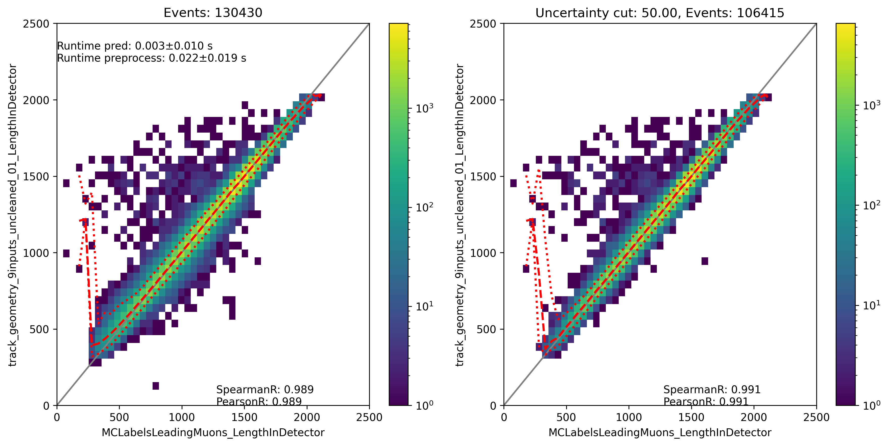

    : The track length in the detector is shown for the network ``DeepLearningREco_track_geometry_9inputs_uncleaned_01``. It uses 9 inputs and the internal DNN time window cleaning.

Direction 
---------

Zenith angle:

.. _direction_9inputs_6ms_medium_02_03__zenith:
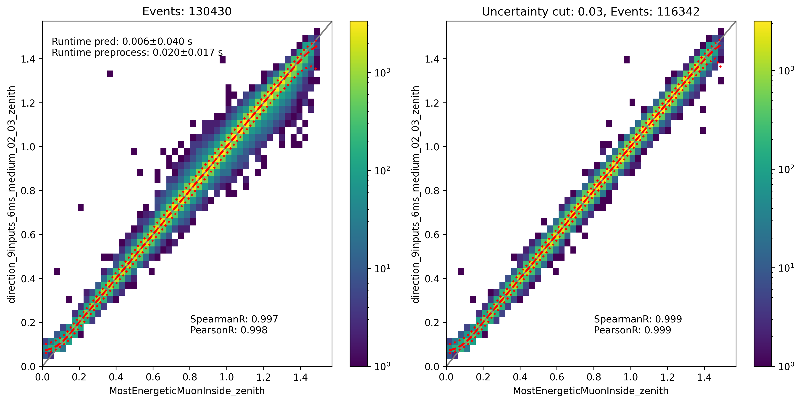

    : The zenith angle is shown for the network ``DeepLearningReco_direction_9inputs_6ms_medium_02_03``. It uses 9 inputs and a 6ms time window.

.. _direction_9inputs_uncleaned_01__zenith:
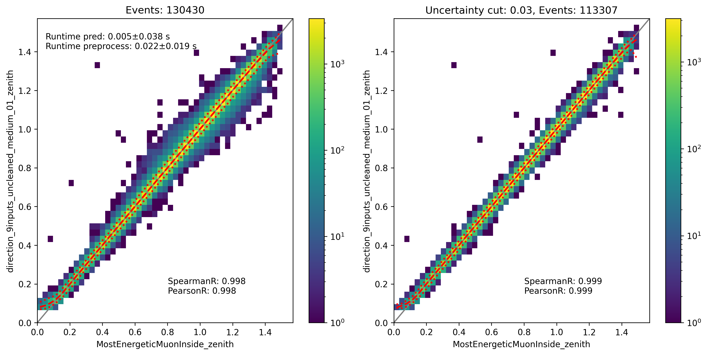

    : The zenith angle is shown for the network ``DeepLearningReco_direction_9inputs_uncleaned_01``. It uses 9 inputs and the internal DNN time window cleaning.

Azimuth angle:

.. _direction_9inputs_6ms_medium_02_03__azimuth:
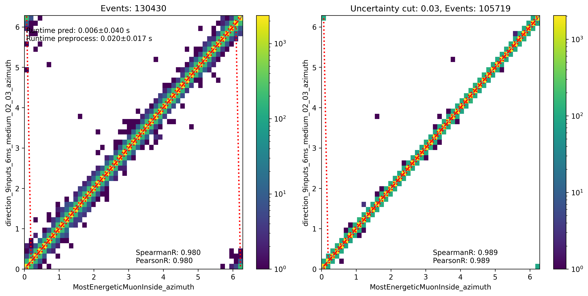

    : The azimuth angle is shown for the network ``DeepLearningReco_direction_9inputs_6ms_medium_02_03``. It uses 9 inputs and a 6ms time window.

.. _direction_9inputs_uncleaned_01__azimuth:
.. figure:: images/plots/model_evaluation/direction/direction_9inputs_uncleaned_medium_01__azimuth.png

    : The azimuth angle is shown for the network ``DeepLearningReco_direction_9inputs_uncleaned_01``. It uses 9 inputs and the internal DNN time window cleaning.

Angular resolution:

.. _direction_9inputs_6ms_medium_02_03_angular_resolution:
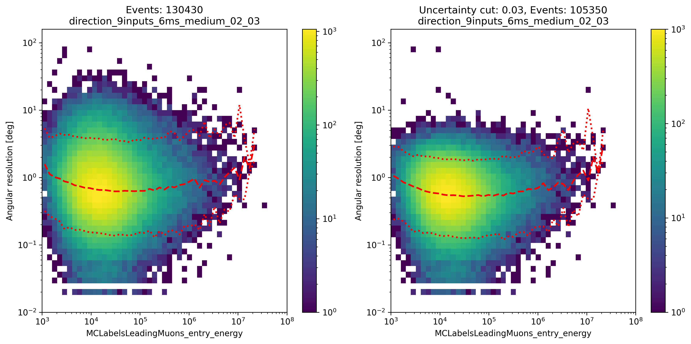

    : The angular resolution is shown for the network ``DeepLearningReco_direction_9inputs_6ms_medium_02_03``. It uses 9 inputs and a 6ms time window.

.. _direction_9inputs_uncleaned_medium_01_angular_resolution:
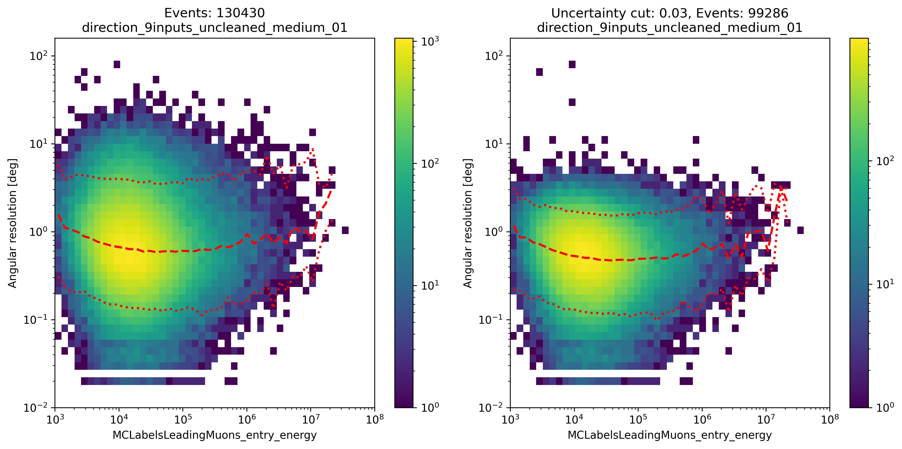

    : The angular resolution is shown for the network ``DeepLearningReco_direction_9inputs_uncleaned_01``. It uses 9 inputs and the internal DNN time window cleaning.

Multiplicity 
------------

The multiplicity means the number of muons entering the detector in a bundle. So far, we do not use this information for the analysis, but we 
just wanted to check if it is possible to reconstruct the multiplicity.

.. _DeepLearningReco_precut_bundle_energy_multi_OC_6ms_01_vs_MCLabelsLeadingMuons_num_muons_at_entry:
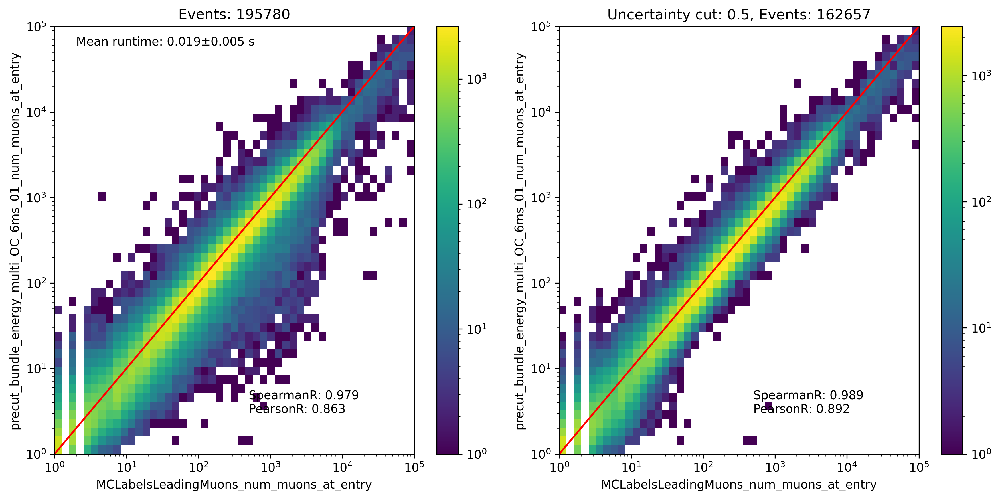

    : The multiplicity is shown for the network ``DeepLearningReco_precut_bundle_energy_multi_OC_6ms_01``. It uses 3 inputs and a 6ms time window.

.. _DeepLearningReco_precut_bundle_energy_multi_OC_6ms_02_vs_MCLabelsLeadingMuons_num_muons_at_entry::
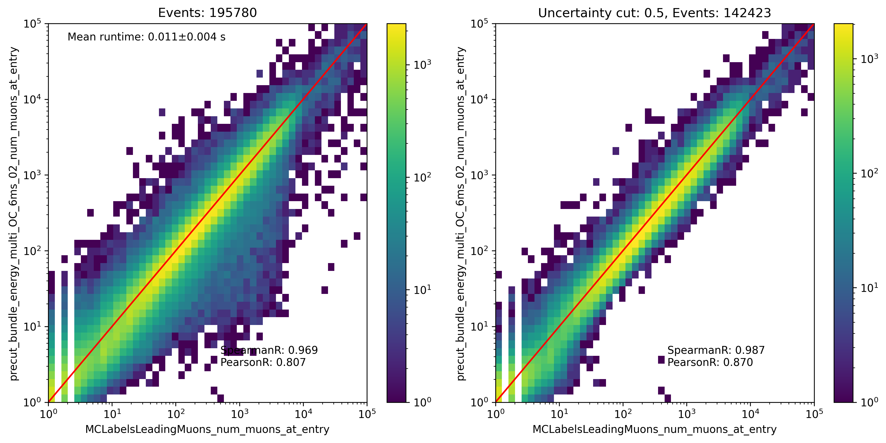

    : The multiplicity is shown for the network ``DeepLearningReco_precut_bundle_energy_multi_OC_6ms_02``. It uses 3 inputs and a 6ms time window.

.. _DeepLearningReco_precut_bundle_energy_multi_OC_6ms_03_vs_MCLabelsLeadingMuons_num_muons_at_entry:
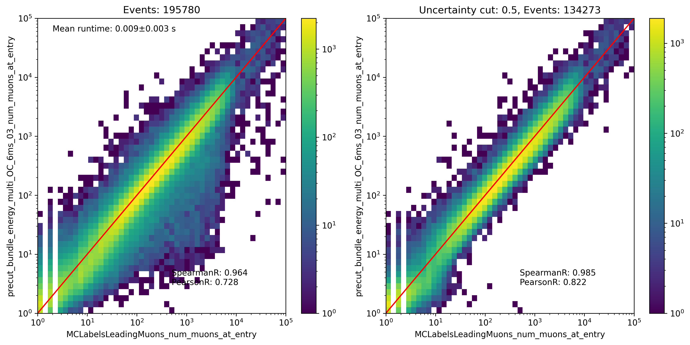

    : The multiplicity is shown for the network ``DeepLearningReco_precut_bundle_energy_multi_OC_6ms_03``. It uses 3 inputs and a 6ms time window.

.. _DeepLearningReco_precut_bundle_energy_multi_OC_6ms_04_vs_MCLabelsLeadingMuons_num_muons_at_entry:
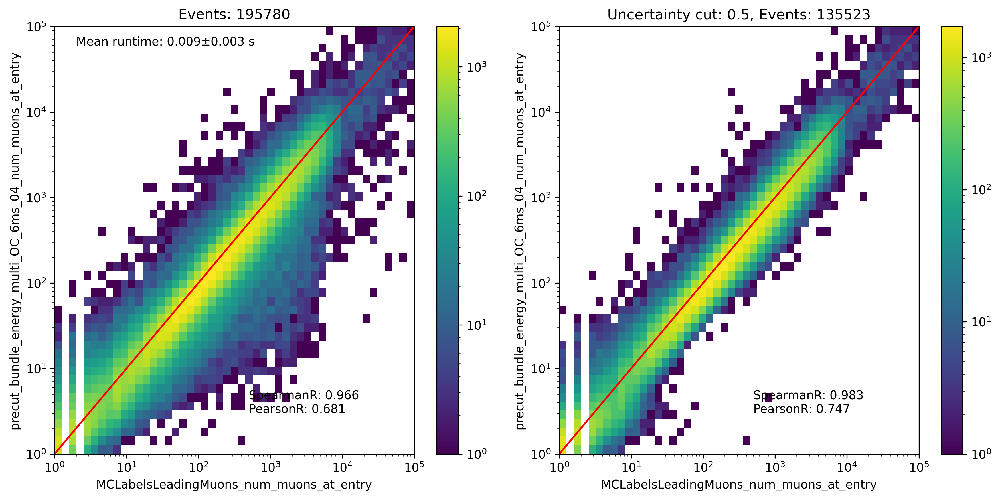

    : The multiplicity is shown for the network ``DeepLearningReco_precut_bundle_energy_multi_OC_6ms_04``. It uses 3 inputs and a 6ms time window.

.. _networks pseudo analysis:

Networks used for pseudo analysis 
+++++++++++++++++++++++++++++++++

``This section is based on datasets 30010-30013``

The following networks are the networks used for the pseudo analysis. These networks are at an early stage as it can be seen 
in the performance in comparison to the plots presented above. Thus, this networks will not be used for the final analysis.

Angular reconstructions 
-----------------------
.. figure:: images/plots/data_mc/DeepLearningReco_direction_big_PrimaryAzimuth.pdf

.. figure:: images/plots/data_mc/DeepLearningReco_direction_big_PrimaryZenith.pdf

.. figure:: images/plots/data_mc/DeepLearningReco_direction_big_PrimaryZenith_angle_deviation.pdf 

Left side: only L2 muon filter, right side: L2 muon filter and cut on bundle energy: :math:`E > 10\,\mathrm{TeV}`

.. figure:: images/plots/data_mc/zenith.pdf 

.. figure:: images/plots/data_mc/zenith_cut_1e4.pdf 

Energy reconstructions: muon bundle 
-----------------------------------
.. figure:: images/plots/data_mc/DeepLearningReco_exported_model_PromptMu_L2_energy_bundle_energy_at_entry.pdf

.. figure:: images/plots/data_mc/bundle_energy.pdf

Energy reconstruction: leading muon 
-----------------------------------
.. figure:: images/plots/data_mc/DeepLearningReco_exported_model_PromptMu_L2_energy_entry_energy.pdf

.. figure:: images/plots/data_mc/leading_energy.pdf

