.. _appendix paragraph:

Appendix
########

This appendix includes further information about studies, detailed investigations and tests.  

.. _first extended history simulations paragraph:

First extended history simulations
++++++++++++++++++++++++++++++++++

New CORSIKA datasets are simulated and stored at: 

* /data/sim/IceCube/2023/generated/CORSIKA_EHISTORY/

The simulation is divided into 4 different energy ranges. Since the simulation is done out ourselves, the dataset numbers are not provided in iceprod.

* 30010: 600 GeV - 1 PeV

* 30011: 1 PeV - 100 PeV

* 30012: 100 PeV - 1 EeV

* 30013: 1 EeV - 50 EeV

The following settings are used:

* CORSIKA version 77420 

* SIBYLL 2.3d 

* Icetray 1.5.1

* 5 components (p, He, N, Al, Fe)

* Component norm: [10, 5, 3, 2, 1]

* Zenith angle: 0 - 90 degrees

* Polyplopia: True 

* Ecuts1: 273 GeV (hadron min energy)

* Ecuts2: 273 GeV (muon min energy)

* Ecuts3: :math:`10^{20}` GeV (electron min energy)

* Ecuts4: :math:`10^{20}` GeV (photon min energy)

* TrimShower: True 

* Atmosphere: ``ratmo: 4`` (April) 

* Spectrum : -1 (increase high energy statistics)

This simulation is performed to test the extended history and prompt tagging software. Thus, the statistics are not yet sufficient.
The built CORSIKA software is stored at: ``/data/user/pgutjahr/software/CORSIKA/corsika-77420/bin/`` and also available in the cvmfs:
``/cvmfs/icecube.opensciencegrid.org/users/pgutjahr/software/CORSIKA/``

Dataset exploration - Level 2
-----------------------------

For the dataset exploration, the definition of a leading muon is defined as following: 
The leading muon is the muon with the highest energy in the muon bundle. This can be expressed in "Leadingness".
Leadingness :math:`L_{\mathrm{E}}` describes the ratio of the highest energetic muon :math:`E_{\mathrm{max}}` 
in a muon bundle to the total energy :math:`E_{\mathrm{tot}}` of the muon bundle:

.. math:: 

    L_{\mathrm{E}} = \frac{E_{\mathrm{max}}}{E_{\mathrm{tot}}}

If there is no specific leadingness stated, the term leading muon refers to the muon with the highest energy in the muon bundle.

In the following, unweighted and weighted distributions of the simulated events are shown. In :numref:`simulated_events_primary_energy` and 
:numref:`simulated_events_primary_energy_weighted`, the primary distributions are shown 
for each dataset.

.. _simulated_events_primary_energy:
.. figure:: images/plots/dataset_exploration/simulated_events_primary_energy.png 

    : The energy distribution of primary particles is shown for the four different simulation datasets.

.. _simulated_events_primary_energy_weighted:
.. figure:: images/plots/dataset_exploration/simulated_events_primary_energy_weighted.png

    : The energy distribution of primary particles is shown for the four different simulation datasets, weighted to GlobalSplineFit5Comp (GSF).

In :numref:`simulated_events_5_components_primary_energy` and :numref:`simulated_events_5_components_primary_energy_weighted`, 
the primary distributions are shown for each dataset, separated by the primary particle type.

.. _simulated_events_5_components_primary_energy: 
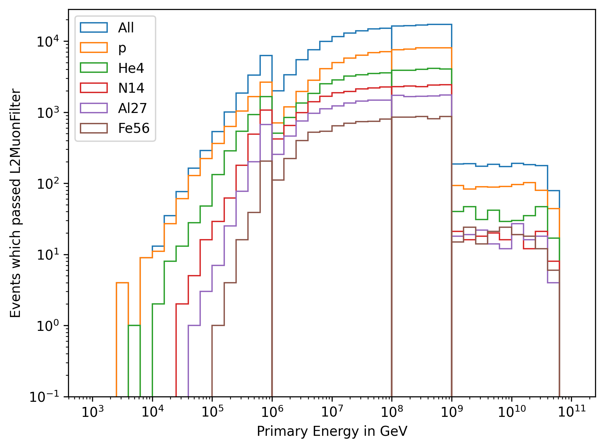

    : The energy distribution of primary particles is shown for the four different simulation datasets, separated by the primary particle type.

.. _simulated_events_5_components_primary_energy_weighted:

    : The energy distribution of primary particles is shown for the four different simulation datasets, separated by the primary particle type, weighted to GlobalSplineFit5Comp (GSF).

In :numref:`simulated_events_leading_muon_energy` and :numref:`simulated_events_leading_muon_energy_weighted`, the energy distribution of the leading muon is shown for each dataset. The leading muon is defined 
as the muon with the highest energy in the muon bundle. The shown energy corresponds to the energy at the detector entry.

.. _simulated_events_leading_muon_energy:

    : The energy distribution of the leading muon is shown for the four different simulation datasets.

.. _simulated_events_leading_muon_energy_weighted:
.. figure:: images/plots/dataset_exploration/simulated_events_leading_muon_energy_weighted.png

    : The energy distribution of the leading muon is shown for the four different simulation datasets, weighted to GlobalSplineFit5Comp (GSF).
    
In :numref:`simulated_events_bundle_muon_energy` and :numref:`simulated_events_bundle_muon_energy_weighted`, the energy distribution of the muon bundle is shown for each dataset. 
The muon bundle is defined as the
the sum of the energy of all muons entering the detector.

.. _simulated_events_bundle_muon_energy:
.. figure:: images/plots/dataset_exploration/simulated_events_bundle_muon_energy.png

    : The energy distribution of the muon bundle is shown for the four different simulation datasets.

.. _simulated_events_bundle_muon_energy_weighted:
.. figure:: images/plots/dataset_exploration/simulated_events_bundle_muon_energy_weighted.png

    : The energy distribution of the muon bundle is shown for the four different simulation datasets, weighted to GlobalSplineFit5Comp (GSF).
    

Estimation of the simulated statistics
--------------------------------------

The estimation of the simulated statistics needed for this analysis is not easy to determine. The statistics should be sufficient in the 
phase space of the analysis. This will probably be defined by the zenith angle of the incoming muon and the muon energy. Here, 
both the leading and bundle energy at detector entry and at the surface are considered. Furthermore, the systematic uncertainties in this 
phase space need to be known to create a simulation with statistical uncertainties lower than the systematic uncertainties.
However, to get a first impression of the statistics simulated so far, :numref:`energy_spectrum_primary_energy_simulation_muonfilter_bundle_cut_1e5` 
and :numref:`energy_spectrum_leading_muon_energy_simulation_muonfilter_bundle_cut_1e5` show the energy spectrum of the primary and leading muon energy. The 
simulated events are shown in blue, in orange the events are weighted to the expected statistics of 1 year of IceCube data using GlobalSplineFit5Comp (GSF) 
weighting. Here, the muon filter is applied and an energy cut of 200 TeV is applied to the muon bundle energy at the surface. For leading muon energies 
above 1 PeV, more muons are simulated than expected for 1 year. (The cuts applied here are not the final cuts for the analysis.)

.. _energy_spectrum_primary_energy_simulation_muonfilter_bundle_cut_1e5:
.. figure:: images/plots/dataset_exploration/energy_spectrum_primary_energy_simulation_muonfilter_bundle_cut_1e5.png

    : Primary energy spectrum is shown to estimate the simulated statistics.
    
.. _energy_spectrum_leading_muon_energy_simulation_muonfilter_bundle_cut_1e5:

    
    : Leading muon energy spectrum is shown to estimate the simulated statistics.

General Simulation Questions 
++++++++++++++++++++++++++++

Before we have started the large-scale IceProd simulation, we have discussed the following questions:

* Does cutting off the electromagnetic shower component have any impact on our phase space (high energy muons)? This is done by `Ecuts3` and `Ecuts4`.
    - 10% effect possible on the muon energy spectrum, but no significant effect on the runtime and disk space
    -  EM component will be turned on, which is 
    done by setting `Ecuts3` and `Ecuts4` to the same value as `Ecuts2` and `Ecuts1`, thus 273 GeV

* Shall we stay with Icetray 1.5.1 which was used for the first test simulation?
    - Use latest version of Icetray to include any possible bug fixes and up-to-date software + latest ice model

* We haven't oversampled our showers yet. Which factor for oversampling is usual? 
    - At low energies, oversampling up to 10 is common, but this should be decreased at higher energies
    - We decided not to oversample the showers, since this results in a "fake statistics"

* How can we reduce the disk space?
    - For the final simulation, we will store step 0 and level 2 files. The extended I3MCTrees can be removed, since we can re-simulate them using PROPOSAL if needed

* How much disk storage do we need for the final simulation? 
    - Roughly 50 TB 

* Which seasons do we want to simulate? 4 seasons?
    - We want to simulate all 12 seasons as defined `here <https://wiki.icecube.wisc.edu/index.php/Real_atmosphere_for_CORSIKA>`_. 
    This enables further studies of the seasonal variations in the future.

* Do we want to set the TrimShower option?
    - For large zenith angles, even high energy muon can be cut off. For the calculation of the effective area, we have to turn off trimshower
    - Thus, we don't use the TrimShower option

.. _stochasticity paragraph:

Stochasticity 
+++++++++++++

``This section is based on datasets 30010-30013``

A muon loses its energy in stochastic processes. Thus, a single muon deposits stochastic energy losses along a track. In a bundle of many muons, 
every muon has its own stochastic energy losses, which 
appear as a more continuous energy loss in the detector. Hence, if there are very stochastic energy losses detected inside the detector, there are 
probably only a few muons or a single muon (at low energies). 
If we extend this to high energies, the largest energy losses are caused by the most energetic muon in the bundle. In a bundle in which the muon 
energies are distributed more equally, also the losses 
appear more continuously. The idea is to search for events that deposit their energy more stochastically to select and/or to improve the energy 
reconstruction of muons with a high leadingness. 

For the stochasticity calculation of the leading muon, the energy depositions and corresponding distances are needed. These can be determined by the function
`get_track_energy_depositions <https://github.com/icecube/ic3-labels/blob/5b68fa208607c5cba9cfd6ec317985017cc6c113/ic3_labels/labels/modules/event_generator/utils.py#L10>`_.
The stochasticity is then calculated by the function `compute_stochasticity <https://github.com/icecube/ic3-labels/blob/5b68fa208607c5cba9cfd6ec317985017cc6c113/ic3_labels/labels/modules/event_generator/utils.py#L796>`_.
This function calculates the stochasticity of energy losses along a track by measuring the area between the cumulative distribution function (CDF) of the energy losses 
and the relative distances. 
It returns three values: the stochasticity (a float between 0 and 1, normalized by 0.5), the total area above the diagonal (a float), and the total area below the diagonal (a float).
An extreme case of 1 means, the muon loses all it's energy in one interaction, the extreme case of 0 means, the muon loses all it's energy continuously.

As mentioned above, usually there is not only one muon, but several muons entering the detector. The energy losses of individual muons overlap. For this calculation, 
all energy losses of all muons with respect to their propagated distance are determined by the function 
`get_bundle_energy_depositions <https://github.com/icecube/ic3-labels/blob/5b68fa208607c5cba9cfd6ec317985017cc6c113/ic3_labels/labels/modules/event_generator/utils.py#L602>`_.
Here, it is assumed that all tracks travel on the same trajectory. The stochasticity is then calculated with the same function stated above. In this analysis, it is referred to 
as the bundle stochasticity.

Monte Carlo studies
-------------------

In :numref:`stochasticity_vs_leadingness`, the leadingness is shown as a function of the bundle stochasticity. If the muon event has a large stochasticity, 
this is caused by a high leadingness, but this is the case only for a small amount of events. Hence, a high leadingness does not necessary results to a 
large stochasticity.

.. _stochasticity_vs_leadingness:
.. figure:: images/plots/stochasticity_check/stochasticity_vs_leadingness.png

    : The leadingness is shown as a function of the bundle stochasticity as a weighted distribution.

To get an idea of the correlation between the leading muon energy and the bundle stochasticity, 
in :numref:`MCLabelsLeadingMuons_bundle_stochasticity_vs_MCLabelsLeadingMuons_entry_energy`, the energy of the leading muon is shown as a function of the bundle stochasticity.

.. _MCLabelsLeadingMuons_bundle_stochasticity_vs_MCLabelsLeadingMuons_entry_energy:

    : The energy of the leading muon is shown as a function of the bundle stochasticity.

In the following, the title of the plots shows a cut applied on the bundle energy in GeV. Hence, from left to right only high energy muons are selected.

In :numref:`MCLabelsLeadingMuons_bundle_stochasticity_vs_MCLabelsLeadingMuons_leading_energy_rel_entry_bundle_energy_cuts_larger_bins_no_logscale`, 
the leadingness is shown as a function of the bundle stochasticity. High stochasticities lead to a large leadingness, but it removes the entire statistics.

.. _MCLabelsLeadingMuons_bundle_stochasticity_vs_MCLabelsLeadingMuons_leading_energy_rel_entry_bundle_energy_cuts_larger_bins_no_logscale:
.. figure:: images/plots/stochasticity_check/MCLabelsLeadingMuons_bundle_stochasticity_vs_MCLabelsLeadingMuons_leading_energy_rel_entry_bundle_energy_cuts_larger_bins_no_logscale.png

    : The leadingness is shown as a function of the bundle stochasticity.

In :numref:`MCLabelsLeadingMuons_bundle_stochasticity_energy_00_vs_MCLabelsLeadingMuons_leading_energy_rel_entry_bundle_energy_cuts_larger_bins_no_logscale`, 
the leadingness is shown as a function of the largest energy loss. It results that considering only the largest energy loss does not 
indicate the leadingness.

.. _MCLabelsLeadingMuons_bundle_stochasticity_energy_00_vs_MCLabelsLeadingMuons_leading_energy_rel_entry_bundle_energy_cuts_larger_bins_no_logscale:
.. figure:: images/plots/stochasticity_check/MCLabelsLeadingMuons_bundle_stochasticity_energy_00_vs_MCLabelsLeadingMuons_leading_energy_rel_entry_bundle_energy_cuts_larger_bins_no_logscale.png

    : The leadingness is shown as a function of the largest energy loss.

In :numref:`MCLabelsLeadingMuons_bundle_stochasticity_energy_00_vs_MCLabelsLeadingMuons_entry_energy`, the energy of the leading muon is shown as a function of the largest energy loss. 
The largest energy loss is correlated with the energy of the leading muon. The larger the energy loss, the higher the energy of the leading muon.

.. _MCLabelsLeadingMuons_bundle_stochasticity_energy_00_vs_MCLabelsLeadingMuons_entry_energy:

    : The energy of the leading muon is shown as a function of the largest energy loss.

In :numref:`bundle_muon_energy_spectrum_stochasticity_cuts`, the energy spectrum of the leading muon is shown for different cuts on the stochasticity. The plot is divided into 
a prompt and conventional component. 
A cut on the stochasticity removes high energy muons. Due to the low statistics expected at high energies for 10 years, 
we do not apply any cuts on the stochasticity in this analysis.

.. _bundle_muon_energy_spectrum_stochasticity_cuts:

    : The energy spectrum of the leading muon is shown for different cuts on the stochasticity.

.. _impact stochasticity paragraph:

Impact on the energy reconstruction
-----------------------------------

The impact of the stochasticity on the energy reconstruction is shown in the following plots. 

The bundle energy reconstruction for different cuts on the stochasticity is shown in :numref:`bundleE_DeepLearningReco_exported_model_PromptMu_L2_energy_stoch_cut_lower` and
:numref:`bundleE_DeepLearningReco_exported_model_PromptMu_L2_energy_stoch_cut_higher`. A cut on the stochasticity does not improve the bundle energy reconstruction.

.. _bundleE_DeepLearningReco_exported_model_PromptMu_L2_energy_stoch_cut_lower:

    : The bundle energy reconstruction for stochasticities below a certain cut is shown.

.. _bundleE_DeepLearningReco_exported_model_PromptMu_L2_energy_stoch_cut_higher:

    
    : The bundle energy reconstruction for stochasticities above a certain cut is shown.

The leading muon energy reconstruction for different cuts on the stochasticity is shown in :numref:`leadingE_DeepLearningReco_exported_model_PromptMu_L2_energy_stoch_cut_lower` and
:numref:`leadingE_DeepLearningReco_exported_model_PromptMu_L2_energy_stoch_cut_higher`. A cut on the stochasticity does not improve the leading muon energy reconstruction.

.. _leadingE_DeepLearningReco_exported_model_PromptMu_L2_energy_stoch_cut_lower:

    : The leading muon energy reconstruction for stochasticities below a certain cut is shown.

.. _leadingE_DeepLearningReco_exported_model_PromptMu_L2_energy_stoch_cut_higher:

    : The leading muon energy reconstruction for stochasticities above a certain cut is shown.

In summary, a cut on the stochasticity does not improve the bundle or leading muon energy reconstruction. 

.. _bundle radius paragraph:

Bundle radius 
+++++++++++++

``This section is based on datasets 30010-30013``

Another idea to investigate muons with a high leadingness is to analyze the bundle radius. Depending on the fraction of the energy the most energetic muons carries, 
the projected radius of the 
entire bundle should differ. Here, different radii for the fractional amount of energy inside the projected area are studied. 
To quantify this, the perpendicular distance between the leading muon and the closest approach position to the center of the detector is 
calculated. Then, the closest approach point to the center is calculated for all muons in the bundle. With these positions, the distances between 
the leading muon and the other muons are calculated. Finally, the distances are weighted by the energy. For example, 100% means that the largest distance between 
a muon and the leading muon is considered. 90% means that the distance between the leading muon and the muon that accumulates 90 % of the bundle energy is considered.
In the following, this distance is referred to as the bundle radius. The calculation can be performed with the function 
`get_bundle_radius <https://github.com/icecube/ic3-labels/blob/5b68fa208607c5cba9cfd6ec317985017cc6c113/ic3_labels/labels/utils/muon.py#L1802>`_.

Monte Carlo studies
-------------------

In :numref:`bundle_radius_scale_2`, the bundle radius is shown for different bundle radius quantiles. These range from the energy inside the projected area 
from 50% to 100%. The same plot is shown for different scalings on the axes. The distributions peak between 5m and 20m, but also radii above 100m are observed.

.. _bundle_radius_scale_2:

    : The bundle radius is shown for different bundle radius quantiles.

In :numref:`bundle_radius_vs_leadingness`, the leadingness is shown as a function of the bundle radius for a bundle radius quantile of 100%. If the bundle radius is 
very small, the leadingness is high.

.. _bundle_radius_vs_leadingness:
.. figure:: images/plots/stochasticity_check_reco_bundle_radius/bundle_radius_vs_leadingness.png

    : The leadingness is shown as a function of the bundle radius for a bundle radius quantile of 100% as a weighted distribution.

In the following :numref:`bundle_radius_radius_quantile_1.000_leadingness_bundle_energy_cut_no_logscale`, 
the leadingness is shown as a function of the bundle radius for different bundle energy cuts. If the bundle radius is high, the leadingness is low.

.. figure:: images/plots/stochasticity_check_reco_bundle_radius/bundle_radius_radius_quantile_0.950_leadingness_bundle_energy_cut_no_logscale.png

.. figure:: images/plots/stochasticity_check_reco_bundle_radius/bundle_radius_radius_quantile_0.990_leadingness_bundle_energy_cut_no_logscale.png

.. _bundle_radius_radius_quantile_1.000_leadingness_bundle_energy_cut_no_logscale:

    : The leadingness is shown as a function of the bundle radius for different bundle energy cuts.

In :numref:`bundle_radius_radius_quantile_1.000_bundleE_bundle_energy_cut`, the muon bundle energy is shown as a function of the bundle radius for different bundle energy cuts.
For a small amount of events, a large bundle radius indicates a low bundle energy.

.. _bundle_radius_radius_quantile_1.000_bundleE_bundle_energy_cut:
.. figure:: images/plots/stochasticity_check_reco_bundle_radius/bundle_radius_radius_quantile_1.000_bundleE_bundle_energy_cut.png

    : The muon bundle energy is shown as a function of the bundle radius for different bundle energy cuts.

In :numref:`bundle_radius_radius_quantile_1.000_leadingE_bundle_energy_cut`, the leading muon energy is shown as a function of the bundle radius for different bundle energy cuts.
For a small amount of events, a large bundle radius indicates a low leading muon energy.

.. _bundle_radius_radius_quantile_1.000_leadingE_bundle_energy_cut:
.. figure:: images/plots/stochasticity_check_reco_bundle_radius/bundle_radius_radius_quantile_1.000_leadingE_bundle_energy_cut.png

    : The leading muon energy is shown as a function of the bundle radius for different bundle energy cuts.

In :numref:`leadingE_radius_0.990_cut_prompt`, the leading muon energy spectrum is shown for different cuts on the bundle radius. 
A bundle radius quantile of 99% is chosen as a cut parameter. 

.. _leadingE_radius_0.990_cut_prompt:
.. figure:: images/plots/stochasticity_check_reco_bundle_radius/leadingE_radius_0.990_cut_prompt.png

    : The leading muon energy spectrum is shown for different cuts on the bundle radius of the 99% quantile.

In :numref:`leadingE_radius_1.000_cut_prompt`, the leading muon energy spectrum is shown for different cuts on the bundle radius.
A bundle radius quantile of 100% is chosen as a cut parameter.

.. _leadingE_radius_1.000_cut_prompt:

    : The leading muon energy spectrum is shown for different cuts on the bundle radius of the 100% quantile.

Selecting events below a certain bundle radius does not increase the sensitivity to distinguish between prompt and conventional, but it removes 
statistics. Thus, there is no selection performed using the bundle radius.

.. _impact bundle radius paragraph:

Impact on the energy reconstruction
-----------------------------------

In :numref:`bundle_radius_radius_quantile_1.000_leadingE_DeepLearningReco_exported_model_PromptMu_L2_energy_radius_cut`, the impact of the bundle radius on the 
reconstruction of the leading muon energy is shown. A bundle radius quantile of 100% is chosen as a cut parameter.

.. _bundle_radius_radius_quantile_1.000_leadingE_DeepLearningReco_exported_model_PromptMu_L2_energy_radius_cut: 
.. figure:: images/plots/stochasticity_check_reco_bundle_radius/bundle_radius_radius_quantile_1.000_leadingE_DeepLearningReco_exported_model_PromptMu_L2_energy_radius_cut.png

    : The impact of the bundle radius of the 10% quantile on the reconstruction of the leading muon energy is shown.

There is no significant reconstruction improvement due to the application of a bundle radius cut. Instead, high energy 
events are rejected. Hence, no cut on the bundle radius is performed.

.. _network evaluation paragraph:

Network evaluation 
++++++++++++++++++

``This section is based on datasets 30010-30013``

In the following, the evaluation of the networks is shown. Each figure contains two plots. The left plots show the evaluation of all events, 
the right plot shows an uncertainty cut applied on the estimated uncertainty by the network. The evaluation is performed on our own extended 
history simulation dataset (datasets 30010 - 30013). Each plot has the network prediction on the y-axis and the true value on the x-axis. 
In general, networks are trained with 
3 or 9 inputs and a time window of 6ms or the internal DNN time window cleaning is applied to the *SplitInIceDSTPulses*. 
Furthermore, the CNN layers and nodes are varied. The runtime prediction 
is presented for the usage of a GPU. The preprocessing runtime represents the time needed to create the input features for the network based on the 
input pulses. 

Bundle energy at surface 
------------------------

precut networks:

.. _DeepLearningReco_precut_bundle_energy_3inputs_6ms_at_surface_01_vs_MCLabelsLeadingMuons_bundle_energy_in_mctree:
.. figure:: images/plots/model_evaluation/precut/DeepLearningReco_precut_bundle_energy_3inputs_6ms_at_surface_01_vs_MCLabelsLeadingMuons_bundle_energy_in_mctree.png 

    : The bundle energy at the surface is shown for the network ``DeepLearningReco_precut_bundle_energy_3inputs_6ms_at_surface_01``. It uses 3 inputs 
    and a 6ms time window.

.. _DeepLearningReco_precut_bundle_energy_3inputs_6ms_01_vs_MCLabelsLeadingMuons_bundle_energy_in_mctree:
.. figure:: images/plots/model_evaluation/precut/DeepLearningReco_precut_surface_bundle_energy_3inputs_6ms_01_vs_MCLabelsLeadingMuons_bundle_energy_in_mctree.png

    : The bundle energy at the surface is shown for the network ``DeepLearningReco_precut_surface_bundle_energy_3inputs_6ms_01``. It uses 3 inputs
    and a 6ms time window.

----

.. _DeepLearningReco_leading_bundle_surface_leading_bundle_energy_OC_inputs9_6ms_large_log_02__bundle_energy_in_mctree:

    : The bundle energy at the surface is shown for the network ``DeepLearningReco_leading_bundle_surface_leading_bundle_energy_OC_inputs9_6ms_large_log_02``. It uses 9 inputs and a 6ms time window.

.. _DeepLearningReco_leading_bundle_surface_leading_bundle_energy_OC_inputs9_large_log_02__bundle_energy_in_mctree:
.. figure:: images/plots/model_evaluation/energy/leading_bundle_surface_leading_bundle_energy_OC_inputs9_large_log_02__bundle_energy_in_mctree.png

    : The bundle energy at the surface is shown for the network ``DeepLearningReco_leading_bundle_surface_leading_bundle_energy_OC_inputs9_large_log_02``. It uses 9 inputs and the internal DNN time window cleaning.

Bundle energy at entry 
----------------------

.. _DeepLearningReco_leading_bundle_energy_OC_inputs9_6ms_large_log_02__bundle_energy_at_entry:
.. figure:: images/plots/model_evaluation/energy/leading_bundle_energy_OC_inputs9_6ms_large_log_02__bundle_energy_at_entry.png

    : The bundle energy at the entry is shown for the network ``DeepLearningReco_leading_bundle_energy_OC_inputs9_6ms_large_log_02``. It uses 9 inputs and a 6ms time window.

.. _DeepLearningReco_leading_bundle_OC_inputs9_large_log_02__bundle_energy_at_entry:
.. figure:: images/plots/model_evaluation/energy/leading_bundle_OC_inputs9_large_log_02__bundle_energy_at_entry.png

    : The bundle energy at the entry is shown for the network ``DeepLearningReco_leading_bundle_OC_inputs9_large_log_02``. It uses 9 inputs and the internal DNN time window cleaning.

.. _DeepLearningReco_leading_bundle_surface_leading_bundle_energy_OC_inputs9_6ms_large_log_02__bundle_energy_at_entry:

    : The bundle energy at the entry is shown for the network ``DeepLearningReco_leading_bundle_surface_leading_bundle_energy_OC_inputs9_6ms_large_log_02``. It uses 9 inputs and a 6ms time window.

.. _DeepLearningReco_leading_bundle_surface_leading_bundle_energy_OC_inputs9_large_log_02__bundle_energy_at_entry:
.. figure:: images/plots/model_evaluation/energy/leading_bundle_surface_leading_bundle_energy_OC_inputs9_large_log_02__bundle_energy_at_entry.png

    : The bundle energy at the entry is shown for the network ``DeepLearningReco_leading_bundle_surface_leading_bundle_energy_OC_inputs9_large_log_02``. It uses 9 inputs and the internal DNN time window cleaning.

Leading muon energy at surface
------------------------------

.. _DeepLearningReco_leading_bundle_surface_leading_bundle_energy_OC_inputs9_6ms_large_log_02__muon_energy_first_mctree:

    : The leading muon energy at the surface is shown for the network ``DeepLearningReco_leading_bundle_surface_leading_bundle_energy_OC_inputs9_6ms_large_log_02``. It uses 9 inputs and a 6ms time window.

.. _DeepLearningReco_leading_bundle_surface_leading_bundle_energy_OC_inputs9_large_log_02__muon_energy_first_mctree:

    : The leading muon energy at the surface is shown for the network ``DeepLearningReco_leading_bundle_surface_leading_bundle_energy_OC_inputs9_large_log_02``. It uses 9 inputs and the internal DNN time window cleaning.

Leading muon energy at entry
----------------------------

.. _DeepLearningReco_leading_bundle_energy_OC_inputs9_6ms_large_log_02__entry_energy:

    : The leading muon energy at the entry is shown for the network ``DeepLearningReco_leading_bundle_energy_OC_inputs9_6ms_large_log_02``. It uses 9 inputs and a 6ms time window.

.. _DeepLearningReco_leading_bundle_OC_inputs9_large_log_02__entry_energy:
.. figure:: images/plots/model_evaluation/energy/leading_bundle_OC_inputs9_large_log_02__entry_energy.png

    : The leading muon energy at the entry is shown for the network ``DeepLearningReco_leading_bundle_OC_inputs9_large_log_02``. It uses 9 inputs and the internal DNN time window cleaning.

.. _DeepLearningReco_leading_bundle_surface_leading_bundle_energy_OC_inputs9_6ms_large_log_02__entry_energy:
.. figure:: images/plots/model_evaluation/energy/leading_bundle_surface_leading_bundle_energy_OC_inputs9_6ms_large_log_02__entry_energy.png

    : The leading muon energy at the entry is shown for the network ``DeepLearningReco_leading_bundle_surface_leading_bundle_energy_OC_inputs9_6ms_large_log_02``. It uses 9 inputs and a 6ms time window.

.. _DeepLearningReco_leading_bundle_surface_leading_bundle_energy_OC_inputs9_large_log_02__entry_energy:
.. figure:: images/plots/model_evaluation/energy/leading_bundle_surface_leading_bundle_energy_OC_inputs9_large_log_02__entry_energy.png

    : The leading muon energy at the entry is shown for the network ``DeepLearningReco_leading_bundle_surface_leading_bundle_energy_OC_inputs9_large_log_02``. It uses 9 inputs and the internal DNN time window cleaning.

---- 

The reconstruction of the leading muon is a difficult task, since the leading muon is accompanied by a bundle of muons. Thus, the emitted cherenkov light of the 
leading muon is superimposed by the light of the other muons. In :numref:`true_muon_energy_fraction`, the true muon energy fraction is shown as a function of the true 
bundle energy, at entry. There is a clear correlation between the true muon energy fraction and the true bundle energy. The distribution is smeared. 
In :numref:`recos_muon_energy_fraction`, the reconstructed muon energy fraction is shown as a function of the reconstructed bundle energy, at entry. This distribution is less smeared. 
Hence, the network seems to reconstruct the bundle energy and tries to refer to the leading muon energy. 

.. _true_muon_energy_fraction:
.. figure:: images/plots/model_evaluation/energy/true_muon_energy_fraction.png

    : The true muon energy fraction is shown as a function of the true bundle energy, at entry.

.. _recos_muon_energy_fraction:

    : The reconstructed muon energy fraction is shown as a function of the true bundle energy, at entry.

Track geometry
--------------

Center time:

.. _track_geometry_9inputs_6ms_medium_01__center_pos_t:

    : The center time is shown for the network ``DeepLearningREco_track_geometry_9inputs_6ms_medium_01``. It uses 9 inputs and a 6ms time window.

.. _track_geometry_9inputs_uncleaned_01__center_pos_t:

    : The center time is shown for the network ``DeepLearningREco_track_geometry_9inputs_uncleaned_01``. It uses 9 inputs and the internal DNN time window cleaning.

Entry time: 

.. _track_geometry_9inputs_6ms_medium_01__entry_pos_t:

    : The entry time is shown for the network ``DeepLearningREco_track_geometry_9inputs_6ms_medium_01``. It uses 9 inputs and a 6ms time window.

.. _track_geometry_9inputs_uncleaned_01__entry_pos_t:
.. figure:: images/plots/model_evaluation/track_geometry/track_geometry_9inputs_uncleaned_01__entry_pos_t.png

    : The entry time is shown for the network ``DeepLearningREco_track_geometry_9inputs_uncleaned_01``. It uses 9 inputs and the internal DNN time window cleaning.

Center position x:

.. _track_geometry_9inputs_6ms_medium_01__center_pos_x:
.. figure:: images/plots/model_evaluation/track_geometry/track_geometry_9inputs_6ms_medium_01__center_pos_x.png

    : The center position x is shown for the network ``DeepLearningREco_track_geometry_9inputs_6ms_medium_01``. It uses 9 inputs and a 6ms time window.

.. _track_geometry_9inputs_uncleaned_01__center_pos_x:

    : The center position x is shown for the network ``DeepLearningREco_track_geometry_9inputs_uncleaned_01``. It uses 9 inputs and the internal DNN time window cleaning.

Center position y:

.. _track_geometry_9inputs_6ms_medium_01__center_pos_y:
.. figure:: images/plots/model_evaluation/track_geometry/track_geometry_9inputs_6ms_medium_01__center_pos_y.png

    : The center position y is shown for the network ``DeepLearningREco_track_geometry_9inputs_6ms_medium_01``. It uses 9 inputs and a 6ms time window.

.. _track_geometry_9inputs_uncleaned_01__center_pos_y:

    : The center position y is shown for the network ``DeepLearningREco_track_geometry_9inputs_uncleaned_01``. It uses 9 inputs and the internal DNN time window cleaning.

Center position z:

.. _track_geometry_9inputs_6ms_medium_01__center_pos_z:
.. figure:: images/plots/model_evaluation/track_geometry/track_geometry_9inputs_6ms_medium_01__center_pos_z.png

    : The center position z is shown for the network ``DeepLearningREco_track_geometry_9inputs_6ms_medium_01``. It uses 9 inputs and a 6ms time window.

.. _track_geometry_9inputs_uncleaned_01__center_pos_z:

    : The center position z is shown for the network ``DeepLearningREco_track_geometry_9inputs_uncleaned_01``. It uses 9 inputs and the internal DNN time window cleaning.

Entry position x:

.. _track_geometry_9inputs_6ms_medium_01__entry_pos_x:
.. figure:: images/plots/model_evaluation/track_geometry/track_geometry_9inputs_6ms_medium_01__entry_pos_x.png

    : The entry position x is shown for the network ``DeepLearningREco_track_geometry_9inputs_6ms_medium_01``. It uses 9 inputs and a 6ms time window.

.. _track_geometry_9inputs_uncleaned_01__entry_pos_x:
.. figure:: images/plots/model_evaluation/track_geometry/track_geometry_9inputs_uncleaned_01__entry_pos_x.png

    : The entry position x is shown for the network ``DeepLearningREco_track_geometry_9inputs_uncleaned_01``. It uses 9 inputs and the internal DNN time window cleaning.

Entry position y:

.. _track_geometry_9inputs_6ms_medium_01__entry_pos_y:
.. figure:: images/plots/model_evaluation/track_geometry/track_geometry_9inputs_6ms_medium_01__entry_pos_y.png

    : The entry position y is shown for the network ``DeepLearningREco_track_geometry_9inputs_6ms_medium_01``. It uses 9 inputs and a 6ms time window.

.. _track_geometry_9inputs_uncleaned_01__entry_pos_y:

    : The entry position y is shown for the network ``DeepLearningREco_track_geometry_9inputs_uncleaned_01``. It uses 9 inputs and the internal DNN time window cleaning.

Entry position z:

.. _track_geometry_9inputs_6ms_medium_01__entry_pos_z:
.. figure:: images/plots/model_evaluation/track_geometry/track_geometry_9inputs_6ms_medium_01__entry_pos_z.png

    : The entry position z is shown for the network ``DeepLearningREco_track_geometry_9inputs_6ms_medium_01``. It uses 9 inputs and a 6ms time window.

.. _track_geometry_9inputs_uncleaned_01__entry_pos_z:

    : The entry position z is shown for the network ``DeepLearningREco_track_geometry_9inputs_uncleaned_01``. It uses 9 inputs and the internal DNN time window cleaning.

Total track length:

.. _track_geometry_9inputs_6ms_medium_01__Length:

    : The track length is shown for the network ``DeepLearningREco_track_geometry_9inputs_6ms_medium_01``. It uses 9 inputs and a 6ms time window.

.. _track_geometry_9inputs_uncleaned_01__Length:

    : The track length is shown for the network ``DeepLearningREco_track_geometry_9inputs_uncleaned_01``. It uses 9 inputs and the internal DNN time window cleaning.

Track length in detector:

.. _track_geometry_9inputs_6ms_medium_01__LengthInDetector:
.. figure:: images/plots/model_evaluation/track_geometry/track_geometry_9inputs_6ms_medium_01__LengthInDetector.png

    : The track length in the detector is shown for the network ``DeepLearningREco_track_geometry_9inputs_6ms_medium_01``. It uses 9 inputs and a 6ms time window.

.. _track_geometry_9inputs_uncleaned_01__LengthInDetector:

    : The track length in the detector is shown for the network ``DeepLearningREco_track_geometry_9inputs_uncleaned_01``. It uses 9 inputs and the internal DNN time window cleaning.

Direction 
---------

Zenith angle:

.. _direction_9inputs_6ms_medium_02_03__zenith:

    : The zenith angle is shown for the network ``DeepLearningReco_direction_9inputs_6ms_medium_02_03``. It uses 9 inputs and a 6ms time window.

.. _direction_9inputs_uncleaned_01__zenith:
.. figure:: images/plots/model_evaluation/direction/direction_9inputs_uncleaned_medium_01__zenith.png

    : The zenith angle is shown for the network ``DeepLearningReco_direction_9inputs_uncleaned_01``. It uses 9 inputs and the internal DNN time window cleaning.

Azimuth angle:

.. _direction_9inputs_6ms_medium_02_03__azimuth:
.. figure:: images/plots/model_evaluation/direction/direction_9inputs_6ms_medium_02_03__azimuth.png

    : The azimuth angle is shown for the network ``DeepLearningReco_direction_9inputs_6ms_medium_02_03``. It uses 9 inputs and a 6ms time window.

.. _direction_9inputs_uncleaned_01__azimuth:
.. figure:: images/plots/model_evaluation/direction/direction_9inputs_uncleaned_medium_01__azimuth.png

    : The azimuth angle is shown for the network ``DeepLearningReco_direction_9inputs_uncleaned_01``. It uses 9 inputs and the internal DNN time window cleaning.

Angular resolution:

.. _direction_9inputs_6ms_medium_02_03_angular_resolution:
.. figure:: images/plots/model_evaluation/direction/direction_9inputs_6ms_medium_02_03_angular_resolution.png

    : The angular resolution is shown for the network ``DeepLearningReco_direction_9inputs_6ms_medium_02_03``. It uses 9 inputs and a 6ms time window.

.. _direction_9inputs_uncleaned_medium_01_angular_resolution:

    : The angular resolution is shown for the network ``DeepLearningReco_direction_9inputs_uncleaned_01``. It uses 9 inputs and the internal DNN time window cleaning.

Multiplicity 
------------

The multiplicity means the number of muons entering the detector in a bundle. So far, we do not use this information for the analysis, but we 
just wanted to check if it is possible to reconstruct the multiplicity.

.. _DeepLearningReco_precut_bundle_energy_multi_OC_6ms_01_vs_MCLabelsLeadingMuons_num_muons_at_entry:

    : The multiplicity is shown for the network ``DeepLearningReco_precut_bundle_energy_multi_OC_6ms_01``. It uses 3 inputs and a 6ms time window.

.. _DeepLearningReco_precut_bundle_energy_multi_OC_6ms_02_vs_MCLabelsLeadingMuons_num_muons_at_entry::

    : The multiplicity is shown for the network ``DeepLearningReco_precut_bundle_energy_multi_OC_6ms_02``. It uses 3 inputs and a 6ms time window.

.. _DeepLearningReco_precut_bundle_energy_multi_OC_6ms_03_vs_MCLabelsLeadingMuons_num_muons_at_entry:
.. figure:: images/plots/model_evaluation/multiplicity/DeepLearningReco_precut_bundle_energy_multi_OC_6ms_03_vs_MCLabelsLeadingMuons_num_muons_at_entry.png

    : The multiplicity is shown for the network ``DeepLearningReco_precut_bundle_energy_multi_OC_6ms_03``. It uses 3 inputs and a 6ms time window.

.. _DeepLearningReco_precut_bundle_energy_multi_OC_6ms_04_vs_MCLabelsLeadingMuons_num_muons_at_entry:
.. figure:: images/plots/model_evaluation/multiplicity/DeepLearningReco_precut_bundle_energy_multi_OC_6ms_04_vs_MCLabelsLeadingMuons_num_muons_at_entry.png

    : The multiplicity is shown for the network ``DeepLearningReco_precut_bundle_energy_multi_OC_6ms_04``. It uses 3 inputs and a 6ms time window.

.. _networks pseudo analysis:

Networks used for pseudo analysis 
+++++++++++++++++++++++++++++++++

``This section is based on datasets 30010-30013``

The following networks are the networks used for the pseudo analysis. These networks are at an early stage as it can be seen 
in the performance in comparison to the plots presented above. Thus, this networks will not be used for the final analysis.

Angular reconstructions 
-----------------------

Left side: only L2 muon filter, right side: L2 muon filter and cut on bundle energy: :math:`E > 10\,\mathrm{TeV}`

Energy reconstructions: muon bundle 
-----------------------------------

Energy reconstruction: leading muon 
-----------------------------------

.. _data_mc_L4_center_pos_z_investigation paragraph:
Z-vertex investigations (L4)
++++++++++++++++++++++++++++

In the following, the center position z is investigated on level 4. Several zenith cuts, distance to center cuts, and energy cuts are applied. Even more plots can be found `here <https://drive.google.com/drive/u/1/folders/1hxokdpjcrMH0kZ4wx5T_J1tCFHwdWimb>`_.

Cos zenith cuts
--------------- 

.. _data_mc_L4_center_pos_z_cos_zenith_cut_GSF:
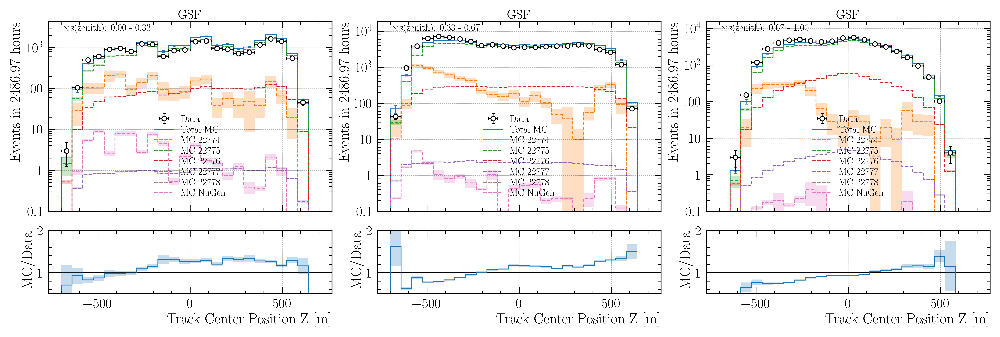

    : Center position z reconstructed by ``DeepLearningReco_track_geometry_9inputs_6ms_medium_01``.

.. _data_mc_L4_center_pos_z_cos_zenith_cut_GST:
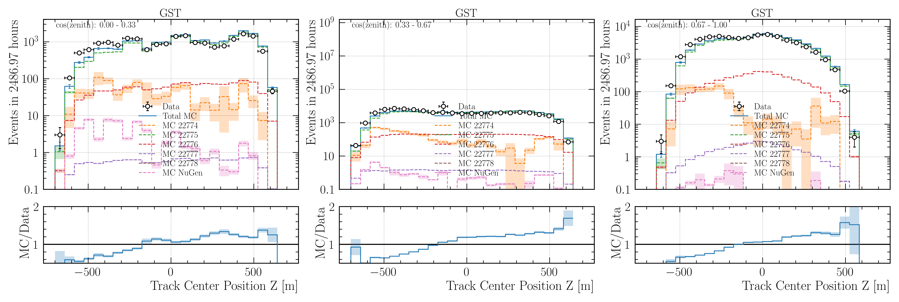

    : Center position z reconstructed by ``DeepLearningReco_track_geometry_9inputs_6ms_medium_01``.

.. _data_mc_L4_center_pos_z_cos_zenith_cut_H3a:
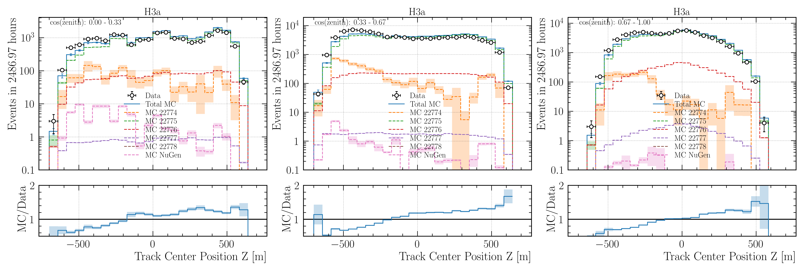

    : Center position z reconstructed by ``DeepLearningReco_track_geometry_9inputs_6ms_medium_01``.

.. _data_mc_L4_center_pos_z_cos_zenith_cut_H4a:
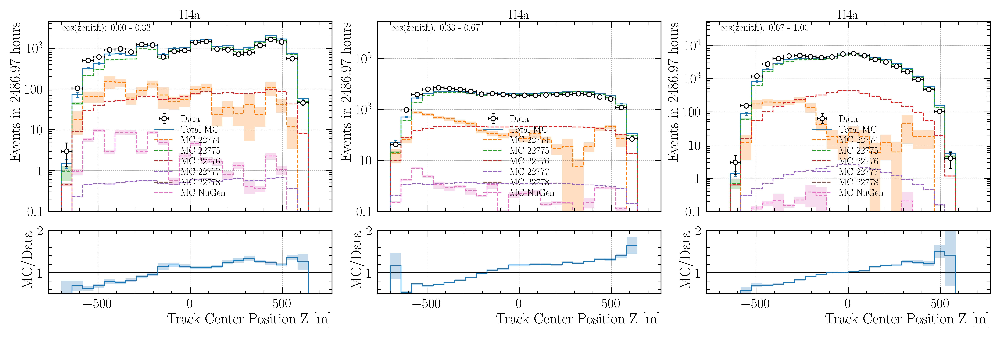

    : Center position z reconstructed by ``DeepLearningReco_track_geometry_9inputs_6ms_medium_01``.

Distance to center cuts 
-----------------------

.. _data_mc_L4_center_pos_z_distance_cut_GSF:
.. figure:: images/plots/data_mc/data_mc_level4/data_mc_center_pos_z_combined_radius_GSF.png
    :width: 800px 

    : Center position z reconstructed by ``DeepLearningReco_track_geometry_9inputs_6ms_medium_01``.

.. _data_mc_L4_center_pos_z_distance_cut_GST:
.. figure:: images/plots/data_mc/data_mc_level4/data_mc_center_pos_z_combined_radius_GST.png
    :width: 800px 

    : Center position z reconstructed by ``DeepLearningReco_track_geometry_9inputs_6ms_medium_01``.

.. _data_mc_L4_center_pos_z_distance_cut_H3a:
.. figure:: images/plots/data_mc/data_mc_level4/data_mc_center_pos_z_combined_radius_H3a.png
    :width: 800px 

    : Center position z reconstructed by ``DeepLearningReco_track_geometry_9inputs_6ms_medium_01``.

.. _data_mc_L4_center_pos_z_distance_cut_H4a:
.. figure:: images/plots/data_mc/data_mc_level4/data_mc_center_pos_z_combined_radius_H4a.png
    :width: 800px 

    : Center position z reconstructed by ``DeepLearningReco_track_geometry_9inputs_6ms_medium_01``.

Energy cuts
-----------

.. _data_mc_L4_center_pos_z_energy_cut_GSF:
.. figure:: images/plots/data_mc/data_mc_level4/data_mc_center_pos_z_combined_energy_DeepLearningReco_track_geometry_9inputs_6ms_medium_01_center_pos_z_GSF.png
    :width: 800px 

    : Center position z reconstructed by ``DeepLearningReco_track_geometry_9inputs_6ms_medium_01``.

.. _data_mc_L4_center_pos_z_energy_cut_GST:
.. figure:: images/plots/data_mc/data_mc_level4/data_mc_center_pos_z_combined_energy_DeepLearningReco_track_geometry_9inputs_6ms_medium_01_center_pos_z_GST.png
    :width: 800px 

    : Center position z reconstructed by ``DeepLearningReco_track_geometry_9inputs_6ms_medium_01``.

.. _data_mc_L4_center_pos_z_energy_cut_H3a:
.. figure:: images/plots/data_mc/data_mc_level4/data_mc_center_pos_z_combined_energy_DeepLearningReco_track_geometry_9inputs_6ms_medium_01_center_pos_z_H3a.png
    :width: 800px 

    : Center position z reconstructed by ``DeepLearningReco_track_geometry_9inputs_6ms_medium_01``.

.. _data_mc_L4_center_pos_z_energy_cut_H4a:
.. figure:: images/plots/data_mc/data_mc_level4/data_mc_center_pos_z_combined_energy_DeepLearningReco_track_geometry_9inputs_6ms_medium_01_center_pos_z_H4a.png
    :width: 800px 

    : Center position z reconstructed by ``DeepLearningReco_track_geometry_9inputs_6ms_medium_01``.

Cos zenith 2D correlation
-------------------------

.. _data_mc_L4_center_pos_z_cos_zenith_2D_GSF:

    : Center position z reconstructed by ``DeepLearningReco_track_geometry_9inputs_6ms_medium_01``.

.. _data_mc_L4_center_pos_z_cos_zenith_2D_GST:
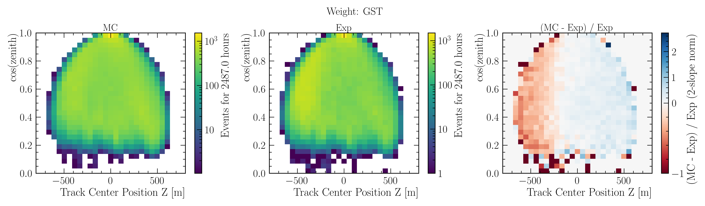

    : Center position z reconstructed by ``DeepLearningReco_track_geometry_9inputs_6ms_medium_01``.

.. _data_mc_L4_center_pos_z_cos_zenith_2D_H3a:

    : Center position z reconstructed by ``DeepLearningReco_track_geometry_9inputs_6ms_medium_01``.

.. _data_mc_L4_center_pos_z_cos_zenith_2D_H4a:

    : Center position z reconstructed by ``DeepLearningReco_track_geometry_9inputs_6ms_medium_01``.

Increase neutrino impact by factor 200
--------------------------------------

.. _data_mc_L4_center_pos_z_nugen_200_GSF:

    : Center position z reconstructed by ``DeepLearningReco_track_geometry_9inputs_6ms_medium_01``.

.. _data_mc_L4_center_pos_z_nugen_200_GST:
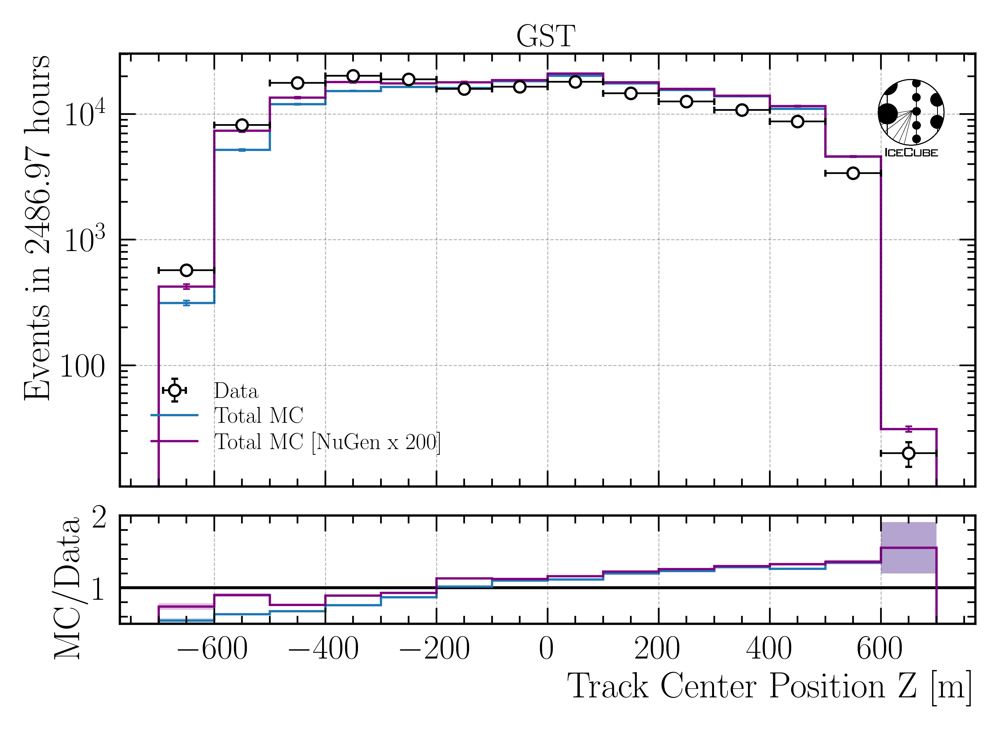

    : Center position z reconstructed by ``DeepLearningReco_track_geometry_9inputs_6ms_medium_01``.

.. _data_mc_L4_center_pos_z_nugen_200_H3a:
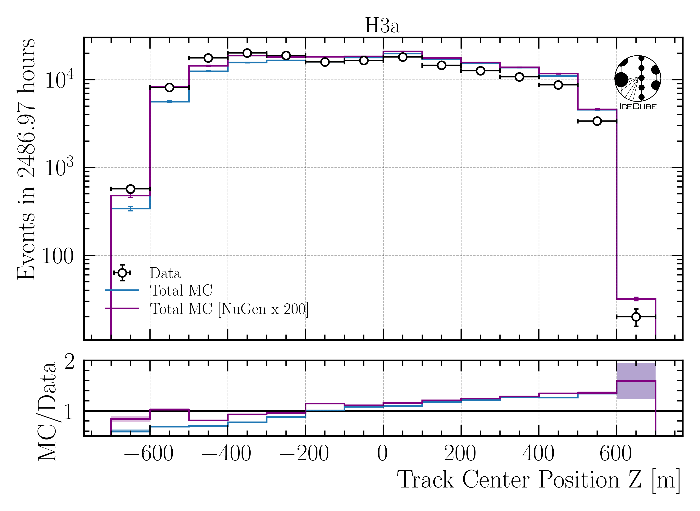

    : Center position z reconstructed by ``DeepLearningReco_track_geometry_9inputs_6ms_medium_01``.

.. _data_mc_L4_center_pos_z_nugen_200_H4a:

    : Center position z reconstructed by ``DeepLearningReco_track_geometry_9inputs_6ms_medium_01``.

.. _data_mc_L5_center_pos_z_investigation paragraph:
Z-vertex investigations (L5)
++++++++++++++++++++++++++++

In the following, the center position z is investigated on level 5. Several zenith cuts, distance to center cuts, and energy cuts are applied. Even more plots can be found `here <https://drive.google.com/drive/u/1/folders/1OSw3dmom8jBVAOkkJ-cN8ViW392_kHim>`_.

Cos zenith cuts
--------------- 

.. _data_mc_L5_center_pos_z_cos_zenith_cut_GSF:
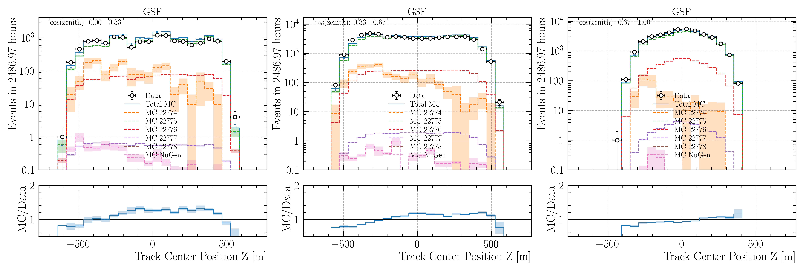

    : Center position z reconstructed by ``DeepLearningReco_track_geometry_9inputs_6ms_medium_01``.

.. _data_mc_L5_center_pos_z_cos_zenith_cut_GST:
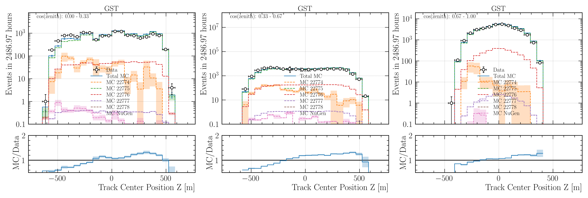

    : Center position z reconstructed by ``DeepLearningReco_track_geometry_9inputs_6ms_medium_01``.

.. _data_mc_L5_center_pos_z_cos_zenith_cut_H3a:
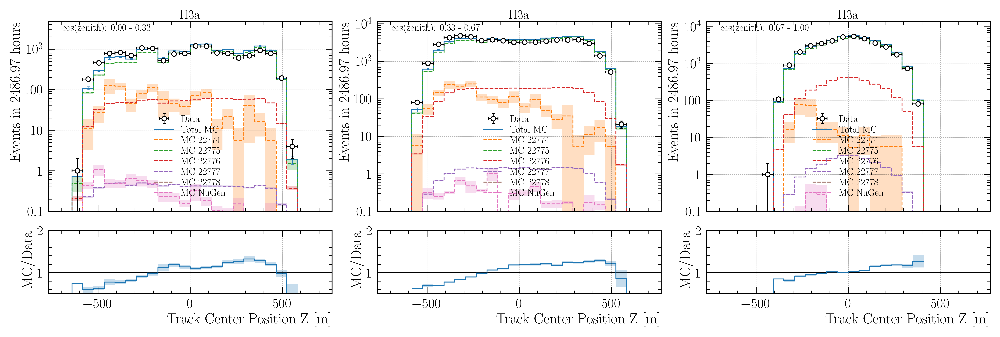

    : Center position z reconstructed by ``DeepLearningReco_track_geometry_9inputs_6ms_medium_01``.

.. _data_mc_L5_center_pos_z_cos_zenith_cut_H4a:
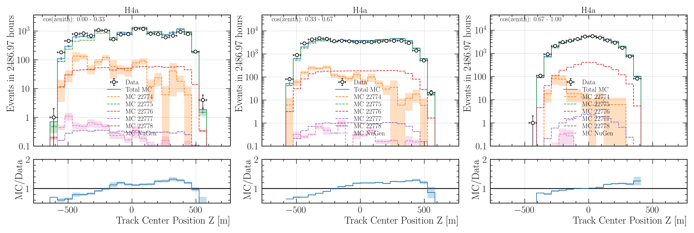

    : Center position z reconstructed by ``DeepLearningReco_track_geometry_9inputs_6ms_medium_01``.

Distance to center cuts 
-----------------------

.. _data_mc_L5_center_pos_z_distance_cut_GSF:
.. figure:: images/plots/data_mc/data_mc_level5/data_mc_center_pos_z_combined_radius_GSF.png
    :width: 800px 

    : Center position z reconstructed by ``DeepLearningReco_track_geometry_9inputs_6ms_medium_01``.

.. _data_mc_L5_center_pos_z_distance_cut_GST:
.. figure:: images/plots/data_mc/data_mc_level5/data_mc_center_pos_z_combined_radius_GST.png
    :width: 800px 

    : Center position z reconstructed by ``DeepLearningReco_track_geometry_9inputs_6ms_medium_01``.

.. _data_mc_L5_center_pos_z_distance_cut_H3a:
.. figure:: images/plots/data_mc/data_mc_level5/data_mc_center_pos_z_combined_radius_H3a.png
    :width: 800px 

    : Center position z reconstructed by ``DeepLearningReco_track_geometry_9inputs_6ms_medium_01``.

.. _data_mc_L5_center_pos_z_distance_cut_H4a:
.. figure:: images/plots/data_mc/data_mc_level5/data_mc_center_pos_z_combined_radius_H4a.png
    :width: 800px 

    : Center position z reconstructed by ``DeepLearningReco_track_geometry_9inputs_6ms_medium_01``.

Energy cuts
-----------

.. _data_mc_L5_center_pos_z_energy_cut_GSF:
.. figure:: images/plots/data_mc/data_mc_level5/data_mc_center_pos_z_combined_energy_DeepLearningReco_track_geometry_9inputs_6ms_medium_01_center_pos_z_GSF.png
    :width: 800px 

    : Center position z reconstructed by ``DeepLearningReco_track_geometry_9inputs_6ms_medium_01``.

.. _data_mc_L5_center_pos_z_energy_cut_GST:
.. figure:: images/plots/data_mc/data_mc_level5/data_mc_center_pos_z_combined_energy_DeepLearningReco_track_geometry_9inputs_6ms_medium_01_center_pos_z_GST.png
    :width: 800px 

    : Center position z reconstructed by ``DeepLearningReco_track_geometry_9inputs_6ms_medium_01``.

.. _data_mc_L5_center_pos_z_energy_cut_H3a:
.. figure:: images/plots/data_mc/data_mc_level5/data_mc_center_pos_z_combined_energy_DeepLearningReco_track_geometry_9inputs_6ms_medium_01_center_pos_z_H3a.png
    :width: 800px 

    : Center position z reconstructed by ``DeepLearningReco_track_geometry_9inputs_6ms_medium_01``.

.. _data_mc_L5_center_pos_z_energy_cut_H4a:
.. figure:: images/plots/data_mc/data_mc_level5/data_mc_center_pos_z_combined_energy_DeepLearningReco_track_geometry_9inputs_6ms_medium_01_center_pos_z_H4a.png
    :width: 800px 

    : Center position z reconstructed by ``DeepLearningReco_track_geometry_9inputs_6ms_medium_01``.

Cos zenith 2D correlation
-------------------------

.. _data_mc_L5_center_pos_z_cos_zenith_2D_GSF:
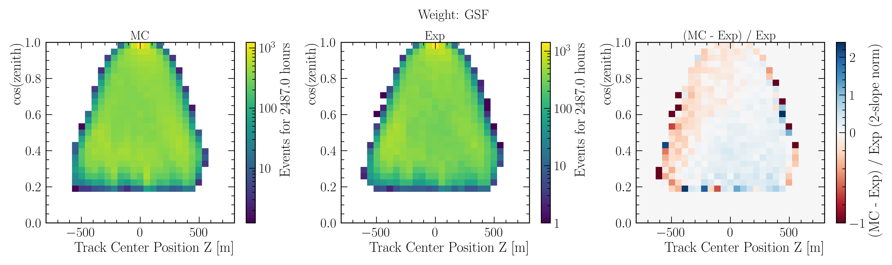

    : Center position z reconstructed by ``DeepLearningReco_track_geometry_9inputs_6ms_medium_01``.

.. _data_mc_L5_center_pos_z_cos_zenith_2D_GST:

    : Center position z reconstructed by ``DeepLearningReco_track_geometry_9inputs_6ms_medium_01``.

.. _data_mc_L5_center_pos_z_cos_zenith_2D_H3a:
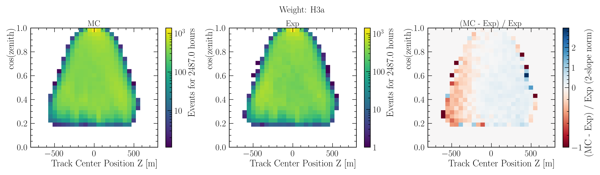

    : Center position z reconstructed by ``DeepLearningReco_track_geometry_9inputs_6ms_medium_01``.

.. _data_mc_L5_center_pos_z_cos_zenith_2D_H4a:

    : Center position z reconstructed by ``DeepLearningReco_track_geometry_9inputs_6ms_medium_01``.

Increase neutrino impact by factor 200
--------------------------------------

.. _data_mc_L5_center_pos_z_nugen_200_GSF:

    : Center position z reconstructed by ``DeepLearningReco_track_geometry_9inputs_6ms_medium_01``.

.. _data_mc_L5_center_pos_z_nugen_200_GST:
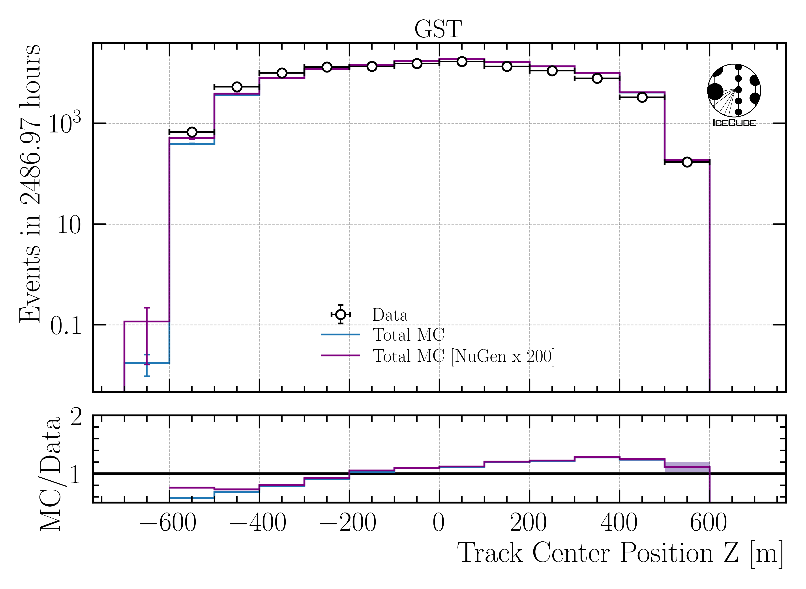

    : Center position z reconstructed by ``DeepLearningReco_track_geometry_9inputs_6ms_medium_01``.

.. _data_mc_L5_center_pos_z_nugen_200_H3a:
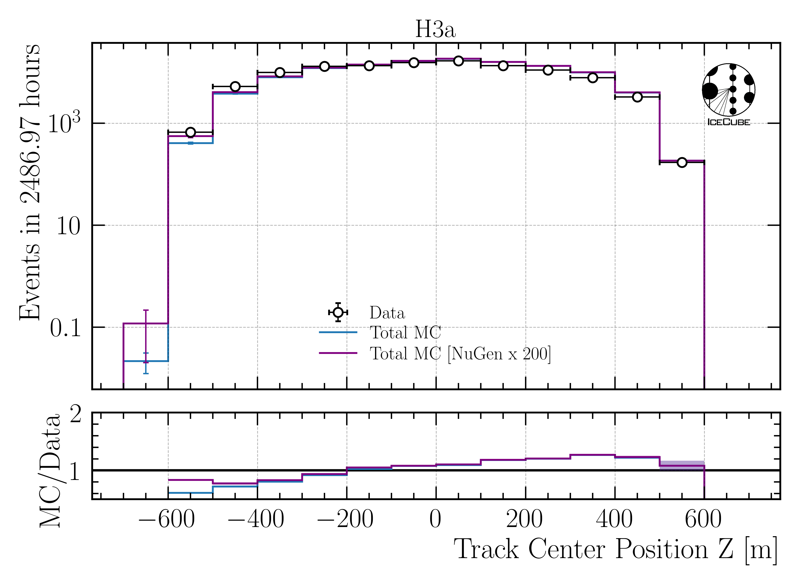

    : Center position z reconstructed by ``DeepLearningReco_track_geometry_9inputs_6ms_medium_01``.

.. _data_mc_L5_center_pos_z_nugen_200_H4a:

    : Center position z reconstructed by ``DeepLearningReco_track_geometry_9inputs_6ms_medium_01``.

Old unfolding plots
+++++++++++++++++++

Proxy Variable
--------------

At first, we need a proxy that correlates with the true physical quantity. In Figure :numref:`proxy_variable`, the muon energy of the 
leading muon at entry is used as a proxy variable. The target is the energy of the leading muon at the surface. 

.. _proxy_variable:

  : Proxy variable for unfolding. Here, the muon energy of the leading muon at entry is used. The target is the leading muon energy 
  at surface.

Unfold Event Rate - one proxy
-----------------------------

In Figure :numref:`unfolding_muon_energy_first_mctree_1.0e+04_5.0e+07_12bins_tauNone_GaisserH3a_few_steps`, the unfolded event rate of the muon energy of the leading muon at the surface is shown. 
In Figure :numref:`unfolding_muon_energy_first_mctree_1.0e+04_5.0e+07_12bins_tauNone_GaisserH3a_more_steps`, the same unfolding is performed with more steps and walkers. 

.. _unfolding_muon_energy_first_mctree_1.0e+04_5.0e+07_12bins_tauNone_GaisserH3a_few_steps:

  : Unfolded event rate of the muon energy of the leading muon at the surface. The true distribution is shown in blue, the unfolded 
  distribution in red. 

.. _unfolding_muon_energy_first_mctree_1.0e+04_5.0e+07_12bins_tauNone_GaisserH3a_more_steps:

  : Unfolded event rate of the muon energy of the leading muon at the surface. The true distribution is shown in blue, the unfolded 
  distribution in red. 

Unfold Event Rate - multiple proxies / tree binning 
---------------------------------------------------

Instead of using just one proxy, multiple proxies can be used. Due to the high dimensionality, a decision tree is used to bin the data. 
This is done in a way, that the tree is used to solve our problem: estimating the energy of the leading muon at the surface. But then, 
we don't use the estimation of the energy, but just the leafs for the binning. This way, we can use the tree to bin the data. Of course, 
this approach can also be used with only one proxy. This is presented first, to compare the results with the classical binning by hand.

In Figures :numref:`decision_tree_regression_1D_only_leading_energy` and :numref:`decision_tree_regression_2D_only_leading_energy`, 
the decision tree regression for the leading muon energy at the surface is shown. The tree is able to reconstruct the target variable.

.. _decision_tree_regression_1D_only_leading_energy:

  : Decision tree regression for the leading muon energy at the surface. The tree is used to bin the data.

.. _decision_tree_regression_2D_only_leading_energy:

  : Decision tree regression for the leading muon energy at the surface in 2D. The tree is used to bin the data.

Using this binning and the same number of steps and walkers a in Figure :numref:`unfolding_muon_energy_first_mctree_1.0e+04_5.0e+07_12bins_tauNone_GaisserH3a_few_steps`, 
the unfolding of the event rate results as in Figure :numref:`tree_binning_unfolding_rate_only_leading_energy`. The tree binning improves 
the unfolding result.

.. _tree_binning_unfolding_rate_only_leading_energy:
.. figure:: images/plots/unfolding/tree_binning_unfolding_rate_only_leading_energy.png

  : Unfolded event rate of the muon energy of the leading muon at the surface. The true distribution is shown in blue, the unfolded in red. 
  Tree binning is used. As a proxy, only the leading muon energy at entry is used.

Following, the leading muon energy at entry and the zenith angle are used as proxies. The tree binning is shown in 
Figure :numref:`binning_tree`. The result of the unfolded event rate is shown in Figure :numref:`tree_binning_unfolding_rate_leading_energy_and_zenith`.

.. _binning_tree: 

  : 2D binning of the data using a decision tree. The tree is used to bin the data.

.. _tree_binning_unfolding_rate_leading_energy_and_zenith: 

  : Unfolded event rate of the muon energy of the leading muon at the surface. The true distribution is shown in blue, the unfolded in red. 
  Tree binning is used. As proxies, the leading muon energy at entry and the zenith angle are used.

Unfold Muon Flux - one proxy 
---------------------------- 

For the unfolding of the muon flux at surface, an effective area is needed. This area is basically the information, 
how many muons correspond to a certain event measured by the detector. 

In Figure :numref:`unfolding_muon_energy_first_mctree_1.0e+04_5.0e+07_12bins_tauNone_GaisserH3a_more_steps_02_regNone_None_MCLabelsLeadingMuons_muon_energy_first_mctree` the muon flux at surface is unfolded using the leading muon energy at entry as a proxy with classical binning. 

.. _unfolding_muon_energy_first_mctree_1.0e+04_5.0e+07_12bins_tauNone_GaisserH3a_more_steps_02_regNone_None_MCLabelsLeadingMuons_muon_energy_first_mctree:

  : Unfolded muon flux at surface. The true distribution is shown in blue, the unfolded in red.

