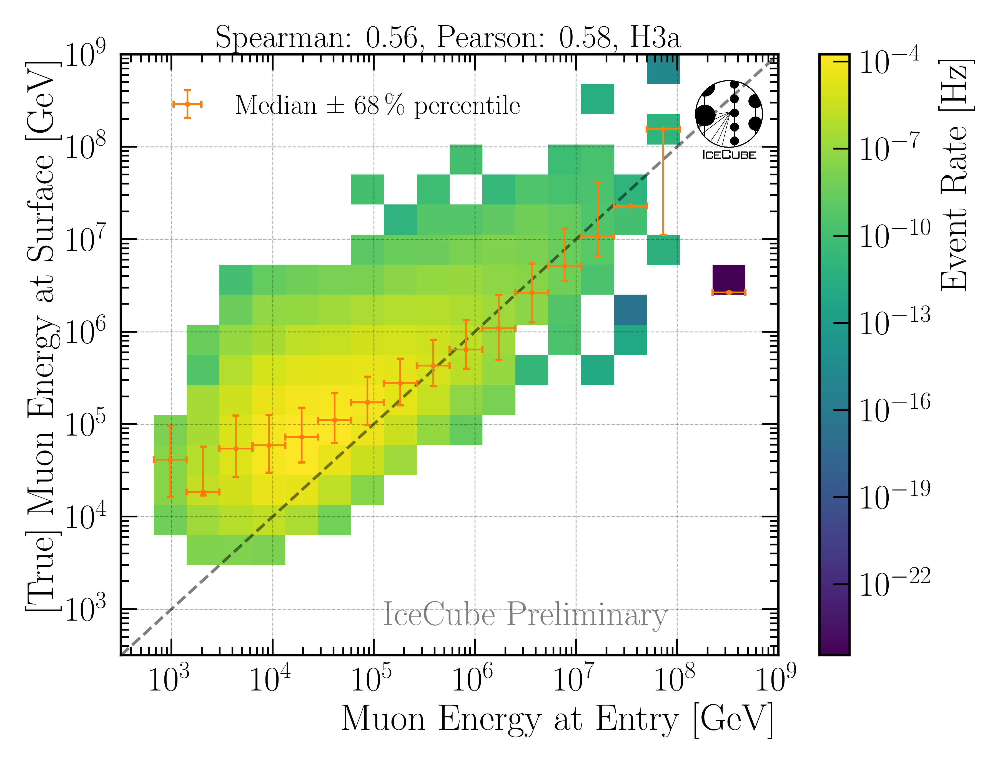
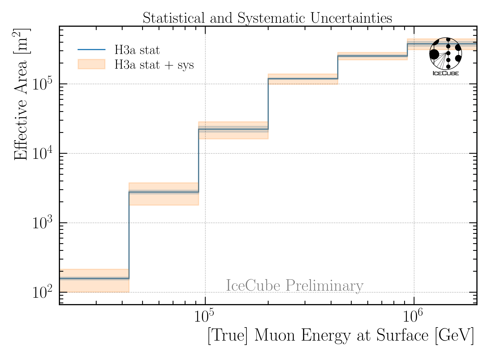
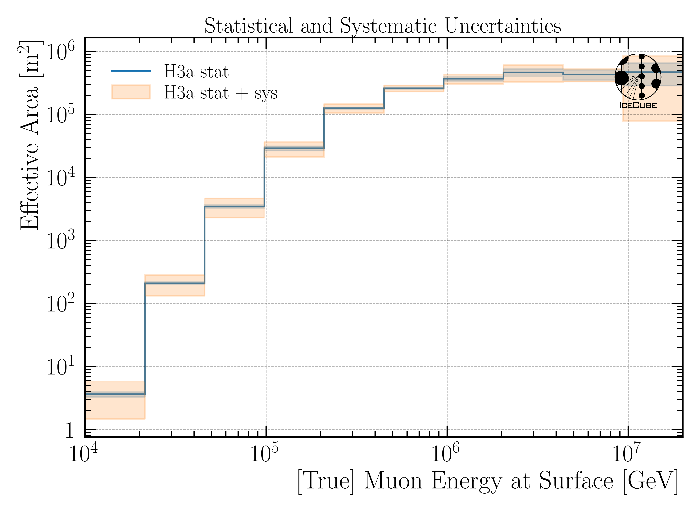
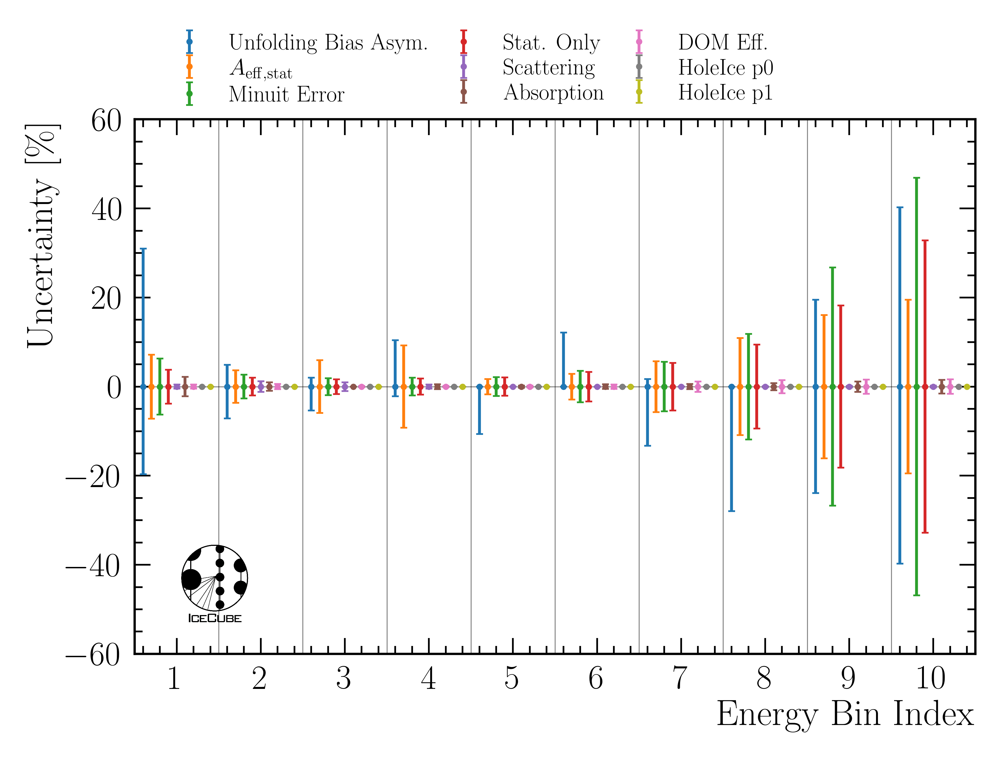

.. _one_page_summary:

One Page Summary
################

This page includes a summary of the entire analysis chain. This helps to get a quick overview of the analysis.

Analysis Goal
+++++++++++++

The goal of this analysis is an unfolding of the atmospheric muon flux in the energy from 10 TeV to about 10 PeV using the IceCube 
in-ice array. 
This enables to become sensitive to heavy mesons decaying in the atmosphere, referred to as prompt (see :numref:`mceq_flux`). 

Prompt Definition
+++++++++++++++++

A muon is categorized as prompt or conventional depending on its parent particle (see :ref:`Prompt Definition <prompt_definition_paragraph>`). 

* Conventional: muon parent is a pion or a kaon 
* Prompt: all other parent particles 

New CORSIKA EHIST Simulation
++++++++++++++++++++++++++++

For the analysis, new CORSIKA simulations with the extended history option are generated with IceProd. This option allows to get the information of the muon parent to classify a muon as prompt or conventional. The datasets were created with the hadronic interaction model SIBYLL 2.3d. More information are stored at :ref:`New CORSIKA Simulation <new_corsika_simulation_paragraph>`. 

CNN Reconstructions 
+++++++++++++++++++

All reconstructions uitilized in this analysis are machine learning based using the `dnn_reco <https://github.com/icecube/dnn_reco>`_ framework. The networks are trained on several older CORSIKA simulation datasets. 
In total, 4 different networks are trained and used in the analysis. One network is used to perform a quick pre-cut to remove 
lower energetic events. The other three networks reconstruct properties like muon energies, directions and detector geometries (entry points etc.). The networks also predict an uncertainty on the reconstructed property. In the figure below, the proxy variable 
for the unfolding (leading muon energy at detector entry ) is shown. 

    : Performance of the leading muon energy reconstruction on the final selection level. This variable is used as a proxy 
    to unfold the atmospheric muon flux at surface.

Details are provided at :ref:`CNN_reconstructions paragraph`.

Selection 
+++++++++

This analysis is based on a new selection performed within the scope of this analysis. Since the goal is an unfolding of the atmospheric muon flux for energies above 10 TeV, the idea is to select high-energetic muons. 
This is reached by several selection steps, labeled as `Level3`, `Level4`, `Level5` and `FinalLevel`. 

* `Level3`: Applying the muon filter to select muons 
* `Level4`: Use the pre-cut network to remove events with a muon bundle energy at surface with below 500 TeV 
* `Level5`: Use the other networks to perform several data-MC comparisons for the direction, detector entry point, closest approach point to the center, propagation length, the predicted uncertainties, etc. A bunch of cuts is performed to improve the data-MC agreement for several properties to select well reconstructed muons. 
* `FinalLevel`: To improve the data-MC agreement on the energy estimator used in this analysis -- the reconstructed energy of the most energetic muon in the muon bundle (leading muon) -- it is required that the leading muon carries at least 40% of the entire muon bundle energy at the entry point of the detector. 

The data-MC agreement of the energy proxy at the final selection stage used for the unfolding in this analysis is shown in :numref:`final_level_energy_proxy`.

.. _final_level_energy_proxy:

  : Proxy variable utilized to unfold the atmospheric muon flux at surface on the final selection stage.

Detailed information of the selection can be found at :ref:`selection paragraph`. The data-MC checks on the different 
selection levels are provided at :ref:`Data-MC Level 4 <data-mc level 4 paragraph>`, :ref:`Data-MC Level 5 <data-mc level 5 paragraph>` and :ref:`Data-MC Final Level <final level paragraph>`.

Unfolding
+++++++++

The distribution of a measured quantity :math:`g(y)` is connected to the true
physical distribution :math:`f(x)` via the detector response :math:`A(x,y)` according
to the convolution integral

.. math::
  \begin{equation}
    g(y) = \int A(x,y) f(x) \,\mathrm{d}x + b(y) \; .
  \end{equation}

This is referred to as the *Fredholm integral equation of the first kind*.
The additional term :math:`b(y)` represents some bias, which originates form
contributions to the measurement that are considered as background. Since the
selected sample is assumed to have a sufficiently high purity, the bias will
be neglected in the following. The detector response function :math:`A(x,y)` describes
the whole detection procedure. It depends on the physical truth and has to be determined
from Monte Carlo simulations. 
Details on the unfolding can be found at :ref:`Unfolding paragraph <unfolding paragraph>`.

Systematic uncertainties are considered
in the detector response as well by modeling the effect of the five in-ice systematics 
on the effective bin count. More information on the systematics can be found at :ref:`Systematics paragraph <systematics_unfolding>`.

In the following, the measured quantity is called proxy and the true physical quantity target.

Proxy--Target Correlation
-------------------------

In this analysis, the leading muon energy at the detector entry point is used as a proxy to unfold the atmospheric muon flux at surface. The correlation is presented in :numref:`proxy_target_correlation_1`.

.. _proxy_target_correlation_1:

  : Proxy variable for unfolding. Here, the muon energy of the leading muon at entry is used. The target is the leading muon energy 
  at surface. 

Regularization strength
-----------------------

To minimize unphysical fluctuations in the unfolded result, a regularization is applied using Tikhonov regularization of order 2. The strength of the regularization is determined by scanning the global correlation coefficient :math:`\rho` as a function of the regularization parameter tau. Here, it is

.. math::
    \rho = \sum_{i>j} V_{ij}\,,

where V is the covariance matrix of the unfolded distribution, with i and j being the indices of the 
unfolding bins. The optimal regularization strength tau is found by minimizing the global correlation, as presented in :numref:`global_correlation_tau_scan_H3a_GSF`. The correlation curve is smooth and a minimum can be found easily.

.. _global_correlation_tau_scan_H3a_GSF:

    : Global correlation as a function of the regularization parameter tau. The unfolding algorithm is trained on H3a and tested on GSF. 

The unfolding is only accepted, if the minimization using minuit is successful, otherwise the point is discarded. To avoid fluctuations in the distribution, a rolling average and a polynomial fit around the 
expected minimum is used to determine the optimal tau value. In :numref:`global_correlation_tau_scan_H3a_H3a`, the global correlation is shown, when the unfolding algorithm is both trained and tested on H3a. Here, the curve is less smooth, however, all 
three methods determine a similar optimal tau value.

.. _global_correlation_tau_scan_H3a_H3a:

    : Global correlation as a function of the regularization parameter tau. The unfolding algorithm is trained and tested on H3a.

Effective Area
--------------

The effective area :math:`A_{\mathrm{eff}}` describes the detector acceptance and is defined as

.. math::
    A_{\mathrm{eff}} = \frac{N_{\mathrm{detected}}}{N_{\mathrm{generated}}} \cdot A_{\mathrm{gen}}\,,

where :math:`N_{\mathrm{detected}}` is the number of detected events after all selection cuts, :math:`N_{\mathrm{generated}}` is the number of generated events in the simulation,
and :math:`A_{\mathrm{gen}}` is the generation area. The effective area is shown for the burnsample in :numref:`effective_area_burnsample`.

.. _effective_area_burnsample:

  : The effective area is presented as a function of the muon energy at surface. Statistical uncertainties are calculated with the weights. The systematic uncertainties result from the variations in the effective area. This is shown for the burnsample binning.

For the full 12 years sample, the effective area is shown in :numref:`effective_area_fullsample_1`.

.. _effective_area_fullsample_1:

    : The effective area is presented as a function of the muon energy at surface. Statistical uncertainties are calculated with the weights. The systematic uncertainties result from the variations in the effective area. This is shown for the full 12 years sample binning.

More information on the effective area and the corresponding systematic uncertainties are described in :ref:`Unfolding/Effective Area <effective_area_paragraph>`. This is done analogue to the analysis of stopping muons by Lucas Witthaus (see `Stopping muons wiki <https://user-web.icecube.wisc.edu/~lwitthaus/StoppingMuonAnalysis/docs/Effective_Area/effective_area.html>`_).

Burnsample Unfolding
--------------------

The burnsample unfolding has been presented at the ICRC and the proceedings is available 
here: `Unfolding the Atmospheric Muon Flux with IceCube: Investigating Stopping Muons and High-Energy Prompt Contributions <https://pos.sissa.it/501/281/>`_. 
Here, more information can be found at :ref:`Burnsample Unfolding <burnsample_unfolding_paragraph>`.

The final result is presented in :numref:`burnsample_final_unfolding_1`.

.. _burnsample_final_unfolding_1:
.. figure:: images/plots/unfolding/new/burnsample/unfolding_flux_pascal_burnsample_mceq_02-1_MC_systematics.png
    :width: 600px 

    : Unfolded muon flux at surface using the burnsample data with :math:`2487\,\mathrm{h}` of IceCube data. The unfolding is performed with tau=0.0029. The uncertainties are derived from the inverse of the Hessian matrix obtained in the Minuit fit and are further expanded to include the systematic variations of the effective area. The unfolded result is compared to predictions from MCEq using H3a, and SIBYLL 2.3c.

Full Sample Unfolding
---------------------

For the full sample, 12 years of data IC86 will be used. The unfolding is performed analogue to the burnsample unfolding. 
However, the uncertainties are treated slightly different. 

The total uncertainty on the unfolded flux is given by

.. math::
    \sigma_{\text{tot}} = \sqrt{\sigma_{\text{minuit}}^2 + \sigma_{\text{Aeff,stat}}^2 + \sigma_{\text{unf-bias}}^2}\,.

Here, :math:`\sigma_{\text{minuit}}` is derived from the inverse of the Hessian matrix obtained in the Minuit fit. This fit also 
includes the 5 in-ice systematics. :math:`\sigma_{\text{Aeff,stat}}` is the statistical uncertainty on the effective area, and :math:`\sigma_{\text{unf-bias}}` is the uncertainty due to a possible unfolding bias. This bias is presented in 
:numref:`unfolding_bias_all_weightings`.

.. _unfolding_bias_all_weightings:

    : Study of the unfolding bias for the full sample unfolding. The unfolding algorithm is trained on the four different primary models, and then the MC dataset weighted to a livetime of 12 years is unfolded. The ratio to the true MC distribution is shown. 
    This is done for all 4 weightings, which then results in 16 unfoldings in total. Ideally, all lines would align with 1. However, some deviations are visible, which are considered as unfolding bias. The maximum deviation in each bin is taken as systematic uncertainty due to the unfolding bias.

After including these uncertainties, the unfolding is able to predict the true MC distribution within the uncertainties, as shown in :numref:`full_sample_final_unfolding_mc_with_bias`.

In :ref:`Sensitivity Test <sensitivity_paragraph>`, a test is performed whether the unfolding is sensitive to the prompt 
component. In that test, a pseudo dataset with and without prompt contribution is unfolded. The test shows that the unfolding is indeed sensitive to the prompt component. 

The final prediction for the full 12 years sample is presented in :numref:`full_sample_final_unfolding_prediction`.

.. _full_sample_final_unfolding_prediction:

    : Predicted unfolded muon flux at surface for the full 12 years sample. The uncertainties are derived from the inverse of the Hessian matrix obtained in the Minuit fit and are further expanded to include the statistical uncertainties of the effective area and the unfolding bias. The unfolded result is compared to predictions from MCEq using H3a, and SIBYLL 2.3c.

The uncertainties per bin are presented in :numref:`full_sample_uncertainties_breakdown`.

.. _full_sample_uncertainties_breakdown:

    : Breakdown of the different uncertainty contributions per bin for the full 12 years sample unfolding. The minuit uncertainties are derived from the inverse of the Hessian matrix obtained in the Minuit fit and are further expanded to include the 5 in-ice systematics. This is the entire minuit error. It is then divided into a statistical error and the 5 systematics each. The statistical uncertainties of the effective area and the unfolding bias are also presented.

Flux characterization (LikelihoodFitter)
++++++++++++++++++++++++++++++++++++++++

The ``LikelihoodFitter`` class performs a **χ²-based fit** of two model components
(e.g. *prompt* and *conventional*) to measured data.  
It allows for both symmetric and asymmetric per-bin uncertainties and performs
a one-sided hypothesis test for the presence of a prompt component.

Overview
--------

Given the binned expectations for the two model components

.. math::

    p_i = \text{prompt expectation}, \quad
    c_i = \text{conventional expectation},

and the measured data

.. math::

    d_i = \text{measurement} \; ,

the model prediction for each bin is

.. math::

    m_i(\alpha, \beta) = \alpha \, p_i + \beta \, c_i \; ,

where :math:`\alpha` and :math:`\beta` are normalization parameters to be fitted.

Chi-Squared Definition
----------------------

The fit minimizes the standard chi-squared function:

.. math::

    \chi^2(\alpha, \beta) = \sum_i
    \left( \frac{d_i - m_i(\alpha, \beta)}{\sigma_i} \right)^2 \; ,

where :math:`\sigma_i` denotes the per-bin uncertainty.

.. For **asymmetric** uncertainties, both lower and upper errors can be supplied
.. as a :math:`(2 \times N)` array:

.. .. math::

..     \sigma_i =
..     \begin{cases}
..       \sigma_i^+ & \text{if } d_i \ge m_i(\alpha, \beta) \\
..       \sigma_i^- & \text{if } d_i < m_i(\alpha, \beta)
..     \end{cases}

.. This allows the fitter to account for asymmetric confidence intervals in the data.

Fit Procedure
-------------

* Minimization is performed with the ``L-BFGS-B`` algorithm,
  enforcing non-negative bounds for both parameters.
* The covariance matrix is estimated from the inverse Hessian of the fit result.
* Uncertainties of the best-fit parameters are derived as:

.. math::

    \Delta \theta_i = \sqrt{ (H^{-1})_{ii} }

where :math:`H^{-1}` is the approximate inverse Hessian returned by the optimizer.

* The fit summary reports:

  - :math:`\hat{\alpha}`, :math:`\hat{\beta}` (best-fit normalizations)  
  - :math:`\chi^2_\text{min}`, degrees of freedom, and :math:`\chi^2/\text{ndof}`  
  - Goodness-of-fit p-value :math:`p_\text{gof} = 1 - F_{\chi^2}(\chi^2_\text{min}; \text{ndof})`  
  - Parameter correlation from the covariance matrix

Hypothesis Test for Prompt Component
------------------------------------

A one-sided hypothesis test evaluates whether the prompt component is required:

* **Null hypothesis (H₀)**: :math:`\alpha = 0`
* **Alternative hypothesis (H₁)**: :math:`\alpha > 0`

The test statistic is defined as:

.. math::

    TS = \max\left( \chi^2_{H_0} - \chi^2_{H_1}, \, 0 \right)

and follows a **½ χ²(1)** distribution (Chernoff 1954) due to the boundary at zero.

The corresponding one-sided p-value is:

.. math::

    p = \tfrac{1}{2} \, \mathrm{erfc}\!\left( \sqrt{\tfrac{TS}{2}} \right)

which is converted into a Gaussian-equivalent significance:

.. math::

    Z = \sqrt{2} \, \mathrm{erfc}^{-1}(2p)

Interpretation:

* A small :math:`p` (e.g. < 0.05) indicates evidence for a non-zero prompt component.
* The reported :math:`Z` value corresponds to the one-sided Gaussian significance.

Usage Example
-------------

.. code-block:: python

    lf = LikelihoodFitter(prompt_expectation, conv_expectation, measurement, uncertainty)

    # Perform best-fit
    fit_result = lf.fit()

    # Perform hypothesis test for prompt component
    test_result = lf.hypothesis_test()

    # Print summary to console
    lf.summary()

Fit prediction
--------------

Assuming symmetric unfolding bias uncertainties, the minuit uncertainties and the statistical uncertainties on the effective area, the result for a fit on MC using H3a weighting and comparing it to the CORSIKA truth is shown in :numref:`likelihood_fitter_mc_fit_result`.

.. _likelihood_fitter_mc_fit_result:

    : Fit of the LikelihoodFitter on MC using H3a weighting and comparing it to the CORSIKA truth. Here, symmetric uncertainties are assumed for the unfolding bias. The minuit uncertainties and the statistical uncertainties on the effective area are included. The fit is able to recover the true prompt normalization within uncertainties.