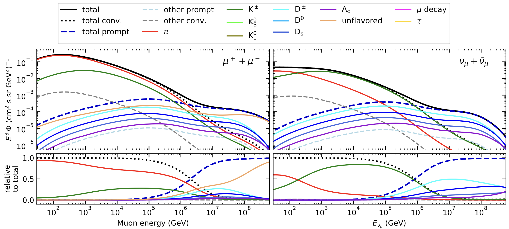

Overview 
########

Atmospheric muon flux 
+++++++++++++++++++++
When a cosmic particle hits our Earth's atmosphere, secondary particles are produced in cascades. Depending on the energy of the primary 
particle, these cascades are very large and produce not only one but several particles. These cascades are called extensive 
air showers. Since most of the produced particles are unstable, on Earth's surface mainly neutrinos and muons are detected. The amount of 
muons arising per area per time interval per solid angle and per energy is called muon flux.
This muon flux is divided into two different components, depending on their spectral index. One is the conventional component with a 
spectral index :math:`\gamma = 3.7`. This flux contains muons arising from pions and kaons, which are the particles produced the most in the 
first interactions, because they are the lightest hadrons. The other part is build by the prompt component, which are in general all 
other muons that originate not from pions and kaons. The flux has a spectral index :math:`\gamma = 2.7`. Thus, it is shifted to higher energies 
in comparison to the conventional flux. In other words, the prompt spectrum is flatter than the conventional one. 
The prompt produced particles have short lifetimes which lead in first order to 
an immediate decay. Hence, the muon energy correlates stronger to the primary particle energy. Instead, the conventional pions and kaons 
live long enough to interact with the atmosphere. This causes energy losses and results to lower muon energies. The cross-over point is 
around :math:`1\,\mathrm{PeV}`. This prompt flux was not significantly detected yet, due to the less amount of 
muons expected for these high energies in a detector volume of 
:math:`1\,\mathrm{km}^3` like IceCube. Figure :numref:`1` shows the different components of 
the atmospheric muon flux created with `MCEq <https://github.com/afedynitch/MCEq>`_. More information to the hadronic interaction model SIBYLL 
used to create these spectra are provided `here <https://arxiv.org/pdf/1806.04140.pdf>`_.

    :numref:`1`
    

Previous analyses 
+++++++++++++++++
In the past, two analyses were performed focused on high energetic muons arising from our Earth's atmosphere by Thomasz Fuchs and Patrick Berghaus. 
In Tomasz's thesis, which included an unfolding of the energy spectrum with one year of experimental data, the analysis was limited by MC statistics. 
This caused the analysis to result in a prompt normalization that is compatible with zero. 
In Patrick's thesis, a mismatch between MC and data was found in the :math:`\cos(\theta)` distribution. This issue leads to systematic uncertainties resulting the 
final significance of the detection of the prompt component to be lower than :math:`3.5 \sigma`.

New analysis 
++++++++++++
Our new analysis aims for two goals. On the one hand, we want to detect the prompt component of the atmospheric muon flux significantly. This 
will be performed by a forward fit of the prompt normalization. 
On the other hand, an unfolding of the muon energy spectrum will be done. 

In the previous analyses, the true information whether a muon is prompt or conventional was not available.  
To classify a muon as prompt, the type of the parent particle needs to be known (see prompt definition).  
This information was never saved in the way the CORSIKA simulations have been run in IceCube. The additional information needs more disk storage
and for neutrino source searches, these information are not valuable. Hence, it was not important to save the parent particles. 

To include the parent and grandparent particles of a muon in the I3MCTree, the ``EXTENDED HISTORY`` option needs to be set in CORSIKA. 
We have started to run 
simulations with this option, which enables the possibility to divide the atmospheric muon spectrum in a prompt and conventional component. 
Thus, the spectrum can be adjusted by applying a scalar to scale the amount of prompt and conventional particles. This scalar is 
the normalization which is measured in the final forward fit. 
Since the runtime of CORSIKA simulations at high energies is on the order of magnitude of months to create sufficient statistics, 
this scaling method allows a forward fit without running several CORSIKA simulations in which the hadronic interaction models 
are adjusted. This has two advantages. First, it saves time and resources. Second, tuning the hadronic interaction models is not 
simply to do and requires a close collaboration with the model builders. Hence, the scaling method is a good way to measure the prompt component.
