Overview
########

The observed atmospheric muon neutrino flux is subject to seasonal variations caused by temperature fluctuations in the Stratosphere throughout the year. Atmospheric neutrinos originate from cosmic ray induced air showers. When a cosmic ray interacts with an air molecule within the atmosphere, a cascade of particle interactions is triggered. Secondary mesons, such as kaons or pions, are produced in the muonic shower component. The ability of these mesons to decay directly into muons and neutrinos, or interact again, depends on the local air density, and hence the pressure, of the atmosphere. The flux becomes temperature-dependent at critical energies :math:`E_{\nu} \cdot \cos(\Theta^{\star})>\epsilon_i` with the zenith angle of neutrino production :math:`\Theta^{\star}` (:math:`\epsilon_{\pi} \approx 125GeV` and :math:`\epsilon_K \approx 850GeV`). The secondary mesons can now interact again and the resulting neutrino flux becomes about one power-law steeper compared to primary cosmic rays:

.. math::

  \Phi_{\nu}(E_{\nu},\Theta,X) = \Phi_{\mathrm{N}}(E_{\nu}) \cdot \int\limits_0^{X_{\mathrm{ground}}} \left( \frac{A_{\pi\rightarrow\nu}(X)}{1 + B_{\pi\rightarrow\nu}(X) \cdot \frac{E_{\nu}\cos(\Theta^{\star})}{\epsilon_{\pi}(T(X))}} + \frac{A_{K\rightarrow\nu}(X)}{1 + B_{K\rightarrow\nu}(X) \cdot \frac{E_{\nu}\cos(\Theta^{\star})}{\epsilon_{K}(T(X))}} \right)  \mathrm{d}X

Fig. :numref:`1` displays the estimated seasonal neutrino flux at South Pole. The seasonal variations increase with energy above roughly 100 GeV and reach deviations of about 10% between summer and winter. A deeper introduction into seasonal variations can be found in the `ICRC proceeding <https://pos.sissa.it/395/1159/pdf>`_  and in the references listed there.

.. hondaplot:
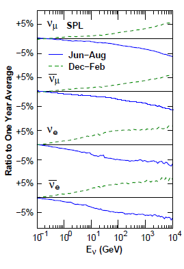

	:numref:`1`
	Calculation of the seasonal atmospheric neutrino flux by `HAKKM15 <https://arxiv.org/abs/1502.03916>`_ for the IceCube site.

The monthly variations predicted by `MCEq <https://github.com/afedynitch/MCEq>`_ are depicted below. As shown in the Section `Results <https://user-web.icecube.wisc.edu/~khymon/SeasonalVariationsUnfolding/docs/Results.html>`_, the impact of the hadronic interaction and primary cosmic ray model vanish in the ratio of seasonal flux to yearly flux.

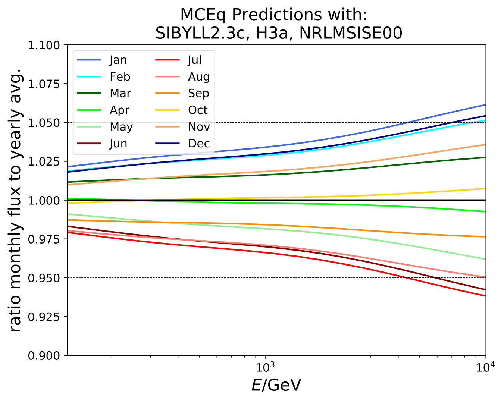

To keep the energy dependence of the seasonal variations, unfolding techniques are used to reconstruct seasonal spectra. The unfolded energy spectra are subject to systematic uncertainties in the reconstruction process. Given the limited amount of data per season, the seasonal spectra are indistinguishable regarding the uncertainties. However, the seasonal variations of the flux can be determined by measuring the deviation of the seasonal unfolded flux to the unfolded annual mean flux. The measurement becomes then independent of systematic uncertainties in the detector reconstruction and the flux model since these do not change with the season. This allows to measure the seasonal variation of the neutrino flux energy-dependently. With 10 years of IceCube data it may be feasible to distinguish between seasonal flux variations that are only affected by statistical uncertainties of the unfolding process.

The overview of the unfolding scheme is illustrated in Fig. :numref:`2`.

MCEq predictions for ratio of monthly flux to annual average depending on zenith angle. Average MCEq flux ratio for the zenith range between 90° and 120°
is shown in dashed lines.

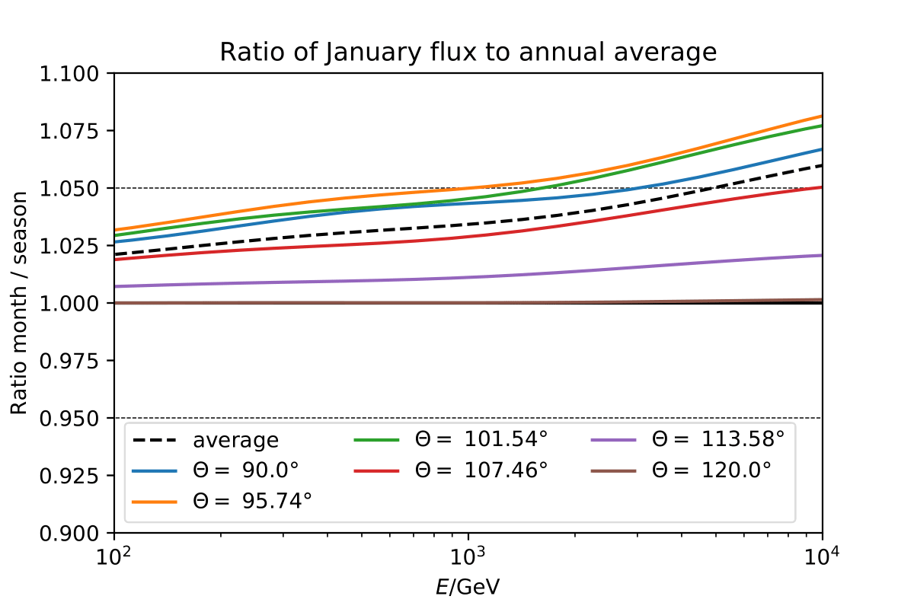

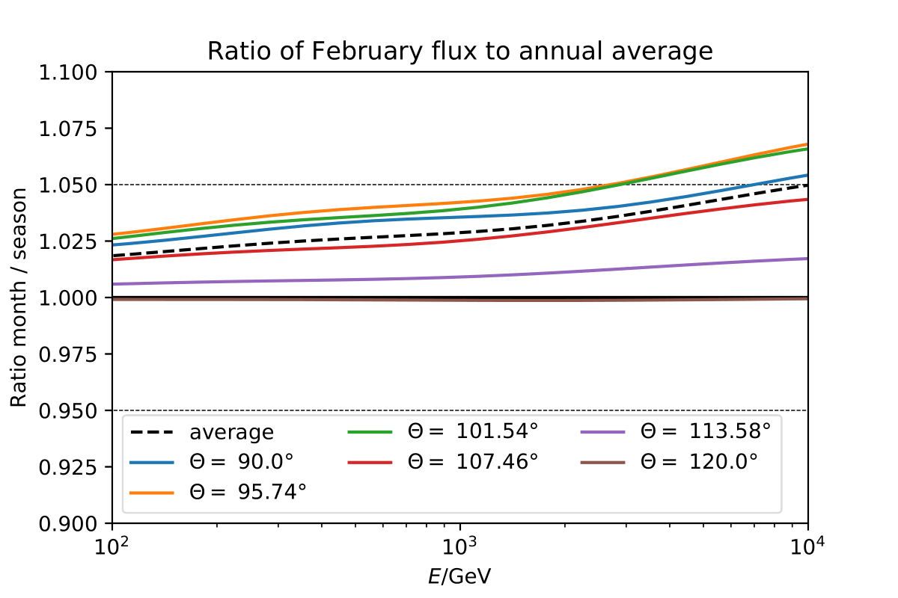

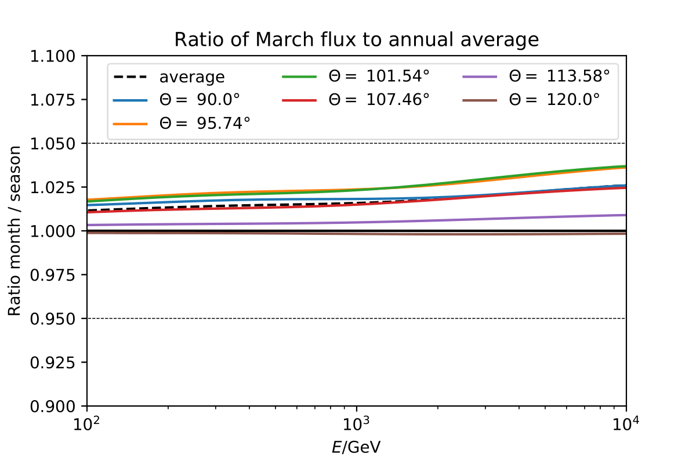

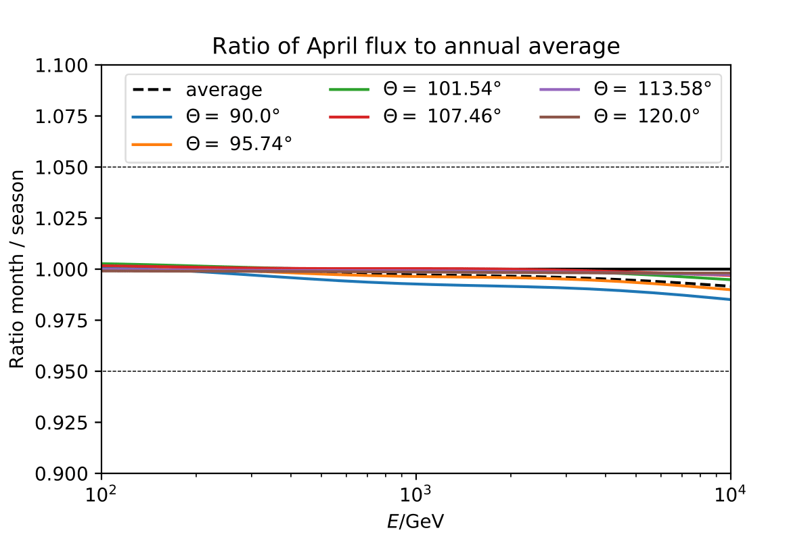

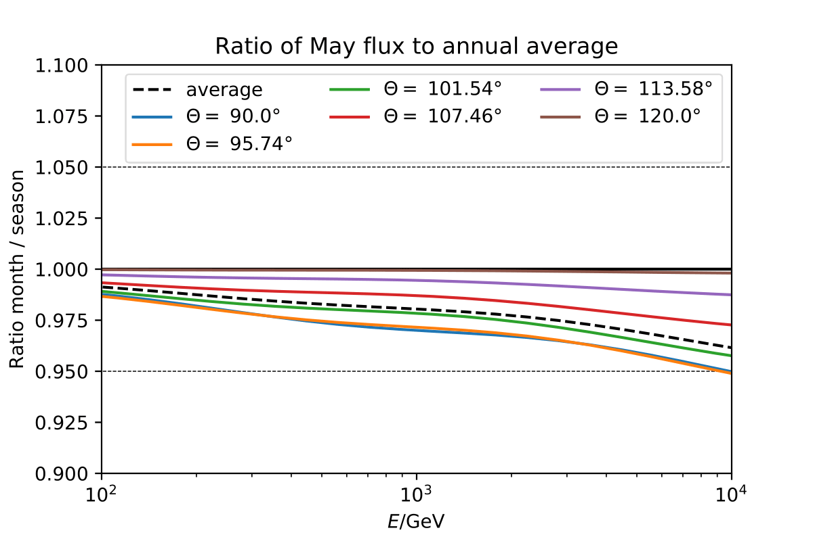

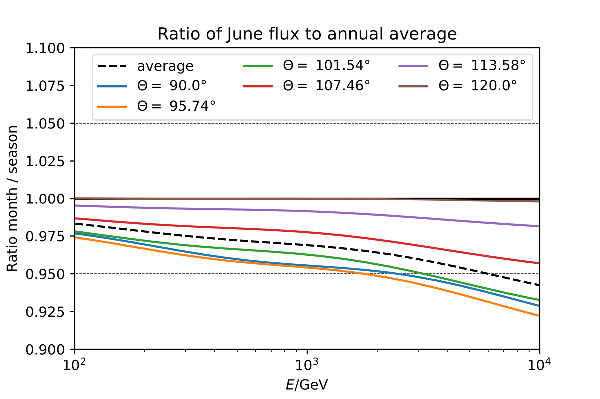

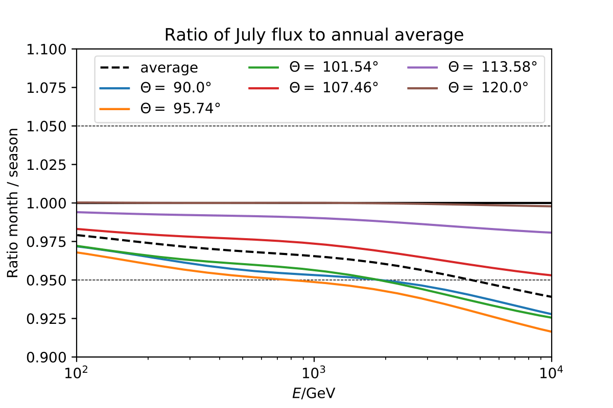

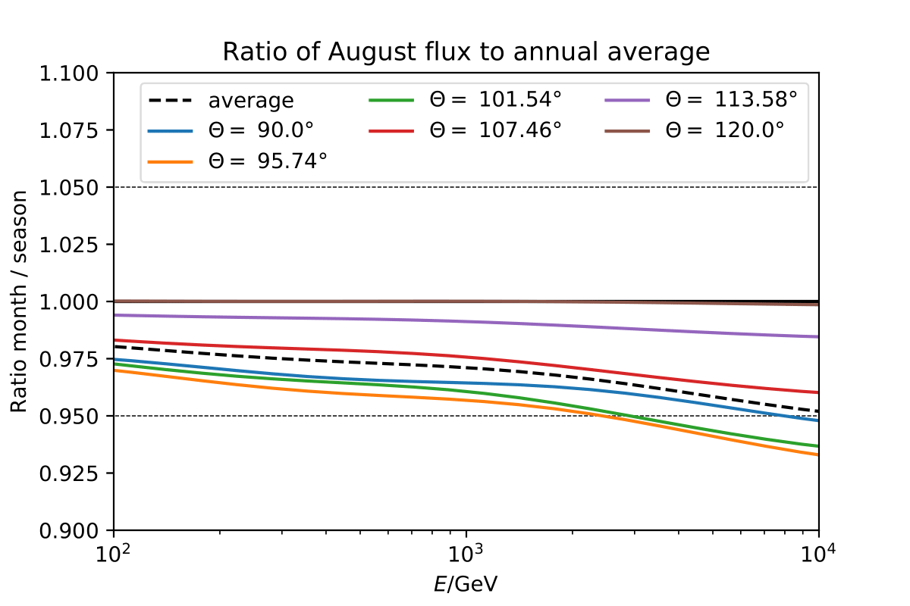

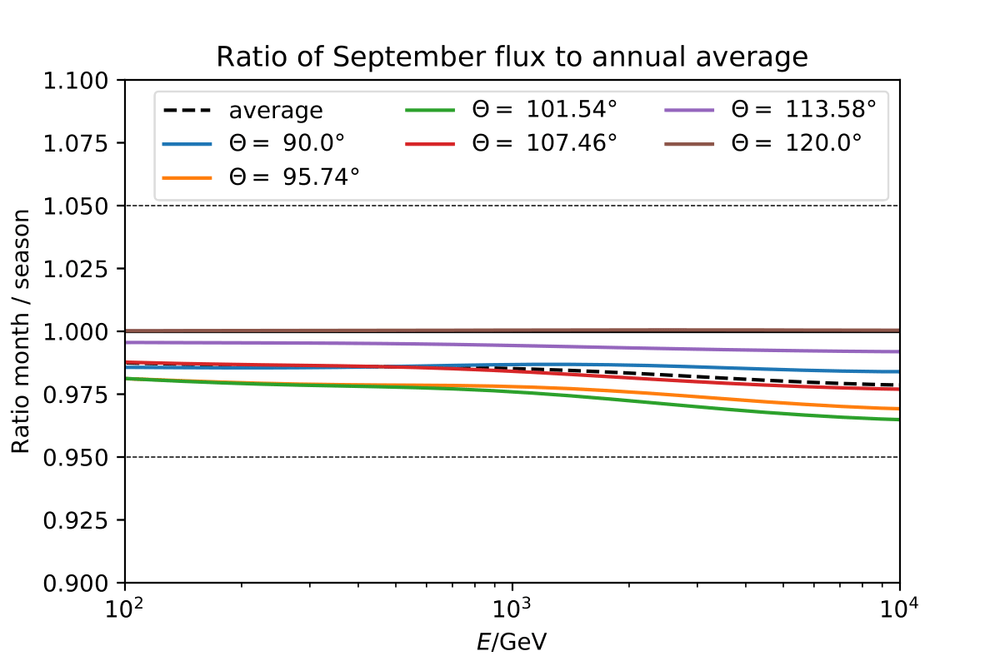

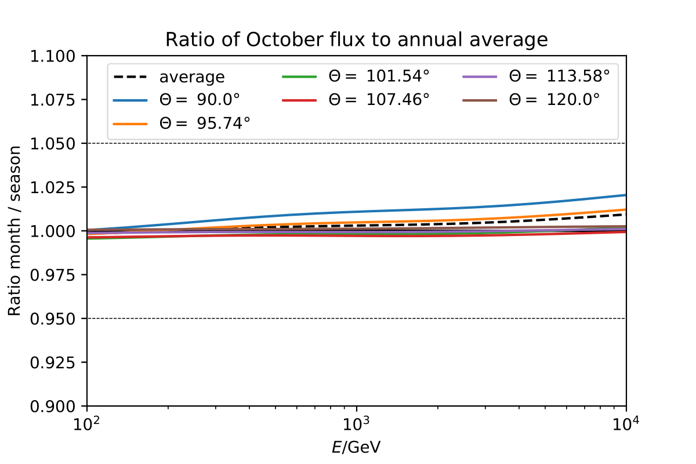

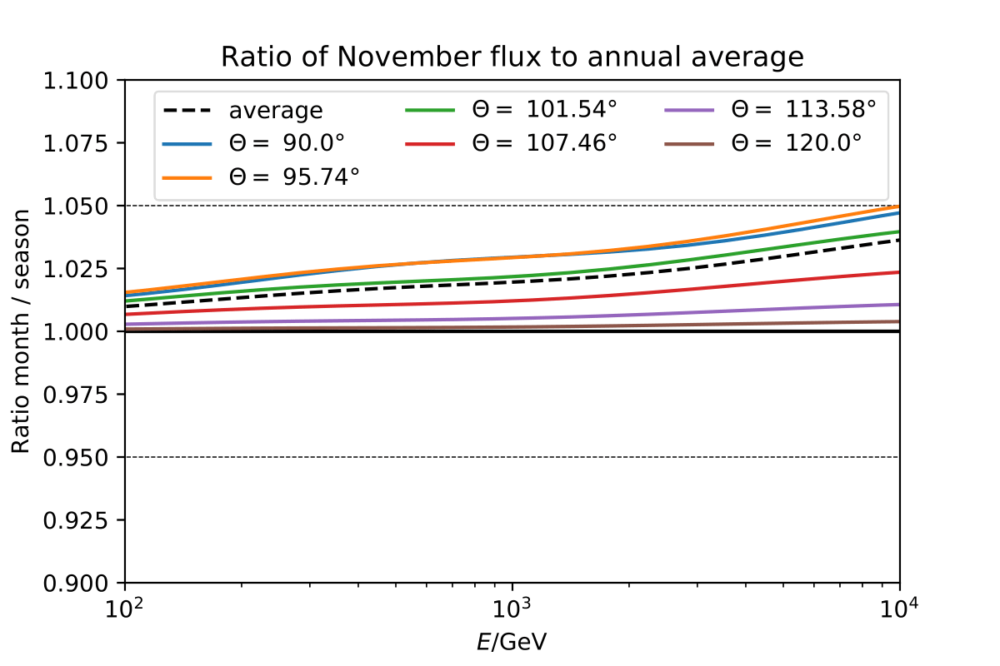

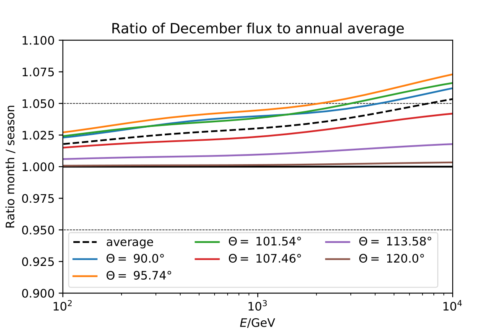
