Plots with Pass1 MC
###################

.. figure:: images/analysis_overview.PNG

Simulation sample: 11374 (zenith: 90°-120°) sampled according to Honda2006 flux model(NewNuFlux)

To train the unfolding algorithm, the Monte Carlo simulation set (NuGen data set **11374**) is used. Folders 1-9 are selected as the training sample (100 000 events) and folders 0, 10 and 11 as the hold-out set.
7 iterations of DSEA are set as default. The tested classifiers converged within this number of iterations.

Data MC Agreement
+++++++++++++++++
Note: comparison to Pass2 Data

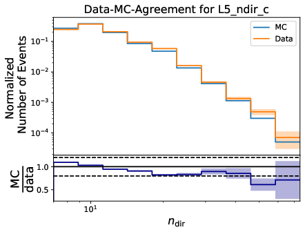

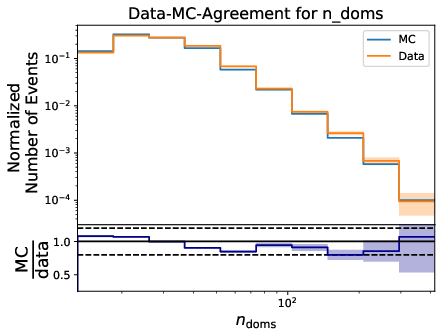

.. image:: images/datavsmc_bns_EtrunDoms_10yr_err.png

Mismatches are found at high truncated energies. These values do not contribute to the energy range of interest below 10TeV.
Nevertheless, the analysis is shifted to pass2 MC to yield consistency.

Sampling Tests
++++++++++++++

The atmospheric flux model is the `Honda2006 <https://arxiv.org/abs/astro-ph/0611418>`_ model which is implemented in the IceCube software within the `NewNuFlux <http://code.icecube.wisc.edu/svn/sandbox/cweaver/NewNuFlux/>`_ package. Once the weights are normalized, the events are reordered according to their event weight. The given number of events is then sampled by three different methods varying the sampled number of events from 10 000 to 100 000. The sampled distributions are compared to the MC primary neutrino energy weighted to the Honda2006 model.

.. image:: images/comp_sampling_Multinomial_50000_test.png
	:width: 49%

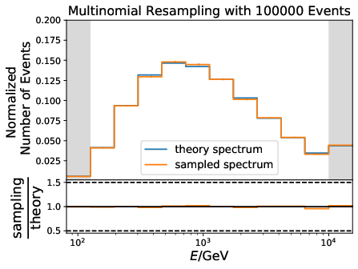

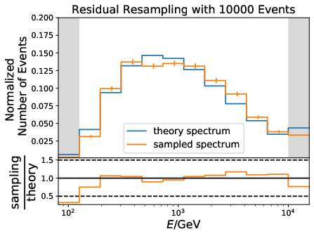

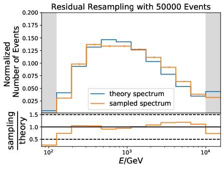

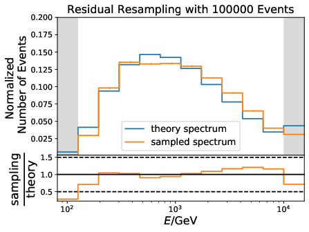

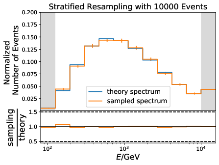

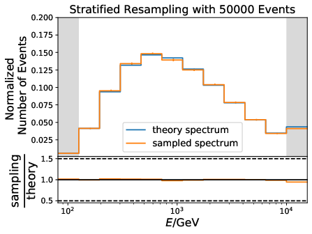

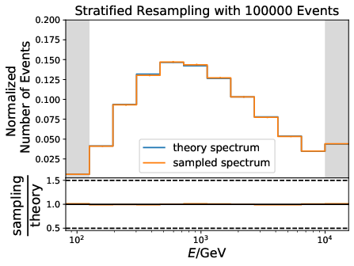

Variable Correlation
++++++++++++++++++++

Correlation to neutrino energy (MC Primary):

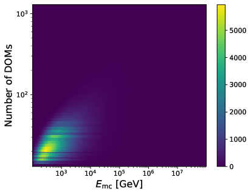

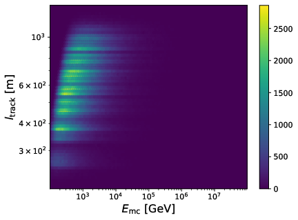

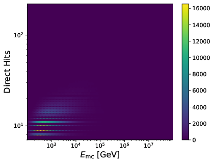

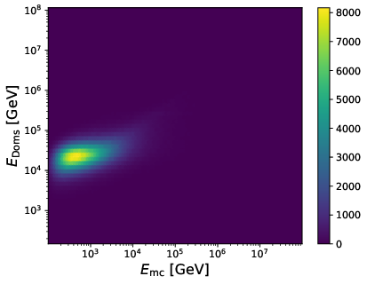

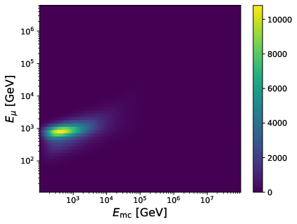

.. image:: images/corr_qtot_emc.png
	:width: 49%

Correlation of unfolding variables to one another:

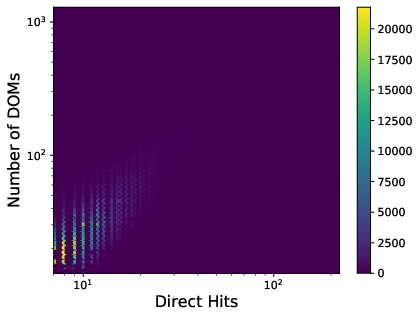

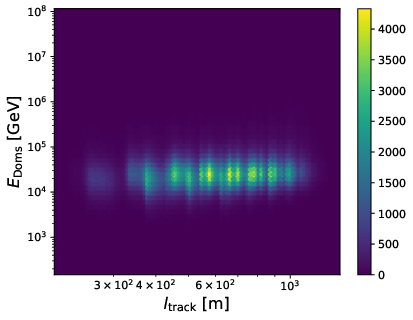

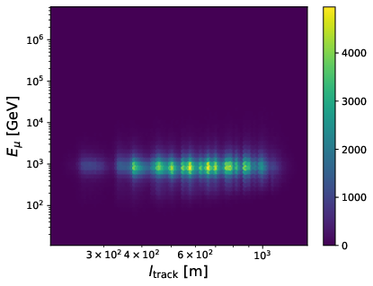

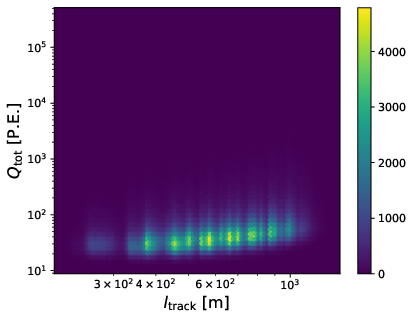

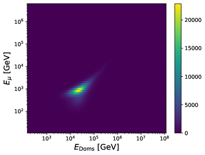

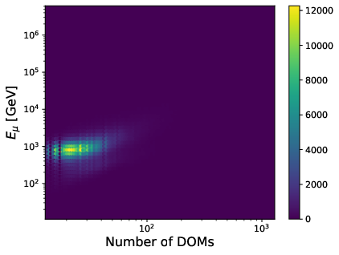

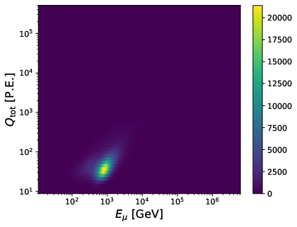

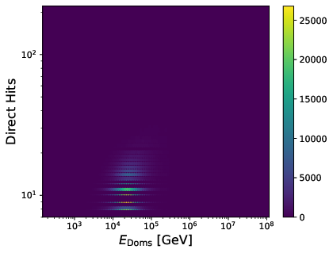

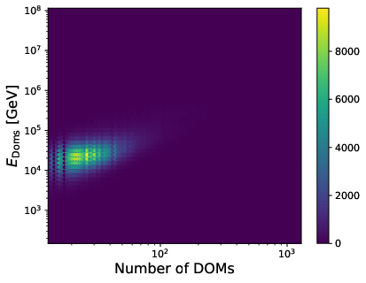

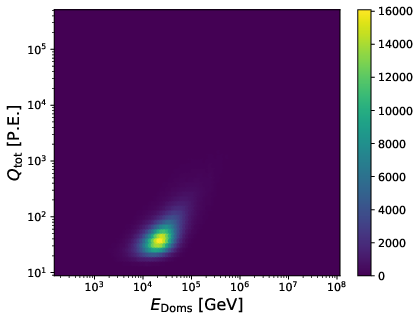

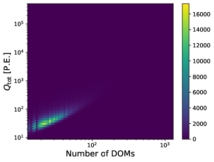

Parameter Optimization
++++++++++++++++++++++

Description of Variables:

- | **n_doms** (*L5_nch*):
  | Number of channels: DOMs detecting photoelectrons (P.E.) per event.

- | **MuEX** (*SplineMPEICMuEXDifferential*) [GeV]:
  | Reconstructed energy of the muon track based on its energy loss. Serves as a promising energy estimator above 1 TeV when the stochastic energy losses scale linearly with energy.

- | **Q_tot** (*SRTHVInIcePulses_Qtot*) [P.E.]:
  | The total deposited charge inside the detector during an event. Measured in number of photoelectrons.

- | **EtrunDoms** (*SplineMPEICTruncatedEnergySPICEMie_DOMS_Neutrino*) [GeV]
  | Truncated neutrino energy: Energy estimator of the neutrino based on the energy loss of the induced muon. The track is binned in a discrete manner. Each DOM along the track represents one bin. The ratio of the observed P.E. to the estimated P.E. with fixed energy loss is calculated for each bin. Bins with high energy losses are discarded and the mean is determined over the remaining bins. The *Bins* approach is analogous, but uses continuous bins of track segments along the muon path. Both algorithms lead to very similar results.

- | **l_track** (*L5_ldir_c*) [m]:
  | Track length of a muon: Projection of direct hits along a muon track within the time window C (-15ns < :math:`t` < 75ns)

- | **direct_hits** (*L5_ndir_c*)
  | Number of direct photons: unscattered photons by ice impurities within the time window C.

The parameter optimization on five energy-correlated variables on MC is displayed below. The MC generation spectrum is :math:`E^{-2}` and is resampled according to the `Honda2006 <https://arxiv.org/abs/astro-ph/0611418>`_ model.

Six classifiers are tested within DSEA at their default settings:

	.. image:: images/opt_e2_5var_classifiers_default.png
		:width: 49%

	.. image:: images/opt_e2_5var_classifiers_default2.png
		:width: 49%

	The best performing classifier (the Random Forest Classifier) is further investigated. To test if any Random Forest parameter does improve the unfolded result, four parameters are tested in detail. Since the Wasserstein Distance remains similar, and even increases for the maximum number of leaves nodes, the default Random Forest classifier is selected for unfolding at its default settings. These are shown in the table below. The following plots are not displayed here and will be updated shortly.

	.. image:: images/opt_e2_5var_rf_depth.png
	    :width: 49%

	.. image:: images/opt_e2_5var_rf_estimators.png
	    :width: 49%

	.. image:: images/opt_e2_5var_rf_features.png
	    :width: 49%

	.. image:: images/opt_e2_5var_rf_leafnodes.png
	    :width: 49%

	.. image:: images/opt_e2_5var_rf_mul_gridsearch.png
		:width: 49%

	.. image:: images/opt_e2_5var_rf_mul_gridsearch_extended.png
		:width: 49%

	.. image:: images/opt_e2_5var_rf_exp_gridsearch.png
		:width: 49%

	.. image:: images/opt_e2_5var_rf_expstartsize_gridsearch.png
		:width: 49%

	.. image:: images/opt_e2_5var_rf_leaves_gridsearch.png
		:width: 49%

	.. image:: images/opt_e2_5var_rf_tau_gridsearch.png
		:width: 49%

	.. image:: images/opt_e2_5var_rf_tau_gridsearch_ext.png
	  :width: 49%

	Test of optimized parameters with best variables (from `Variable Test Section <https://user-web.icecube.wisc.edu/~khymon/SeasonalVariationsUnfolding/docs/Pass1.html#variable-selection>`_):

	.. image:: images/opt_atm_3var_rf_depth.png
	    :width: 49%

	.. image:: images/opt_atm_3var_rf_features.png
	    :width: 49%

	.. image:: images/opt_atm_3var_rf_leafnodes.png
	    :width: 49%

	.. image:: images/opt_atm_3var_classifiers_default2.png
	    :width: 49%

	.. image:: images/opt_atm_3var_rf_mul_gridsearch.png
		:width: 49%

	.. image:: images/opt_atm_3var_rf_mul_gridsearch_extended.png
	    :width: 49%

	.. image:: images/opt_atm_3var_rf_exp_gridsearch.png
		:width: 49%

	.. image:: images/opt_atm_3var_rf_expstartsize_gridsearch.png
		:width: 49%

	.. image:: images/opt_atm_3var_rf_leaves_gridsearch.png
		:width: 49%

	.. image:: images/opt_atm_3var_rf_tau_gridsearch.png
		:width: 49%

	.. image:: images/opt_atm_3var_rf_tau_gridsearch_ext.png
		  :width: 49%

Variable Selection
++++++++++++++++++

Coverage Test:

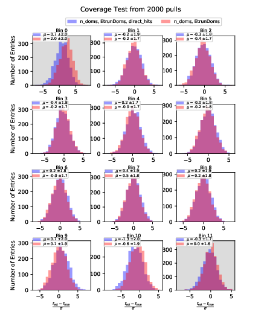

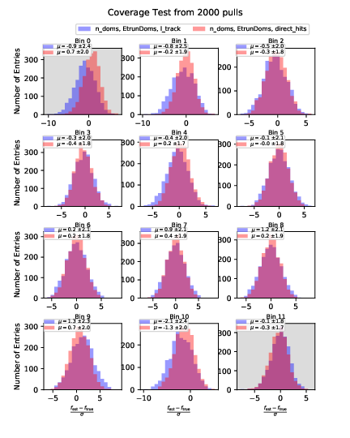

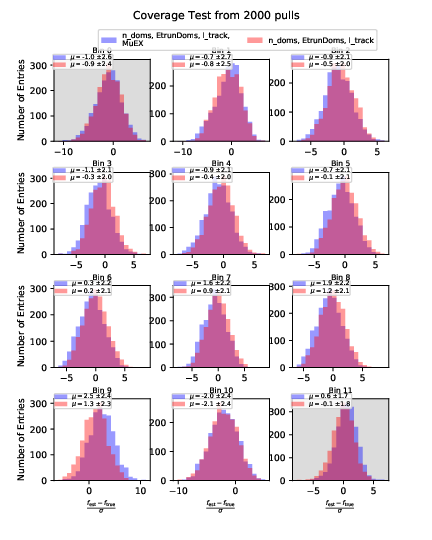

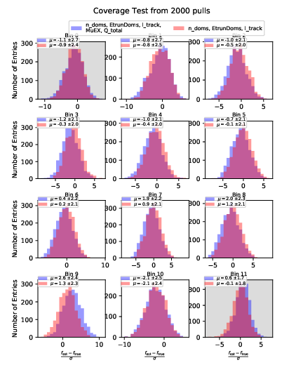

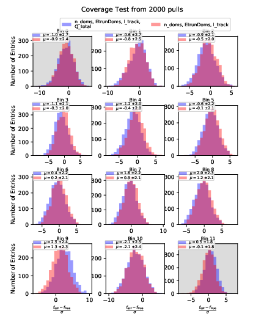

Bias Test:

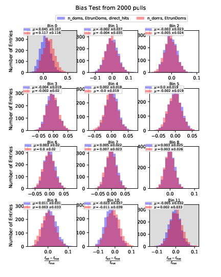

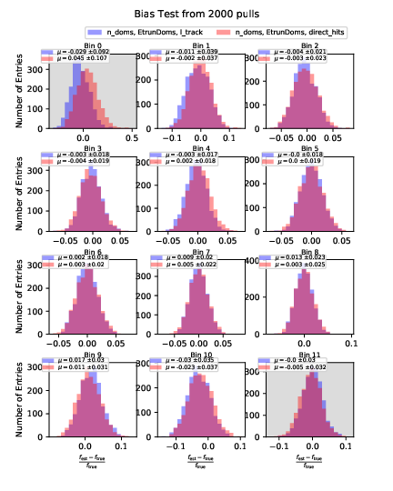

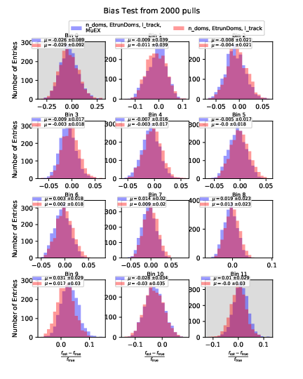

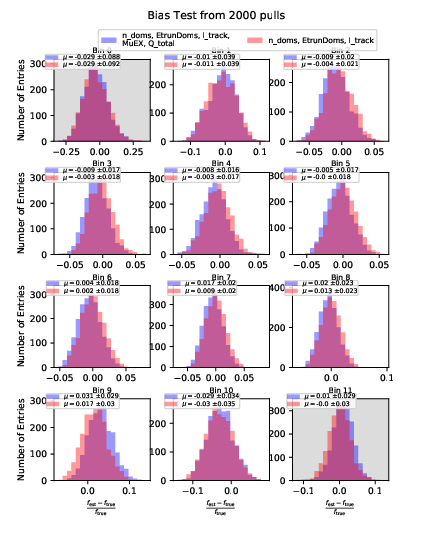

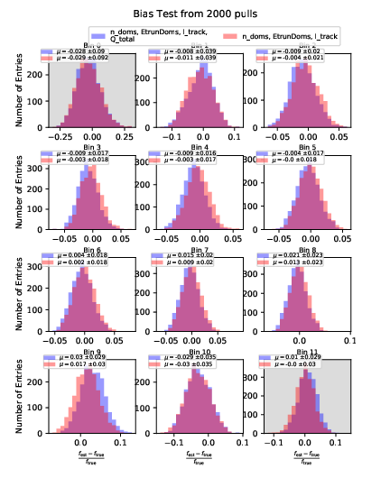

Summary:

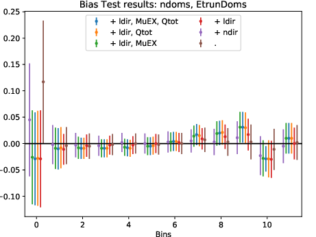

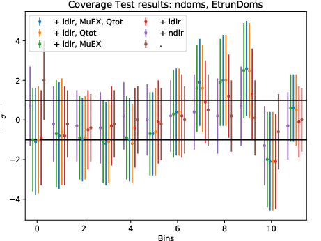

Systematic Uncertainties
++++++++++++++++++++++++

Bootstrap - Statistical uncertainty
-----------------------------------

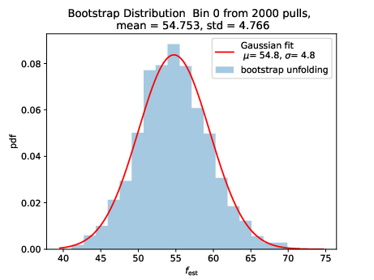

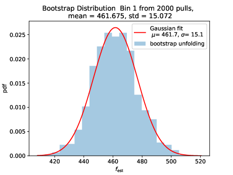

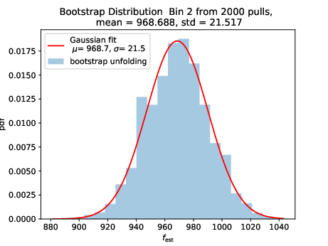

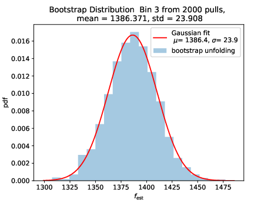

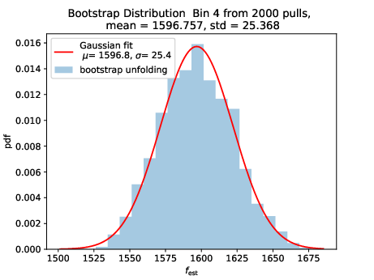

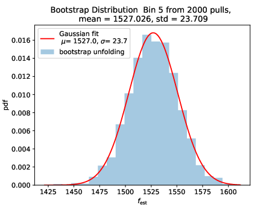

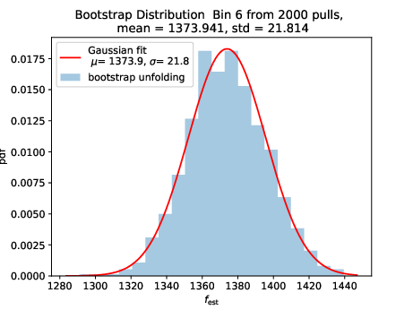

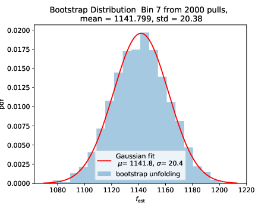

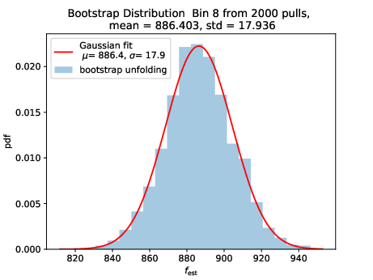

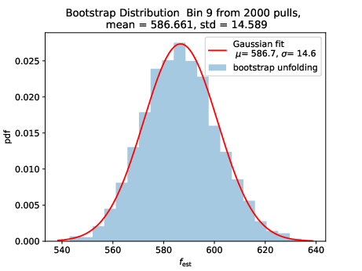

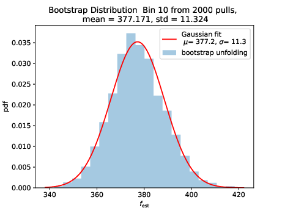

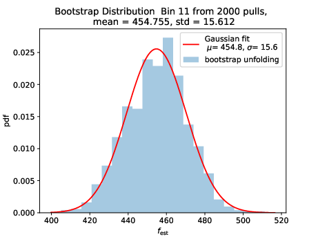

Systematic Uncertainty
----------------------

.. math::

  \sigma_{\mathrm{sys}} = \sqrt{\sigma^2_{\mathrm{DOM}} + \sigma^2_{\mathrm{abs}} +  \sigma^2_{\mathrm{scat}} + \sigma^2_{\mathrm{honda2006}}+\sigma^2_{\mathrm{flux}}}

These sources of uncertainty are considered:

 - DOM efficiency: NuGen simulation with varied DOM efficiency by +/- 10%.

 - Ice model: NuGen simulation using SpiceLea model (depth-dependence of absorption and scattering coefficient, anisotropies). The effect of        absorption is investigated by increasing the absorption coefficient by +10% and jointly decreasing both coefficients by -7%. The same procedure follows for the scattering coefficient.

 - flux model Honda2006: The simulated events are resampled to an atmospheric distribution for the training of DSEA and also to create pseudo-data m the systematic simulation sets. Since the `Honda2006 <https://arxiv.org/abs/astro-ph/0611418>`_ model, and therefore the weight calculation, is subject to uncertainties as well. Two new MC sets are created incorporating the uncertainties of the model in the weighting of the reference simulation. The sets respresent the upper and lower flux limits from the model so that the flux model uncertainties can be treated as the other sources of uncertainty (such as DOM efficiency and ice model parameters). The uncertainties of the flux model are displayed in Fig. 11 in the `paper <https://arxiv.org/abs/astro-ph/0611418>`_. They assume an uncertainty of +/- 14% at 100GeV and +/-25% at 1TeV. The uncertainty increases linearly in log(E) between these two reference energies. That is why the flux model uncertainty is interpolated linearly on a log-scale for the reweighed MC used to evaluate the flux model uncertainty in unfolding. The uncertainty is assumed to remain constant at around +/- 25% above 1 TeV. The uncertainty of the flux model accounts for uncertainty arising from the kaon and pion production in the hadronic interaction models, hadronic interaction cross section, atmospheric density profile. The statistical uncertainty of the flux model are not included because they are small compared to the other sources of uncertainty. The uncertainty arising from the neutrino flavor ratio and zenith angle dependencies are smaller and negligible compared to the other errors.

  .. figure:: images/honda_uncertainty_2006.PNG

 - neutrino flux (hadronic interaction and primary cosmic ray composition): The hadronic interactions and the primary cosmic ray compostion uncertainties are not considered in the Honda2006 model (exept cross secrion of the kaon and pion production). The effect of both sources of uncertainty is investigated in `in this paper <https://arxiv.org/pdf/1206.6710.pdf>`_. The uncertainty of the neutrino flux is displayed in Table 1. All primary models (cHGp, cHGm, ZS-PAMELA, poly-gonato and GH) an three hadronic models (sibyll-2.1, qgsjet01c, qgsjet-II) are included. The uncertainties are interpolated linearly on a log-scale in energy between 0.1 TeV and 10TeV in the same manner as for the Honda200 uncertainty.
 The uncertainty calculations are slightly more conservative as predicted by `Barr <https://journals.aps.org/prd/pdf/10.1103/PhysRevD.74.094009>`_. Hence, the uncertainties might be slightly overestimated. However, they will shrink on the complete data set because they are estimated in a bootstrap approach.

.. figure:: images/cr_uncertainty.png

Unfolded seasonal spectra with the corresponding uncertainties:

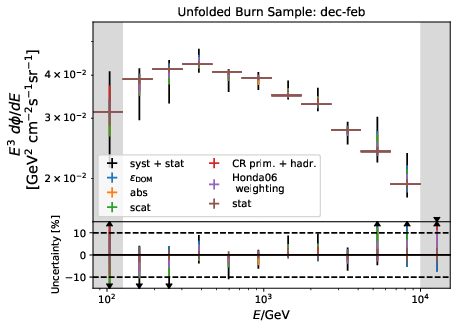

.. image:: images/errorbar_newbns10yr_bns_jun-aug_sys.png
	:width: 49%

Systematic Tests
++++++++++++++++

Impact of Input Spectrum
------------------------

The training set for unfolding should be very similar to the data set. Therefore, the MC set is resampled to an atmospheric distribution before it is fed into DSEA for training. However, the data can deviate from any flux model since the exact parameters are still unknown. The unfolding algorithm should hence lead to similar results, independent of small changes in the input spectrum. Otherwise the unfolding algorithm would produce model-dependent results. For this test, 100 000 events from the hold-out set (MC folders 00, 10 and 11) are resampled to an atmospheric distribution and unfolded. Different training sets are used: the first consists of 100 000 events from the original MC, the second contains 100 000 resampled events for the atmospheric distribution (Honda2006 model). The other inputs are resampled with the MCEq flux weights (models: primary composition - Gaisser H3a, hadronic interaction - SIBYLL2.3c, atmosphere: NRLMSISE00). The hold-out set is unfolded via the bootstrap approach described below. The statistical uncertainties are marked as light bands.

As expected, the Honda 2006 input leads to the best expectation with a deviation of maximum 5%, as well as the unfolding trained on MCEq.
Unfolding the :math:`E^{-2}` MC sample does not work well since the training input resambles an amtmospheric spectrum. This behavior is as expected.

Sampling Tests
--------------

During the review process, mistakes in the sampling procedure have been found. The MC set was sampled to match the HAKKM15 (Honda15) and MCEq flux predictions. As documented in the Q&A section, the unfolded results of the input spectrum test was very similar to the :math:`E^{-2}` result (see left plot below). The right plot below shows the sampled MC true energies for the different models. The sampling for Honda2015 and MCEq are, contrarily to expectation, compatible in the histogram.

Possible reasons for the incorrect sampling have been investigated. A crosscheck on atmospheric sampling has shown that the weights calculated by NewNuFlux (Honda 2006) are calculated correctly. The plot below show the true sampled energies according to Honda2006 with acceptance correction. The sampled distribution is compatible with the flux model. The number of events is equivalent to the size of the burnsample scaled up by a factor of ten to match the size of the estimated complete data set.

The weights for MCEq and Honda15 have been calculated in the following way since these models were not implemented as the time the code was developed: The flux tables have been read for given energy and zenith bands. The corresponding flux has been assigned binwise by zenith and energy. This results in few problems. True zenith and reconstructed zenith from SplineMPE can differ, but only flux tables for zenith between 90° and 120° have been loaded. These few events got a calculated flux of 0. Same applies for events with energy above 10TeV, since the Honda2015 flux is only given up to this energy. Hence, many events in the MC got a flux, and a weight, of 0. Another aspect is the binning that is introduced by the search through the flux tables so that the flux is not calculated accurately. This issue can be fixed with spline interpolation. These spline fits are already available for the diffuse fit analysis by Erik Ganster and Richard Naab. The weighting of MCEq is now comparable to the Honda2006 atmospheric weighting. The following plot shows the sampled energies for NewNuFlux and MCEq. MCEq fluxes have been generating using the following models: primary composition - Gaisser H3a, hadronic interaction - SIBYLL2.3c, atmosphere: NRLMSISE00.

Impact of Prior
---------------

The impact of a prior estimate on the unfolded result is investigated as a systematic check. A uniform prior between 1 GeV and 1 TeV is selected as a difficult prior, which should not match the target distribution. Ideally, the impact of the prior should disappear latest after a few iterations. The unfolding should be independent on prior assumptions to avoid any model dependence of the result.
The training set contains 100 000 events, the test set 100 000 events randomly drawn from the hold-out set (resampled to an atmospheric distribution). The test set is unfolded 2 000 times and the Wasserstein Distance to the MC truth is displayed below.

.. image:: images/atm_3var_prior.png

The prior impacts the result of the first iteration leading to a large Wasserstein Distance (bad approximation of the distribution). The Wasserstein Distance converges from iteration 2 on. The prior has no impact on the final spectrum estimation.

Confusion Matrices
++++++++++++++++++

Confusion matrices of random forest with seven iterations of DSEA.

Effective Area
++++++++++++++
.. image :: images/Aeff.png

Might show wrong units on axis! However, correctly transformed in spectrum plots.

Bin-to-bin correlation
++++++++++++++++++++++

see `here <https://user-web.icecube.wisc.edu/~khymon/SeasonalVariationsUnfolding/docs/QA.html#questions-on-pass1-mc>_`

Unfolding Results from Burn Sample
++++++++++++++++++++++++++++++++++

Each of the unfolded spectra is plotted with the corresponding systematic and statistical uncertainties. As described in the Section about systematic uncertainties, additional sources of systematics would have to be considered when seasonal spectra are regarded standalone. The seasonal spectra cannot be distinguished due to the large systematic uncertainties that arise from the detector simulation and event reconstruction. Therefore, the unfolded seasonal flux is compared to the unfolded annual mean flux in the ratio plot below the spectra. This allows to discard uncertainties, despite of statistical fluctuations which arise from unfolding. Regarding the unfolded ratio for June to August compared to flux ratio of December to February the flux deviates from the annual mean flux. The variations increase with energy.

As a crosscheck two additional comparisons are made. Seasons which have similar temperature profiles should not show any seasonal variations and hence be compatible with the annual mean flux. This is illustrated below for the autumn and spring seasons (March-April and September-October). In addition to that, the unfolded flux for the seasons January to June and July to December is compared to the annual mean flux. Both seasons should be compatible with one another.

.. image:: images/newbns_e2_10yr_mar-apr_sep-oct_sys_90-120_ratio_cblind.png
    :width: 49%

In principle, it would be interesting to investigate seasonal variations for monthly data sets. However, this is not feasible on the limited number of events in the burn sample since the statistical uncertainties would increase tremendously since only very few events are sorted into the highest bins. This could be one possibility to investigate this effect further on the complete data set.

Full Data Set Estimation
++++++++++++++++++++++++

The result which one would obtain on the complete data sample is estimated in MC simulation. The number of events in each seasonal data set and the corresponding livetime is scaled by a factor of ten. The events are resampled to MCEq predictions, as explained `here <https://user-web.icecube.wisc.edu/~khymon/SeasonalVariationsUnfolding/docs/SystematicChecks.html#impact-of-input-spectrum>`_. The unfolded spectra and the corresponding uncertainty are displayed below. MC truths is shown additionally.

Comparison to Model Prediction with MCEq
++++++++++++++++++++++++++++++++++++++++

The different seasons for the primary model H3a:

.. image:: images/mceqfluxes_h3a_newbns_e3_10yr_jul-dec_sys_90-120_ratio_cblind.png
    :width: 49%

The unfolded flux is roughly 30% smaller than the MCEq fluxes. Given that MCEq does not contain any uncertainty estimate on the calculated flux, the comparison to the Honda2006 model shows that the unfolded spectrum is in agreement with the respective uncertainties. The ratios of the seasonal fluxes to the whole-year average agree quite well regarding the large uncertainties. The unfolded results are unreliable in the first bins due to the small statistics. The MCEq prediction ensures that no seasonal variations are expected from March-April, September-October, January-June and July-December. Hence, the analysis of these seasons seems to be a reliable crosscheck of background. It has to be considered that neutrinos fluxes originating from cosmic rays interaction carry an uncertainty on the order of +/- 30% to 40% depending on the energy. Given that, the MCEq fluxes would be in agreement with the unfolded spectra and the Honda2006 flux model. The corresponding uncertainties can be found `in this paper <https://arxiv.org/pdf/1206.6710.pdf>`_.

The flux ratio seems to match for all models. This shows that the flux ratio is independent of the hadronic interaction model. Both predicted fluxes, the seasonal and the annual mean, change the slope in the same manner due to the hadronic interactions inside the atmosphere. The ratio between seasons remains the same for all models (hadronic and primary cosmic ray composition) since it is only affected by the atmospheric model. The other atmospheric models in MCEq do not respect temperature variations troughout the year and are hence not suitable to predict seasonal variations. Multiple versions of each of the four tested models are available in MCEq. The prediction of seasonal variations should be robust to uncertainties arising from hadronic interaction models. The ratio between the seasons allows to neglect all sources of systematic uncertainties which are not season-dependent. Is has to be denoted that the ratio is independent on the physical models, but are also subject to uncertainties of the given atmospheric model, which is not incorporated into MCEq.

Variation of primary composition and hadronic interaction models:

The following plots show the predicted MCEq fluxes scaled with :math:`E^{2}`.

Comparison to Data
++++++++++++++++++

The plot below shows the unfolded seasonal spectra in comparison to the `IC79 <https://link.springer.com/content/pdf/10.1140/epjc/s10052-017-5261-3.pdf>`_ and `ANTARES <https://arxiv.org/pdf/2101.12170.pdf>`_ unfolding.

Background Scrambling as an Estimation of Significance
+++++++++++++++++++++++++++++++++++++++++++++++++++++++

Even though a clear tendency towards an increased flux for the season from December to February is observable on the burn sample, it has to be ensured that this observation has not been caused randomly. To investigate the likelihood of observing the given deviation from the mean annual flux by chance, the following background scrambling method has been developed:

First a test statistic (TS) :math:`\tau = \sum_{i=1}^{10} \frac{flux_{\mathrm{season},i}}{flux_{\mathrm{year},i}} -1` is defined to measure the deviation of the seasonal deviation from the annual mean flux in energy bin 1-10. Here, the underflow and overflow bins are neglected since events in these bins are out of interest for the analysis. However, the definition of these is necessary to account for smearing in the unfolding process.

Scrambled data sets are created in the following manner. A value, either 0 (the respective season) or 1 (any other season), is randomly assigned to each run. The fraction of both values is given by a weight that compares the livetime of the respective season divided by the livetime of the complete data set (here: burn sample), hence the livetime fraction of the season compared to the complete all season data set. The so-called scrambled data set, corresponding to all events labelled with 0, is unfolded. This procedure is repeated over 10 000 trials and the test statistic value of each one is calculated. The seasonal livetime weight ensures that a season contains on average a fraction of events similar to the real data set. Statistical uncertainties are not yet included in this test.

The distributions of the test statistic are displayed below. The p value and the corresponding significance of the unfolded result can be obtained by counting the more extreme values of the test statistic than the test statistic value obtained from the burn sample result (p value for data - black in figures below). 10 000 background trials, however, do not lead to an accurate p value which is desirably very small for a significant result. Hence, the p value can be obtained from a Gaussian distribution by the integration of the distribution's tail. As illustrated below, the test statistic distributions are fitted with a Gaussian function. The p value from the gaussian distribution is calculated by integrating the distribution tail above/below the ciritcal test statistic value :math:`\tau_{crit}`. Since this is a one-sided p value, the right tail is integrated if :math:`\tau_{crit}>0` and the left one if :math:`\tau_{crit}<0`. This assumption is valid since the test statistic is centered around 0. This is expected for a random scrambling which shouldn't show any seasonal dependence.

Cross check: Seasons that shouldn't show variations:

.. list-table:: Significances Burn Sample per Season
   :widths: 24 25 25 25
   :header-rows: 1

   * - Season
     - TS (:math:`\tau_{crit}`)
     - p value
     - Significance
   * - Dec-Feb
     - 0.205
     - 0.00407
     - 2.9 :math:`\sigma`
   * - Jun-Aug
     - -0.368
     - 0.00008
     - 3.9 :math:`\sigma`
   * - Mar-Apr
     - 0.004
     - 0.34482
     - 0.9 :math:`\sigma`
   * - Sep-Oct
     - 0.147
     - 0.04228
     - 2.0 :math:`\sigma`
   * - Jan-Jun
     - -0.07
     - 0.30749
     - 1.0 :math:`\sigma`
   * - Jul-Dec
     - -0.021
     - 0.67716
     - 0.4 :math:`\sigma`

Old (false) Background Scrambling
---------------------------------

**NOTE:** **The following section displays the old background scrambling with bugs. The splitting test (compare Q&A) showed that some events outside of the range from January 2011 to December 2020 are present in the data set from which was scrambled. This distorted the scrambling and the test statistic was not centered around 0. The bug does not affect data unfolding or livetime calculation. This part is kept on the wiki for complete documentation of the analysis and its review**

Cross check: Seasons without variations should not be significant.

The obtained p value is already close to the one obtained from the Gaussian distribution.
The test statistic distribution is not centered around :math:`\tau_{crit}=0`. Therefore, the significance is larger towards negative TS values, which is corresponding to a lower flux than the average yeraly neutrino flux. This artifact might be attributed to the burn sample and its resulting limited statistics. Based on the atmospheric model used in MCEq (see section below and Q&A), the variations per season/months are expected to be symmetric. This effect was, however, never been measured energy-dependently so that the final investigation of the discrepancy of the test statistic can only be conducted on the complete data sample.

Despite that, the background scrambling test finds promising results for the burn sample unfolding for the seasons December-February and June-August. However, the significance for some seasons, such as September-October, is larger than expected. This is on the one hand caused by the uncentered test statistic, and on the other hand by the lack of statistical uncertainties in the calculation. The statistical uncertainties of the burn sample unfolding are of the order of few per cent so that the variations are smaller than the uncertainties especially in the low energ bins. Since the statistical uncertainties are expectd to become very small on the complete data set (see plot in previous section), this discrepancy is expected to vanish on the complete sample. An option to determine correct trustworthy significances for the burn sample would be considering the statistical uncertainty in the test statistic calculation. Calculating the uncertainty via bootstrap as it is done for the unfolding would be too time consuming. Each of the scrambled data sets would have to be unfolded at least 100 to 1000 times and averaged in order to gain meaningful uncertainty estimates. A first test could include the statistical uncertainty of the burn sample unfolding. The test statistic could be scaled according to the uncertainty in each bin. Since the uncertainties depend on the number of events in the data set, which remains roughly equal due to the livetime ratio of a given season to the complete data sample, the uncertainties are expected to remain roughly the samw. This test is illustrated in the next section. An overview of the TS and significances is given below including the p values calculated from the Gaussian fit.

Tests on Background Scrambling
------------------------------

The test statistic is adapted in the following section:

1. To take the statistical uncertainty into account, the test statistic is divided by the statistical uncertainty in each bin: :math:`\tau = \sum_{i=1}^{10} \frac{ratio_i -1}{\sigma_i}`. The statistical uncertainty of the burn sample unfolding is taken in each trial to calculate the test statistic of the unfolded scrambled data set.

The TS cannot be centered around zero when the deviation per bin is scaled by the statistical uncertainty and the mean shifts for each season respectively.  Overall, this test statistic yields similar results as the unscaled TS.

2. To test whether the scrambling is dependent on the livetime ratio to the complete year, the livetime is given as a fraction to the complete year. The livetime is set to :math:`\frac{1}{4}` for the seasons December-February and June-August. As shown below, the test statistic distribution is unaffected from the livetime.

The livetime ratio of Dec-Feb to the complete year is 0.23. Hence the approximation of using a livetime ratio of months/12 is valid approximately. The TS shifts slightly towards negative values for Dec-Feb according to the small deviation in livetime ratio. However, this would be suitable for a rough test.

3. The TS investigated further by redefining the TS to certain bins. If the deviation from TS=0 would increase for each energy bin, there would be systematics in the calculation of the TS. If not, the shift is likely being attributed to data. A livetime ratio for Dec-Feb of 0.23 is assumed and TS is calculated as mentioned in 1.

Summary plot for TS per bin:

No systematic behavior is observable in the TS for each bin.

In summary, the test statistic shows some artifacts which are attributed to the limited statistics of the burn sample. Basically each run can be selected over the 10 year time span. However, the burn sample contains only runs that end with 0. The fact that basically any run ID could occur in the sampling might cause the shifted TS. The same applies to the statistical uncertainties which are not respected in the TS calculation. The uncertainties are smaller for the 6-months samples, which results into more smaller significanes as for March and April  and September and October. Hence, the final significance caluclation can only be conducted on the complete data set to exclude all sources of possible biases.
