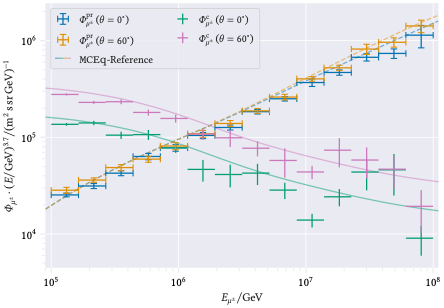
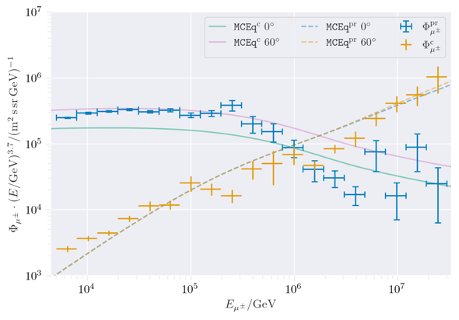

Definitions of the prompt component 
###################################

This work is based on the Master thesis of Ludwig Neste, which can be provided on request. 

Whether a muon is prompt or not can be defined in different ways. The definition we choose is mentioned in the final definition.
Furthermore, we have comparison between CORSIKA and MCEq for other possible prompt definitions.

Final definition 
++++++++++++++++

* Prompt muon: parent is not pion or kaon 

A comparison between CORSIKA standalone and MCEq is shown:

A comparison between CORSIKA in icetray step 0 and MCEq is shown:

Other definitions 
+++++++++++++++++