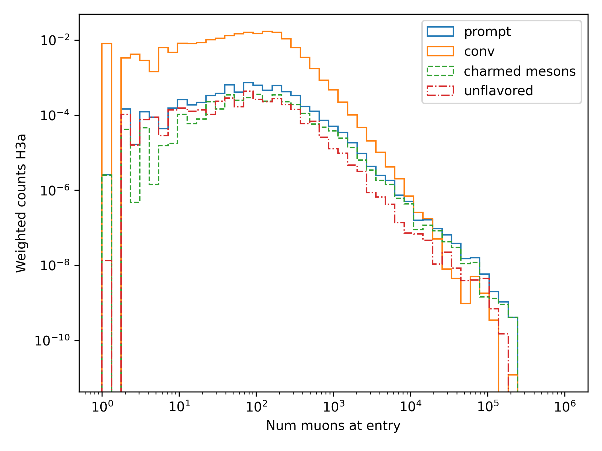
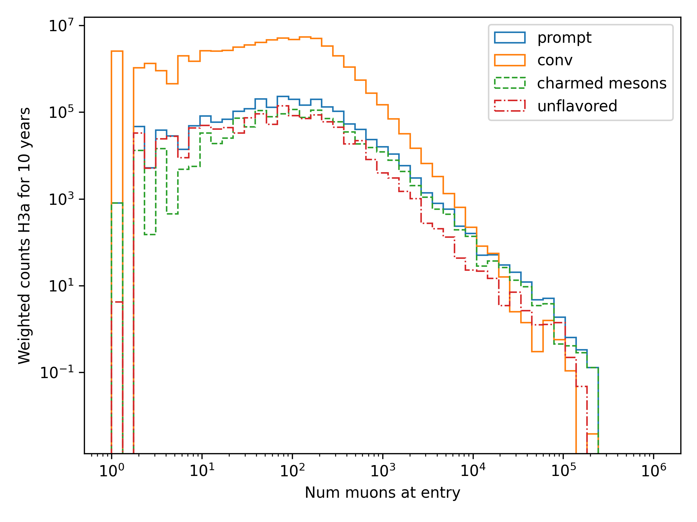
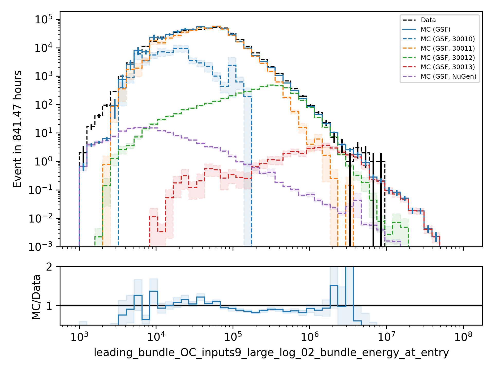
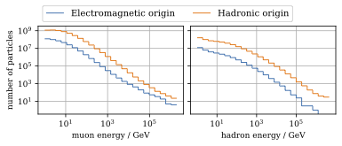
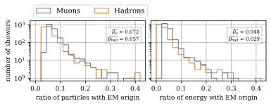

Q & A
#####

In this section, a collection of all questions and answers from the presentations is given. The presentations are listed :ref:`here <main paragraph>`.

September 25, 2024
==================

`Q (Tianlu): Why do you correct for the z-position if it is not important in your analysis? How can you ensure that the mismatch in z does not impact your phyiscs analysis? So the prompt component?`

A: I don't use the z-vertex as an analysis variable, hence it should not affect my analysis. I have also shown,
that correcting the z-distribution does not affect the energy reconstruction. The cos-zenith distribution is also
not much affected, maybe there is even a small improvement. Currently, I don't correct the z-distribution in my analysis, but I checked if I could correct it and I wanted to check, if there is any impact of this correction.

`Q: (Agnieszka): The unfolding starts at 10 TeV, how can you be sure that at these energies you don't have any impact from muon bundles?`

A: For the forward fit, I am interested in the prompt component. Since this component is not dominating at a leadingness of 1, I have never selected leading muons. For the unfolding, we are using a neural network 
to reconstruct the leading muon energy. Of course, if the leading muon is entering the detector with a 
high energy muon bundle, the reconstruction is difficult, but this smearing is considered in the unfolding.

`Q (Jakob): Have you tried to fit the systematics to fix the z-mismatch?`

A: Not yet. 

March 18, 2024
==============

`Q (Jakob): Do you want to do your analysis in different zenith bins?` 

A: At the moment we do not have enough MC statistics to do the analysis in different zenith bins. But 
with more statistics we will test this.

----

`Q (Jakob): Do you include zenith in your pseudo analysis?` 

A: In the plots shown in this presentation, we do not include zenith since the results are pretty similar. 
For the future analysis with more MC statistics we will check again, if we are more sensitive to prompt for 
including zenith.

----

`Q (Claudio): You plan to do a foward folding fit with NNMFit. Why do you also want to unfold a muon spectrum?` 

A: With a foward folding fit we can test a specific model. In our case this is the latest CORSIKA 77500, 
SIBYLL 2.3d, latest icetray etc. Hence, we do the fit under the assumption of these specific models. This 
has the advantage, that these models can be tested and iteratively improved. An unfolding is model independent. 
This means, that we get the inclusive muon flux at the surface. This should not change with the model. 
It can then be used for example by theorists to update and improve their models. Both are important measurements
that need to be done.

----

`Q (Claudio): Does your reconstruction have any overlap with the ones of Alina?`

A: No, she is interested in the neutrinos, I am interested in the muons. But we do have an overlap in the 
simulation part, since we both use CORSIKA ehist for the high energy region. 

----

`Q (Lu): How do you treat unflavoured mesons?`

A: We treat them as prompt. Muons arising from pions and kaons are treated as conventional, all the others 
as prompt.

----

`Q (Lu): I am not sure how meaningful it is for particle experiments to merge unflavoured and forward D.` 

A: The energy distribution looks similar up to ~30 PeV (see Figure :numref:`mceq_flux`). I assume we are not able to fit 
charmed and unflavoured separately.

----

`Q (Lu): Do to different physics between unflavoured and forward D there could be a difference in the multiplicity. Can you check that?`

A: Figure :numref:`multiplicity_charmed_vs_unflavored` shows the multiplicity of charmed and unflavoured mesons as a rate. 
Figure :numref:`multiplicity_charmed_vs_unflavored_10_years` shows the multiplicity of charmed and unflavoured mesons for 10 years. 
The shape of charmed an unflavoured mesons is similar. In the forward fit, we can try to fit them separately, but regarding the low statistics at 
higher energies, I don't expect a significant result. The classification of the particles is shown in the table :numref:`particle_categories`.

.. _multiplicity_charmed_vs_unflavored:

    : The multiplicity of charmed and unflavoured mesons is shown as a rate.

.. _multiplicity_charmed_vs_unflavored_10_years:

    : The multiplicity of charmed and unflavoured mesons is shown for the expeceted events for 10 years.

.. _particle_categories:
.. list-table:: Particle Categories
   :widths: 25 25 25
   :header-rows: 1

   * - Conventional
     - Charmed
     - Unflavored
   * - pi+
     - D+
     - rho(770)0
   * - K+
     - D*(2010)+
     - eta
   * - K(L)0
     - D0
     - omega(782)
   * - K(S)0
     - D*(2007)0
     - phi(1020)
   * - mu-
     - D(s)+
     - J/psi(1S)
   * - 
     - D(s)*+
     - p
   * - 
     - 
     - Sigma(c)(2455)0
   * - 
     - 
     - Lambda(c)+
   * - 
     - 
     - Xi(c)0
   * - 
     - 
     - Sigma(c)(2455)+
   * - 
     - 
     - Sigma(c)(2455)++
   * - 
     - 
     - Xi(c)+
 
----

`Q (Lu): What atmospheric uncertainties do you include?`

A: We will do our analysis for all common cosmic ray primary models, Gaisser H3a, H4a and Global Spline Fit. Since the simulation 
is pretty expensive, we rely on one hadronic interaction model, which will be SIBYLL 2.3d.

----

March 1, 2024
=============

`Q (Frank): For the angular resolution, you can show a histogram of the angular difference between the true and the reconstructed direction.` 

A: TODO 

----

`Q (Dave): The lateral distribution between unflavoured, charmed and conventianal should be different. Can you use machine learning to distinguish between them?` 

A: On the one hand, this is a stochastic process. Hence, the distributions overlap. On the other hand, the lateral distributions are on the order of :math:`1 \mathrm{m}`. 
Using the current IceCube geometry, we can not resolve this. 

----

`Q (Dave): Can you reconstruct the multiplicity with your neural networks? It would be very interesting if we can select a single muon (neutrino induced muon) from 
muon bundle.` 

A: So far, we don't need the multiplicity for our analysis. Hence, we didn't improve this reconstruction, but at the beginning I just trained one model 
to predict the multiplicity. The results are shown in Figure :numref:`DeepLearningReco_precut_bundle_energy_multi_OC_6ms_01_vs_MCLabelsLeadingMuons_num_muons_at_entry` 
and following. Of course, we can test the multiplicity prediction for a neutrino dataset.

---- 

`Q (Dave): Can you train a network to detect/select prompt mouns?`

A: This is not what we want to do. But you could for example train a network on CORSIKA simulations including prompt and on CORSIKA simulations without prompt, this 
depends on the hadronic interaction model. Since the entire shower profile is pretty similar, it is hard to distinguish between prompt and conventional muons. We for 
example also used the dynstack method to scale the prompt component up and down to test, whether the showers change to validate, that we can introduce our 
scaling parameter for the prompt component.

----

`Q (Serap): You showed the network performances for the usual time window cleaning of 6000 ns and for the pulses without any cleaning. The results without cleaning seem to 
be better. Do you have an idea why this is the case?`

A: The 6000 ns time window cleaning analyzes the weighted charge and chooses the time window with the most charged included. On the one hand, this removes successfully 
the after pulses, on the other hand it also removes the first pulses that arrive at the DOM. But these first pulses definitely include information about the 
direction and maybe also about the highest energetic muon - the leading muon. This is why the results without cleaning are better.

----

October 21, 2023
================

`Q (Dave): How do you want to identify a prompt muon?`

A: We do not want do identify a prompt muon. We want to measure the normalization of the prompt component. 

----

`Q (Frank): Is 20 % offset between MCEq and CORSIKA an issue?` 

A: These are two completely different approaches. There is no true or correct result. (see section `Definitions of the prompt component`)

----

`Q (Spencer): How does the cos(theta) distribution behaves in comparison with the results of Patrick Berghaus?`

A: There are similar issues. Overshoots above 0.5 and undershoots around 0.3.

----

`Q (Anatoli): Do you set a fixed conventional normalization in your pseudo analysis? If not, to which value do you fit it?`

A: No, it is not fixed. In the pseudo analysis we fit it to 0.998.

----

`Q (Shigeru): What happens, if you use single muons?`

A: For the pseudo analysis, we use the reconstructed bundle energy at entry to fit the normalization of the prompt and conventional muon flux. Here, we do not select 
muons with a special leadingness. This follows from :numref:`leading_bundle_energy_fraction`, which shows that a high leadingness does not increase the sensitivity do detect prompt 
muons. Apart from that, a single muon does not appear at high energies, there you only have muon bundles. If we select muons with a high leadingness, often referred to as 
single muons, we would lose statistics and the analysis would be less sensitive.

----

`Q (Spencer): Regarding the zenith-problem: Maybe you can estimate the impact of the magnetic field of the earth on high energy muons. Could this help to solve the problem?` 

A: 

The radius of curvature :math:`R` of a charged particle moving perpendicular to a magnetic field is given by the balance between the Lorentz force and the centripetal force:

.. math::
   
   q\,v\,B = \frac{p\,v}{R} \quad \Longrightarrow \quad R = \frac{p}{qB} \,,

where
   - :math:`p` is the momentum,
   - :math:`q` is the charge,
   - :math:`B` is the magnetic field strength.

For a highly relativistic muon, the momentum can be approximated by

.. math::
   
   p \approx \frac{E}{c} \,,

with :math:`E` the energy and :math:`c` the speed of light.

Below are the calculations for both a 1 PeV muon and a 1 TeV muon.

**Calculation for a 1 PeV Muon**

**Step 1. Convert the Muon Energy to SI Units**

A muon with 1 PeV energy has

.. math::
   
   E = 1\,\mathrm{PeV} = 1 \times 10^{15}\,\mathrm{eV} \,.

Using

.. math::
   
   1\,\mathrm{eV} = 1.602 \times 10^{-19}\,\mathrm{J} \,,

we obtain

.. math::
   
   E = 1 \times 10^{15} \times 1.602 \times 10^{-19}\,\mathrm{J}
     = 1.602 \times 10^{-4}\,\mathrm{J} \,.

**Step 2. Calculate the Momentum**

For an ultra-relativistic muon,

.. math::
   
   p \approx \frac{E}{c} \,,

with :math:`c = 3.00 \times 10^{8}\,\mathrm{m/s}`, so

.. math::
   
   p \approx \frac{1.602 \times 10^{-4}\,\mathrm{J}}{3.00 \times 10^{8}\,\mathrm{m/s}}
     \approx 5.34 \times 10^{-13}\,\mathrm{kg\,m/s} \,.

**Step 3. Calculate the Radius of Curvature**

The muon’s charge is

.. math::
   
   q = 1.602 \times 10^{-19}\,\mathrm{C} \,,

and a typical Earth magnetic field is about

.. math::
   
   B \approx 5.0 \times 10^{-5}\,\mathrm{T} \,.

Substitute these values into

.. math::
   
   R = \frac{p}{qB} \,:

.. math::
   
   R = \frac{5.34 \times 10^{-13}\,\mathrm{kg\,m/s}}
         {(1.602 \times 10^{-19}\,\mathrm{C})(5.0 \times 10^{-5}\,\mathrm{T})}
     \approx 6.67 \times 10^{10}\,\mathrm{m} \,.

This radius of curvature (~67 million kilometers) is extremely large, implying that over any typical experimental or atmospheric distance the deflection of a 1 PeV muon by the Earth's magnetic field is negligible.

**Calculation for a 1 TeV Muon**

**Step 1. Convert the Muon Energy to SI Units**

A muon with 1 TeV energy has

.. math::
   
   E = 1\,\mathrm{TeV} = 1 \times 10^{12}\,\mathrm{eV} \,,

so

.. math::
   
   E = 1 \times 10^{12} \times 1.602 \times 10^{-19}\,\mathrm{J}
     = 1.602 \times 10^{-7}\,\mathrm{J} \,.

**Step 2. Calculate the Momentum**

Again, using

.. math::
   
   p \approx \frac{E}{c} \,,

with :math:`c = 3.00 \times 10^{8}\,\mathrm{m/s}`, we have

.. math::
   
   p \approx \frac{1.602 \times 10^{-7}\,\mathrm{J}}{3.00 \times 10^{8}\,\mathrm{m/s}}
     \approx 5.34 \times 10^{-16}\,\mathrm{kg\,m/s} \,.

**Step 3. Calculate the Radius of Curvature**

Using the same charge and magnetic field:

.. math::
   
   q = 1.602 \times 10^{-19}\,\mathrm{C} \,,
   
.. math::
   
   B \approx 5.0 \times 10^{-5}\,\mathrm{T} \,,

the radius is

.. math::
   
   R = \frac{p}{qB}
     = \frac{5.34 \times 10^{-16}\,\mathrm{kg\,m/s}}
            {(1.602 \times 10^{-19}\,\mathrm{C})(5.0 \times 10^{-5}\,\mathrm{T})}
     \approx 6.67 \times 10^{7}\,\mathrm{m} \,.

This gives a radius of curvature of roughly :math:`6.67 \times 10^{7}\,\mathrm{m}` (or about 66,700 kilometers). Although this is smaller than the 1 PeV case by a factor of 1000, it is still extremely large compared to typical distances encountered in experiments or in the atmosphere.

Interpretation

In both cases, the large radius of curvature means that the deflection of the muon due to the Earth’s magnetic field is negligible over the scales of most experiments. For a 1 PeV muon the radius is on the order of :math:`10^{10}\,\mathrm{m}`, and for a 1 TeV muon it is on the order of :math:`10^{7}\,\mathrm{m}`.

----

`Q (Spencer): How large are the uncertainties on the conventional component (pion/kaon production)?` 

A: TODO

----

`Q (Spencer): How large is the background that we expect (astrophysical neutrinos, atmospheric neutrinos)? If we are able to distinguish between a single muon 
and a muon bundle, we can remove neutrino induced background muons.`

A: To estimate the neutrino background, the bundle energy at entry is shown in :numref:`neutrino_background_bundle_energy_at_entry`. The NuGen background includes both atmospheric
and astrophysical neutrinos. At the highest energies of :math:`10 \mathrm{PeV}`, it's on the order of a few percent. It decreases to 
below :math:`1 \mathrm{%}` at lower energies. 
Regarding the distinction between single muons and muon bundles, I made some very preliminary studies. It seems to be quite promising, but it 
definitely needs more investigation. Since I used some assumptions, uploading the plots might be confusing. I can provide some plots upon request.

.. _neutrino_background_bundle_energy_at_entry:

    : Bundle energy at entry is shown to estimate the neutrion background. The NuGen background in purple includes both atmospheric 
    and astrophysical neutrinos. The atmospheric 
    neutrinos are estimated using MCEq and GaisserH3a. The astrophysical neutrinos are calculated with :math:`\gamma = 2.6` with a 
    normalization of :math:`n = 1.5`. 

----

September 29, 2023
==================

`Q (?): In the simulation you remove the electromagnetic shower component. Thus, you also remove some muons. How large is the impact of this to your analysis?``

A: We used CORSIKA 8 to estimate the impact of the electromagnetic shower component on the produced muons. For a 500 PeV proton shower, the total amount of 
muon-energy per shower is about 4.8 %. 
For the large-scale simulation 
we will simulate the EM component, if the simulation of the EM component is feasible. This impact was investigated by Jean-Marco and is shown in 
:numref:`energy_distribution` and :numref:`num_and_energy_ratio`.

.. _energy_distribution:

    : CORSIKA 8 was used to simulate 500 PeV proton showers to estimate the impact of the electromagnetic shower component. 

.. _num_and_energy_ratio:

    : The ratio of the number of muons and the energy of the muons is shown for 500 PeV proton showers. On average, 4.8 % of the energy is carried by muons originating 
    from the electromagnetic shower component.

----

`Q (?): Your prompt definition is: parent is not pion or kaon. The definiton in MCEq divides prompt and conventional by a minimum decay length of 0.123 cm. Is there a difference?`

A: The “lifetime” definition is similar, as it includes every particle with a lifetime which is greater than ten times the lifetime of the D0 as conventional and the rest as 
prompt. This is the definition of prompt used inside MCEq, and the lifetime limit corresponds to a decay length of approximately 1.2 cm. Considering all particles in CORSIKA7, 
these are the photon, electron, muon and neutrino from the fundamental particles. Of these none can decay into a muon. But in CORSIKA, a muon can be listed as 
the parent of a muon. These would then be considered to belong to the conventional component. The hadrons below the lifetime limit are pion, K±, KL, KS, which are exactly the pion 
and kaons from the pion-kaon definition. The Baryons below the lifetime limit are 𝑝, 𝑛, 𝛬, 𝛴±, 𝛯0, 𝛯±, of these only the proton and the neutron can not decay into a muon. 
These baryons and the muon is the only difference compared to the pion-kaon definition of prompt. These particles do not seem to contribute much to the flux, as both of the 
definitions produce nearly identical results, see section `Definitions of the prompt component`.

----

`Q (Agnieszka): How do you plan to reconstruct the leading muon energy?`

A: For the reconstruction of the leading muon energy, we use a convolutional neural network. Further details can be found in the `Reconstructions` section of this wiki.

----

`Q (Jakob): In your pseudo analysis you used a poisson likelihood. Do you want to add limited statistics to your likelihood?`

A: Yes, we do want use the Say likelihood. Apart from that, for the real analysis we will probably switch to the tool NNMFit. This is already known in IceCube and in our 
first test it seems to work for us as well. Thus, we can avoid code duplication. In addition, the tools is able to perform fits with multiple datasets. In the future, this 
helps do to a combined fit with a atmospheric muon and neutrino dataset.

----

`Q (Jakob?): What is the impact of limited MC statistics on your analysis currently?`

A: As you can see in the section `New CORSIKA extended history simulations`, we have a quite sufficient statistics for high energies, but to little statistics for low energies. 
Hence, especially the low energy events are oversampled in the pseudo dataset. For the real analysis, we will simulate a new datasets with more statistics to reach 
statistical uncertainties lower than our systematic uncertainties. But to estimate our systematic uncertainties, we already need more statistics.