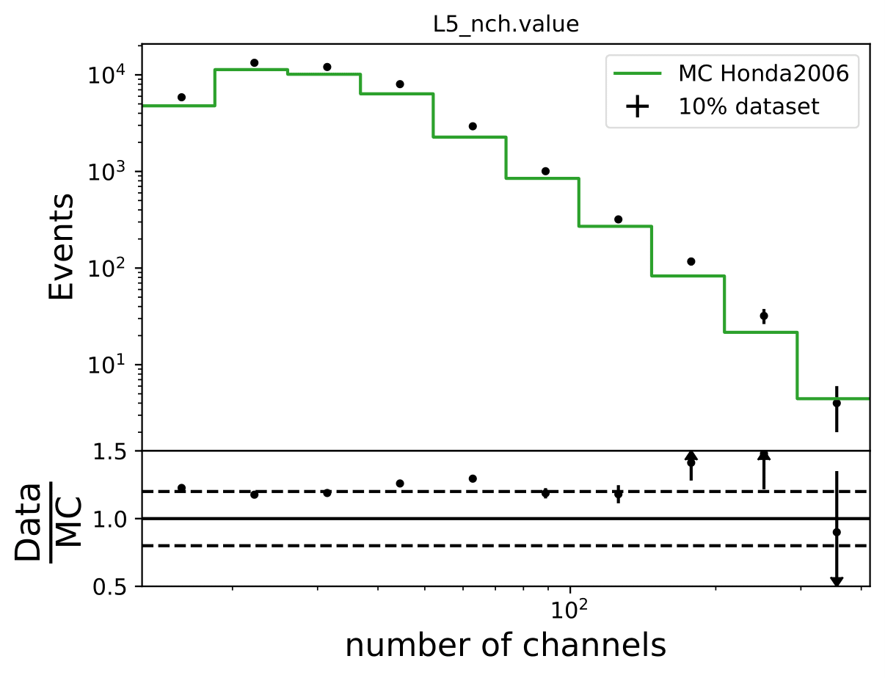
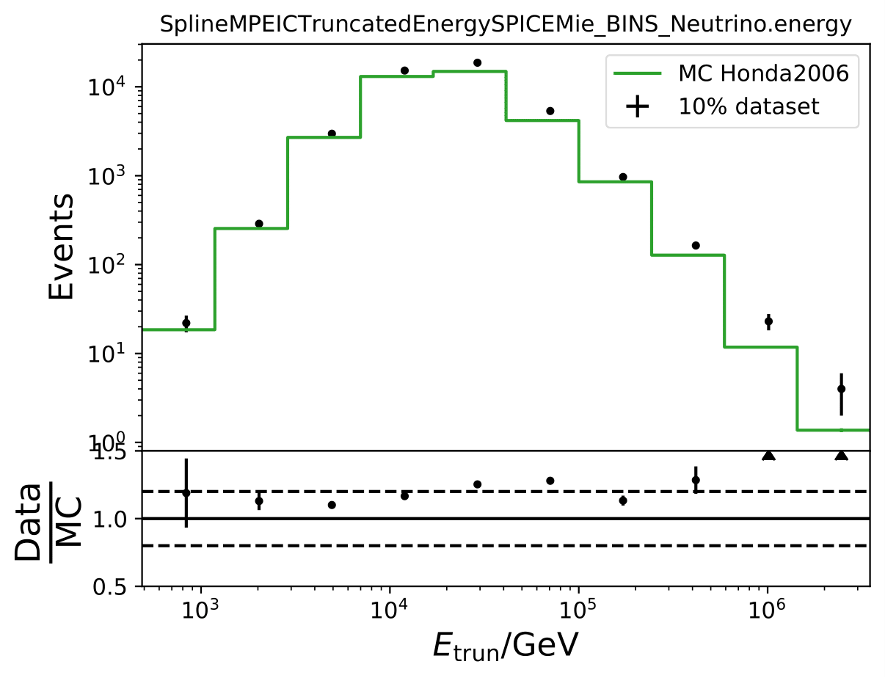

Q & A
#####

Questions by CR WG / Jakob Böttcher
+++++++++++++++++++++++++++++++++++

* Q: *Do you have plots regarding the training steps of the BDT comparing test and training sample?  What is the feature importance?*

  A: The classification results of the random forest could be displayed in each DSEA iteration. However, the difference between the classification and the complete unfolding process is that DSEA accumulates the classifier's confidences for each single event. A classifier, such as a BDT or random forest, would categorize an event into an energy bin based on the bin with the highest probability of this event. Since DSEA sums over all probabilities to produce an output pdf for any neutrino event, the classification behavior itself does not reveal insights into the training of DSEA.

  The prediction that DSEA gives in each iteration is shown in the section `Systematic Checks <https://user-web.icecube.wisc.edu/~khymon/SeasonalVariationsUnfolding/docs/SystematicChecks.html#impact-of-prior>`_. The plot displays how the Wasserstein Distance between the prediction and the truth evolves in each iteration. The impact of the initial prior vanishes from the second iteration on, which means that any given prior will not impact the result when DSEA is applied over multiple iterations. The Wasserstein Distance, and hence also the prediction by DSEA, remains similar from iteration 4 on, only improving slightly. All tested classifiers converged within seven iterations. That is why this is selected in the unfolding process. However, running DSEA over 3 to 4 iterations would be sufficient in the future.

  Pass1 MC: The feature importance from the CV approach are in the last iteration of DSEA (round to 3 decimals) for pass1 MC: EtrunDoms 0.89, L5_nch 0.08, L5_ndir_c 0.03

  Feature importance for pass2 MC: ndoms: 0.05, Etrun: 0.95

* Q: *What is the per bin accuracy of the BDT? A Confusion matrix of events in specific bins would also be interesting to see*.

  A: The confusion matrices are obtained within the 10-fold crossvalidation for the optimal settings of DSEA (Random Forest classifier, 4 iterations and the exponential step size decay regularization). The prediction corresponds to the Random Forest output of the last iteration. 9 out of 10 sets are chosen as the training sample for the crossvalidation, so this refers to 450 000 events (500 000 events in total). Hence, the test set, for which the confusion matrices are obtained, contains 50 000 events each. The predictions are normalized to the true number of events per bin.

  .. image:: images_pass2/pass2_confusionmatrix_crossvalidation_normalizetrueth0.pdf-1.png
    :width: 49%

  .. image:: images_pass2/pass2_confusionmatrix_crossvalidation_normalizetrueth1.pdf-1.png
    :width: 49%

  .. image:: images_pass2/pass2_confusionmatrix_crossvalidation_normalizetrueth2.pdf-1.png
    :width: 49%

  .. image:: images_pass2/pass2_confusionmatrix_crossvalidation_normalizetrueth3.pdf-1.png
    :width: 49%

  .. image:: images_pass2/pass2_confusionmatrix_crossvalidation_normalizetrueth4.pdf-1.png
    :width: 49%

  .. image:: images_pass2/pass2_confusionmatrix_crossvalidation_normalizetrueth5.pdf-1.png
    :width: 49%

  .. image:: images_pass2/pass2_confusionmatrix_crossvalidation_normalizetrueth6.pdf-1.png
    :width: 49%

  .. image:: images_pass2/pass2_confusionmatrix_crossvalidation_normalizetrueth8.pdf-1.png
    :width: 49%

  .. image:: images_pass2/pass2_confusionmatrix_crossvalidation_normalizetrueth9.pdf-1.png
      :width: 49%

* Q: *How much influence has each of the systematic parameters?*

  A: The impact of each systematic parameter is displayed `in this section <https://user-web.icecube.wisc.edu/~khymon/SeasonalVariationsUnfolding/docs/SystematicChecks.html>`_. The flux model has almost no impact (order of 1 to few per cent). Both, the DOM efficiency, as well as ice model have a great impact on the unfolded spectrum, especially on the lower and higher energy bins. Combining all systematic parameters gives an uncertainty lower than 10% in bin 5, but exceeds 40% in bin 1.

* Q: *How does the test statistic look like for the MCEq predictions*?

  A: The significance for the unfolded full sample MC estimations are shown below:

  .. image:: images_pass2/teststats_mcequnfolding_jun-aug_10yr_10000_newcol-1.png
    :width: 49%

  .. image:: images_pass2/teststats_mcequnfolding_dec-feb_10yr_10000_newcol-1.png
    :width: 49%

* Q: *In some of the bins (e.g. bin 4,6,7) the systematic uncertainties are very asymmetric to the point that there seems to be a bias. Do you know where these asymmetries come from*?

  A:  The asymmetric uncertainties originate from unfolding. The simulated data with varied systematic parameters are unfolded. The variation of one parameter can have different impacts in different bins. How the unfolding method behaves in terms of coverage and bias is shown in the `Unfolding <https://user-web.icecube.wisc.edu/~khymon/SeasonalVariationsUnfolding/docs/Unfolding.html>`_ section. However, many of the investigated systematics are biased. A variation of the DOM efficiency and ice model parameters have similar effects in the same energy range. Both, for instance, affect how much light is detected. This introduces asymmetric uncertainties. It also arises from the fact that the systematic simulation sets are discrete.

* Q: *What are the unblinding plans*?

  A: The aim is to quantify that seasonal variations are present at a given significance level with respect to the annual mean average flux / energy spectrum. It is planned to determine monthly spectra and to investigate the monthly flux ratio to the annual mean flux. One of the target plots would be similar to the MCEq prediction:

  .. image:: images/monthly_meceq_ratio_prediction.png

  Furthermore, the variations per month and bin will be investigated and quantified (fitted). The aim of this test would be the determination of the variation in a specific energy range. The expected cosine fit for the MCeq variations are displayed below for each energy bin:

  .. image:: images_pass2/mceq_ratio_bin1-1.png
    :width: 49%

  .. image:: images_pass2/mceq_ratio_bin2-1.png
    :width: 49%

  .. image:: images_pass2/mceq_ratio_bin3-1.png
    :width: 49%

  .. image:: images_pass2/mceq_ratio_bin4-1.png
    :width: 49%

  .. image:: images_pass2/mceq_ratio_bin5-1.png
    :width: 49%

  .. image:: images_pass2/mceq_ratio_bin6-1.png
    :width: 49%

  .. image:: images_pass2/mceq_ratio_bin7-1.png
    :width: 49%

  .. image:: images_pass2/mceq_ratio_bin8-1.png
    :width: 49%

  .. image:: images_pass2/mceq_ratio_bin9-1.png
    :width: 49%

  .. image:: images_pass2/mceq_ratio_bin10-1.png
    :width: 49%

  Another objective is the change of variations throughout the year. DSEA+ is able to keep the contribution of each single event to the spectrum. This allows to determine monthly spectra that are constructed e.g. from day 1 to 30 (in total: 365 days stacked for the 10 years). The monthly data set can then be shifted to day 1 to 31 and so forth. This would show how the variations shift throughout the year (and not only based on defined months) as an add-on.

* Q: *Why is the test statistic summed over all bins*?

  A: The test statistic (TS) is defined as the sum of the seasonal deviations from the annual mean of all bins to determine the significance of seasonal variations in the seasonal flux.  The TS could be calculated separately per bin (as shown in the `Results section <https://user-web.icecube.wisc.edu/~khymon/SeasonalVariationsUnfolding/docs/Results.html>`_), but this would only give the significance of the derivation from the annual mean binwise. This could be used to determine the variation strength per bin. However, to obtain the significance of the complete seasonal energy spectrum, and its deviations from the annual mean energy spectrum, the TS has to consider all bins.

* Q: *As a crosscheck for acceptance correction, can you unfolding pseudo data weighted to Honda2006 flux*?

  A: The estimated number of events in the full year 10yr data sample (437040 - burn sample x 10) is resampled to the estimated flux from Honda2006 with the nuflux package and simweights. Training is done with MCEq+astrophysical weights. MC truth is shown in orange and shows deviations from the flux given in the Honda paper. Statistical and systematic uncertainties are shown in the plot.

  .. image:: images_pass2/pseudodataunfolding_pass2_honda2006_e3_sys-1.png

  The unfolding of Honda weighted pseudo data is generally feasible, but shows some deviations in the first and last bins with smaller statistics. The Honda flux deviates largely from MCeq predicted flux in terms of shape, so that such a result is expected. This can be underlined with the data-MC agreement of Honda weighted MC to the burn sample as shown below. The deviation from truth to unfolded spectrum is still acceptable (few per cents). This deviation does not show any impact on the seasonal variation measurement since the target quantity of interest is the ratio of the unfolded seasonal to the unfolded yearly average flux. Such a deviation would impact both unfolding and averages out in the ratio. If a spectrum is to be determined, an additional uncertainty for DSEA could be added to the unfolded spectra to cover up for spectral index variations.

  The MC is not in agreement with the burn sample especially at the highest bins of both unfolding variables. A constant offset would be tolerable.

* Q: *How does a shift in spectral index impact the unfolded spectrum*?

  A: A shift and its impact on the spectrum are already investigated in the systematic uncertainty calculation. A shift in DOM efficiency, ice absorption and similar, appear to the algorithm as a shifted spectrum. However, another source of uncertainty corresponding to a shift in :math:`\Delta \gamma` in spectral index could be added additionally.

  The shift in spectral index was chosen to be 0.03 in previous unfolding analysis (see IC79 unfolding). Here, very extreme shift up to 0.2 are tested. Unfolding is trained on MCEq as usual and the estimation of full data set and full year (jan-dec) is unfolded. The binned true weighted MC is given in orange, unfolding in blue. Honda2006 flux and MCEq flux are shown in black for comparison of shift strength compared to these models. Upper row denotes shift of 0.2 on the left and -0.02 on the right. Mid row 0.1 and lower row 0.05

  .. image:: images_pass2/pseudodataunfolding_pass2_deltagamma0.2_jan-dec_e3-1.png
    :width: 49%

  .. image:: images_pass2/pseudodataunfolding_pass2_deltagamma-0.2_jan-dec_e3-1.png
    :width: 49%

  .. image:: images_pass2/pseudodataunfolding_pass2_deltagamma0.1_jan-dec_e3-1.png
    :width: 49%

  .. image:: images_pass2/pseudodataunfolding_pass2_deltagamma-0.1_jan-dec_e3-1.png
    :width: 49%

  .. image:: images_pass2/pseudodataunfolding_pass2_deltagamma0.05_jan-dec_e3-1.png
    :width: 49%

  .. image:: images_pass2/pseudodataunfolding_pass2_deltagamma-0.05_jan-dec_e3-1.png
    :width: 49%

  The seasonal MCEq weights are weighted to a shift of :math:`(\frac{E}{1TeV})^{\Delta \gamma}` with :math:`\Delta \gamma = 0.05` and :math:`\Delta \gamma = -0.05`.
  It is tested if seasonal unfolding is still feasible. Only statistical uncertainties are shown here, no uncertainties of systematics such as uncertainty of the unfolding.
  The seasonal behavior can still be retrieved. The truth of MCEq seasonal variations is shown in the bottom plot.

  .. image:: images_pass2/pseudodataunfolding_pass2_trainmceq_unfolddg0.05_e3_ratioseasonyear-1.png
    :width: 49%

  .. image:: images_pass2/pseudodataunfolding_pass2_trainmceq_unfolddg-0.05_e3_ratioseasonyear-1.png
    :width: 49%

  .. image:: images_pass2/pseudodataunfolding_pass2_trainmceq_unfolddg0.1_e3_ratioseasonyear-1.png
    :width: 49%

  .. image:: images_pass2/pseudodataunfolding_pass2_trainmceq_unfolddg-0.1_e3_ratioseasonyear-1.png
    :width: 49%

  The same unfolding tests are shown but with deviation of unfolding to MC truth in the ratio:

  .. image:: images_pass2/pseudodataunfolding_pass2_trainmceq_unfolddg0.05_e3_ratiototruth-1.png
    :width: 49%

  .. image:: images_pass2/pseudodataunfolding_pass2_trainmceq_unfolddg-0.05_e3_ratiototruth-1.png
    :width: 49%

  .. image:: images_pass2/pseudodataunfolding_pass2_trainmceq_unfolddg0.1_e3_ratiototruth-1.png
    :width: 49%

  .. image:: images_pass2/pseudodataunfolding_pass2_trainmceq_unfolddg-0.1_e3_ratiototruth-1.png
    :width: 49%

  The deviation from unfolding to truth remains the same for all seasons. This allows to still determine seasonal variations.

* Q: *How does the unfolding behave if another MCEq flux based on different primary and hadronic interaction model is unfolded*?

  A: The unfolded MC is weighted to GST primary model and QGSJet-II-04 hadronic interaction model. Number of events is corresponding to estimation of full year data sets as in the test above.

  .. image:: images_pass2/pseudodataunfolding_pass2_mceq_qgsjet_GST_jan-dec_e3-1.png
   :width: 90%

* Q: *Regarding the asymmetric uncertainties, if you scale it up and down they both go in the same direction. How this can be? There could be systematic shift in the baseline MC and modified one. Strength of the bias should depend on how far you are from trained model*.

  A: The simulation set 21002 was used as the baseline in the systematic uncertainty calculation. However, as mentioned above, the shift goes into the same direction for scaling a parameter up and down. Scattering and absorption parameter are varied in the systematics sets 21003-21006.

  .. image:: images_pass2/pass2_systvsbaseline_abs_10yr_bns_dec-feb_base21002-1.png
    :width: 49%

  .. image:: images_pass2/pass2_systvsbaseline_scat_10yr_bns_dec-feb_base21002-1.png
    :width: 49%

  The baseline does not seem to be chosen correctly and is switched to 21047. This is applied to hole ice parameters and DOM efficiency as well.

  .. image:: images_pass2/pass2_systvsbaseline_abs_10yr_bns_dec-feb_base21047-1.png
    :width: 49%

  .. image:: images_pass2/pass2_systvsbaseline_scat_10yr_bns_dec-feb_base21047-1.png
    :width: 49%

  .. image:: images_pass2/pass2_systvsbaseline_edom_10yr_bns_dec-feb-1.png
    :width: 49%

  .. image:: images_pass2/pass2_systvsbaseline_holeice_10yr_bns_dec-feb-1.png
    :width: 49%

  The systematic uncertainties follow now an expected pattern. 21002 is kept as baseline set for the flux uncertainty calculation because the fux uncertainties were applied on the weights from the simulation 21002.

  .. image:: images_pass2/pass2_systvsbaseline_flux_10yr_bns_dec-feb-1.png
    :width: 49%

  The section on systematic uncertainties has been updated and the error bars corrected in all plots.

Questions by Cosmic Ray WG
++++++++++++++++++++++++++

* Q: *How does data-MC-agreement look like in zenith bins*?

  A: Here 10° bins are shown. Starting from 90°-100°, 100°-110°, 110°-120°.

  .. image:: images_pass2/datavsmc_bns_atmastro_unnormed_L5_nch.value_10yr_21002_90-100-1.png
    :width: 49%

  .. image:: images_pass2/datavsmc_bns_atmastro_unnormed_SplineMPEICTruncatedEnergySPICEMie_BINS_Neutrino.energy_10yr_21002_90-100-1.png
    :width: 49%

  .. image:: images_pass2/datavsmc_bns_atmastro_unnormed_L5_nch.value_10yr_21002_100-110-1.png
    :width: 49%

  .. image:: images_pass2/datavsmc_bns_atmastro_unnormed_SplineMPEICTruncatedEnergySPICEMie_BINS_Neutrino.energy_10yr_21002_100-110-1.png
    :width: 49%

  .. image:: images_pass2/datavsmc_bns_atmastro_unnormed_L5_nch.value_10yr_21002_110-120-1.png
    :width: 49%

  .. image:: images_pass2/datavsmc_bns_atmastro_unnormed_SplineMPEICTruncatedEnergySPICEMie_BINS_Neutrino.energy_10yr_21002_110-120-1.png
    :width: 49%

* Q: *Why are Honda2006 line and Honda2006 MC Truth not the same? Is it the zenith difference*?

  A: The question refers to one of the questions adressed above. Training MC was weighted to MCEq+astrophysical weights, psedo data set was weighted to Honda2006 flux prediction (weights obtained from simweights - nuflux).

  .. image:: images_pass2/pseudodataunfolding_pass2_honda2006_e3_sys-1.png

  The MC truth shown in the upper plot is binned number of events in Honda2006 pseudo data sample and corresponding flux normalization. The black curve respresents the neutrino + antineutrino flux determined from the `paper <https://arxiv.org/abs/astro-ph/0611418>`_. The fluxes were added separately for zenith bands in :math:`cos(\Theta)=0` to :math:`cos(\Theta)=-0.5` in steps of :math:`\Delta cos(\Theta)=0.1` and divided by the number of zenith bins. This means that an average flux for the zenith region from 90° to 120° is shown in this plot here in black. However, the true zenith distribution in the MC can differ. The plot below shows the zenith distribution in the first energy bin. It can be noted that fewer events are close to the horizon. So this could contribute to the difference in the upper plot. Another aspect could be the energy distribution in the bin. The center of gravity in the first bin is not identical with the energy bin midth, but higher. Hence the appearing deviation is also an effect of the binning and the large increase in events at higher energies. This is an effect that occurs dominantly at small energies corresponding to the first bin.

  .. image:: images_pass2/energydistribution_bin_1-1.png
    :width: 49%

  .. image:: images_pass2/zenithdistribution_bin_1-1.png
    :width: 49%

* Q: *Can you quantify the difference of the predicted flux ratio from MCEq to the MC pseudo data unfolding*? *Can you fit the deviation from the model*?

  A: The question refers to the following plots of `MC pseudo data unfolding <https://user-web.icecube.wisc.edu/~khymon/SeasonalVariationsUnfolding/docs/Results.html#estimation-of-full-sample-results>`_ matching the expectation of the 10 year data set. The bottom plots show the ratio of an unfolded seasonal flux to the annual average flux. The unfolded ratios seem to match the MCEq prediction for the respective flux ratios. It was proposed to plot the deviation of the unfolded flux ratio to the MCEq predicted flux ratio. The spline fits from MCEq weighting are used to calculate the flux at bin mids. The plots below show unfolded ratio divided by predicted ratio including statistical uncertaintes of the unfolded ratio. A linear fit is perfomed on the ratio including the uncertainties. The shaded orange bands denote the upper and lower limits of the fits.
  Underflow and overflow bins are excluded in the test statistic calculation.

  To quantify whether the data points fluctuate around 1, a :math:`\chi^2` test is performed :math:`\sum \frac{(o_i - e_i)^2}{\sigma_i^2}` with the observation :math:`o` coming from the unfolded ratio devided by expectation with corresponding statistical uncertainty :math:`\sigma`. :math:`e` is the expectation (ratio=1).  A significant deviation from a ratio of 1 would mean that the round-trip test of MC undolding would not work reliably well. All seasons show a large p-value so that the data points show a statistical fluctuation around the model prediction.

  .. image:: images_pass2/ratio_mcequnfolding_mean_splinempeapprox_jun-aug_mceqtheoryflux_withuncertaintyinfit-1.png
    :width: 49%

  .. image:: images_pass2/ratio_mcequnfolding_mean_splinempeapprox_dec-feb_mceqtheoryflux_withuncertaintyinfit-1.png
    :width: 49%

  .. image:: images_pass2/ratio_mcequnfolding_mean_splinempeapprox_jan-jun_mceqtheoryflux_withuncertaintyinfit-1.png
    :width: 49%

  .. image:: images_pass2/ratio_mcequnfolding_mean_splinempeapprox_jul-dec_mceqtheoryflux_withuncertaintyinfit-1.png
    :width: 49%

  .. image:: images_pass2/ratio_mcequnfolding_mean_splinempeapprox_jan_mceqtheoryflux_withuncertaintyinfit-1.png
    :width: 49%

  .. image:: images_pass2/ratio_mcequnfolding_mean_splinempeapprox_feb_mceqtheoryflux_withuncertaintyinfit-1.png
    :width: 49%

  .. image:: images_pass2/ratio_mcequnfolding_mean_splinempeapprox_mar_mceqtheoryflux_withuncertaintyinfit-1.png
    :width: 49%

  .. image:: images_pass2/ratio_mcequnfolding_mean_splinempeapprox_apr_mceqtheoryflux_withuncertaintyinfit-1.png
    :width: 49%

  .. image:: images_pass2/ratio_mcequnfolding_mean_splinempeapprox_may_mceqtheoryflux_withuncertaintyinfit-1.png
    :width: 49%

  .. image:: images_pass2/ratio_mcequnfolding_mean_splinempeapprox_jun_mceqtheoryflux_withuncertaintyinfit-1.png
    :width: 49%

  .. image:: images_pass2/ratio_mcequnfolding_mean_splinempeapprox_jul_mceqtheoryflux_withuncertaintyinfit-1.png
    :width: 49%

  .. image:: images_pass2/ratio_mcequnfolding_mean_splinempeapprox_aug_mceqtheoryflux_withuncertaintyinfit-1.png
    :width: 49%

  .. image:: images_pass2/ratio_mcequnfolding_mean_splinempeapprox_sep_mceqtheoryflux_withuncertaintyinfit-1.png
    :width: 49%

  .. image:: images_pass2/ratio_mcequnfolding_mean_splinempeapprox_oct_mceqtheoryflux_withuncertaintyinfit-1.png
    :width: 49%

  .. image:: images_pass2/ratio_mcequnfolding_mean_splinempeapprox_nov_mceqtheoryflux_withuncertaintyinfit-1.png
    :width: 49%

  .. image:: images_pass2/ratio_mcequnfolding_mean_splinempeapprox_dec_mceqtheoryflux_withuncertaintyinfit-1.png
    :width: 49%

  Same test is repeated for the pseudo data unfolding with shift in spectral index:

  .. image:: images_pass2/ratio_mcequnfolding_mean_splineapprox_deltagam-0.1_jun_mceqtheoryflux_withuncertaintyinfit-1.png
    :width: 49%

  .. image:: images_pass2/ratio_mcequnfolding_mean_splineapprox_deltagam-0.1_dec_mceqtheoryflux_withuncertaintyinfit-1.png
    :width: 49%

  .. image:: images_pass2/ratio_mcequnfolding_mean_splineapprox_deltagam-0.05_jun_mceqtheoryflux_withuncertaintyinfit-1.png
    :width: 49%

  .. image:: images_pass2/ratio_mcequnfolding_mean_splineapprox_deltagam-0.05_dec_mceqtheoryflux_withuncertaintyinfit-1.png
    :width: 49%

  .. image:: images_pass2/ratio_mcequnfolding_mean_splineapprox_deltagam0.05_jun_mceqtheoryflux_withuncertaintyinfit-1.png
    :width: 49%

  .. image:: images_pass2/ratio_mcequnfolding_mean_splineapprox_deltagam0.05_dec_mceqtheoryflux_withuncertaintyinfit-1.png
    :width: 49%

  .. image:: images_pass2/ratio_mcequnfolding_mean_splineapprox_deltagam0.1_dec_mceqtheoryflux_withuncertaintyinfit-1.png
    :width: 49%

  .. image:: images_pass2/ratio_mcequnfolding_mean_splineapprox_deltagam0.1_dec_mceqtheoryflux_withuncertaintyinfit-1.png
    :width: 49%

Questions by Diffuse WG
+++++++++++++++++++++++

* Q: *What are the bin-to-bin correlations*?

  A: left: dec-feb   right:jun-aug

  .. image:: images_pass2/correlation_bns_pass2_dec-feb_90-120-1.png
    :width: 49%

  .. image:: images_pass2/correlation_bns_pass2_jun-aug_90-120-1.png
    :width: 49%

Questions by Richard Naab
+++++++++++++++++++++++++

**Event Selection**

* Q: *Restricting arrival directions to zenith angles between 90deg and 120deg: Can you specify which reconstruction method is used for the angular variables*?

  A: SplineMPE is used for angular reconstruction.

* Q: *Data/MC agreement: Can you please include uncertainties in these plots, so that one can understand the scale on which variations are expected? Also, which flux model did you chose to weight your MC for these plots*

  A: The Data/MC comparison shows the distribution of each unfolding variable for data and MC. The MC does not include any seasonal predictions. The flux model Honda2006 (NewNuFlux in IceCube software) is used for weighting. The weighting process and flux model are described `in this section <https://user-web.icecube.wisc.edu/~khymon/SeasonalVariationsUnfolding/docs/EventSelection.html#resampling-to-an-atmospheric-distribution>`_. The updated plots can be found `here <https://user-web.icecube.wisc.edu/~khymon/SeasonalVariationsUnfolding/docs/EventSelection.html#data-to-mc-agreement>`_. Poissonian variance is assumed as data uncertainty per bin, the uncertainty for MC is calculated as follows: :math:`\sqrt{\sum_i weights_i^2)}` for each energy bin *i*.

* Q: *The MC set you are using seems to be pass 1, is that correct? The recent diffuse analysis on the upgoing Track sample used more modern pass 2 (MC and data), is there a reason not to do the same*?

  A: The analysis has been updated to pass2 MC.

**Unfolding**

* Q: *You seem to be disregarding muon backgrounds completely, can you please confirm/make this explicit? The recent diffuse analysis includes template to estimate contributions of atmospheric muons* (`link <https://arxiv.org/pdf/2111.10299.pdf>`_, *Figure 1. for example), can you quantify what effect that would have on your unfolding*?

  A: The purity of the event selection is approx. 99.7% (see Chapter 10 `in this thesis <https://www.institut3b.physik.rwth-aachen.de/global/show_document.asp?id=aaaaaaaaaayrjby>`_). Such a small percentage is negligible in unfolding.

  No muons could be found in the MC sample.

* Q: *Coverage test: The uncertainty from weighted events should be sigma = sqrt( sum_j w_j^2) per bin - not sum_j(sqrt(w_j))^2 as you've written*.

  A: Agree, typo has been fixed! Code was correct.

* Q: *Bias & Coverage test result: Except for the very first bin, the 2-variable unfolding (n_doms and EtrunDoms) seems to result in less bias and better coverage than the 3-variable unfolding (including direct_hits), still you propose to go with the higher dimensionality. I would assume that more dimensions make the measurement more complicated and subject to fluctuations in MC - are these under control*?

  A: This question concerns pass1 variable selection:   Both variable combinations are acceptable to be used in unfolding. The underflow bin is biased for the  2-variable unfolding (n_doms and EtrunDoms). That is why the 3-variable unfolding is chosen. A measurement being based on only two variables makes it generally more biased than one based on three since the measurement would be influenced more by one variable. However, same applies on some scale to adding more variables. As coverage and bias are good for both variable combinations, the choice is almost equal in terms of performance and stability. Using three variables is a common choice in unfolding, as illustrated `in this paper <https://link.springer.com/article/10.1140/epjc/s10052-015-3330-z>`_.

  Pass2: The combination of truncated energy and number of channels yields the most stable results.

**Systematic Checks**

* Q: *Systematic uncertainties: Regarding "The ratio of the unfolded spectrum to the reference unfolding with the default systematic parameters becomes the systematic uncertainty of the parameter variation.", can you clarify what is added in quadrature later exactly? You show in the plots below that the systematic variations produce asymmetric ratios, do you take the maximal deviation before adding in quadrature*?

  A: Yes, the maximal deviation is taken separately for the upper and lower errorbar and then squared for each source of uncertainty. The equation given in this `section <https://user-web.icecube.wisc.edu/~khymon/SeasonalVariationsUnfolding/docs/SystematicChecks.html>`_ is applied for upper and lower uncertainty. For example, :math:`\sigma_{\mathrm{DOM}}` is the deviation from the unfolded result obtained with a lower/higher DOM efficiency compared to the reference pseudo-data unfolding. The deviation is squared. Same applies to the other sources of uncertainty.

* Q: *Are correlations between seasonal and yearly data set considered in the propagated uncertainty of the flux ratio*?

  A: The correlation has not been considered in the calculated uncertainty of the flux ratio because the correlation is expected to be small. Beforehand,
  the bootstrap unfolding was done in the following manner: The seasonal data set was selected based on the RunID and the seasonal set was bootstrapped afterwards.
  This ensures that the number of events of the seasonal set are always the same. Possible correlations between the seasonal and the yearly unfolded event spectrum for a given bin could not be determined in this approach.
  Therefore, a test has been made with bootstrapping the entire data set and dividing into seasonal sets afterwards. The random seed ensures that the correlation can be calculated correctly.
  The correlation term has been added to the uncertainty propagation of the ratio and is shown below on the right figure. Left is the uncertainty with the previous approach.
  The difference of the uncertainty is marginal, but not visible in the plots. The uncertainty of the unblinded data will be calculalted considering the correlation between seaosnal and yearly data sets.
  The text in the Results section will be updated accordingly.

  .. image:: images_pass2/newbns_e3_pass2_10yr_jun-aug_dec-feb_sys_90-120_ratio_cblind-1.png
    :width: 49%

  .. image:: images_pass2/newbns_e3_pass2_10yr_jun-aug_dec-feb_sys_90-120_ratio_cblind_withcorr-1.png
    :width: 49%

  **Results**

* Q: *Unfolding results from Burn Sample and Full Data Set Estimation: Why are the uncertainties for the individual unfolded flux points overlapping in the upper panel but not in the lower one*?

  A: The flux points in the upper panel include statistical and systematics uncertainties concerning the energy spectrum. The systematic uncertainties (compare `this section <https://user-web.icecube.wisc.edu/~khymon/SeasonalVariationsUnfolding/docs/SystematicChecks.html#systematic-uncertainties>`_) are larger than the expected seasonal variations and the flux points overlap. The lower panel displays the unfolded flux ratio of a specific season and the annual mean. The systematic uncertainties are independent on the season, as reconstruction and flux models are investigated so that the effect of the systematic uncertainties on the unfolding cancels in the ratio. Hence, the ratio only displays the statistical uncertainties of the ratio. This allows to disentangle between the seasons and to measure seasonal variations energy-dependently.

* Q: *Background scrambling: Can you specify what you mean with livetime ratio when you say* "*Afterwards, the RunID of each event is shuffled randomly but weighted according to the livetime ratio of the investigated season*."?

  A : Text has been updated `here <https://user-web.icecube.wisc.edu/~khymon/SeasonalVariationsUnfolding/docs/Results.html#background-scrambling-as-an-estimation-of-significance>`_.

* Q: *Background scrambling: Which part of the tests is the table of Burn Sample significance referring to, exactly*?

  A: The table refers to the presented method of determining the significance of the unfolded flux ratio from `this section <https://user-web.icecube.wisc.edu/~khymon/SeasonalVariationsUnfolding/docs/Results.html#background-scrambling-as-an-estimation-of-significance>`_. The tests in the following section are not presentend in the table.

* Q: *Tests on Background scrambling: You attribute the characteristics of the BG TS distribution, especially the asymmetry, to the limited data statistics in the burnsample. From the tests you showed it is not immediately clear that the reason for the asymmetry actually are statistical fluctuations, to me it looks more like a systematic shift. One way of investigating statistical fluctuations could be to split the burnsample in half and perform the analysis on both - I would expect the BG TS distributions to vary quite a bit if statistical fluctuations actually cause the shift you are observing*.

  A:  The burn sample was split into two sets from January 2011 to December 2015 and from January 2016 to December 2020. As shown below, the TS is centered around 0, being identical for both sets. Hence, statistical fluctuations did not cause the shfit in the TS. Potential bugs in the scrambling sets are currently being investigated why the TS considering the complete burn sample is not centered around 0.

  .. image:: images/teststats_split1_jun-aug_10yr_10000.png
    :width: 49%

  .. image:: images/teststats_split2_jun-aug_10yr_10000.png
   :width: 49%

  There was a bug in the scrambling script, which is now fixed. The bug does not have an impact on the calculated significance as explained `in this section <https://user-web.icecube.wisc.edu/~khymon/SeasonalVariationsUnfolding/docs/Results.html#background-scrambling-as-an-estimation-of-significance>`_.

* Q: *Comparison to Model Prediction: You say that* "*The ratio between the seasons allows to neglect all sources of systematic uncertainties which are not season-dependent.", what does that mean for your analysis plan - what is being neglected exactly and how*?

  A: The aim of this analysis is to measure the seasonal deviation of the muon neutrino flux from the annual mean flux energy-dependently. The seasonal spectra can, however, not be distinguished due to the systematic uncertainties (as the seasonal variation effect is quite small). That is why the main objective of this analysis is to determine the ratio of the unfolded seasonal flux to the unfolded annual average flux. The respective systematic uncertainties are independent on the season. The uncertainties, explained `here <https://user-web.icecube.wisc.edu/~khymon/SeasonalVariationsUnfolding/docs/SystematicChecks.html#systematic-uncertainties>`_, consider detector (reconstruction) and flux model uncertainties. All parameters assume the same systematic parameters for all seasons. This means that the impact of each systematic uncertainty on the unfolding cancels when seasonal unfolded fluxes are divided by one another. The systematic uncertainties have to be considered for seasonal energy spectrum, but vanish in the unfolded flux ratios. Then, the flux ratio is only subject to statistical uncertainties which drive the main impact on the analysis result.

**Q&A**

* Q: *You show a range of confusion matrices, it is not clear what they are referring to exactly - different seasons*?

  A: The confusion matrix represent each of the 10 crossvalidation sets. The parameters of the unfolding algorithm have been tested and optimized in 10-fold crossvalidation. The algorithms is trained on 9 out of 10 sets and the 10th is unfolded. The confusion matrix shows the prediction of this sub-set. The procedure is repeated for each remaining sets, meaning that 9 are always selected for training and the 10th is unfolded.

* Q: *Expected cosine fit for MCEq variations: Why is the period not exactly 6 months in these fits, but consistently lower*?

  A: The cosine fit shows the seasonal neutrino flux variations per month for each energy bin in the analysis. The cosine being consistently lower than 6 indicates that the variations are not symmetric over the year. This behavior is regulated by the atmospheric model NRLMSISE-00 implemented in MCEq. One objective of this analysis is the investigation whether the variations have the same pattern in summer and winter. There are indications that this is the case, however, there are no other models including these effects. A measurement of this could help with the development of new models which investigate this asymmetry of variations.

* Q: *Bin-to-bin correlations: Why are some of the bins correlated to very distance ones in the same way as to neighboring ones*?

  A: The four plots show the bin-to-bin correlation for the unfolded seasons. The correlation behavior is governed by the random forest classifier that is fed into DSEA. The random forest is not an ordinal classifier, so the predictions can be clear into one bin. But, some prediction can also be contradictory, and e.g. show a similar probability in two non-neighboring bins. Accumulation over all events leads to the displayed corelation behavior. The correlation is still small, but due to the use of random forest, not always around neighboring bins.

Questions during collaboration review
+++++++++++++++++++++++++++++++++++++

* Q: *What post-unblinding checks are planned? It would be useful to determine something like a fitted spectral index variation for each season*.

  A: A simple power law :math:` N \cdot (E1TeV)^{\Delta \gamma}` is fitted to the unfolded ratio. :math:`N` determines the variations strength normalization,
  :math:`\Delta \gamma` deviation in spectral index compared to annual flux. The correponding test on the burn sample is shown `here <https://user-web.icecube.wisc.edu/~khymon/SeasonalVariationsUnfolding/docs/Results.html#unfolding-results-from-burn-sample`_`

Questions on Pass1 MC
+++++++++++++++++++++

* Q: *To the effective area: Do you use the same MC sample as for training the bdt*?

  A: The same MC sample (11374) sample is used for the calculation of the effective area and training of DSEA. The effective area uses the original MC which is simulated to an :math:`E^{-2}` spectrum. This sample is resampled to an atmospheric spectrum for the algorithm training.

* Q: *How does the bdt behave if the primary spectrum of CR is changed before training*?

  A: The impact of the training input spectrum is illustrated `here <https://user-web.icecube.wisc.edu/~khymon/SeasonalVariationsUnfolding/docs/SystematicChecks.html#impact-of-input-spectrum>`_.

  The Honda2006 model uses the primary cosmic ray composition which is described `here <https://www.annualreviews.org/doi/pdf/10.1146/annurev.nucl.52.050102.090645>`_ (spectral index of -2.71 above 100GeV).

* Q: *How is your analysis significance affected by a change in the atmospheric normalization*?

  A: A change in the atmospheric normalization should not impact the significance. The atmospheric normalization is incorporated in the Honda flux model. The training MC sample is resampled to this flux model via the OneWeight approach (see question above). If the normalization of the flux model would change, the weights in the sampling procedure would be different and hence, the training sample. However, the normalization would have to be different at multiple orders of magnitude to produce a very different training sample. If the training sample would be very different to the one that is used currently, the unfolded spectrum might be different. The data-MC-comparison ensures that training and test (the actual data set) data agree within the unfolding features. The impact of different training spectra is investigated `in this section <https://user-web.icecube.wisc.edu/~khymon/SeasonalVariationsUnfolding/docs/SystematicChecks.html#impact-of-input-spectrum>`_.

  The unfolded result (number of events / pdf) is different when the algorithm is trained by a different flux model. If the normalization would be changed, the data and MC must be compared first to see whether this flux model is a reasonable representation of the data.

  The significance of the analysis depends only on the deviations per bin of the unfolded seasonal flux to the unfolded annual mean flux. If another flux normalization is used, the unfolded seasonal fluxes are expected to differ in the same manner. Since the ratio of both is regarded, the impact of the flux normalization is supposed to cancel out. However, if the data-MC-agreement would be poor due to the changed flux normalization, the unfolded result (energy-dependent seasonal variations) would not be trustworthy.

* Q: *How well are the different input spectra unfolded*?

  A: This can be investigated by training the algorithm with a resampled MC to the corresponding model and splitting the MC into training and test
  set. Ideally, the unfolded test set and the true pdf should be similar. The plot shows the training and unfolding of the Honda2006 model and MCEq MC. Both are estimated well within 5%. The uncertainties are originating from botostrapping.

  .. image:: images/unfoldingwithdifferentmodels_mceq.png

* Q: *How well are different models unfolded*?

  A: This test is the counterpart to the impact of input spectrum test. DSEA is trained on MC resampled to the Honda2006 model. The remaining events from the MC sample (the hold-out set) is resampled to MCEq (same models as input spectrum test). The fluxes are calculated for the yearly average and do not take any seasons into account. The samples are unfolded via the bootstrap approach. The estimation is averaged over 2000 trials and statistical uncertainties are added upon the mean unfolded result. The ratio between f_est and f_true is the deviation of the unfolded resampled MC to the MC truth based on the specific model.

  ..  image:: images/unfoldingdifferentmodelsmceq_traininghonda06.png

  The unfolded MC based on Honda2006 shows small deviations from the unfolded MC based on the MCEq flux predictions. As already shown in the wiki, the deviation between the estimation and MC truth is within 5% or smaller for the Honda2006 model. The MCEq predictions show slightly larger deviations from the MC truth, expecially at lower energies. This is attributed to the fact that both Honda2006 and MCEq display an atmospheric distribution, but do differ.

* Q: *What are the bin-to-bin correlations*?

  A: The bins are poorly correlated. Thus, the unfolding is not too strongly regularized. Such a poor correlation is expected since the prediction of a random forest classifier is fed into the unfolding algorithm DSEA+. The random forest is not an ordinal classifier so that the neighboring bins are usually not well correlated. The bin-to bin correlations for the different seasons are shown in the following order (top left, right to lower right): jun.aug, dec-feb, jan-jun, jan-dec.

  .. image:: images/correlation_bns_jun-aug_90-120.png
    :width: 49%

  .. image:: images/correlation_bns_dec-feb_90-120.png
    :width: 49%

  .. image:: images/correlation_bns_jan-jun_90-120.png
    :width: 49%

  .. image:: images/correlation_bns_jan-dec_90-120.png
    :width: 49%

  * Q: *Impact of input spectrum: Why is the result for an E^-2 spectrum so close to some of the MCEq fluxes but deviates much more from the Honda line? Going from E^-2 to any atmospheric flux is more than just "small changes in the input spectrum" as you write in that paragraph*?

    A: This test shows how the unfolding differs when the algorithm is trained with a different input. The MC sample that is unfolded here is weighted to the Honda2006 model. That is why the algorithm performs best when being trained on MC weighted to Honda2006.

    A bug was found in the weighting to MCEq fluxes. The plot below shows the distributions of the MC energy labels of the resampled training sets. A clear deviation between the atmospheric Honda flux and the original :math:`E^{-2}` sample can be found, which is expected. The sampled sets using the MCEq flux with SIBYLL is quite similar to the original MC sample. This indicates that the sampling of a specific model like MCEq does not work. This issue will be investigated. Since it is independent of the sampling towards the atmospheric flux from the model Honda2006, the analysis is not impacted (only this test using MCEq for weighting different MC samples).

    .. image:: images/inputdistr_energytrain_test.png
      :width: 49%

    The weighting to MCEq models has been fixed. The corresponding figure has been updated. The unfolded distribution is acceptable if DSEA is trained with Honda2006, but a distribution following the annual MCEq prediction (H3a, SIBYLL2.3c,MSIS-00) is unfolded.

  * Q: *Systematic uncertainties: Why are ice absorption and ice scattering effects added independently in quadrature when the variation in the simulation sets is a combination of both? How do you disentangle the effects exactly*?

    A: The naming might be misleading here. Three systematic MCs are available for variations of ice model parameters. Two of them have enhanced absorption or scattering separately by 10%, whereas the other parameter remains constant at reference level. The third set reduces absorption and scattering jointly by -7%. The single enhanced parameters (+10%) are taken as the upper uncertainty for both, absorption and scattering, respectively. The parameters cannot be studied separately since the only MC set available with decreased parameters is for absorption and scattering, where both parameters are jointly decreased. Hence, the respective uncertainties :math:`\sigma_{\mathrm{abs}}` and :math:`\sigma_{\mathrm{scat}}` correspond to the MC samples rather than the exact disentaglement of the parameters. As shown in the uncertainty overview `here <https://user-web.icecube.wisc.edu/~khymon/SeasonalVariationsUnfolding/docs/SystematicChecks.html#systematic-uncertainties>`_, both uncertainties have the same value (as expected due to the same increase/decrease of the coefficients). Both parameters have to be evaluated to obtain a reasonable estimate of the ice model uncertainty and its impact on unfolding.
