.. _CNN_reconstructions paragraph:
CNN reconstructions
###################

The reconstructions used in this analysis are based on machine learning using the `dnn_reco <https://github.com/icecube/dnn_reco>`_ framework.

The CNN structure provided in the IceCube framework is explained `here <https://iopscience.iop.org/article/10.1088/1748-0221/16/07/P07041>`_.

In this chapter, the architecture, usage, training data, and network evaluation are presented.

The results shown here were supported by two bachelor students, Leander Flottau and Benjamin Brandt who worked on direction and energy reconstructions.

CNN approach
++++++++++++

Traditional reconstruction methods often involve maximum likelihood estimation and are computationally expensive. Convolutional Neural Networks (CNNs) offer 
several advantages for this task. CNNs are highly effective at extracting spatial and temporal features from complex datasets, which is essential for 
analyzing the Cherenkov light patterns detected by IceCube's optical modules. Furthermore, traditional methods assume a single-track hypothesis, i.e. the energy and 
direction of a single muon are reconstructed. This is useful if neutrinos are investigated, since single muon events are induced by neutrino interactions. 
When analyzing the atmospheric muon flux, muons enter the detector as muon bundles usually. That breaks the single-track hypothesis. A machine learning 
approach utilizes the data and estimates the target 
label, without requiring any further information about the data.

Physics motivation
------------------

This analysis has two goals: 1. measure the normalization of the prompt component of the atmospheric muon flux and 2. unfold the muon energy spectrum at surface. 
These measurements require a reconstruction of the muon energy. Furthermore, to verify the CORSIKA simulations, properties like the muon direction, the detector 
entry position of the muon and the propagation length of the muon are reconstructed. This does not only help to verify the simulations, but also to perform a 
selection. For example, regions in which a data-MC mismatch is observed can be excluded from the analysis.

When a cosmic particle hits our Earth's atmosphere, secondary particles are produced in cascades. Depending on the energy of the primary particle, 
these cascades are large and produce not only one but several particles. These cascades are called extensive air showers. Since most of the produced 
particles are unstable, on Earth's surface mainly neutrinos and muons are detected. Thus, per shower not only one muon is created, but a bundle of muons.

A muon bundle is defined as all muons that are produced by the same primary cosmic ray. Since not all muons are energetic enough to reach the detector, 
the amount of muons in a bundle does change while the muons propagate through the Earth to the detector. In this analysis, typical defintions are 
the bundle energy at the surface and the bundle energy at the detector entry, which are the sum of the muon energies at the surface and at the detector entry, respectively.

The leading muon is the muon with the highest energy in the bundle. This can be defined by the ``leadingness``, where the
leadingness :math:`L_{\mathrm{E}}` describes the ratio of the most energetic muon :math:`E_{\mathrm{max}}` in a bundle to the total energy :math:`E_{\mathrm{tot}}` of the bundle:

.. _leadingness:
.. math:: 

    L_{\mathrm{E}} = \frac{E_{\mathrm{max}}}{E_{\mathrm{tot}}}

Since all muons in a bundle propagate close to each other, it is not possible to 
reconstruct the energies of the individual muons in a bundle. 

Nevertheless, in this analysis, we reconstruct the energy of the leading muon using neural networks. This is fundamentally aided by two physical phenomena. 
Firstly, muons with energies of TeV and above mainly lose energy in stochastic interactions like bremsstrahlung, electron pair production and photonuclear interaction
(see Bethe-Bloch).
Thus, a single muon statistically deposits varying amounts of energy along its path through the ice. When considering a bundle, the individual energy 
losses add up and it appears as if the entire muon bundle continuously loses (the same amount of) energy along its propagation. If the muon bundle contains a muon 
that is significantly higher in energy than the accompanying muons, this high-energy muon should deposit larger amounts of energy in the ice, making the overall energy 
deposition appear less continuous. This is referred to as stochasticity. In summary, if the energy depositions are dominated by large stochastic losses, the leadingness 
is more likely to be high. If the energy depositions appear to be more continuous, the leadingness is more likely to be low. MC studies about the stochasticity 
are available in :ref:`Appendix/Stochasticity <stochasticity paragraph>`.

Secondly, at high energies, the particles are produced in a forward direction. This means that the leading muon is more likely to be produced in the forward direction.
Hence, the distances of the individual muons to the projected center of the shower are smaller, for a bundle with a high leadingness. For a bundle with a low leadingness,
the distances are larger. To quantify this, the perpendicular distance between the leading muon and the closest approach position to the center of the detector is 
calculated. Then, the closest approach point to the center is calculated for all muons in the bundle. With these positions, the distances between 
the leading muon and the other muons are calculated. Finally, the distances are weighted by the energy. For example, 100% means that the largest distance between 
a muon and the leading muon is considered. 90% means that the distance between the leading muon and the muon that accumulates 90 % of the bundle energy is considered.
In the following, this distance is referred to as the bundle radius. MC studies about the bundle radius are available in :ref:`Appendix/Bundle radius <bundle radius paragraph>`.

These effects are mentioned and explained here solely to provide 
insight into the information available for utilization by a machine learning approach. 
In this analysis, neither the stochasticity nor the bundle radius is reconstructed or used. 
The impact of cuts based on stochasticity and 
bundle radius was studied but no improvement was found, as shown in :ref:`Stochasticity impact <impact stochasticity paragraph>` and 
:ref:`Bundle radius impact <impact bundle radius paragraph>`.

CNN structure and input data
++++++++++++++++++++++++++++

CNN structure 
-------------

In :numref:`layer_sketch`, the basic CNN structure is presented. The network is divided into three sub-arrays due to the different vertical DOM to DOM distances 
of the main array and upper and lower DeepCore.  
Convolutional layers extract spatial features from the input data. Hexagonally shaped convolution kernels are used to match the geometry of the detector. Pooling layers reduce the spatial dimensions of the data, focusing on the most relevant features. The output of the convolutional layers is flattened and passed through fully connected layers to make final predictions about the energy and direction of the event. The network has separate output layers for predicting the reconstructed quantities (e.g., energy, direction) and their associated uncertainties. This uncertainty estimation provides insights into the reliability of the prediction. 
The loss function used in training the network incorporates both the predicted values and their uncertainties. It is based on the assumption of a Gaussian likelihood,
which means the residuals (differences between the true and predicted values) are assumed to follow a Gaussian distribution with a standard deviation that varies for each event. The loss function is given by

.. math::
    \begin{equation}
        L = 2 \ln{(\sigma)} + \frac{(y - \hat{y})^2}{\sigma^2}
    \end{equation}

where :math:`y` is the true value, :math:`\hat{y}` is the predicted value and :math:`\sigma` is the predicted standard deviation (uncertainty).
This loss function ensures that the network not only minimizes the difference between the true and predicted values but also learns to predict the associated uncertainty.

.. _layer_sketch:
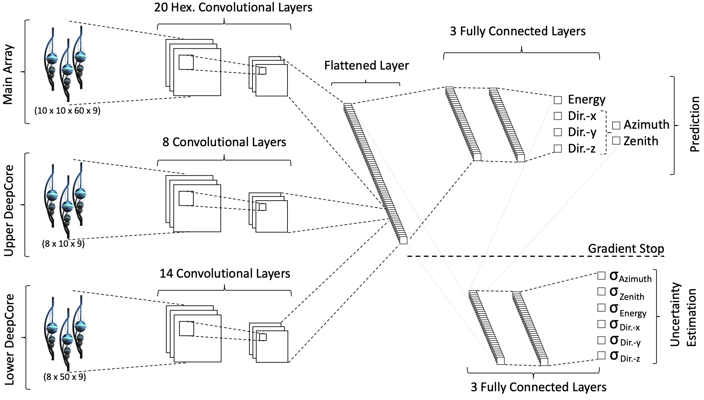

    : A sketch of the neural network architecture is shown. Data from the three sub-arrays are sequenced into convolutional layers. The result is flattened, combined, and passed on to two fully-connected sub-networks which perform the reconstruction and uncertainty estimation. The uncertainty-estimating sub-network also obtains the prediction output as an additional input. Figure taken from `CNN paper <https://iopscience.iop.org/article/10.1088/1748-0221/16/07/P07041>`_.

.. _dnn input data paragraph:

Input data 
----------

In :numref:`dnn_input_cnn_paper`, 9 input features for the CNN are shown. These features are based on the pulses, charge over time, and the features 
are calculated per DOM. 
In this analysis, there are two cases. Either all 9 features or 3 features are used. Using less input features speeds up the evaluation of the network, since less features have to be 
calculated. Providing more features to the network can help to improve the accuracy of the reconstruction. Overall, as long as the information of the features 
is not redundant, choosing the number of features is a trade-off between runtime and accuracy.

.. _dnn_input_cnn_paper:
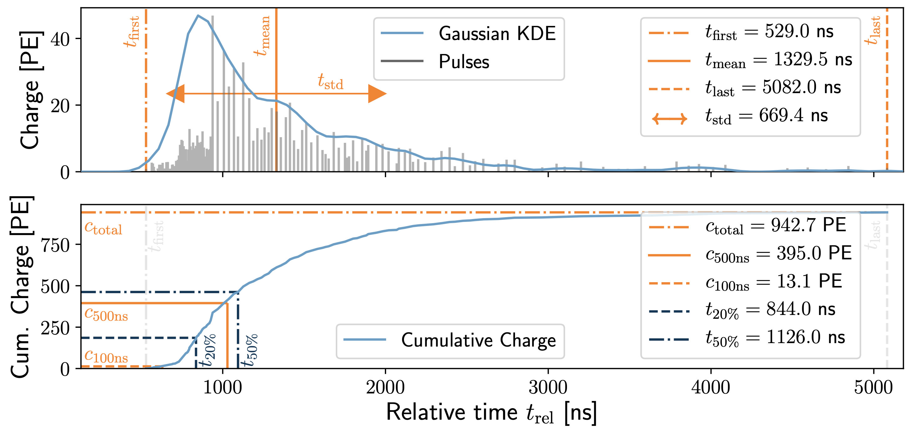

    : All 9 input features for the CNN are shown.

The features of the 3 input networks are:

* :math:`c_{\mathrm{total}}:` Total charge: Sum of charge 

* :math:`t_{\mathrm{first}}:` Relative time of first pulse: Relative to total time offset, calculated as the charge weighted mean time of all pulses

* :math:`t_{\mathrm{std}}:` Standard deviation of first pulse: Charge weighted standard deviation of pulse times relative to total time offset

The additional 6 input features are:

* :math:`t_{\mathrm{last}}:` Relative time of last pulse: Relative to total time offset, calculated as the charge weighted mean time of all pulses

* :math:`t_{\mathrm{20\,\%}}:` Relative time of 20% charge: Relative to total time offset, calculated as the charge weighted mean time of all pulses

* :math:`t_{\mathrm{50\,\%}}:` Relative time of 50% charge: Relative to total time offset, calculated as the charge weighted mean time of all pulses

* :math:`t_{\mathrm{mean}}:` Mean time: Charge weighted mean time of all pulses relative to total time offset

* :math:`c_{\mathrm{500ns}}:` Charge at 500ns: Sum of charge after 500ns

* :math:`c_{\mathrm{100ns}}:` Charge at 100ns: Sum of charge after 100ns

Input pulses 
------------

For the input pulses, two different time window cleaning methods are used. On the one hand, there is an internal time cleaning 
in the DNN framework. It depends on a weighted charge and does not set a fixed time window. On the other hand, the following module 
is used with a fixed cleaning of :math:`6000\,\mathrm{ns}`. Both methods use the *SplitInIceDSTPulses* as input.

.. code-block:: python 

    @icetray.traysegment
    def apply_time_window_cleaning(
        tray,
        name,
        InputResponse="SplitInIceDSTPulses",
        OutputResponse="SplitInIceDSTPulsesTWCleaning6000ns",
        TimeWindow=6000 * icetray.I3Units.ns,
    ):
        from icecube import DomTools  # noqa F401

        tray.AddModule(
            "I3TimeWindowCleaning<I3RecoPulse>",
            name,
            InputResponse=InputResponse,
            OutputResponse=OutputResponse,
            TimeWindow=TimeWindow,
        )

----

Training data 
-------------

The training data are based on four old CORSIKA datasets. Further information are given at `iceprod2 <https://iceprod2.icecube.wisc.edu>`_.

* 20904 
* 21962
* 22020
* 22187 

.. _reconstrected_properties:
Reconstructed properties
++++++++++++++++++++++++ 

As mentioned above, analyzing the prompt component of the atmospheric muon flux requires reconstructions of several properties like energy, direction and 
further track information for the selection.
For this analysis, the following properties are reconstructed by 3 different networks. One networks estimates different networks, one estimates track geometry information 
and another one estimates the direction. Here, a list of all reconstructed properties is presented:

Energy 
------
* ``entry_energy``: Leading muon energy at the detector entry 
* ``bundle_energy_at_entry``: Muon bundle energy at the detector entry
* ``muon_energy_first_mctree``: Leading muon energy at surface 
* ``bundle_energy_in_mctree``: Muon bundle energy at surface

Track geometry
--------------
* ``Length``: Propagation length of muon in the ice 
* ``LengthInDetector``: Propagation length of muon in the detector
* ``center_pos_x``: Closest x position of muon to center of the detector
* ``center_pos_y``: Closest y position of muon to center of the detector
* ``center_pos_z``: Closest z position of muon to center of the detector
* ``center_pos_t``: Time of closest approach to the center of the detector
* ``entry_pos_x``: x position of muon at the detector entry
* ``entry_pos_y``: y position of muon at the detector entry
* ``entry_pos_z``: z position of muon at the detector entry
* ``entry_pos_t``: Time of muon at the detector entry

Direction 
---------
* ``zenith``: Zenith angle of muon 
* ``azimuth``: Azimuth angle of muon

----

Network evaluation 
++++++++++++++++++

As described in :ref:`Selection <selection paragraph>`, 4 different networks are used for the selection. Due to the high statistics at low energies, a very 
fast reconstruction is necessary to remove low-energetic muons. This is done by a network using only 3 input features referred to as *precut network*. This network is only used to reconstruct the muon bundle energy at surface.
The other 3 networks use 9 input features. A time window cleaning of 6ms is applied to the *SplitInIceDSTPulses*. 

The networks used in this analysis are named:

* Pre-cut: ``DeepLearningReco_precut_surface_bundle_energy_3inputs_6ms_01``
* Energy: ``DeepLearningReco_leading_bundle_surface_leading_bundle_energy_OC_inputs9_6ms_large_log_02``
* Track geometry: ``DeepLearningReco_track_geometry_9inputs_6ms_medium_01``
* Direction: ``DeepLearningReco_direction_9inputs_6ms_medium_02_03``

In the following, the evaluation of the networks is shown. The evaluation is performed on our new CORSIKA dataset. Each plot has the true value on the y-axis and the network prediction on the x-axis. The events are weighted to H3a, in the title of the figure the Spearman and Pearson correlation coefficients are given, and the ratio panel presents either the median difference, or the median of the relative difference between the true and reconstructed value. Orange crosses indicate the median and the 68% quantile in each bin.

(Note: Comparisons have been performed for networks with and without the standard timewindow cleaning. In general, the the results without the 6ms cleaning are slightly better. However, to avoid after pulses and minimizing the influence of coincident 
events, the 6ms cleaning is applied anyway. If you are interested in this, the comparisons can be found in :ref:`Appendix/Network evaluation <network evaluation paragraph>`.)

Bundle energy at surface 
------------------------

.. _DeepLearningReco_precut_bundle_energy_3inputs_6ms_01_vs_MCLabelsLeadingMuons_bundle_energy_in_mctree:
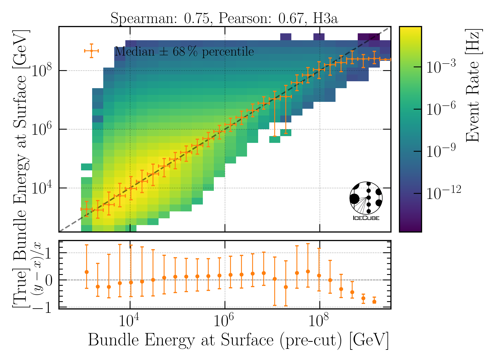

    : The bundle energy at the surface is shown on ``Level3``. 

Bundle energy at entry 
----------------------

.. _DeepLearningReco_leading_bundle_surface_leading_bundle_energy_OC_inputs9_large_log_02__bundle_energy_at_entry:
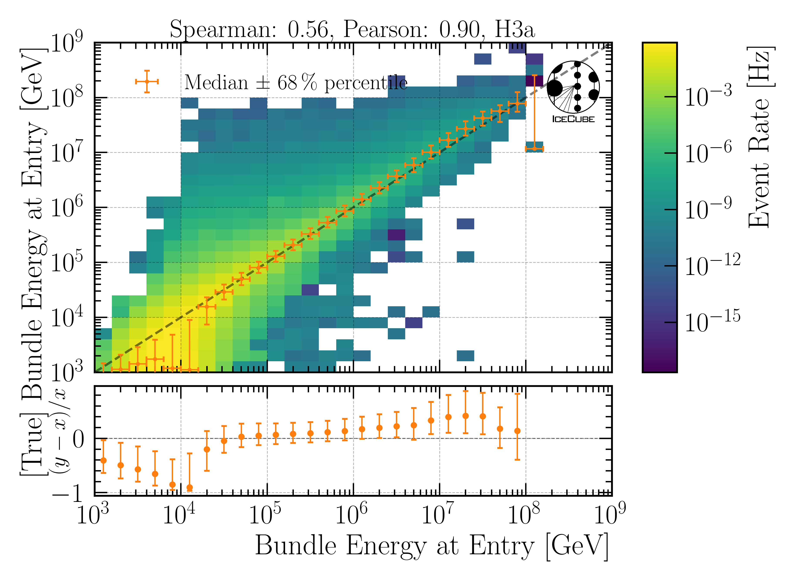

    : The bundle energy at the entry is shown on ``Level3``.

Leading muon energy at entry
----------------------------

.. _DeepLearningReco_leading_bundle_surface_leading_bundle_energy_OC_inputs9_large_log_02__entry_energy:
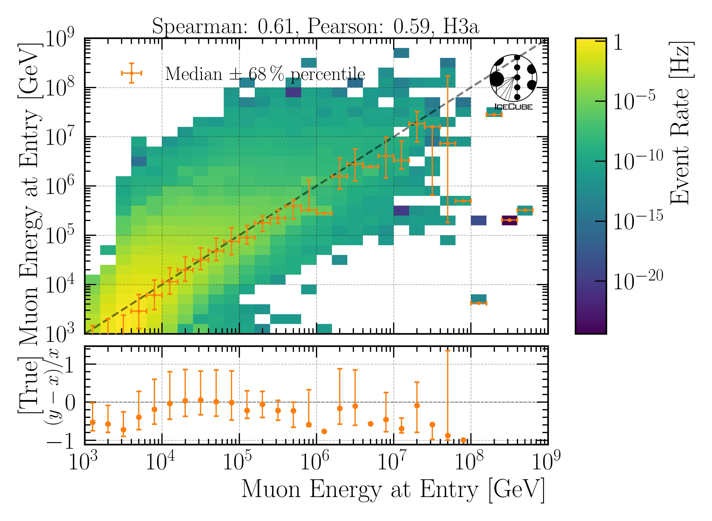

    : The leading muon energy at the entry is shown on ``Level3``.

Track geometry
--------------

The center information are defined as the closest approach point of the muon to the center of the detector. This includes the position of the closest approach point, 
the energy of the muon at that point and the relative time of the muon in its time window. The same properties can be calculated for the 
detector entry point, which is the point where the muon enters the detector. For this, a convex hull around the in-ice detector is created. 
The Cherenkov 
light produced by the muons is not only visible, if the muon passes through the detector, but also when it passes close to the detector. Hence, the
convex hull is extended by 200m. Thus, the entry point is defined as the point, where the muon enters the convex hull around the IceCube 
detector extended by 200m.
The propagation length inside the detector is defined as the length the muon propagates inside this convex hull until it either leaves the detector or decays. 
The total propagation length is the length the muon propagates in total, from the surface (for atmospheric muons) to the point where it stops (decays).

The information about the track geometry are calculated by several functions. The entry position, time and energy are determined using
`get_muon_entry_info <https://github.com/icecube/ic3-labels/blob/5b68fa208607c5cba9cfd6ec317985017cc6c113/ic3_labels/labels/utils/muon.py#L605>`_.
The center position is determined by 
`get_muon_closest_approach_to_center <https://github.com/icecube/ic3-labels/blob/5b68fa208607c5cba9cfd6ec317985017cc6c113/ic3_labels/labels/utils/muon.py#L1258>`_.
The energy at the center position is calculated by 
`get_muon_energy_at_position <https://github.com/icecube/ic3-labels/blob/5b68fa208607c5cba9cfd6ec317985017cc6c113/ic3_labels/labels/utils/muon.py#L201>`_. 
The time when the muon is at the closest point of the center is calculated with 
`get_muon_time_at_position <https://github.com/icecube/ic3-labels/blob/5b68fa208607c5cba9cfd6ec317985017cc6c113/ic3_labels/labels/utils/muon.py#L59>`_.
The total propagation length of the muon is provided in its class I3Particle and accessible via *muon.length*.
The propagation length inside the detector is determined using 
`get_muon_track_length_inside <https://github.com/icecube/ic3-labels/blob/5b68fa208607c5cba9cfd6ec317985017cc6c113/ic3_labels/labels/utils/muon.py#L1764>`_.

**Center time:**

.. _track_geometry_9inputs_uncleaned_01__center_pos_t:
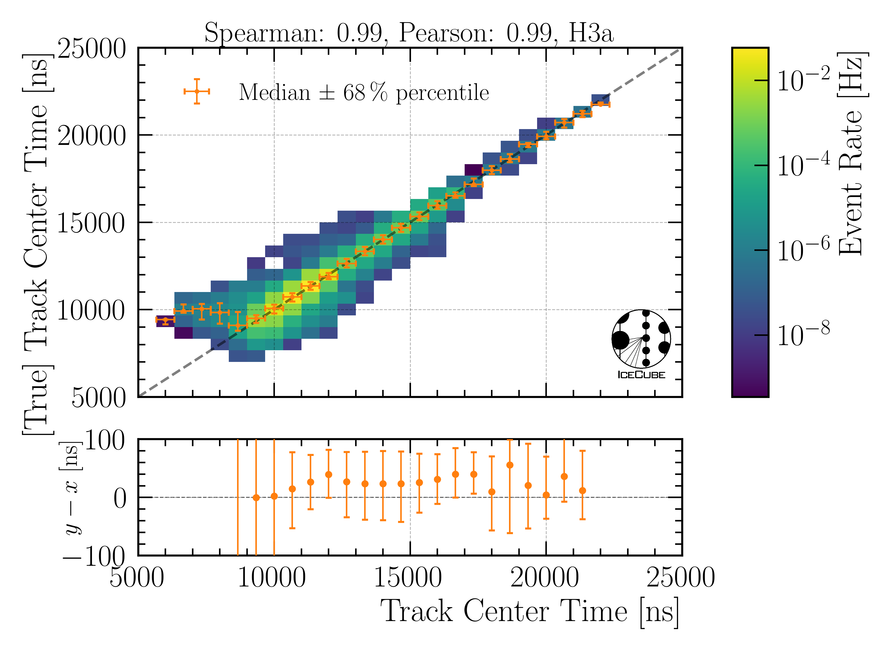

    : The center time is shown on ``Level4``.

**Entry time:** 

.. _track_geometry_9inputs_uncleaned_01__entry_pos_t:
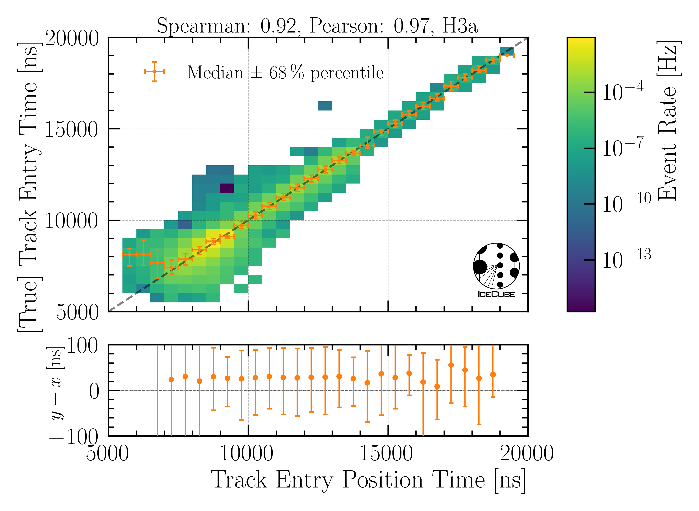

    : The entry time is shown on ``Level4``.

**Center position x:**

.. _track_geometry_9inputs_uncleaned_01__center_pos_x:
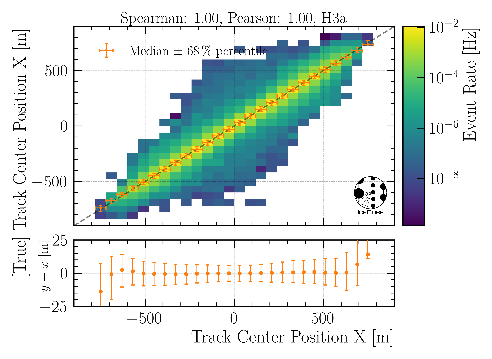

    : The center position x is shown on ``Level4``.

**Center position y:**

.. _track_geometry_9inputs_uncleaned_01__center_pos_y:
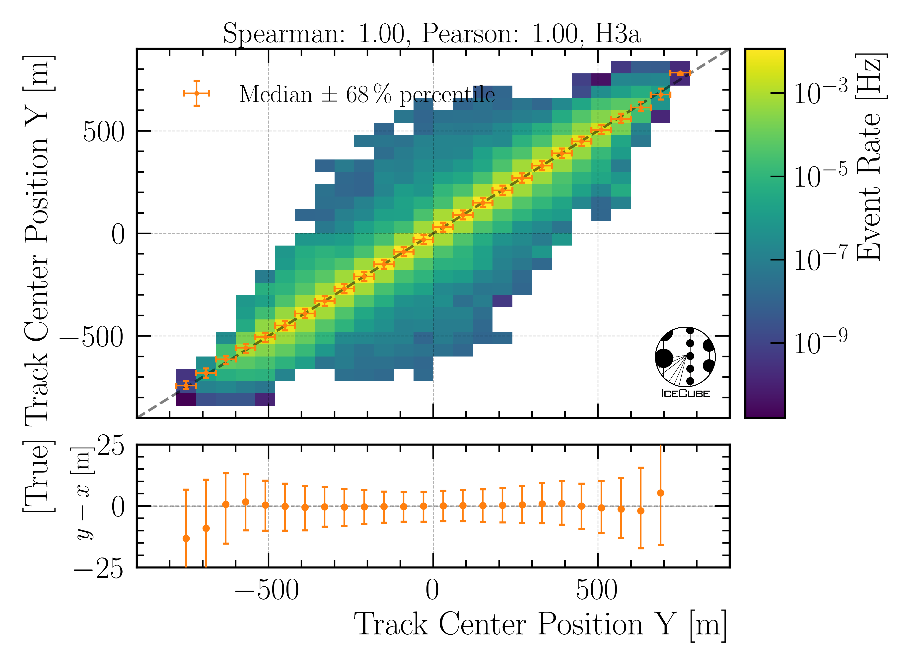

    : The center position y is shown on ``Level4``.

**Center position z:**

.. _track_geometry_9inputs_uncleaned_01__center_pos_z:
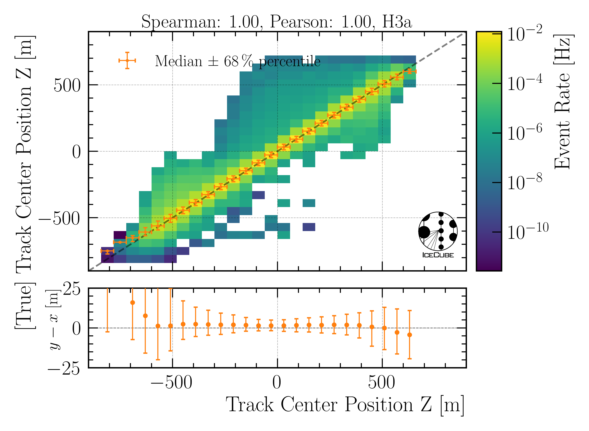

    : The center position z is shown on ``Level4``.

**Entry position x:**

.. _track_geometry_9inputs_uncleaned_01__entry_pos_x:
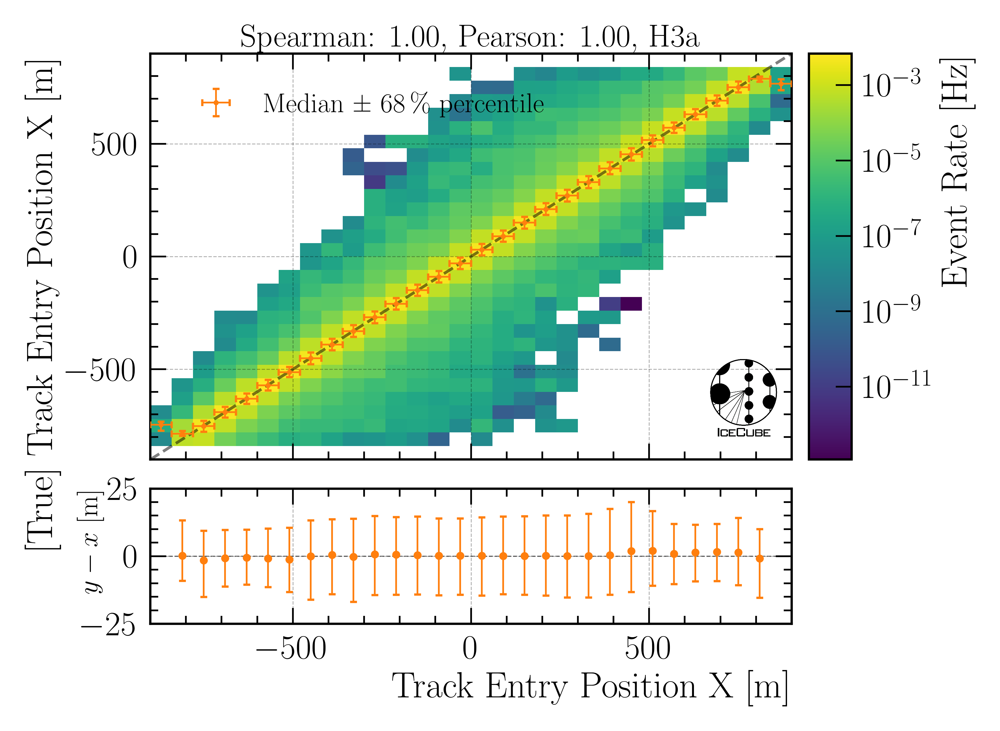

    : The entry position x is shown on ``Level4``.

**Entry position y:**

.. _track_geometry_9inputs_uncleaned_01__entry_pos_y:
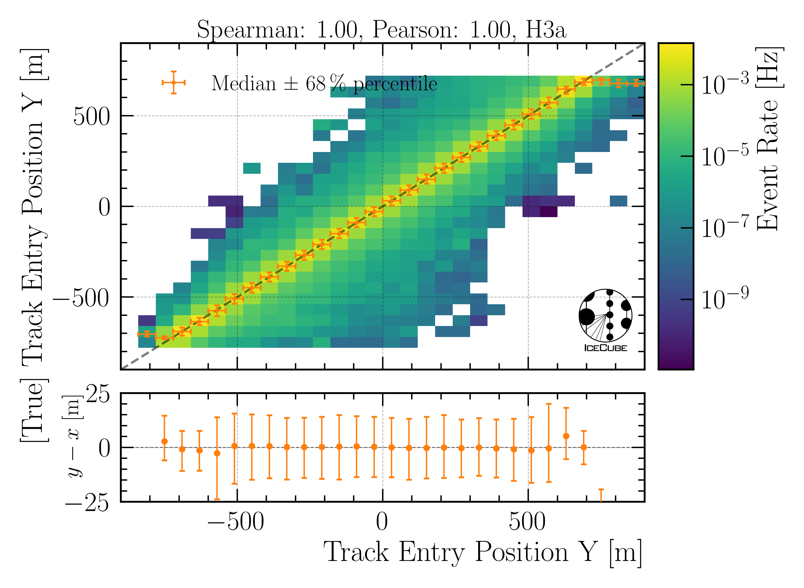

    : The entry position y is shown on ``Level4``.

**Entry position z:**

.. _track_geometry_9inputs_uncleaned_01__entry_pos_z:
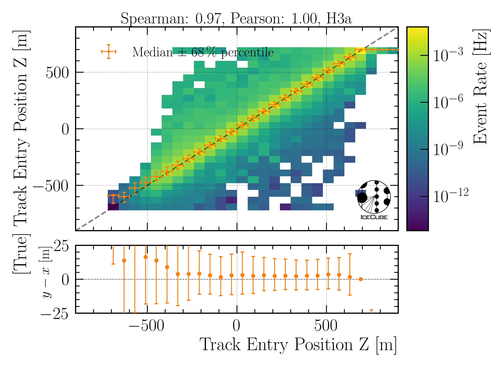

    : The entry position z is shown on ``Level4``.

**Total track length:**

.. _track_geometry_9inputs_uncleaned_01__Length:
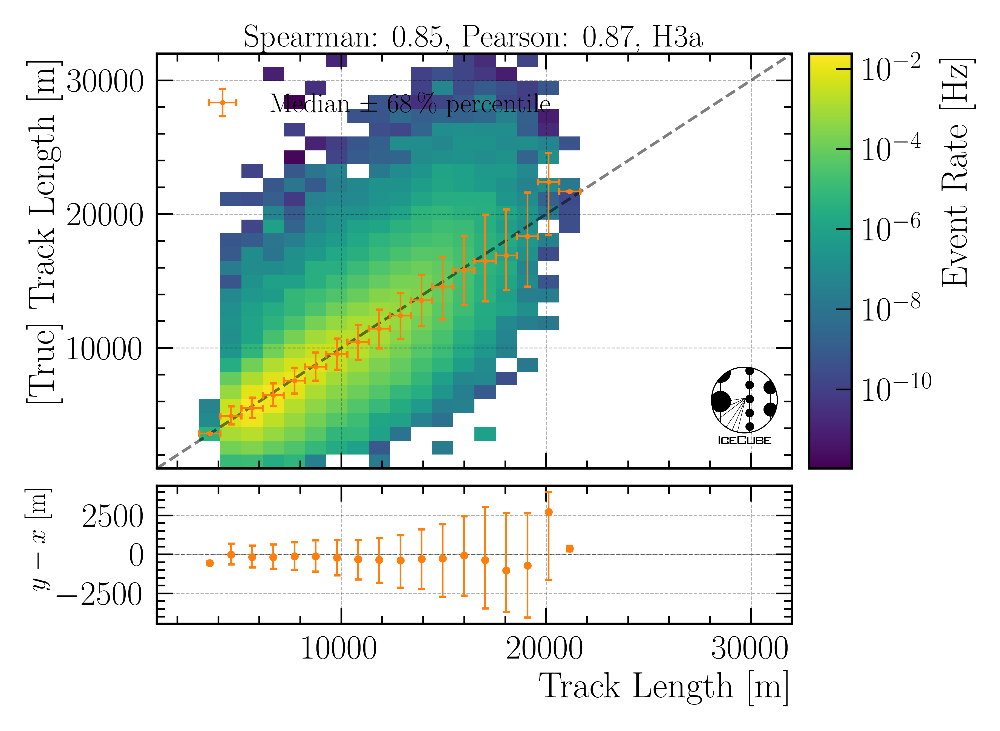

    : The total track length is shown on ``Level4``.

**Track length in detector:**

.. _track_geometry_9inputs_uncleaned_01__LengthInDetector:
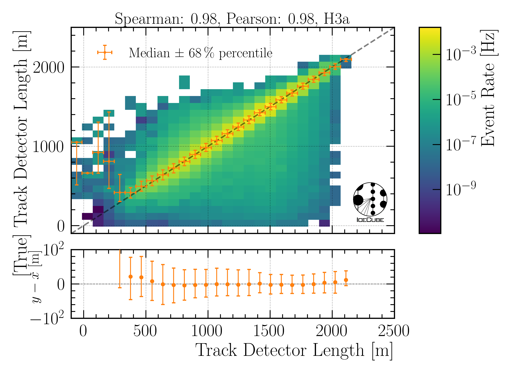

    : The track length in the detector is shown on ``Level4``.

Direction 
---------

**Zenith angle:**

.. _direction_9inputs_6ms_medium_02_03__zenith:
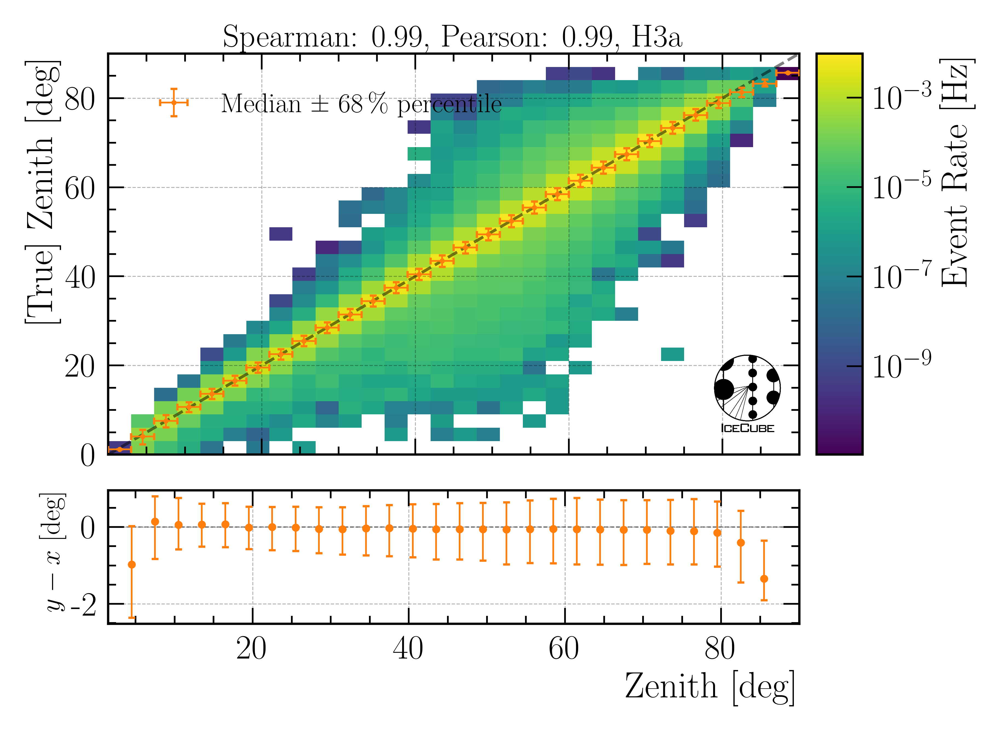

    : The zenith angle is shown on ``Level4``.

**Azimuth angle:**

.. _direction_9inputs_6ms_medium_02_03__azimuth:
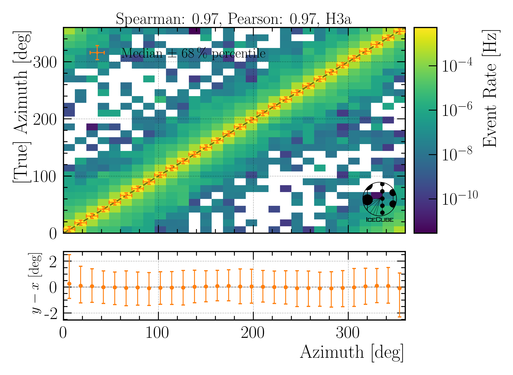

    : The azimuth angle is shown on ``Level4``.

**Angular resolution:**

The angular resolution is defined as the opening angle :math:`\Delta \Psi` between the true and predicted direction. This calculation is done via: 

.. math::
    \begin{align}
        \cos{(\Delta \Psi)} &= \cos{(\phi_{\mathrm{true}} - \phi_{\mathrm{pred}})} \times \sin{(\theta_{\mathrm{true}})} \times \sin{(\theta_{\mathrm{pred}})} 
        + \cos{(\theta_{\mathrm{true}})} \times \cos{(\theta_{\mathrm{pred}})} \\
        \Delta \Psi &= \arccos{(\cos{(\Delta \Psi)})}
    \end{align}

with the azimuth angles :math:`\phi_{\mathrm{true}},\,\phi_{\mathrm{pred}}` and zenith angles :math:`\theta_{\mathrm{true}},\,\theta_{\mathrm{pred}}`

.. _direction_9inputs_6ms_medium_02_03_angular_resolution:
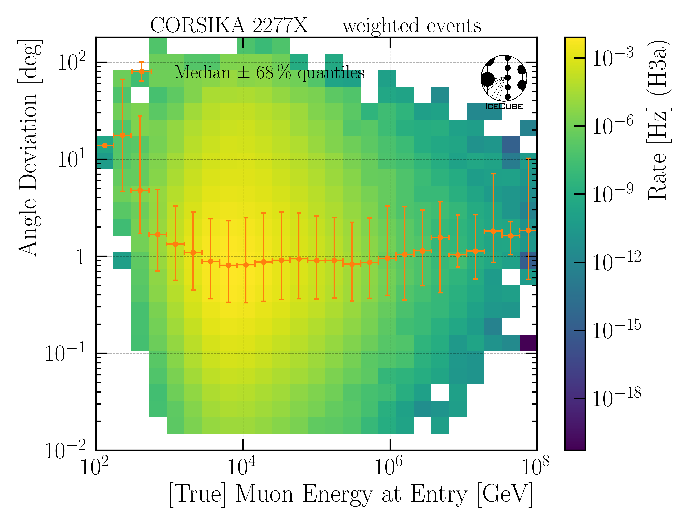

    : The angular resolution is shown on ``Level4``.

.. _SplineMPE vs DNN paragraph:

SplineMPE vs. DNN 
----------------- 

In :numref:`spline mpe all`, the traditional reconstruction SplineMPE is compared to the DNN direction reconstruction on ``Level5``.
Here, OnlineL2 and four different SplineMPE reconstructions are shown. The SplineMPE reconstructions are seeded with the DNN best-fit.
For energies below 100 TeV, the median angular resolution of the DNN performs better than the SplineMPE reconstructions. For energies up to 5 PeV, both method provide similar results, towards higher energies, the statistics becomes low. However, all reconstructions 
perform very similar within the uncertainties.

.. _spline mpe all:
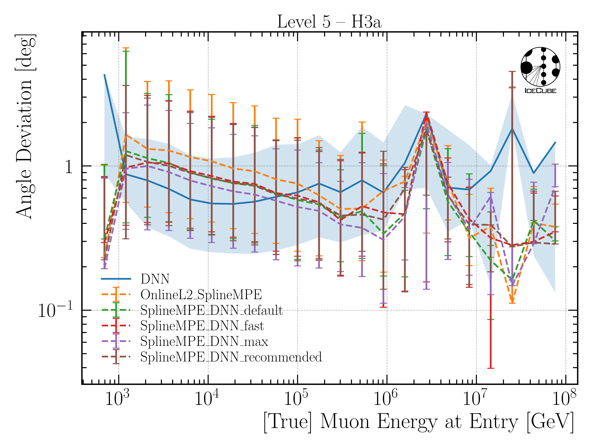

    : The median angular resolution with a 68% interval is shown for different reconstructions on ``Level5``. The DNN only reconstruction is shown in blue, the OnlineL2 reconstruction in orange, and the other four SplineMPE reconstructions are 
    seeded with the DNN best-fit. All reconstructions perform very similar within the uncertainties.

The duration of applying the method SplineMPE to an event is shown in :numref:`spline mpe duration`, and compared to the DNN runtime predictions. The runtime of the DNN for the directional prediction is about 60ms (on a CPU), and the runtime for SplineMPE using the 
recommended setting is about 830ms. Thus, the DNN is more than one order of magnitude faster than SplineMPE. 
Since we are interested in an overall atmospheric muon flux, we are not interested in the best possible angular resolution, 
which is necessary for example in a point source analysis. Given the additional time needed for the SplineMPE reconstruction
and the similar performance, we decided to use the DNN only reconstructions for the directional reconstruction.

.. _spline mpe duration:
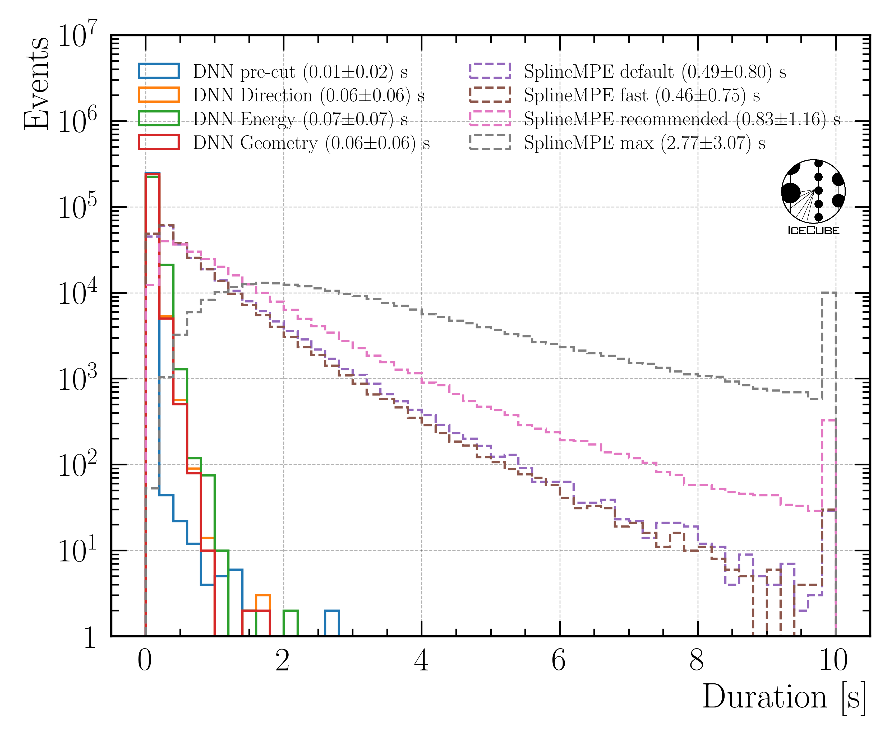

    : The duration of applying SplineMPE to an event and the runtime for the four DNNs are shown on ``Level5``. 

