Reconstructions 
###############

The reconstructions used in this analysis are based on machine learning using the `dnn_reco <https://github.com/icecube/dnn_reco>`_ framework.
We had two bachelor students Leander Flottau and Benjamin Brandt working on angular and 
energy reconstructions. Their bachelor theses are provided on request. Afterwards, we further improved these reconstructions. 
In this chapter, the usage, training data, and network evaluation are presented.

The CNN structure provided in the IceCube framework is explained `here <https://iopscience.iop.org/article/10.1088/1748-0221/16/07/P07041>`_.

Input data 
++++++++++

In :numref:`dnn_input_cnn_paper`, the input features for the CNN are shown.

.. _dnn_input_cnn_paper:
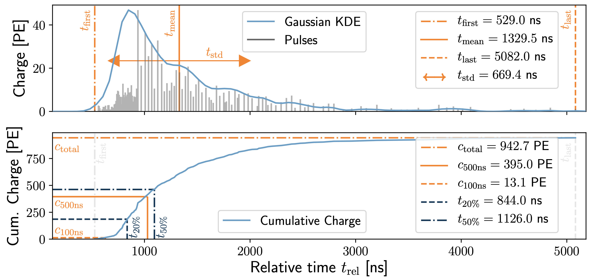

    : All 9 input features for the CNN are shown.

In total, 9 input features are used for the CNN. For the following reconstructions, not only networks with 9 input features are used, 
but also networks with 3 input features. This speeds up the evaluation of the network, since less input features have 
to be calculated. Each feature is calculated per DOM. 

The features of the 3 inputs networks are:

* :math:`c_{\mathrm{total}}:` Total charge: Sum of charge 

* :math:`t_{\mathrm{first}}:` Relative time of first pulse: Relative to total time offset, calculated as the charge weighted mean time of all pulses

* :math:`t_{\mathrm{std}}:` Standard deviation of first pulse: Charge weighted standard deviation of pulse times relative to total time offset

The additional 6 input features are:

* :math:`t_{\mathrm{last}}:` Relative time of last pulse: Relative to total time offset, calculated as the charge weighted mean time of all pulses

* :math:`t_{\mathrm{20\,\%}}:` Relative time of 20% charge: Relative to total time offset, calculated as the charge weighted mean time of all pulses

* :math:`t_{\mathrm{50\,\%}}:` Relative time of 50% charge: Relative to total time offset, calculated as the charge weighted mean time of all pulses

* :math:`t_{\mathrm{mean}}:` Mean time: Charge weighted mean time of all pulses relative to total time offset

* :math:`c_{\mathrm{500ns}}:` Charge at 500ns: Sum of charge after 500ns

* :math:`c_{\mathrm{100ns}}:` Charge at 100ns: Sum of charge after 100ns

Input pulses 
------------

For the input pulses, two different time window cleaning methods are used. On the one hand, there is an internal time cleaning 
in the DNN framework. It depends on a weighted charge and does not set a fixed time window. On the other hand, the following module 
is used with a fixed cleaning of :math:`6000\,\mathrm{ns}`. Both methods use the *SplitInIceDSTPulses* as input.

.. code-block:: python 

    @icetray.traysegment
    def apply_time_window_cleaning(
        tray,
        name,
        InputResponse="SplitInIceDSTPulses",
        OutputResponse="SplitInIceDSTPulsesTWCleaning6000ns",
        TimeWindow=6000 * icetray.I3Units.ns,
    ):
        from icecube import DomTools  # noqa F401

        tray.AddModule(
            "I3TimeWindowCleaning<I3RecoPulse>",
            name,
            InputResponse=InputResponse,
            OutputResponse=OutputResponse,
            TimeWindow=TimeWindow,
        )

----

Training data 
+++++++++++++

The training data are based on four old CORSIKA datasets. Further information are given at `iceprod2 <https://iceprod2.icecube.wisc.edu>`_.

* 20904 
* 21962
* 22020
* 22187 

.. _reconstrected_properties:
Reconstructed properties 
++++++++++++++++++++++++ 

For this analysis, the following properties are reconstructed by 3 different networks.

Energy 
------
* ``entry_energy``: Leading muon energy at the detector entry 
* ``bundle_energy_at_entry``: Muon bundle energy at the detector entry
* ``muon_energy_first_mctree``: Leading muon energy at surface 
* ``bundle_energy_in_mctree``: Muon bundle energy at surface
Track geometry  
--------------
* ``Length``: Propagation length of muon in the ice 
* ``LengthInDetector``: Propagation length of muon in the detector
* ``center_pos_x``: Closest x position of muon to center of the detector
* ``center_pos_y``: Closest y position of muon to center of the detector
* ``center_pos_z``: Closest z position of muon to center of the detector
* ``center_pos_t``: Time of closest approach to the center of the detector
* ``entry_pos_x``: x position of muon at the detector entry
* ``entry_pos_y``: y position of muon at the detector entry
* ``entry_pos_z``: z position of muon at the detector entry
* ``entry_pos_t``: Timer of muon at the detector entry
Direction 
---------
* ``zenith``: Zenith angle of muon 
* ``azimuth``: Azimuth angle of muon

----

Physics motivation
------------------

A muon bundle is defined as a bundle of muons that are produced by the same primary cosmic ray. 
The leading muon is the muon with the highest energy in the bundle. This can be defined by the leadingness, which indicates the ratio between the 
leading muon energy and the total bundle energy. Since it is not possible to reconstruct the 
individual energy of the muons inside a bundle, in the following some MC studies are presented to show ideas, 
how a neural network can be used reconstruct the energy of the leading muon. For this, the stochasticity and 
the bundle radius are investigated.

Stochasticity 
-------------

A muon looses its energy in stochastic processes. Thus, a single muon deposits stochastic energy losses along a track. In a bundle of many muons, every muon has its own stochastic energy losses, which 
appear as a more continuous energy loss in the detector. Hence, if there are very stochastic energy losses detected inside the detector, there are probably only a few muons or a single muon (at low energies). 
If we extend this to high energies, the largest energy losses are caused by the most energetic muon in the bundle. In a bundle in which the muon energies are distributed more equally, also the losses 
appear more continuously. The idea is to search for events that deposit their energy more stochastically to select and/or to improve the energy reconstruction of muons with a high leadingness. 

Monte Carlo studies
-------------------

In :numref:`stochasticity_vs_leadingness`, the leadingness is shown as a function of the bundle stochasticity. A high stochasticity leads to a large leadingness, but only 
for a small amount of events.

.. _stochasticity_vs_leadingness:
.. figure:: images/plots/stochasticity_check/stochasticity_vs_leadingness.png

    : The leadingness is shown as a function of the bundle stochasticity as a weighted distribution.

To get an idea of the correlation between the leading muon energy and the bundle stochasticity, 
in :numref:`MCLabelsLeadingMuons_bundle_stochasticity_vs_MCLabelsLeadingMuons_entry_energy`, the energy of the leading muon is shown as a function of the bundle stochasticity.

.. _MCLabelsLeadingMuons_bundle_stochasticity_vs_MCLabelsLeadingMuons_entry_energy:
.. figure:: images/plots/stochasticity_check/MCLabelsLeadingMuons_bundle_stochasticity_vs_MCLabelsLeadingMuons_entry_energy.png

    : The energy of the leading muon is shown as a function of the bundle stochasticity.

In the following, the title of the plots shows a cut applied on the bundle energy in GeV. Hence, from left to right only high energy muons are selected.

In :numref:`MCLabelsLeadingMuons_bundle_stochasticity_vs_MCLabelsLeadingMuons_leading_energy_rel_entry_bundle_energy_cuts_larger_bins_no_logscale`, 
the leadingness is shown as a function of the bundle stochasticity. High stochasticities lead to a large leadingness, but it removes the entire statistics.

.. _MCLabelsLeadingMuons_bundle_stochasticity_vs_MCLabelsLeadingMuons_leading_energy_rel_entry_bundle_energy_cuts_larger_bins_no_logscale:
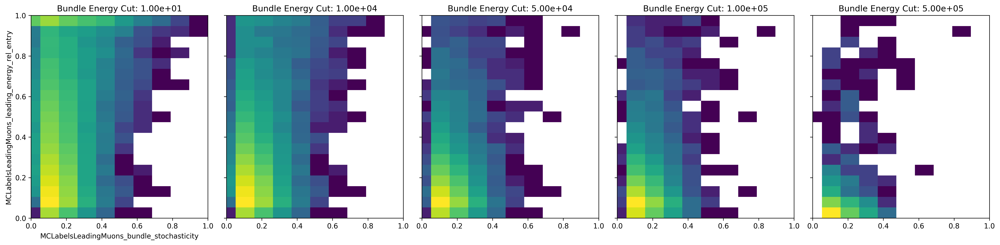

    : The leadingness is shown as a function of the bundle stochasticity.

In :numref:`MCLabelsLeadingMuons_bundle_stochasticity_energy_00_vs_MCLabelsLeadingMuons_leading_energy_rel_entry_bundle_energy_cuts_larger_bins_no_logscale`, 
the leadingness is shown as a function of the largest energy loss. The largest energy loss is not a good indicator for the leadingness.

.. _MCLabelsLeadingMuons_bundle_stochasticity_energy_00_vs_MCLabelsLeadingMuons_leading_energy_rel_entry_bundle_energy_cuts_larger_bins_no_logscale:
.. figure:: images/plots/stochasticity_check/MCLabelsLeadingMuons_bundle_stochasticity_energy_00_vs_MCLabelsLeadingMuons_leading_energy_rel_entry_bundle_energy_cuts_larger_bins_no_logscale.png

    : The leadingness is shown as a function of the largest energy loss.

In :numref:`MCLabelsLeadingMuons_bundle_stochasticity_energy_00_vs_MCLabelsLeadingMuons_entry_energy`, the energy of the leading muon is shown as a function of the largest energy loss. 
The largest energy loss is correlated with the energy of the leading muon. The larger the energy loss, the higher the energy of the leading muon.

.. _MCLabelsLeadingMuons_bundle_stochasticity_energy_00_vs_MCLabelsLeadingMuons_entry_energy:
.. figure:: images/plots/stochasticity_check/MCLabelsLeadingMuons_bundle_stochasticity_energy_00_vs_MCLabelsLeadingMuons_entry_energy.png

    : The energy of the leading muon is shown as a function of the largest energy loss.

In :numref:`bundle_muon_energy_spectrum_stochasticity_cuts`, the energy spectrum of the leading muon is shown for different cuts on the stochasticity. The plot is divided into 
a prompt and conventional component. 
A cut on the stochasticity removes high energy muons. Due to the low statistics expected at high energies for 10 years, 
we do not apply any cuts on the stochasticity.

.. _bundle_muon_energy_spectrum_stochasticity_cuts:
.. figure:: images/plots/stochasticity_check/bundle_muon_energy_spectrum_stochasticity_cuts.png

    : The energy spectrum of the leading muon is shown for different cuts on the stochasticity.

Impact on the energy reconstruction
-----------------------------------

The impact of the stochasticity on the energy reconstruction is shown in the following plots. 

The bundle energy reconstruction for different cuts on the stochasticity is shown in :numref:`bundleE_DeepLearningReco_exported_model_PromptMu_L2_energy_stoch_cut_lower` and
:numref:`bundleE_DeepLearningReco_exported_model_PromptMu_L2_energy_stoch_cut_higher`. A cut on the stochasticity does not improve the bundle energy reconstruction.

.. _bundleE_DeepLearningReco_exported_model_PromptMu_L2_energy_stoch_cut_lower:
.. figure:: images/plots/stochasticity_check_reco_bundle_radius/bundleE_DeepLearningReco_exported_model_PromptMu_L2_energy_stoch_cut_lower.png

    : The bundle energy reconstruction for stochasticities below a certain cut is shown.

.. _bundleE_DeepLearningReco_exported_model_PromptMu_L2_energy_stoch_cut_higher:
.. figure:: images/plots/stochasticity_check_reco_bundle_radius/bundleE_DeepLearningReco_exported_model_PromptMu_L2_energy_stoch_cut_higher.png
    
    : The bundle energy reconstruction for stochasticities above a certain cut is shown.

The leading muon energy reconstruction for different cuts on the stochasticity is shown in :numref:`leadingE_DeepLearningReco_exported_model_PromptMu_L2_energy_stoch_cut_lower` and
:numref:`leadingE_DeepLearningReco_exported_model_PromptMu_L2_energy_stoch_cut_higher`. A cut on the stochasticity does not improve the leading muon energy reconstruction.

.. _leadingE_DeepLearningReco_exported_model_PromptMu_L2_energy_stoch_cut_lower:
.. figure:: images/plots/stochasticity_check_reco_bundle_radius/leadingE_DeepLearningReco_exported_model_PromptMu_L2_energy_stoch_cut_lower.png

    : The leading muon energy reconstruction for stochasticities below a certain cut is shown.

.. _leadingE_DeepLearningReco_exported_model_PromptMu_L2_energy_stoch_cut_higher:
.. figure:: images/plots/stochasticity_check_reco_bundle_radius/leadingE_DeepLearningReco_exported_model_PromptMu_L2_energy_stoch_cut_higher.png

    : The leading muon energy reconstruction for stochasticities above a certain cut is shown.

A cut on the stochasticity does not improve the bundle or leading muon energy reconstruction for the networks presented here. 

Bundle radius 
-------------

Another idea to investigate muons with a high leadingness is to analyze the bundle radius. Depending on the fraction of the energy the most energetic muons carries, 
the projected radius of the 
entire bundle should differ. Here, different radii for the fractional amount of energy inside the projected circle (first order approximation) are studied. 
The bundle radius is defined as the radius of the circle that contains a certain fraction of the energy.

Monte Carlo studies
-------------------

In :numref:`bundle_radius_scale_2`, the bundle radius is shown for different bundle radius quantiles. These range from the energy inside the projected circle 
from 50% to 100%. The same plot is shown for different scalings on the axes. The distributions peak between 5m and 20m, but also radii above 100m are observed.

.. _bundle_radius_scale_2:
.. figure:: images/plots/stochasticity_check_reco_bundle_radius/bundle_radius_scale_2.png

    : The bundle radius is shown for different bundle radius quantiles.

In :numref:`bundle_radius_vs_leadingness`, the leadingness is shown as a function of the bundle radius for a bundle radius quantile of 100%. 
A small bundle radius leads to a high leadingness.

.. _bundle_radius_vs_leadingness:
.. figure:: images/plots/stochasticity_check_reco_bundle_radius/bundle_radius_vs_leadingness.png

    : The leadingness is shown as a function of the bundle radius for a bundle radius quantile of 100% as a weighted distribution.

In the following figures :numref:`bundle_radius_radius_quantile_1.000_leadingness_bundle_energy_cut_no_logscale`, 
the leadingness is shown as a function of the bundle radius for different bundle energy cuts. Large bundle radii lead to a low leadingness.

.. figure:: images/plots/stochasticity_check_reco_bundle_radius/bundle_radius_radius_quantile_0.500_leadingness_bundle_energy_cut_no_logscale.png 

.. figure:: images/plots/stochasticity_check_reco_bundle_radius/bundle_radius_radius_quantile_0.800_leadingness_bundle_energy_cut_no_logscale.png

.. figure:: images/plots/stochasticity_check_reco_bundle_radius/bundle_radius_radius_quantile_0.900_leadingness_bundle_energy_cut_no_logscale.png

.. figure:: images/plots/stochasticity_check_reco_bundle_radius/bundle_radius_radius_quantile_0.950_leadingness_bundle_energy_cut_no_logscale.png

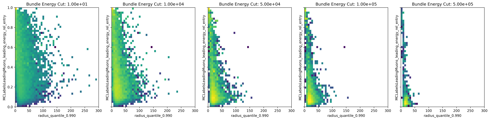

.. _bundle_radius_radius_quantile_1.000_leadingness_bundle_energy_cut_no_logscale:
.. figure:: images/plots/stochasticity_check_reco_bundle_radius/bundle_radius_radius_quantile_1.000_leadingness_bundle_energy_cut_no_logscale.png

    : The leadingness is shown as a function of the bundle radius for different bundle energy cuts.

In :numref:`bundle_radius_radius_quantile_1.000_bundleE_bundle_energy_cut`, the muon bundle energy is shown as a function of the bundle radius for different bundle energy cuts.
For a small amount of events, a large bundle radius indicates a low bundle energy.

.. _bundle_radius_radius_quantile_1.000_bundleE_bundle_energy_cut:
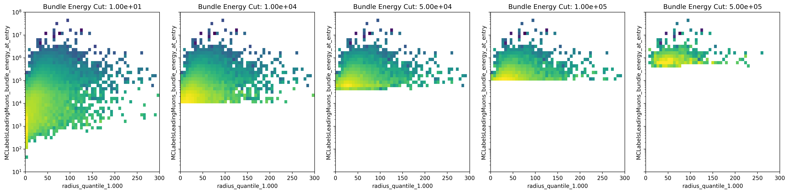

    : The muon bundle energy is shown as a function of the bundle radius for different bundle energy cuts.

In :numref:`bundle_radius_radius_quantile_1.000_leadingE_bundle_energy_cut`, the leading muon energy is shown as a function of the bundle radius for different bundle energy cuts.
For a small amount of events, a large bundle radius indicates a low leading muon energy.

.. _bundle_radius_radius_quantile_1.000_leadingE_bundle_energy_cut:
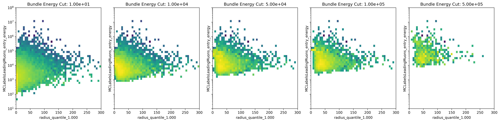

    : The leading muon energy is shown as a function of the bundle radius for different bundle energy cuts.

In :numref:`leadingE_radius_0.990_cut_prompt`, the leading muon energy spectrum is shown for different cuts on the bundle radius. 
A bundle radius quantile of 99% is chosen as a cut parameter. 

.. _leadingE_radius_0.990_cut_prompt:
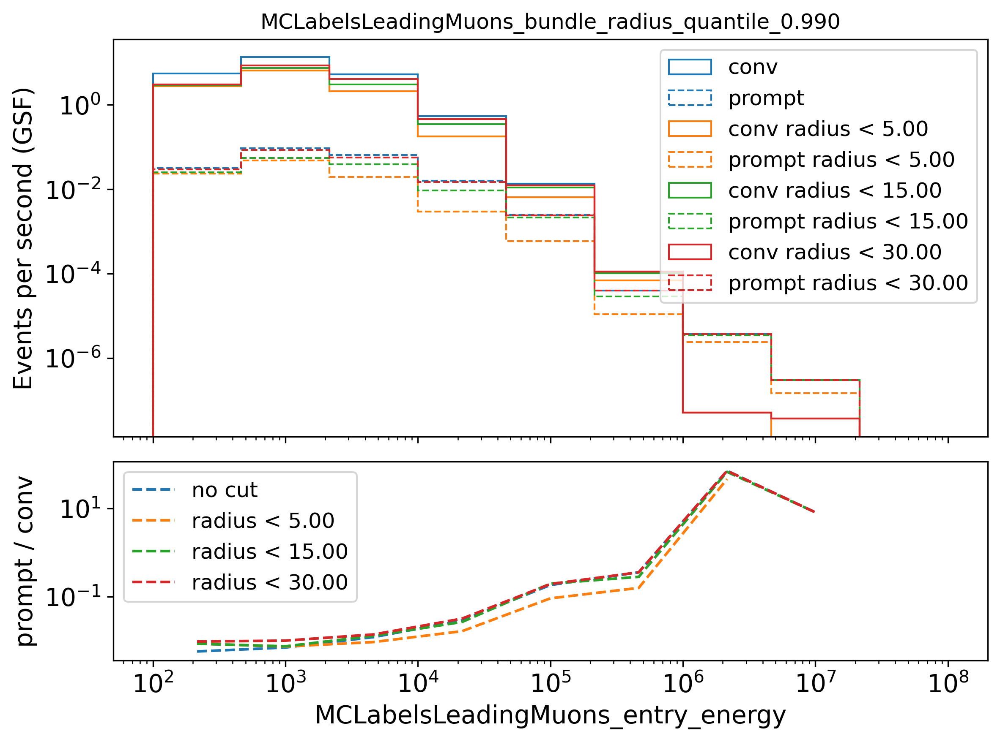

    : The leading muon energy spectrum is shown for different cuts on the bundle radius of the 99% quantile.

In :numref:`leadingE_radius_1.000_cut_prompt`, the leading muon energy spectrum is shown for different cuts on the bundle radius.
A bundle radius quantile of 100% is chosen as a cut parameter.

.. _leadingE_radius_1.000_cut_prompt:
.. figure:: images/plots/stochasticity_check_reco_bundle_radius/leadingE_radius_1.000_cut_prompt.png

    : The leading muon energy spectrum is shown for different cuts on the bundle radius of the 100% quantile.

As mentioned above, a cut on the bundle radius also removes high energy events, thus we do not plan to set a cut.

Impact on the energy reconstruction
-----------------------------------

In :numref:`bundle_radius_radius_quantile_1.000_leadingE_DeepLearningReco_exported_model_PromptMu_L2_energy_radius_cut`, the impact of the bundle radius on the 
reconstruction of the leading muon energy is shown. A bundle radius quantile of 100% is chosen as a cut parameter.

.. _bundle_radius_radius_quantile_1.000_leadingE_DeepLearningReco_exported_model_PromptMu_L2_energy_radius_cut: 
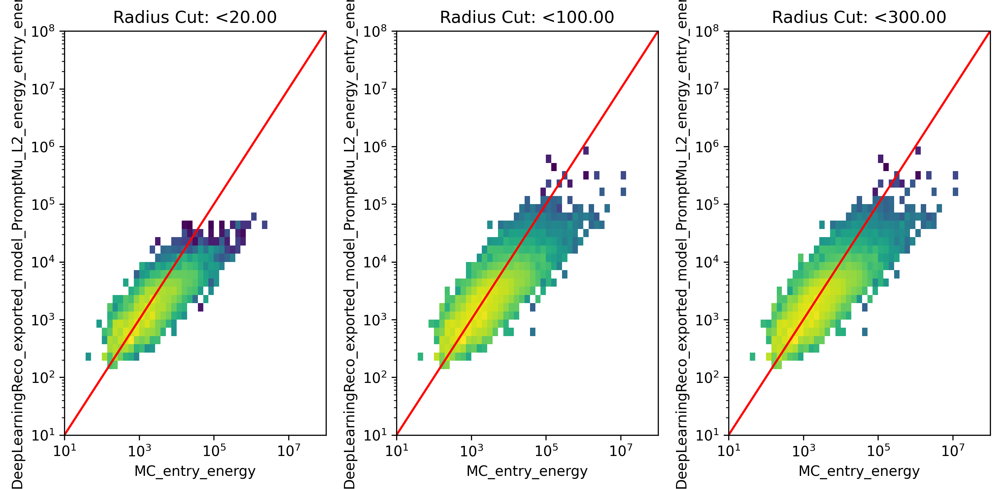

    : The impact of the bundle radius of the 10% quantile on the reconstruction of the leading muon energy is shown.

There is no significant reconstruction improvement due to the application of a bundle radius cut. Instead, high energy 
events are rejected.

Network evaluation 
++++++++++++++++++

In the following, the evaluation of the networks is shown. Each figures contains two plots. The left plots shows the evaluation of all events, 
the right plot shows an uncertainty cut applied on the estimated uncertainty by the network. The evaluation is performed on our own extended 
history simulation dataset. Each plot has the network prediction on the y-axis and the true value on the x-axis. In general, networks are trained with 
3 or 9 inputs and a time window of 6ms or the internal DNN time window cleaning. Furthermore, the CNN layers and nodes are varied. The runtime prediction 
is presented for the usage of a GPU. The preprocessing runtime represents the time needed to create the input features for the network based on the 
input pulses. 

Bundle energy at surface 
------------------------

precut networks:

.. _DeepLearningReco_precut_bundle_energy_3inputs_6ms_at_surface_01_vs_MCLabelsLeadingMuons_bundle_energy_in_mctree:
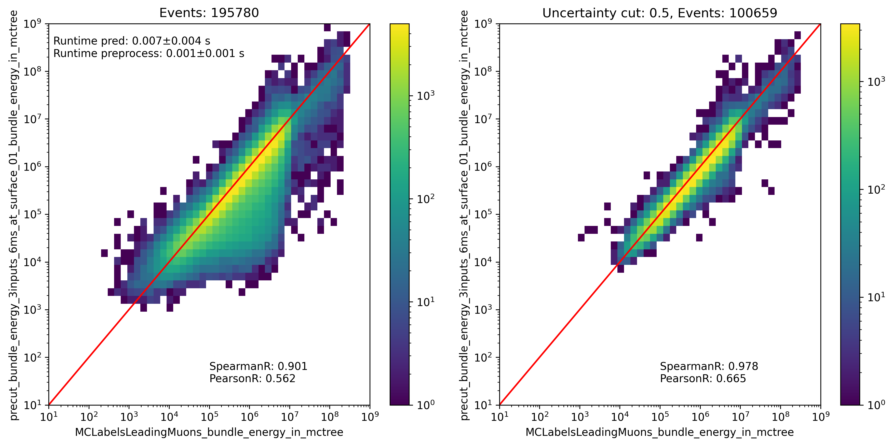

    : The bundle energy at the surface is shown for the network ``DeepLearningReco_precut_bundle_energy_3inputs_6ms_at_surface_01``. It uses 3 inputs 
    and a 6ms time window.

.. _DeepLearningReco_precut_bundle_energy_3inputs_6ms_01_vs_MCLabelsLeadingMuons_bundle_energy_in_mctree:
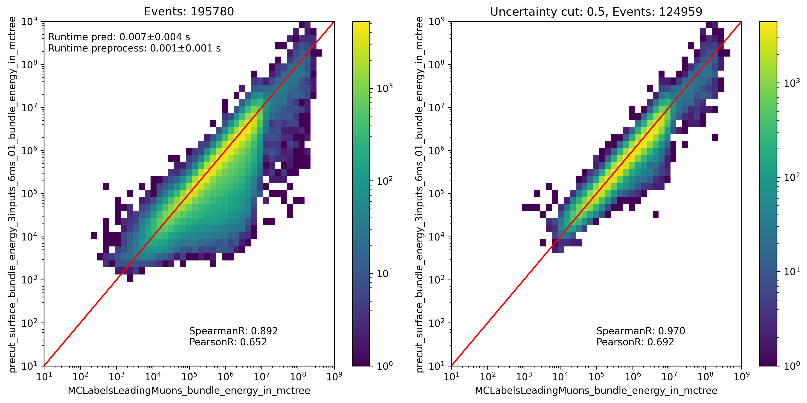

    : The bundle energy at the surface is shown for the network ``DeepLearningReco_precut_surface_bundle_energy_3inputs_6ms_01``. It uses 3 inputs
    and a 6ms time window.

----

.. _DeepLearningReco_leading_bundle_surface_leading_bundle_energy_OC_inputs9_6ms_large_log_02__bundle_energy_in_mctree:
.. figure:: images/plots/model_evaluation/energy/leading_bundle_surface_leading_bundle_energy_OC_inputs9_6ms_large_log_02__bundle_energy_in_mctree.png

    : The bundle energy at the surface is shown for the network ``DeepLearningReco_leading_bundle_surface_leading_bundle_energy_OC_inputs9_6ms_large_log_02``. It uses 9 inputs and a 6ms time window.

.. _DeepLearningReco_leading_bundle_surface_leading_bundle_energy_OC_inputs9_large_log_02__bundle_energy_in_mctree:
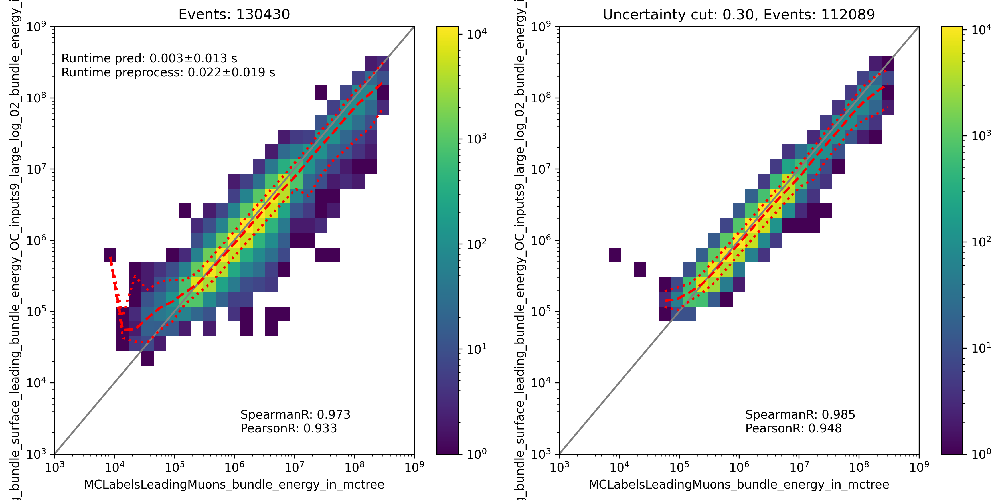

    : The bundle energy at the surface is shown for the network ``DeepLearningReco_leading_bundle_surface_leading_bundle_energy_OC_inputs9_large_log_02``. It uses 9 inputs and the internal DNN time window cleaning.

Bundle energy at entry 
----------------------

.. _DeepLearningReco_leading_bundle_energy_OC_inputs9_6ms_large_log_02__bundle_energy_at_entry:
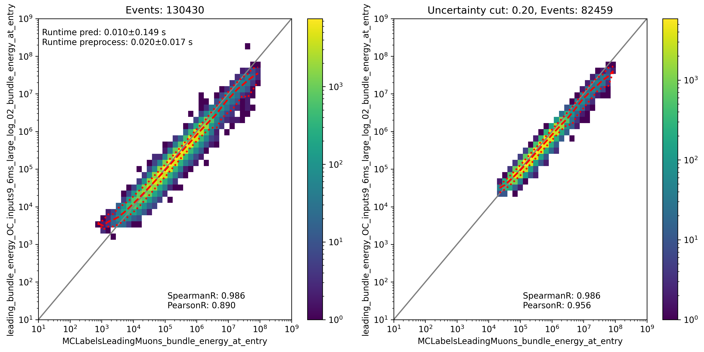

    : The bundle energy at the entry is shown for the network ``DeepLearningReco_leading_bundle_energy_OC_inputs9_6ms_large_log_02``. It uses 9 inputs and a 6ms time window.

.. _DeepLearningReco_leading_bundle_OC_inputs9_large_log_02__bundle_energy_at_entry:
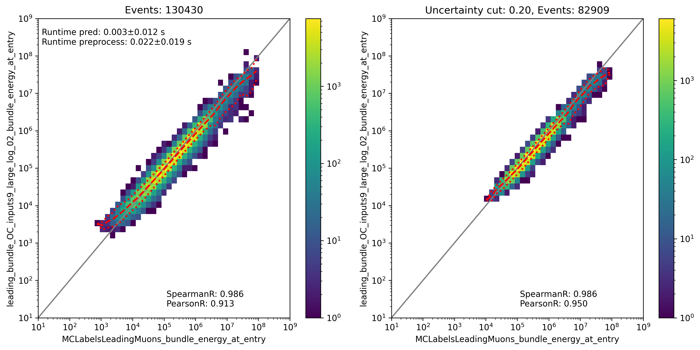

    : The bundle energy at the entry is shown for the network ``DeepLearningReco_leading_bundle_OC_inputs9_large_log_02``. It uses 9 inputs and the internal DNN time window cleaning.

.. _DeepLearningReco_leading_bundle_surface_leading_bundle_energy_OC_inputs9_6ms_large_log_02__bundle_energy_at_entry:
.. figure:: images/plots/model_evaluation/energy/leading_bundle_surface_leading_bundle_energy_OC_inputs9_6ms_large_log_02__bundle_energy_at_entry.png

    : The bundle energy at the entry is shown for the network ``DeepLearningReco_leading_bundle_surface_leading_bundle_energy_OC_inputs9_6ms_large_log_02``. It uses 9 inputs and a 6ms time window.

.. _DeepLearningReco_leading_bundle_surface_leading_bundle_energy_OC_inputs9_large_log_02__bundle_energy_at_entry:
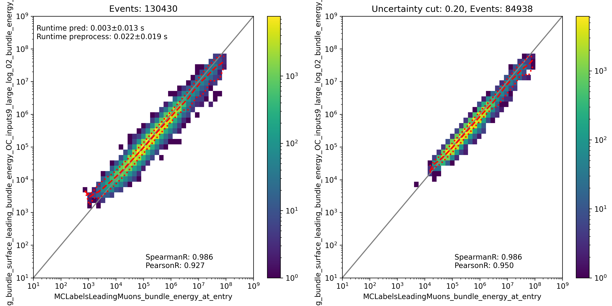

    : The bundle energy at the entry is shown for the network ``DeepLearningReco_leading_bundle_surface_leading_bundle_energy_OC_inputs9_large_log_02``. It uses 9 inputs and the internal DNN time window cleaning.

Leading muon energy at surface
------------------------------

.. _DeepLearningReco_leading_bundle_surface_leading_bundle_energy_OC_inputs9_6ms_large_log_02__muon_energy_first_mctree:
.. figure:: images/plots/model_evaluation/energy/leading_bundle_surface_leading_bundle_energy_OC_inputs9_6ms_large_log_02__muon_energy_first_mctree.png

    : The leading muon energy at the surface is shown for the network ``DeepLearningReco_leading_bundle_surface_leading_bundle_energy_OC_inputs9_6ms_large_log_02``. It uses 9 inputs and a 6ms time window.

.. _DeepLearningReco_leading_bundle_surface_leading_bundle_energy_OC_inputs9_large_log_02__muon_energy_first_mctree:
.. figure:: images/plots/model_evaluation/energy/leading_bundle_surface_leading_bundle_energy_OC_inputs9_large_log_02__muon_energy_first_mctree.png

    : The leading muon energy at the surface is shown for the network ``DeepLearningReco_leading_bundle_surface_leading_bundle_energy_OC_inputs9_large_log_02``. It uses 9 inputs and the internal DNN time window cleaning.

Leading muon energy at entry
----------------------------

.. _DeepLearningReco_leading_bundle_energy_OC_inputs9_6ms_large_log_02__entry_energy:
.. figure:: images/plots/model_evaluation/energy/leading_bundle_energy_OC_inputs9_6ms_large_log_02__entry_energy.png

    : The leading muon energy at the entry is shown for the network ``DeepLearningReco_leading_bundle_energy_OC_inputs9_6ms_large_log_02``. It uses 9 inputs and a 6ms time window.

.. _DeepLearningReco_leading_bundle_OC_inputs9_large_log_02__entry_energy:
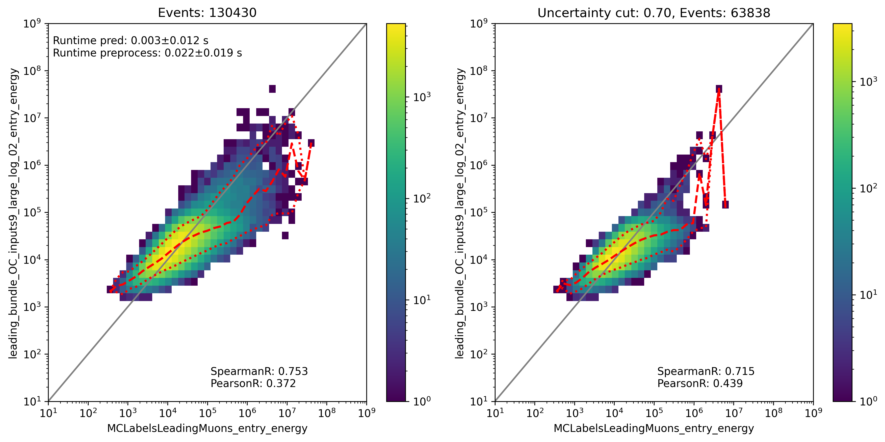

    : The leading muon energy at the entry is shown for the network ``DeepLearningReco_leading_bundle_OC_inputs9_large_log_02``. It uses 9 inputs and the internal DNN time window cleaning.

.. _DeepLearningReco_leading_bundle_surface_leading_bundle_energy_OC_inputs9_6ms_large_log_02__entry_energy:
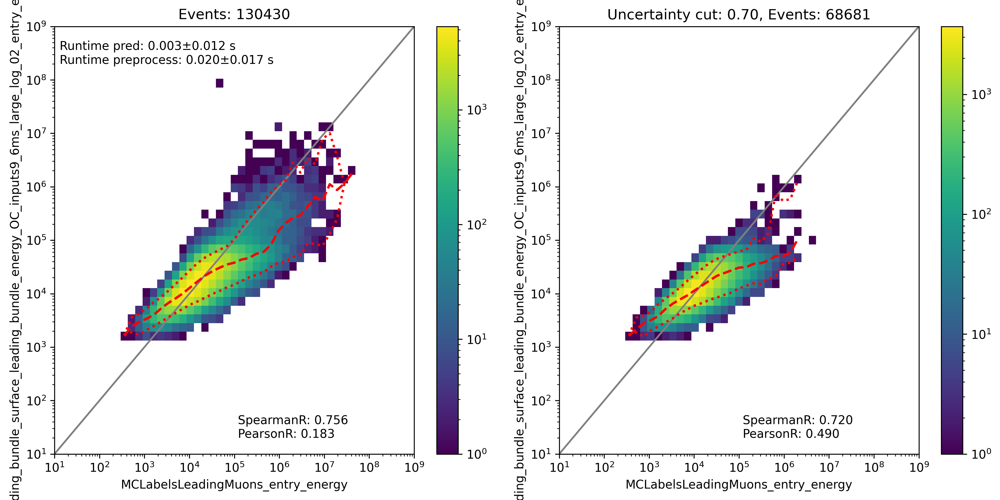

    : The leading muon energy at the entry is shown for the network ``DeepLearningReco_leading_bundle_surface_leading_bundle_energy_OC_inputs9_6ms_large_log_02``. It uses 9 inputs and a 6ms time window.

.. _DeepLearningReco_leading_bundle_surface_leading_bundle_energy_OC_inputs9_large_log_02__entry_energy:
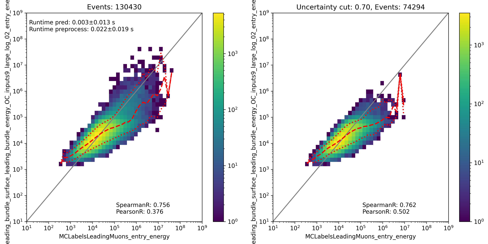

    : The leading muon energy at the entry is shown for the network ``DeepLearningReco_leading_bundle_surface_leading_bundle_energy_OC_inputs9_large_log_02``. It uses 9 inputs and the internal DNN time window cleaning.

---- 

The reconstruction of the leading muon is a difficult task, since the leading muon is accompanied by a bundle of muons. Thus, the emitted cherenkov light of the 
leading muon is superimposed by the light of the other muons. In :numref:`true_muon_energy_fraction`, the true muon energy fraction is shown as a function of the true 
bundle energy, at entry. There is a clear correlation between the true muon energy fraction and the true bundle energy. The distribution is smeared. 
In :numref:`recos_muon_energy_fraction`, the reconstructed muon energy fraction is shown as a function of the reconstructed bundle energy, at entry. This distribution is less smeared. 
Hence, the network seems to reconstruct the bundle energy and tries to refer to the leading muon energy. 

.. _true_muon_energy_fraction:
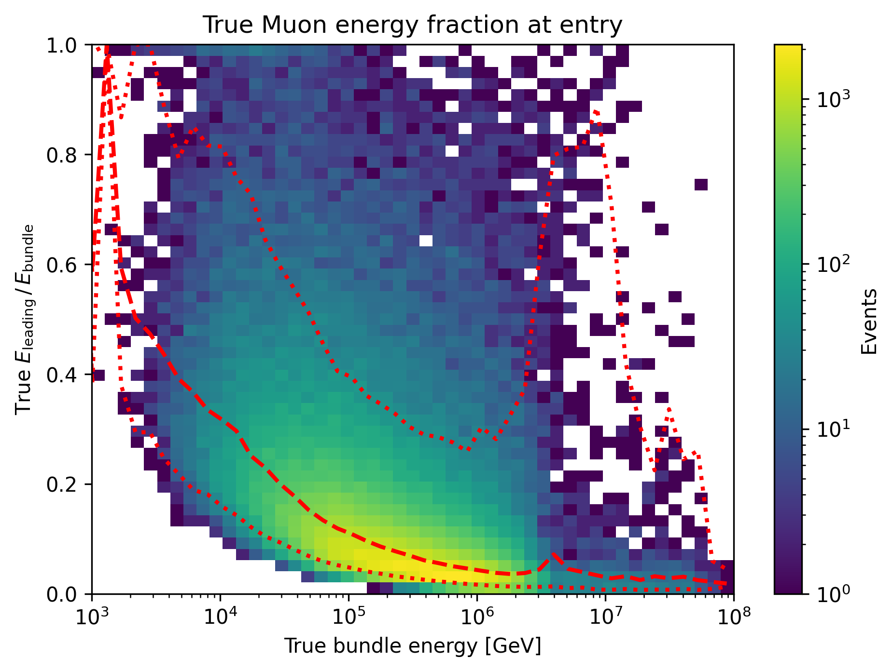

    : The true muon energy fraction is shown as a function of the true bundle energy, at entry.

.. _recos_muon_energy_fraction:
.. figure:: images/plots/model_evaluation/energy/reco_muon_energy_fraction.png

    : The reconstructed muon energy fraction is shown as a function of the true bundle energy, at entry.

Track geometry
--------------

Center time:

.. _track_geometry_9inputs_6ms_medium_01__center_pos_t:
.. figure:: images/plots/model_evaluation/track_geometry/track_geometry_9inputs_6ms_medium_01__center_pos_t.png

    : The center time is shown for the network ``DeepLearningREco_track_geometry_9inputs_6ms_medium_01``. It uses 9 inputs and a 6ms time window.

.. _track_geometry_9inputs_uncleaned_01__center_pos_t:
.. figure:: images/plots/model_evaluation/track_geometry/track_geometry_9inputs_uncleaned_01__center_pos_t.png

    : The center time is shown for the network ``DeepLearningREco_track_geometry_9inputs_uncleaned_01``. It uses 9 inputs and the internal DNN time window cleaning.

Entry time: 

.. _track_geometry_9inputs_6ms_medium_01__entry_pos_t:
.. figure:: images/plots/model_evaluation/track_geometry/track_geometry_9inputs_6ms_medium_01__entry_pos_t.png

    : The entry time is shown for the network ``DeepLearningREco_track_geometry_9inputs_6ms_medium_01``. It uses 9 inputs and a 6ms time window.

.. _track_geometry_9inputs_uncleaned_01__entry_pos_t:
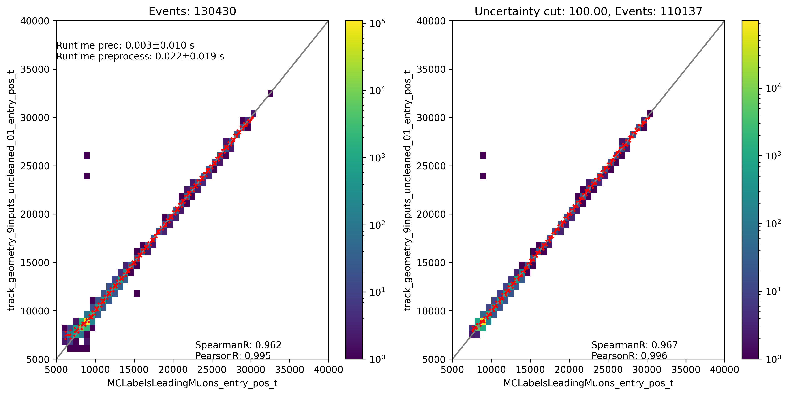

    : The entry time is shown for the network ``DeepLearningREco_track_geometry_9inputs_uncleaned_01``. It uses 9 inputs and the internal DNN time window cleaning.

Center position x:

.. _track_geometry_9inputs_6ms_medium_01__center_pos_x:
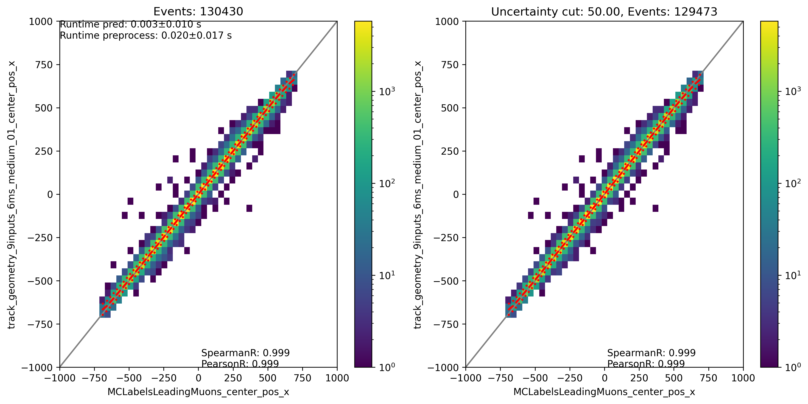

    : The center position x is shown for the network ``DeepLearningREco_track_geometry_9inputs_6ms_medium_01``. It uses 9 inputs and a 6ms time window.

.. _track_geometry_9inputs_uncleaned_01__center_pos_x:
.. figure:: images/plots/model_evaluation/track_geometry/track_geometry_9inputs_uncleaned_01__center_pos_x.png

    : The center position x is shown for the network ``DeepLearningREco_track_geometry_9inputs_uncleaned_01``. It uses 9 inputs and the internal DNN time window cleaning.

Center position y:

.. _track_geometry_9inputs_6ms_medium_01__center_pos_y:
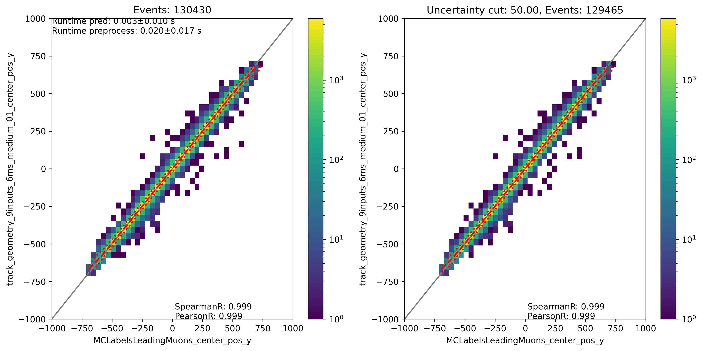

    : The center position y is shown for the network ``DeepLearningREco_track_geometry_9inputs_6ms_medium_01``. It uses 9 inputs and a 6ms time window.

.. _track_geometry_9inputs_uncleaned_01__center_pos_y:
.. figure:: images/plots/model_evaluation/track_geometry/track_geometry_9inputs_uncleaned_01__center_pos_y.png

    : The center position y is shown for the network ``DeepLearningREco_track_geometry_9inputs_uncleaned_01``. It uses 9 inputs and the internal DNN time window cleaning.

Center position z:

.. _track_geometry_9inputs_6ms_medium_01__center_pos_z:
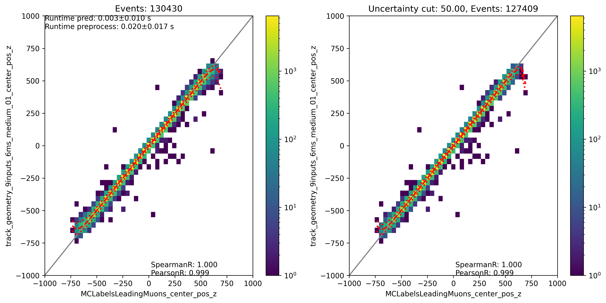

    : The center position z is shown for the network ``DeepLearningREco_track_geometry_9inputs_6ms_medium_01``. It uses 9 inputs and a 6ms time window.

.. _track_geometry_9inputs_uncleaned_01__center_pos_z:
.. figure:: images/plots/model_evaluation/track_geometry/track_geometry_9inputs_uncleaned_01__center_pos_z.png

    : The center position z is shown for the network ``DeepLearningREco_track_geometry_9inputs_uncleaned_01``. It uses 9 inputs and the internal DNN time window cleaning.

Entry position x:

.. _track_geometry_9inputs_6ms_medium_01__entry_pos_x:
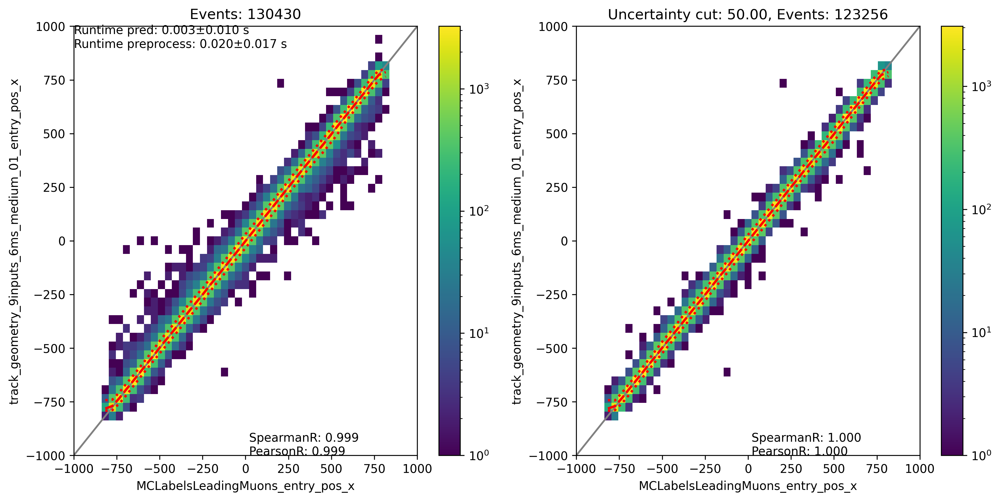

    : The entry position x is shown for the network ``DeepLearningREco_track_geometry_9inputs_6ms_medium_01``. It uses 9 inputs and a 6ms time window.

.. _track_geometry_9inputs_uncleaned_01__entry_pos_x:
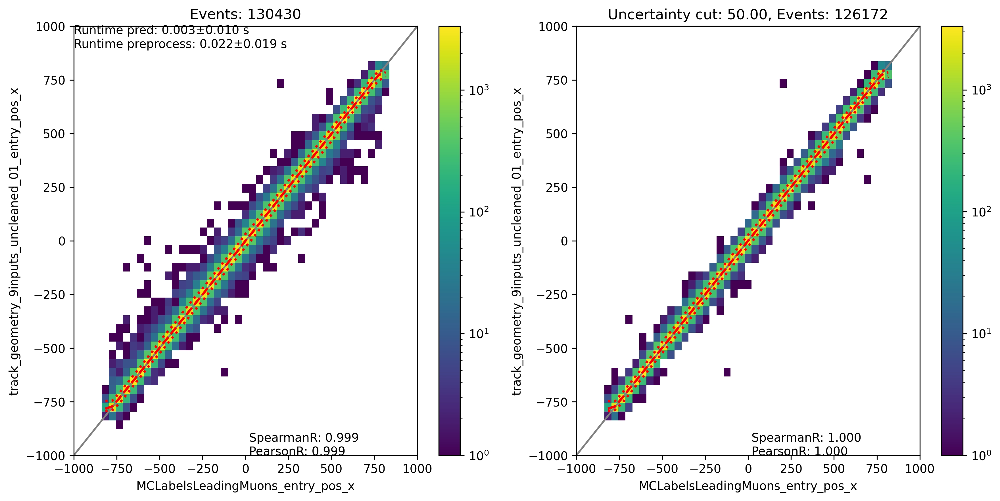

    : The entry position x is shown for the network ``DeepLearningREco_track_geometry_9inputs_uncleaned_01``. It uses 9 inputs and the internal DNN time window cleaning.

Entry position y:

.. _track_geometry_9inputs_6ms_medium_01__entry_pos_y:
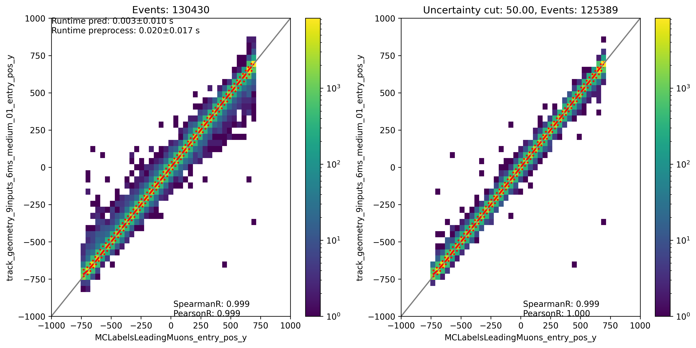

    : The entry position y is shown for the network ``DeepLearningREco_track_geometry_9inputs_6ms_medium_01``. It uses 9 inputs and a 6ms time window.

.. _track_geometry_9inputs_uncleaned_01__entry_pos_y:
.. figure:: images/plots/model_evaluation/track_geometry/track_geometry_9inputs_uncleaned_01__entry_pos_y.png

    : The entry position y is shown for the network ``DeepLearningREco_track_geometry_9inputs_uncleaned_01``. It uses 9 inputs and the internal DNN time window cleaning.

Entry position z:

.. _track_geometry_9inputs_6ms_medium_01__entry_pos_z:
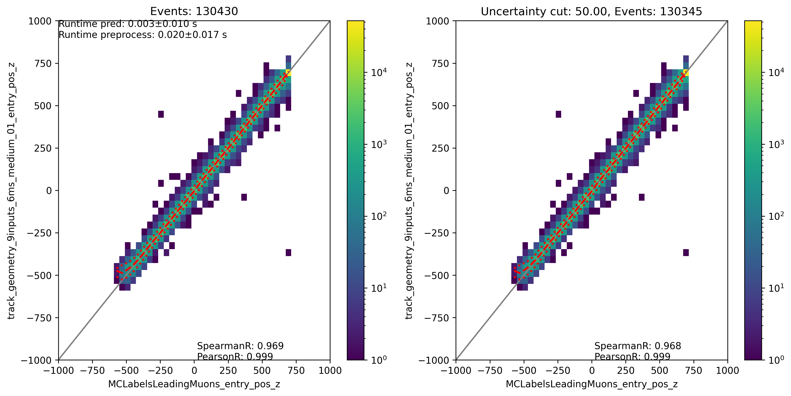

    : The entry position z is shown for the network ``DeepLearningREco_track_geometry_9inputs_6ms_medium_01``. It uses 9 inputs and a 6ms time window.

.. _track_geometry_9inputs_uncleaned_01__entry_pos_z:
.. figure:: images/plots/model_evaluation/track_geometry/track_geometry_9inputs_uncleaned_01__entry_pos_z.png

    : The entry position z is shown for the network ``DeepLearningREco_track_geometry_9inputs_uncleaned_01``. It uses 9 inputs and the internal DNN time window cleaning.

Total track length:

.. _track_geometry_9inputs_6ms_medium_01__Length:
.. figure:: images/plots/model_evaluation/track_geometry/track_geometry_9inputs_6ms_medium_01__Length.png

    : The track length is shown for the network ``DeepLearningREco_track_geometry_9inputs_6ms_medium_01``. It uses 9 inputs and a 6ms time window.

.. _track_geometry_9inputs_uncleaned_01__Length:
.. figure:: images/plots/model_evaluation/track_geometry/track_geometry_9inputs_uncleaned_01__Length.png

    : The track length is shown for the network ``DeepLearningREco_track_geometry_9inputs_uncleaned_01``. It uses 9 inputs and the internal DNN time window cleaning.

Track length in detector:

.. _track_geometry_9inputs_6ms_medium_01__LengthInDetector:
.. figure:: images/plots/model_evaluation/track_geometry/track_geometry_9inputs_6ms_medium_01__LengthInDetector.png

    : The track length in the detector is shown for the network ``DeepLearningREco_track_geometry_9inputs_6ms_medium_01``. It uses 9 inputs and a 6ms time window.

.. _track_geometry_9inputs_uncleaned_01__LengthInDetector:
.. figure:: images/plots/model_evaluation/track_geometry/track_geometry_9inputs_uncleaned_01__LengthInDetector.png

    : The track length in the detector is shown for the network ``DeepLearningREco_track_geometry_9inputs_uncleaned_01``. It uses 9 inputs and the internal DNN time window cleaning.

Direction 
---------

Zenith angle:

.. _direction_9inputs_6ms_medium_02_03__zenith:
.. figure:: images/plots/model_evaluation/direction/direction_9inputs_6ms_medium_02_03__zenith.png

    : The zenith angle is shown for the network ``DeepLearningReco_direction_9inputs_6ms_medium_02_03``. It uses 9 inputs and a 6ms time window.

.. _direction_9inputs_uncleaned_01__zenith:
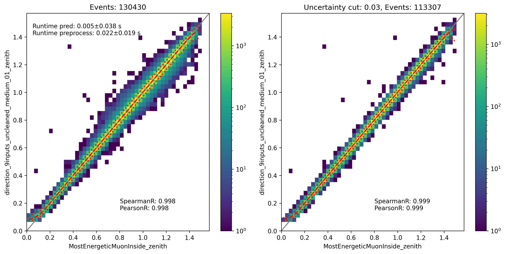

    : The zenith angle is shown for the network ``DeepLearningReco_direction_9inputs_uncleaned_01``. It uses 9 inputs and the internal DNN time window cleaning.

Azimuth angle:

.. _direction_9inputs_6ms_medium_02_03__azimuth:
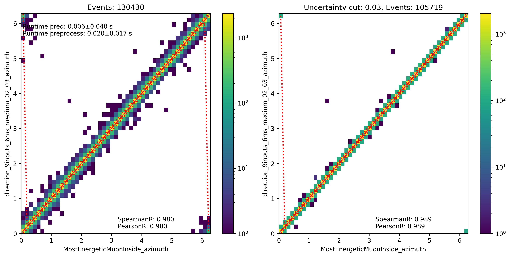

    : The azimuth angle is shown for the network ``DeepLearningReco_direction_9inputs_6ms_medium_02_03``. It uses 9 inputs and a 6ms time window.

.. _direction_9inputs_uncleaned_01__azimuth:
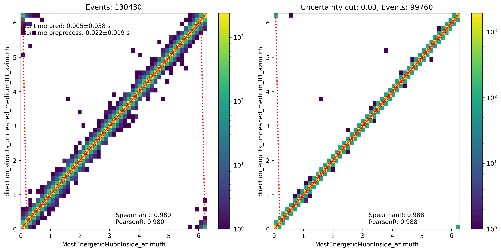

    : The azimuth angle is shown for the network ``DeepLearningReco_direction_9inputs_uncleaned_01``. It uses 9 inputs and the internal DNN time window cleaning.

Angular resolution:

.. _direction_9inputs_6ms_medium_02_03_angular_resolution:
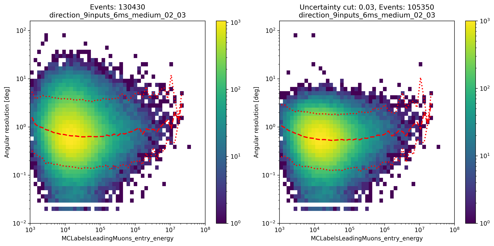

    : The angular resolution is shown for the network ``DeepLearningReco_direction_9inputs_6ms_medium_02_03``. It uses 9 inputs and a 6ms time window.

.. _direction_9inputs_uncleaned_medium_01_angular_resolution:
.. figure:: images/plots/model_evaluation/direction/direction_9inputs_uncleaned_medium_01_angular_resolution.png

    : The angular resolution is shown for the network ``DeepLearningReco_direction_9inputs_uncleaned_01``. It uses 9 inputs and the internal DNN time window cleaning.

Multiplicity 
------------

The multiplicity means the number of muons entering the detector in a bundle. So far, we do not use this information for the analysis, but we 
just wanted to check if it is possible to reconstruct the multiplicity.

.. _DeepLearningReco_precut_bundle_energy_multi_OC_6ms_01_vs_MCLabelsLeadingMuons_num_muons_at_entry:
.. figure:: images/plots/model_evaluation/multiplicity/DeepLearningReco_precut_bundle_energy_multi_OC_6ms_01_vs_MCLabelsLeadingMuons_num_muons_at_entry.png

    : The multiplicity is shown for the network ``DeepLearningReco_precut_bundle_energy_multi_OC_6ms_01``. It uses 3 inputs and a 6ms time window.

.. _DeepLearningReco_precut_bundle_energy_multi_OC_6ms_02_vs_MCLabelsLeadingMuons_num_muons_at_entry::
.. figure:: images/plots/model_evaluation/multiplicity/DeepLearningReco_precut_bundle_energy_multi_OC_6ms_02_vs_MCLabelsLeadingMuons_num_muons_at_entry.png

    : The multiplicity is shown for the network ``DeepLearningReco_precut_bundle_energy_multi_OC_6ms_02``. It uses 3 inputs and a 6ms time window.

.. _DeepLearningReco_precut_bundle_energy_multi_OC_6ms_03_vs_MCLabelsLeadingMuons_num_muons_at_entry:
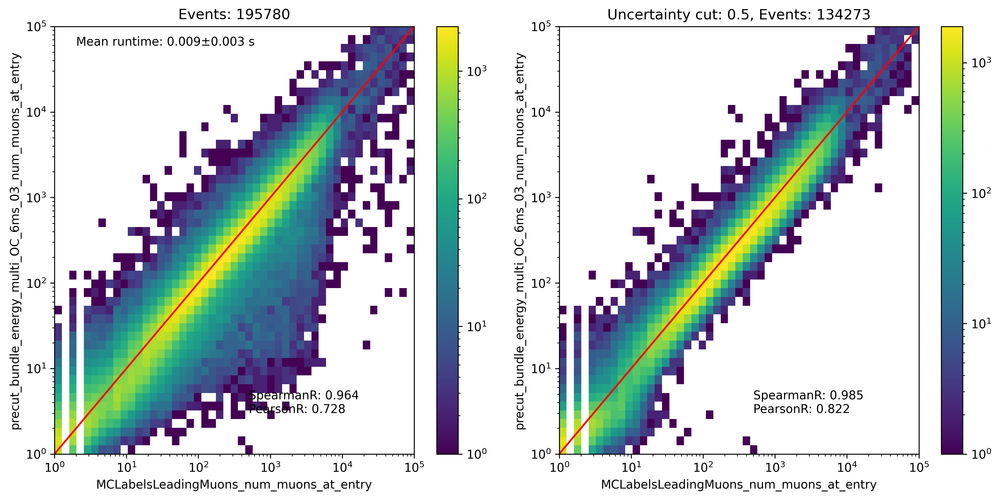

    : The multiplicity is shown for the network ``DeepLearningReco_precut_bundle_energy_multi_OC_6ms_03``. It uses 3 inputs and a 6ms time window.

.. _DeepLearningReco_precut_bundle_energy_multi_OC_6ms_04_vs_MCLabelsLeadingMuons_num_muons_at_entry:
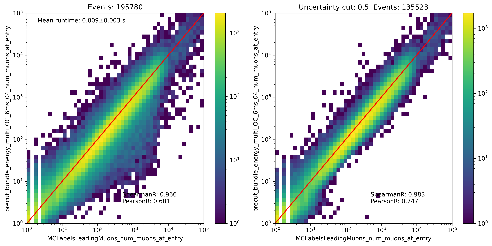

    : The multiplicity is shown for the network ``DeepLearningReco_precut_bundle_energy_multi_OC_6ms_04``. It uses 3 inputs and a 6ms time window.

SplineMPE vs. DNN 
----------------- 

The improvement of SplineMPE to the reconstructed direction is shown below. The DNN only reconstruction is shown 
in red and the network ``DeepLearningReco_direction_9inputs_6ms_medium_02_03`` is used. On the one hand, 
this network is used as a direction seed for SplineMPE. The center position and time are provided by the network 
``DeepLearningReco_track_geometry_9inputs_uncleaned_01`` and the energy is given by 
``DeepLearningReco_leading_bundle_surface_leading_bundle_energy_OC_inputs9_large_log_02`` as the muon entry energy.
Furthermore, also the default OnlineL2 reconstructions are shown. :numref:`spline mpe all` shows the median angular resolution, 
which is around :math:`1^\circ` for all reconstructions. The SplineMPE reconstructions are slightly better.

.. _spline mpe all:
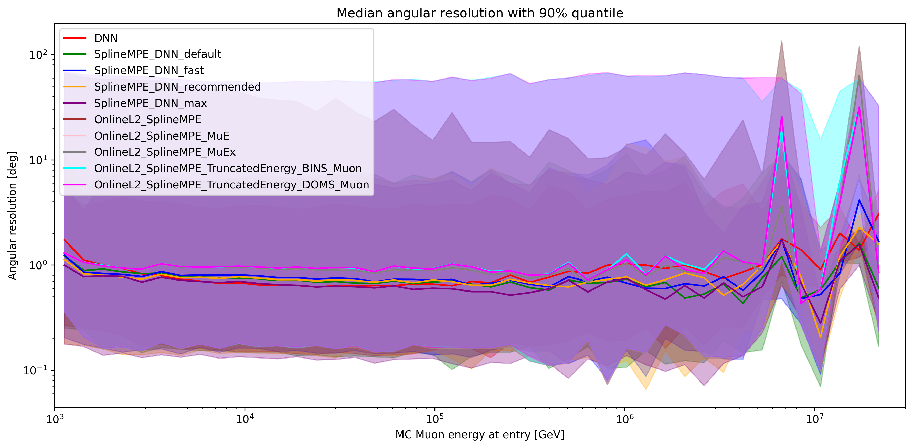

    : The median angular resolution with a 90% containment is shown for all reconstructions.

The improvement of SplineMPE with the DNN seeds is shown in :numref:`spline mpe sub`. At energies around :math:`1\,\mathrm{PeV}` there 
is a small improvement, but the :math:`90\,\%` containment is smallest for the DNN only reconstruction.

.. _spline mpe sub:
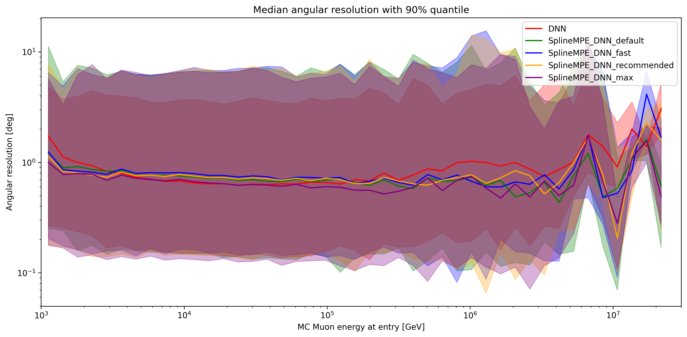

    : The median angular resolution with a 90% containment is shown for DNN seeds only.

The duration of SplineMPE is shown in :numref:`spline mpe duration`. 

.. _spline mpe duration:
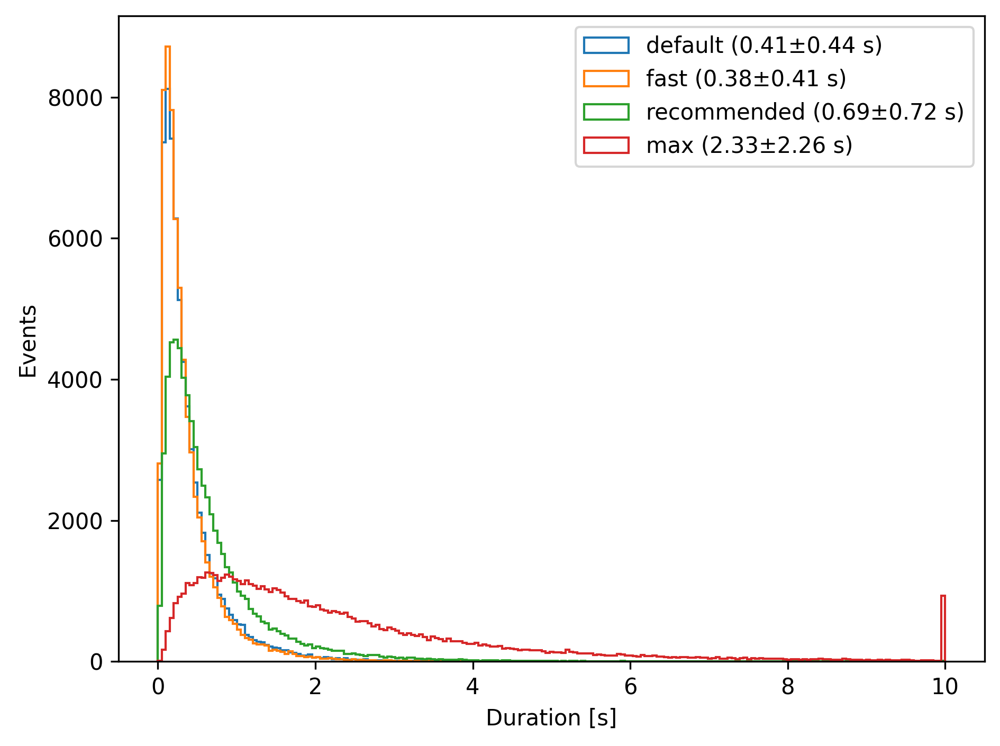

    : The duration of the SplineMPE reconstruction is shown.

Since we are interested in an overall atmospheric muon flux, we are not interested in the best possible angular resolution, 
which is necessary for example in a point source analysis. Given the additional time needed for the SplineMPE reconstruction
and the wider contours, we decided to use the DNN only reconstructions for the directional reconstruction.

Final networks for analysis
+++++++++++++++++++++++++++

* ``DeepLearningReco_precut_surface_bundle_energy_3inputs_6ms_01``: 
* ``DeepLearningReco_direction_9inputs_uncleaned_medium_01``:
* ``DeepLearningReco_leading_bundle_surface_leading_bundle_energy_OC_inputs9_large_log_02``:
* ``DeepLearningReco_track_geometry_9inputs_uncleaned_01``:

----

Networks used for pseudo analysis 
+++++++++++++++++++++++++++++++++

The following networks are the networks used for the pseudo analysis. These networks are at an early stage as it can be seen 
in the performance in comparison to the plots presented above. Thus, this networks will not be used for the final analysis.

Angular reconstructions 
-----------------------
.. figure:: images/plots/data_mc/DeepLearningReco_direction_big_PrimaryAzimuth.pdf

.. figure:: images/plots/data_mc/DeepLearningReco_direction_big_PrimaryZenith.pdf

.. figure:: images/plots/data_mc/DeepLearningReco_direction_big_PrimaryZenith_angle_deviation.pdf 

Left side: only L2 muon filter, right side: L2 muon filter and cut on bundle energy: :math:`E > 10\,\mathrm{TeV}`

.. figure:: images/plots/data_mc/zenith.pdf 

.. figure:: images/plots/data_mc/zenith_cut_1e4.pdf 

Energy reconstructions: muon bundle 
-----------------------------------
.. figure:: images/plots/data_mc/DeepLearningReco_exported_model_PromptMu_L2_energy_bundle_energy_at_entry.pdf

.. figure:: images/plots/data_mc/bundle_energy.pdf

Energy reconstruction: leading muon 
-----------------------------------
.. figure:: images/plots/data_mc/DeepLearningReco_exported_model_PromptMu_L2_energy_entry_energy.pdf

.. figure:: images/plots/data_mc/leading_energy.pdf

