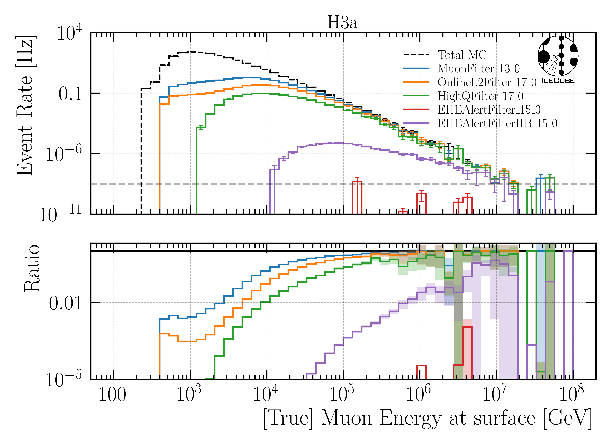

.. _selection paragraph:

Selection 
#########

The starting point for the selection is level 2.  
The rate for all events depends on the underlying primary model. For the common primary models H3a, H4a, GST and GSF, the rates on level2 are shown in 
:numref:`level2_rate`. For example, using H3a, the number of total 
events per run (8h) can be estimated, which is more than 83 Mio. events. 
A single run 
is processed by a single processor unit. Assuming an average processing time 
of 1 second per event, the runtime per run would be longer than 23k hours, which 
is not feasible. Hence, a fast selection is necessary to remove 
statistics. As presented in :numref:`mceq_flux`, the prompt 
muon flux becomes more dominant towards higher energies, and it is 
suppressed by orders of magnitude at lower energies. Thus, low energy muons need 
to be removed. 

.. _level2_rate:
.. list-table:: Rates on level 2 before applying any filter for different primary models.
  :header-rows: 1

  * - Model
    - H3a
    - H4a
    - GST
    - GSF
  * - Level2 rate / Hz
    - 2887.86
    - 2956.16
    - 2725.19
    - 2941.80

In a first step, several filters are investigated in regard 
to the energy of the leading muon at surface and the cosine zenith angle. The muon filter results as the best choice. Afterwards, a cut on the bundle energy at surface is applied to remove more low energy events. These two steps define 
level 3. In level 4, DNN reconstructions for several properties are added. 
In level 5, quality cuts are applied to improve the data-MC agreement.

**Note**
The rates mentioned above are based on the simulations 22774-22778 and the dataset 22875. 
The set 22875 was produced for primary energies from 500 GeV to 10 TeV with very small statistics to estimate the correct rates. 
As presented below in :numref:`efficiency_primary_energy`, due to an energy cut, primary energies below 10 TeV are not relevant 
for this high-energy analysis. Hence, these energies were not considered in the full-statistics CORSIKA simulation.

Level 3 
+++++++

Filters 
-------
The detection of atmospheric prompt muons requires high energy events. Thus, five different filters focusing on high energy events are tested to get rid of low energy events 
while keeping as many as possible high energy events. :numref:`fration_of_passed_events` shows the fraction of passed events for different energy bins, 
filters and weightings.

.. _leading_muon_energy_ratio:

    : Investigating the impact of several filters on level 2 for the leading muon energy at surface.

.. _cos_zenith_ratio:

    : Investigating the impact of several filters on level 2 for the cosine of the primary zenith angle. 

.. _fration_of_passed_events:
.. list-table:: Fraction of events passed filters for different energy bins and weightings. Muon energy at surface is considered.
   :header-rows: 1

   * - Filter
     - 10 TeV < E < 100 TeV
     - 100 TeV < E < 1 PeV
     - 1 PeV < E < 10 PeV
     - 10 PeV < E < 100 PeV 
     - All energies
   * - MuonFilter, GaisserH3a
     - 2.8e-01
     - 7.8e-01
     - 8.3e-01
     - 1.0e+00
     - 1.2e-02
   * - OnlineL2Filter, GaisserH3a
     - 1.2e-01
     - 6.3e-01
     - 7.9e-01
     - 8.6e-01
     - 2.9e-03
   * - HighQFilter, GaisserH3a
     - 3.0e-02
     - 2.8e-01
     - 5.1e-01
     - 6.4e-01
     - 5.1e-04
   * - EHEAlertFilter, GaisserH3a
     - 0.0e+00
     - 1.8e-07
     - 2.0e-05
     - 0.0e+00
     - 4.6e-12
   * - EHEAlertFilterHB, GaisserH3a
     - 2.9e-06
     - 8.3e-04
     - 3.2e-02
     - 2.1e-01
     - 4.4e-08
   * - MuonFilter, GaisserH4a
     - 2.8e-01
     - 7.8e-01
     - 8.0e-01
     - 1.0e+00
     - 1.2e-02
   * - OnlineL2Filter, GaisserH4a
     - 1.2e-01
     - 6.3e-01
     - 7.7e-01
     - 1.0e+00
     - 2.8e-03
   * - HighQFilter, GaisserH4a
     - 2.9e-02
     - 2.7e-01
     - 5.2e-01
     - 6.5e-01
     - 5.0e-04
   * - EHEAlertFilter, GaisserH4a
     - 0.0e+00
     - 1.8e-07
     - 1.2e-04
     - 0.0e+00
     - 7.4e-12
   * - EHEAlertFilterHB, GaisserH4a
     - 2.4e-06
     - 6.5e-04
     - 2.2e-02
     - 2.6e-01
     - 3.6e-08
   * - MuonFilter, GlobalFitGST
     - 2.9e-01
     - 7.8e-01
     - 8.4e-01
     - 1.0e+00
     - 1.1e-02
   * - OnlineL2Filter, GlobalFitGST
     - 1.3e-01
     - 6.3e-01
     - 8.2e-01
     - 1.0e+00
     - 2.7e-03
   * - HighQFilter, GlobalFitGST
     - 3.3e-02
     - 2.9e-01
     - 5.1e-01
     - 6.4e-01
     - 5.4e-04
   * - EHEAlertFilter, GlobalFitGST
     - 0.0e+00
     - 2.4e-07
     - 2.6e-10
     - 0.0e+00
     - 4.4e-12
   * - EHEAlertFilterHB, GlobalFitGST
     - 2.2e-06
     - 5.2e-04
     - 3.0e-02
     - 3.1e-01
     - 2.7e-08
   * - MuonFilter, GlobalSplineFit5Comp
     - 2.7e-01
     - 7.8e-01
     - 7.6e-01
     - 1.0e+00
     - 1.2e-02
   * - OnlineL2Filter, GlobalSplineFit5Comp
     - 1.2e-01
     - 6.2e-01
     - 7.3e-01
     - 9.5e-01
     - 2.6e-03
   * - HighQFilter, GlobalSplineFit5Comp
     - 2.6e-02
     - 2.7e-01
     - 5.6e-01
     - 6.1e-01
     - 4.1e-04
   * - EHEAlertFilter, GlobalSplineFit5Comp
     - 0.0e+00
     - 9.7e-08
     - 2.4e-05
     - 0.0e+00
     - 3.3e-12
   * - EHEAlertFilterHB, GlobalSplineFit5Comp
     - 1.7e-06
     - 4.0e-04
     - 2.7e-02
     - 3.0e-01
     - 2.5e-08

In the final analysis, the lower bound of the muon energy at surface is 10 TeV. As presented in :numref:`fration_of_passed_events`, the MuonFilter 
rejects in total 98.8% of the events, but keeps the most events for the 4 energy intervals between 10 TeV and 100 PeV. Regarding the cosine zenith distribution, 
the HighQFilter removes more horizontal events than the MuonFilter. This is caused by the fact, that horizontal, high energy events travel through a large amount of 
ice and thus have a large amount of energy losses. In the detector, they are not able to pass the high-charge filter, since they arrive with a lower energy. 
Since we want to reconstruct the muon energy at surface, we want to keep these events.  
Hence, the MuonFilter is used.

The rates after the application of the MuonFilter are shown in :numref:`level2_rate_muon_filter`. This results in a runtime of 150h per run with a processing time of 1s per event. This is still too long.

.. _level2_rate_muon_filter:
.. list-table:: Rates on level 2 after applying the muon filter for different primary models.
  :header-rows: 1

  * - Model
    - H3a
    - H4a
    - GST
    - GSF
  * - Leve2 rate after muon / Hz
    - 18.43
    - 18.83
    - 17.41
    - 17.85 

Bundle energy pre cut 
---------------------
To further reduce the number of events in the low energy region, a cut on the bundle energy at surface is applied. For this, 
the efficiency as a ratio of the number of events before and after the cut is calculated. The cut is applied in a way, that the remaining rate is :math:`125\,\mathrm{mHz}`. Additionally, a cut of :math:`500\,\mathrm{TeV}` is applied on the bundle energy at surface. The rate of :math:`125\,\mathrm{mHz}` is motivated by the estimation of a feasible runtime of 1h per run with a processing time of 1s per event.

In the following, 5 plots are shown which present the efficiency for 
the bundle and leading muon energy at surface and detector entry and 
for the primary energy.

.. _efficiency_bundle_energy_at_entry:

    : Efficiency for the bundle energy at entry.

.. _efficiency_bundle_energy_at_surface:

    : Efficiency for the bundle energy at entry.

.. _efficiency_muon_energy_at_entry:

    : Efficiency for the bundle energy at entry.

.. _efficiency_muon_energy_at_surface:

    : Efficiency for the bundle energy at entry.

.. _efficiency_primary_energy:

    : Efficiency for the bundle energy at entry.

For our level 3, we apply the MuonFilter and a cut of :math:`500\,\mathrm{TeV}` on the bundle energy at surface. The remaining rate is :math:`144.3\,\mathrm{mHz}`. The network 
``DeepLearningReco_precut_surface_bundle_energy_3inputs_6ms_01`` is used. 

Level 4 
+++++++

On level 4, we do not apply any filters and we do not remove any events. We just add the DNN reconstructions mentioned in the reconstruction section. For this, the following networks are added:

* ``DeepLearningReco_direction_9inputs_6ms_medium_02_03``
* ``DeepLearningReco_leading_bundle_surface_leading_bundle_energy_OC_inputs9_6ms_large_log_02``
* ``DeepLearningReco_track_geometry_9inputs_6ms_medium_01``

Already added in step 3:

* ``DeepLearningReco_precut_surface_bundle_energy_3inputs_6ms_01``

In :numref:`DNN_reconstruction_runtimes`, the runtimes for the DNN reconstructions are shown. The preprocessing time is needed to create the input features for the DNNs based on the 
input pulses. The preprocessing time of the precut network is faster, since only 3 input features instead of 9 features are calculated. 
The CPU and GPU times are the runtimes needed to apply the DNNs on the respective device.

.. _DNN_reconstruction_runtimes:
.. list-table:: DNN reconstruction runtimes 
    :widths: 33 33 33 33
    :header-rows: 1 

    * - Network
      - Preprocessing / ms 
      - CPU / ms 
      - GPU / ms
    * - Direction
      - 22 ± 20  
      - 106 ± 42 
      - 5 ± 38 
    * - Energy 
      - 22 ± 20
      - 144 ± 56 
      - 3 ± 13 
    * - Track geometry
      - 22 ± 20 
      - 106 ± 42 
      - 3 ± 10
    * - precut 
      -  1 ± 1
      - 11 ± 1
      - 7 ± 4

Level 5
+++++++

Cuts presented here are based on the plots in :ref:`Data-MC <data-mc level 4 paragraph>`.

For level 5, quality cuts are performed to improve the data-MC agreement. Furthermore, some additional cuts are performed to remove neutrino background events. For the reconstruction of the bundle energy, the 
network learns, that if an event is entering the detector from the 
horizon, it must be very high-energetic because it was able to pass the 
Earth. Cutting away events from the horizon removes these neutrino events. 
The third category of cuts is based on the uncertainty estimation 
provided by the DNN reconstructions as mentioned before. 

In :numref:`containment_cuts`, the cuts to improve data-MC based on the detector geometry are presented. In :numref:`neutrino_cuts`, the cuts to remove neutrino background events are shown. :numref:`uncertainty_cuts` shows the cuts based on the uncertainty estimation.

.. _containment_cuts:
.. list-table:: Containment Cuts
   :header-rows: 1

   * - Containment Cuts
     - >
     - <
   * - length in detector
     - 1000 m
     - 2000 m
   * - entry pos x, y
     - -750 m
     - 750 m
   * - entry pos z
     - -500 m
     - 750 m
   * - center pos x, y
     - -550 m
     - 550 m
   * - center pos z
     - -650 m
     - 650 m

.. _neutrino_cuts:
.. list-table:: Neutrino Cuts
   :header-rows: 1

   * - Neutrino Cuts
     - >
     - <
   * - cos(zenith)
     - 0.2
     - 
   * - length
     - 5000 m
     - 15000 m

.. _uncertainty_cuts:
.. list-table:: Uncertainty Cuts
   :header-rows: 1

   * - Uncertainty Cuts
     - <
   * - bundle energy at entry
     - 0.9 log10(GeV)
   * - bundle energy at surface
     - 2.0 log10(GeV)
   * - zenith
     - 0.1 rad
   * - azimuth
     - 0.2 rad
   * - entry pos x, y, z
     - 42 m
   * - center pos x, y, z
     - 50 m
   * - entry pos time
     - 200 ns
   * - center pos time
     - 600 ns
   * - length in detector
     - 160 m
   * - length
     - 2000 m