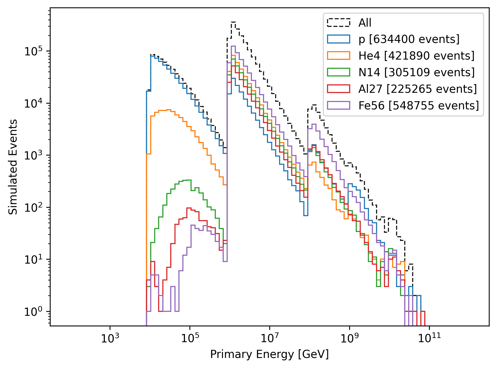
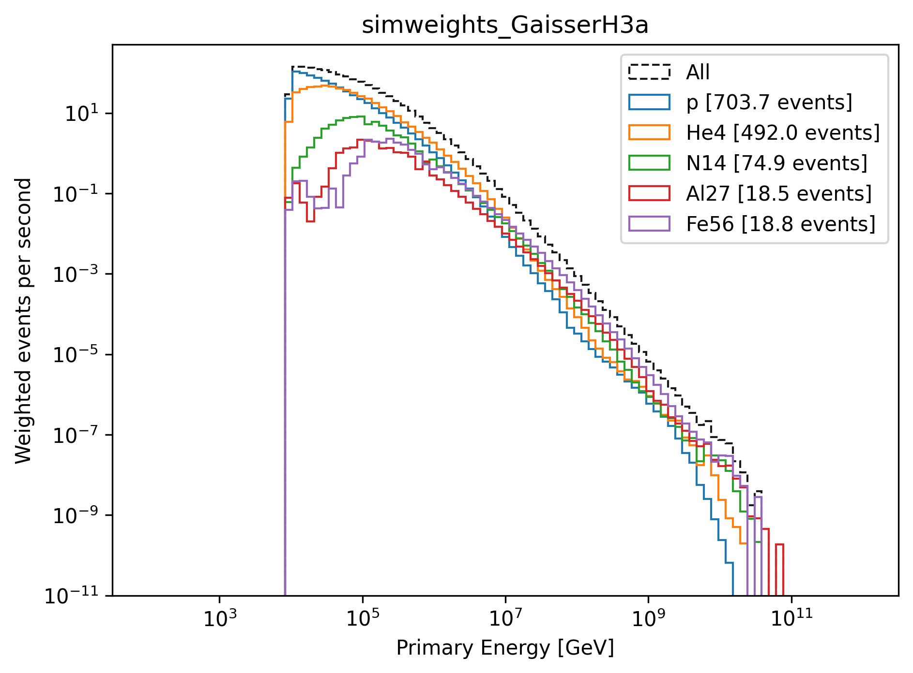

New CORSIKA extended history simulations
########################################

For this analysis, new CORSIKA simulations with the ``EXTENDED HISTORY`` option enabled have been performed using the official IceCube `IceProd <https://iceprod.icecube.aq>`_ framework.

New CORSIKA datasets are stored at: 

* /data/sim/IceCube/2023/generated/CORSIKA_EHISTORY/generated/ 
    (official datasets: 22875, 22774, 22775, 22776, 22777, 22778)

Official CORSIKA Ehist IceProd simulation 
+++++++++++++++++++++++++++++++++++++++++

The different datasets correspond to different primary energy ranges:

* 22875: 6e2 GeV - 1e4 GeV
* 22774: 1e4 GeV - 1e6 GeV 
* 22775: 1e6 GeV - 1e8 GeV
* 22776: 1e8 GeV - 1e9 GeV
* 22777: 1e9 GeV - 1e10 GeV
* 22778: 1e10 GeV - 1e11 GeV

The following settings are used:

* CORSIKA version 77500 

* SIBYLL 2.3d 

* Icetray 1.11.0-rc1

* 5 components (p, He, N, Al, Fe)

* Zenith angle: 0 - 90 degrees

* Polyplopia: False (no coincident events are simulated)

* Ecuts1: 273 GeV (hadron min energy)

* Ecuts2: 273 GeV (muon min energy)

* Ecuts3: 273 GeV (electron min energy)

* Ecuts4: 273 GeV (photon min energy)

* TrimShower: False 

* Atmosphere: all 12 seasons (defined `here <https://wiki.icecube.wisc.edu/index.php/Real_atmosphere_for_CORSIKA>`_)

The detailed settings can be found in the config files at `IceProd <https://iceprod2.icecube.wisc.edu>`_

(Note: The low-energy dataset 22875 was simulated at a later time to check, whether some events would make it into the final sample after all cuts have been applied. For the number of generated Events (48k files times 3 million events per file), this is not the case. However, in all other plots shown in this wiki, this dataset is not included.)

---- 

In the following two figures, the primary energy distribution of the simulated CORSIKA Ehist IceProd datasets is shown on level 2 
for the different primary particles. No cuts or filters are applied. This is not the entire statistics, but a subset of the data.
The relative ratios of the primaries are different for each dataset to match the contributions of the 
primaries to the weighted, physical primary flux.

    : Primary energy distribution of the simulated CORSIKA Ehist IceProd datasets is shown on level 2. Not cuts or filters 
    are applied. This is not the entire statistics, but a subset of the data.

    : Primary energy distribution of the simulated CORSIKA Ehist IceProd datasets is shown on level 2. The weights are applied 
    using the GaisserH3a flux model.

v1.11.0-rc1 code fix 
++++++++++++++++++++

.. note:: To reproduce the exact same simulation as we did, a simple code modification is necessary. In the icetray version 1.11.0-rc1, a bug was introduced that we fixed locally without committing to move on with our simulation. This fix is mentioned below.

.. _diff_changes:

The following code modifications were made:

.. code-block:: diff

    diff --git a/KalmanFilter/python/KalmanFilter.py b/KalmanFilter/python/KalmanFilter.py
    index 8e6c04d..1616a90 100644
    --- a/KalmanFilter/python/KalmanFilter.py
    +++ b/KalmanFilter/python/KalmanFilter.py
    @@ -30,8 +30,12 @@ class SlowMPHit:
    
     def hitfilter(frame, inputMapName, ignoreDC=False):
    
    -    inputMap = dataclasses.I3RecoPulseSeriesMap.from_frame(frame, inputMapName)
    -
    +    #inputMap = dataclasses.I3RecoPulseSeriesMap.from_frame(frame, inputMapName)
    +    if type(frame[inputMapName]) == dataclasses.I3RecoPulseSeriesMapMask:
    +        inputMap = frame[inputMapName].apply(frame)
    +    else:
    +        inputMap = frame[inputMapName]
    +
         hitlist = [
             SlowMPHit(omkey, pulse.time, pulse)
             for omkey, recoPulseVector in inputMap
    diff --git a/sim-services/private/sim-services/MCPEMCPulseTools.cxx b/sim-services/private/sim-services/MCPEMCPulseTools.cxx
    index b29234f..1d02365 100644
    --- a/sim-services/private/sim-services/MCPEMCPulseTools.cxx
    +++ b/sim-services/private/sim-services/MCPEMCPulseTools.cxx
    @@ -118,11 +118,11 @@ public:
                 PushFrame(frame);
                 return;
             }
    -        if(frame->Has(inputName+"ParticleIDMap")){
    -            log_warn_stream("Frame already contains " << (inputName+"ParticleIDMap")
    -                             << " suggesting that " << inputName << " is already compressed!"
    -                             << " Make sure that merging again is what you intent do.");
    -        }
    +        //if(frame->Has(inputName+"ParticleIDMap")){
    +        //    log_warn_stream("Frame already contains " << (inputName+"ParticleIDMap")
    +        //                     << " suggesting that " << inputName << " is already compressed!"
    +        //                     << " Make sure that merging again is what you intent do.");
    +        //}

             //We have to copy all of the input data. This is gonna hurt.
             boost::shared_ptr<I3Map<OMKey,std::vector<I3MCPE>>> hits=
    diff --git a/topeventcleaning/private/topeventcleaning/I3TankPulseMerger.cxx b/topeventcleaning/private/topeventcleaning/I3TankPulseMerger.cxx
    index e57d647..6977da4 100644
    --- a/topeventcleaning/private/topeventcleaning/I3TankPulseMerger.cxx
    +++ b/topeventcleaning/private/topeventcleaning/I3TankPulseMerger.cxx
    @@ -144,10 +144,10 @@ void I3TankPulseMerger::GrabBadTanksAndDOMs(I3FramePtr frame)
         if (badDOMList) {
           badDOMs_.clear();
           badDOMs_.insert(badDOMList->begin(), badDOMList->end());
    -    } else {
    -      log_warn("Bad DOM list '%s' not in the frame. Not updating.",
    -	       badDOMListName_.c_str());
    -    }
    +    }// else {
    +    //  log_warn("Bad DOM list '%s' not in the frame. Not updating.",
    +    //      badDOMListName_.c_str());
    +    //}
       }

       if (!badTankListName_.empty()) {
    @@ -156,10 +156,10 @@ void I3TankPulseMerger::GrabBadTanksAndDOMs(I3FramePtr frame)
         if (badTankList) {
           badTanks_.clear();
           badTanks_.insert(badTankList->begin(), badTankList->end());
    -    } else {
    -      log_warn("Bad tank list '%s' not in the frame. Not updating.",
    -	       badTankListName_.c_str());
    -    }
    +    }// else {
    +     // log_warn("Bad tank list '%s' not in the frame. Not updating.",
    +     //     badTankListName_.c_str());
    +    //}
       }

First unofficial test simulations
+++++++++++++++++++++++++++++++++

At first, in 2023 test simulations were performed using the software `simulation_scripts <https://github.com/tudo-astroparticlephysics/simulation_scripts>`_. 
This software is a framework similar to IceProd, but it is used for local simulations on our Madison cluster. It imports all the icetray functions that are used in 
any other IceCube simulation. The main difference is that this framework is maintained locally in Dortmund and thus it's easier to adapt to our needs.

The test datasets are named ``30010``, ``30011``, ``30012`` and ``30013``. Caution, these numbers do **not** correspond to the official dataset numbers.
We used these simulations to develop and test this analysis of the prompt component of the atmospheric muon flux. 
First dataset explorations are stored in :ref:`Appendix/First extended history simulations <first extended history simulations paragraph>`. 

These datasets can be found here:

* /data/sim/IceCube/2023/generated/CORSIKA_EHISTORY/ 
    (test datasets: 30010, 30011, 30012, 30013)