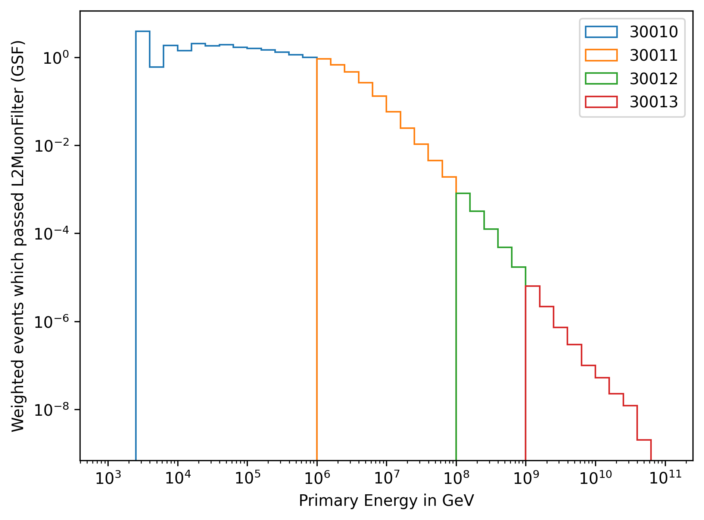
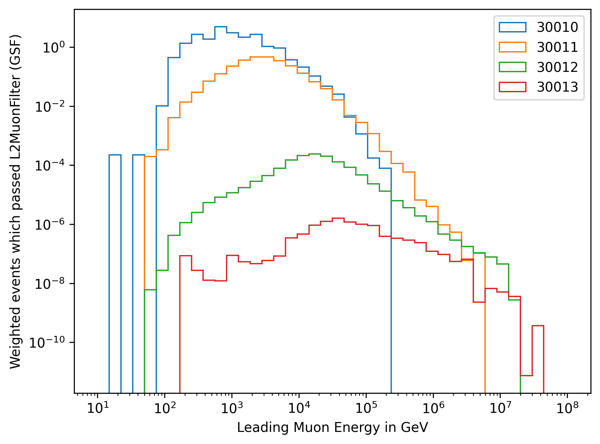
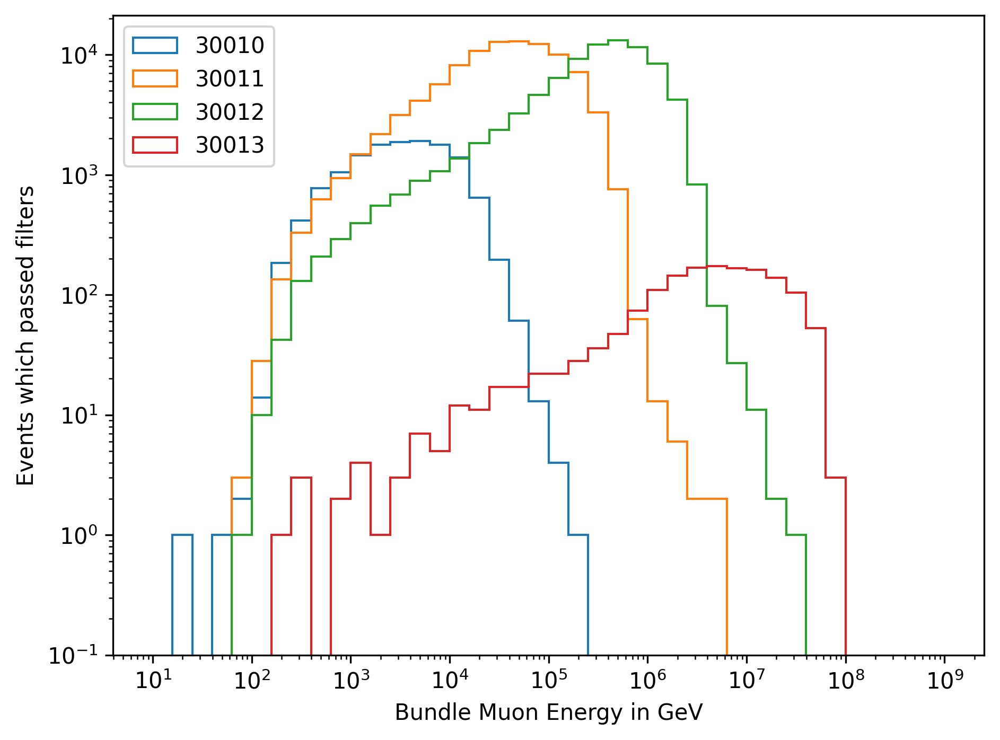
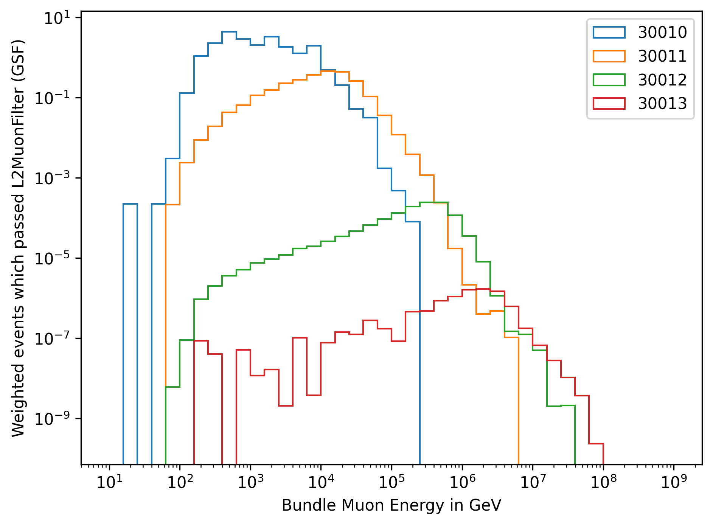
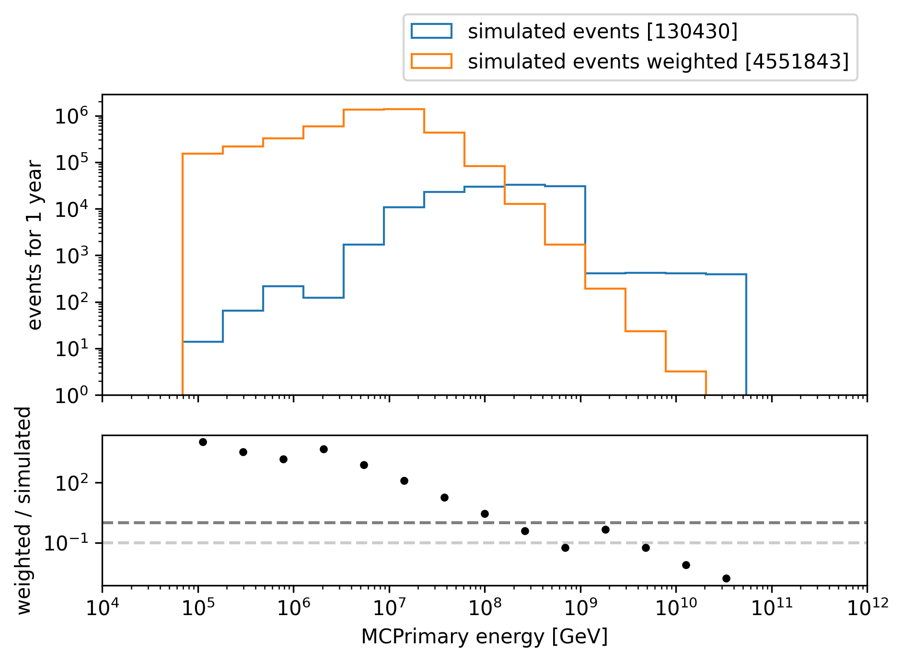

New CORSIKA extended history simulations
########################################

New CORSIKA datasets are simulated and stored at: 

* /data/sim/IceCube/2023/generated/CORSIKA_EHISTORY/

The simulation is divided into 4 different energy ranges. Since the simulation is done out ourselves, the dataset numbers are not provided in iceprod.

* 30010: 600 GeV - 1 PeV

* 30011: 1 PeV - 100 PeV

* 30012: 100 PeV - 1 EeV

* 30013: 1 EeV - 50 EeV

The following settings are used:

* CORSIKA version 77420 

* SIBYLL 2.3d 

* Icetray 1.5.1

* 5 components (p, He, N, Al, Fe)

* Component norm: [10, 5, 3, 2, 1]

* Zenith angle: 0 - 90 degrees

* Polyplopia: True 

* Ecuts1: 273 GeV (hadron min energy)

* Ecuts2: 273 GeV (muon min energy)

* Ecuts3: :math:`10^{20}` GeV (electron min energy)

* Ecuts4: :math:`10^{20}` GeV (photon min energy)

* TrimShower: True 

* Atmosphere: ``ratmo: 4`` (April) 

* Spectrum : -1 (increase high energy statistics)

This simulation is performed to test the extended history and prompt tagging software. Thus, the statistics are not yet sufficient.
The built CORSIKA software is stored at: ``/data/user/pgutjahr/software/CORSIKA/corsika-77420/bin/`` and also available in the cvmfs:
``/cvmfs/icecube.opensciencegrid.org/users/pgutjahr/software/CORSIKA/``

Dataset exploration - Level 2
+++++++++++++++++++++++++++++

For the dataset exploration, the definition of a leading muon is defined as following: 
The leading muon is the muon with the highest energy in the muon bundle. This can be expressed in "Leadingness".
Leadingness :math:`L_{\mathrm{E}}` describes the ratio of the highest energetic muon :math:`E_{\mathrm{max}}` 
in a muon bundle to the total energy :math:`E_{\mathrm{tot}}` of the muon bundle:

.. math:: 

    L_{\mathrm{E}} = \frac{E_{\mathrm{max}}}{E_{\mathrm{tot}}}

If there is no specific leadingness stated, the term leading muon refers to the muon with the highest energy in the muon bundle.

In the following, unweighted and weighted distributions of the simulated events are shown. In :numref:`simulated_events_primary_energy` and 
:numref:`simulated_events_primary_energy_weighted`, the primary distributions are shown 
for each dataset.

.. _simulated_events_primary_energy:
.. figure:: images/plots/dataset_exploration/simulated_events_primary_energy.png 

    : The energy distribution of primary particles is shown for the four different simulation datasets.

.. _simulated_events_primary_energy_weighted:

    : The energy distribution of primary particles is shown for the four different simulation datasets, weighted to GlobalSplineFit5Comp (GSF).

In :numref:`simulated_events_5_components_primary_energy` and :numref:`simulated_events_5_components_primary_energy_weighted`, 
the primary distributions are shown for each dataset, separated by the primary particle type.

.. _simulated_events_5_components_primary_energy: 
.. figure:: images/plots/dataset_exploration/simulated_events_5_components_primary_energy.png

    : The energy distribution of primary particles is shown for the four different simulation datasets, separated by the primary particle type.

.. _simulated_events_5_components_primary_energy_weighted:
.. figure:: images/plots/dataset_exploration/simulated_events_5_components_primary_energy_weighted.png

    : The energy distribution of primary particles is shown for the four different simulation datasets, separated by the primary particle type, weighted to GlobalSplineFit5Comp (GSF).

In :numref:`simulated_events_leading_muon_energy` and :numref:`simulated_events_leading_muon_energy_weighted`, the energy distribution of the leading muon is shown for each dataset. The leading muon is defined 
as the muon with the highest energy in the muon bundle. The shown energy corresponds to the energy at the detector entry.

.. _simulated_events_leading_muon_energy:
.. figure:: images/plots/dataset_exploration/simulated_events_leading_muon_energy.png

    : The energy distribution of the leading muon is shown for the four different simulation datasets.

.. _simulated_events_leading_muon_energy_weighted:

    : The energy distribution of the leading muon is shown for the four different simulation datasets, weighted to GlobalSplineFit5Comp (GSF).
    
In :numref:`simulated_events_bundle_muon_energy` and :numref:`simulated_events_bundle_muon_energy_weighted`, the energy distribution of the muon bundle is shown for each dataset. 
The muon bundle is defined as the
the sum of the energy of all muons entering the detector.

.. _simulated_events_bundle_muon_energy:

    : The energy distribution of the muon bundle is shown for the four different simulation datasets.

.. _simulated_events_bundle_muon_energy_weighted:

    : The energy distribution of the muon bundle is shown for the four different simulation datasets, weighted to GlobalSplineFit5Comp (GSF).
    

Estimation of the simulated statistics
++++++++++++++++++++++++++++++++++++++

The estimation of the simulated statistics needed for this analysis is not easy to determine. The statistics should be sufficient in the 
phase space of the analysis. This will probably be defined by the zenith angle of the incoming muon and the muon energy. Here, 
both the leading and bundle energy at detector entry and at the surface are considered. Furthermore, the systematic uncertainties in this 
phase space need to be known to create a simulation with statistical uncertainties lower than the systematic uncertainties.
However, to get a first impression of the statistics simulated so far, :numref:`energy_spectrum_primary_energy_simulation_muonfilter_bundle_cut_1e5` 
and :numref:`energy_spectrum_leading_muon_energy_simulation_muonfilter_bundle_cut_1e5` show the energy spectrum of the primary and leading muon energy. The 
simulated events are shown in blue, in orange the events are weighted to the expected statistics of 1 year of IceCube data using GlobalSplineFit5Comp (GSF) 
weightig. Here, the muon filter is applied and an energy cut of 200 TeV is applied to the muon bundle energy at the surface. For leading muon energies 
above 1 PeV, more muons are simulated than expected for 1 year. (The cuts applied here are not the final cuts for the analysis.)

.. _energy_spectrum_primary_energy_simulation_muonfilter_bundle_cut_1e5:

    : Primary energy spectrum is shown to estimate the simulated statistics.
    
.. _energy_spectrum_leading_muon_energy_simulation_muonfilter_bundle_cut_1e5:
.. figure:: images/plots/dataset_exploration/energy_spectrum_leading_muon_energy_simulation_muonfilter_bundle_cut_1e5.png
    
    : Leading muon energy spectrum is shown to estimate the simulated statistics.

 
Large scale simulation 
++++++++++++++++++++++

----

*Note*: In the icetray version 1.11.0-rc1, a bug was introduced that we fixed locally without committing to move on 
with our simulation to perform further tests. Hence, this is still a preliminary simulation since we want to provide 
a simulation that is re-producible (using an official icetray version tag).

----

A preliminary large-scale simulation is currently performed with Iceprod. 
The datasets are:

* 22774: 1e4 GeV - 1e6 GeV 
* 22775: 1e6 GeV - 1e8 GeV
* 22776: 1e8 GeV - 1e9 GeV
* 22777: 1e9 GeV - 1e10 GeV
* 22778: 1e10 GeV - 1e11 GeV

The following settings are used:

* CORSIKA version 77500 

* SIBYLL 2.3d 

* Icetray 1.11.0-rc1

* 5 components (p, He, N, Al, Fe)

* Zenith angle: 0 - 90 degrees

* Polyplopia: False (no coincident events are simulated)

* Ecuts1: 273 GeV (hadron min energy)

* Ecuts2: 273 GeV (muon min energy)

* Ecuts3: 273 GeV (electron min energy)

* Ecuts4: 273 GeV (photon min energy)

* TrimShower: False 

* Atmosphere: all 12 seasons 

The detailed settings can be found in the config files at `IceProd <https://iceprod2.icecube.wisc.edu>`_

General Simulation Questions 
++++++++++++++++++++++++++++

Before we have started the large-scale IceProd simulation, we have discussed the following questions:

* Does cutting of the electromagnetic shower component have any impact on our phase space (high energy muons)? This is done by `Ecuts3` and `Ecuts4`.
    - 10% effect possible on the muon energy spectrum, but no significant effect on the runtime and disk space -> EM component will be turned on, which is 
    done by setting `Ecuts3` and `Ecuts4` to the same value as `Ecuts2` and `Ecuts1`, thus 273 GeV.

* Shall we stay with Icetray 1.5.1 which was used for the first test simulation?
    - Use latest version of Icetray to include any possible bug fixes and up-to-date software + latest ice model

* We haven't oversampled our showers yet. Which factor for oversampling is usual? 
    - At low energies, oversampling up to 10 is common, but this should be decreased at higher energies. 
    -> We decided not to oversample the showers, since this results in a "fake statistics".

* How can we reduce the disk space?
    - For the final simulation, we will store step 0 and level 2 files. The extended I3MCTrees can be removed, since we can re-simulate them using PROPOSAL if needed.

* How much disk storage do we need for the final simulation? 
    - Roughly 50 TB 

* Which seasons do we want to simulate? 4 seasons?
    - We want to simulate all 12 seasons as defined `here <https://wiki.icecube.wisc.edu/index.php/Real_atmosphere_for_CORSIKA>`_. 
    This enables further studies of the seasonal variations in the future.

* Do we want to set the TrimShower option?
    - For large zenith angles, even high energy muon can be cut off. For the calculation of the effective area, we have to turn off trimshower
    - Thus, we don't use the TrimShower option